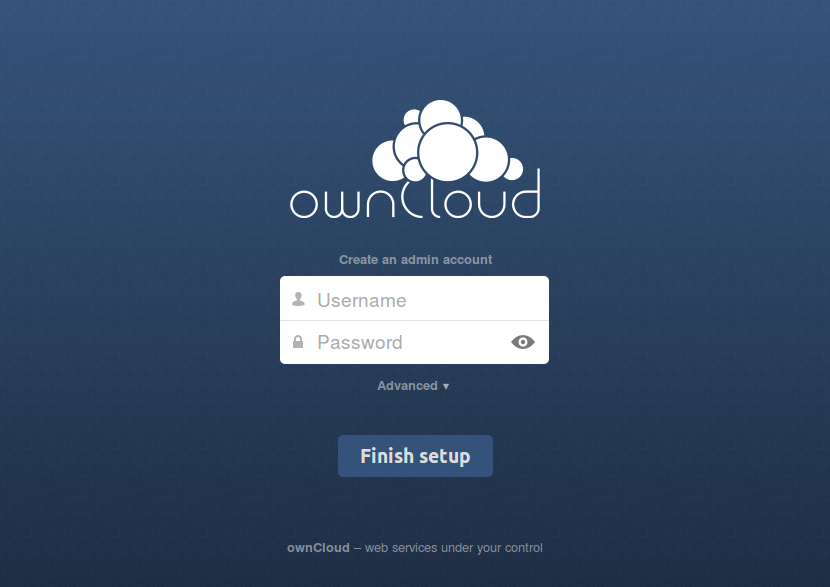
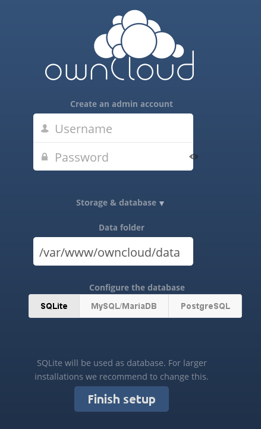
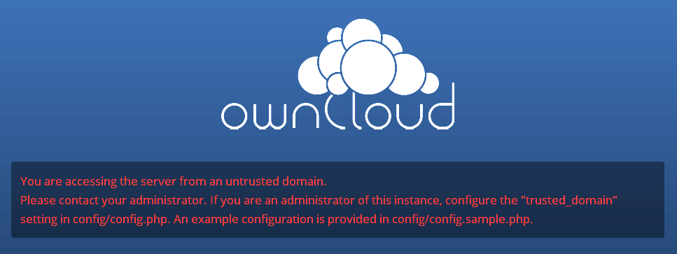

===================
Installation Wizard
===================

When ownCloud prerequisites are fulfilled and all ownCloud files are installed on the server, the last step to complete the 
installation is running the Installation Wizard.

  * If you are installing ownCloud on the same machine as you are accessing the
    install wizard from, the URL will be ``http://localhost/owncloud``, or ``https://localhost/owncloud`` if you have enabled SSL.
  * If you are installing ownCloud on a different machine, you'll have to access
    it by its hostname or IP address, e.g. ``http://example.com/owncloud``.
  * If you are using a self-signed certificate, you will be presented with a
    security warning about the issuer of the certificate not being trusted which
    you can ignore.

* You will be presented with the setup screen:

 
   
Required Settings
~~~~~~~~~~~~~~~~~

Under ``create an admin account`` you must enter a username and password for the administrative user account. You may choose any 
username and password that you want.

Storage & Database
~~~~~~~~~~~~~~~~~~

* Click ``Storage & Database`` to see all of your database options, and to optionally change the default data storage directory. 
  The default database is SQLite, which is sufficient for testing and simple single-user setups, but not for a production server.
  
.. note:: SQLite is not supported and not included in the ownCloud Enterprise Subscription.  
  
* The database you want to use must already be installed, and you must have the database administrative user and password for all 
  databases except SQLite, which does not have an admin user.
* Enter any arbitrary name for the ownCloud Database name. This must be a database that 
  does not already exist.
* If you are not using Apache as the web server, it is highly
  recommended to configure the data directory to a location outside of
  the document root. Otherwise all user data is potentially publicly
  visible.

Database Choice
~~~~~~~~~~~~~~~

* See :doc:`../configuration_database/linux_database_configuration` for 
  guidelines on choosing a database.

* It is not easy to migrate to another database system after you have set up ownCloud.

* You will only be able to choose among the PHP database connectors which are actually installed on the system.

* When using MySQL/MariaDB or PostgreSQL you need the login of the database root user, or an admin user with sufficient 
  privileges to create a new database and add users. This lets ownCloud create its own database; it will also create a database 
  user account with restricted rights.

* There are restrictions as to what characters a database name may or may not contain; see the `MySQL Schema Object Names 
  documentation`_ for details).
  
.. _MySQL Schema Object Names documentation: http://dev.mysql.com/doc/refman/5.5/en/identifiers.html

Finish Installation
~~~~~~~~~~~~~~~~~~~

* Once you've entered all settings, click "Finish Setup"
* ownCloud will set up your cloud according to your settings
* When it's finished, it will log you in as administrative user and present the
  "Welcome to ownCloud" screen.
  
Setting Strong Directory Permissions
~~~~~~~~~~~~~~~~~~~~~~~~~~~~~~~~~~~~

For hardened security we recommend setting the permissions on your ownCloud 
directory as strictly as possible. This should be done immediately after the 
initial installation. Your HTTP user must own the ``config/``, ``data/`` and 
``apps/`` directories in your ownCloud directory so that you can configure 
ownCloud, create, modify and delete your data files, and install apps via the 
ownCloud Web interface. 

You can find your HTTP user in your HTTP server configuration files. Or you can 
create a PHP page to find it for you. To do this, create a plain text file with 
a single line in it:

      ``<?php echo exec('whoami'); ?>``
   
Name it ``whoami.php`` and place it in your ``/var/www/html`` directory, and 
then open it in a Web browser, for example ``http://localhost/whoami.php``. You 
should see a single line in your browser page with the HTTP user name.

* The HTTP user and group in Debian/Ubuntu is ``www-data``.
* The HTTP user and group in Fedora/CentOS is ``apache``.
* The HTTP user and group in Arch Linux is ``http``.
* The HTTP user in openSUSE is ``wwwrun``, and the HTTP group is ``www``.

.. note:: When using an NFS mount for the data directory, do not change its 
   ownership from the default. The simple act of mounting the drive will set 
   proper permissions for ownCloud to write to the directory. Changing 
   ownership as above could result in some issues if the NFS mount is 
   lost.

The easy way to set the correct permissions is to copy and run this 
script. Replace the ``ocpath`` variable with the path to your ownCloud 
directory, and replace the ``htuser`` variable with your own HTTP user::

 #!/bin/bash
 ocpath='/var/www/owncloud'
 htuser='www-data'

 find ${ocpath}/ -type f -print0 | xargs -0 chmod 0640
 find ${ocpath}/ -type d -print0 | xargs -0 chmod 0750

 chown -R root:${htuser} ${ocpath}/
 chown -R ${htuser}:${htuser} ${ocpath}/apps/
 chown -R ${htuser}:${htuser} ${ocpath}/config/
 chown -R ${htuser}:${htuser} ${ocpath}/data/

 chown root:${htuser} ${ocpath}/.htaccess
 chown root:${htuser} ${ocpath}/data/.htaccess
 
 chmod 0644 ${ocpath}/.htaccess
 chmod 0644 ${ocpath}/data/.htaccess
 
If you have customized your ownCloud installation and your filepaths are 
different than the standard installation, then modify this script accordingly.

These are the recommended modes and ownership for your ownCloud directories 
and files:

* All files should be read-write for the file owner, read-only for the 
  group owner, and zero for the world
* All directories should be executable (because directories always need the 
  executable bit set), read-write for the directory owner, and read-only for 
  the group owner
* The :file:`/` directory should be owned by ``root:[HTTP user]``
* The :file:`apps/` directory should be owned by ``[HTTP user]:[HTTP user]``
* The :file:`config/` directory should be owned by ``[HTTP user]:[HTTP user]``
* The :file:`data/` directory should be owned by ``[HTTP user]:[HTTP user]``
* The :file:`[ocpath]/.htaccess` file should be owned by ``root:[HTTP user]``
* The :file:`data/.htaccess` file should be owned by ``root:[HTTP user]``
* Both :file:`.htaccess` files are read-write file owner, read-only group and 
  world

Trusted Domains
~~~~~~~~~~~~~~~

ownCloud will take the URL used to access the Installation Wizard and insert that into the ``config.php`` file for the 
``trusted_domains`` setting. All needed domain names of the ownCloud server go into the ``trusted_domains`` setting. Users will 
only be able to log into ownCloud when they point their browsers to a domain name listed in the ``trusted_domains`` setting. An 
IPv4 address can be specified instead of a domain name. A typical configuration looks like this::

 'trusted_domains' => 
   array (
    0 => 'localhost', 
    1 => 'server1.example.com', 
    2 => '192.168.1.50',
 ),

In the event that a load balancer is in place there will be no issues as long
as it sends the correct X-Forwarded-Host header.

The loopback address, ``127.0.0.1``, is whitelisted and
therefore users on the ownCloud server who access ownCloud with the loopback
interface will be able to successfully login.
In the event that an improper URL is used, the
following error will appear:

   
For configuration examples, refer to the :file:`config/config.sample.php`
document.

