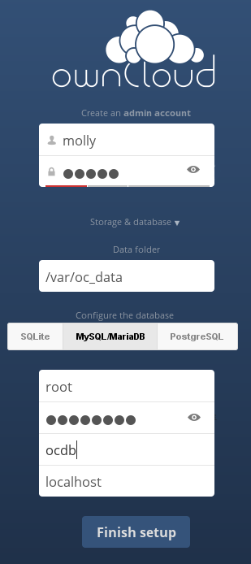
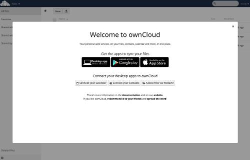

===================
Installation Wizard
===================

Quick Start
-----------

When ownCloud prerequisites are fulfilled and all ownCloud files are installed, 
the last step to completing the installation is running the Installation 
Wizard. 
This is just three steps:

#. Point your Web browser to ``http://localhost/owncloud``
#. Enter your desired administrator's username and password.
#. Click **Finish Setup**.

.. figure:: images/install-wizard.png
   :scale: 75%
   :alt: screenshot of the installation wizard   
   
You're finished and can start using your new ownCloud server.   

Of course, there is much more that you can do to set up your ownCloud server for 
best performance and security. In the following sections we will cover important 
installation and post-installation steps. Note that you must follow the 
instructions in :ref:`Setting Strong Permissions <strong-perms-label>` in order 
to use the :doc:`occ Command <../configuration_server/occ_command>`.

* :ref:`Data Directory Location <label-data-directory-location>`
* :ref:`Database Choice <label-database-choice>`
* :ref:`Trusted Domains <label-trusted-domains>`
* :ref:`Setting Strong Permissions <strong-perms-label>`

.. _label-data-directory-location:

Data Directory Location
-----------------------

Click **Storage and Database** to expose additional installation configuration 
options for your ownCloud data directory and database options.

You should locate your ownCloud data directory outside of your Web root if you 
are using an HTTP server other than Apache, or you may wish to store your 
ownCloud data in a different location for other reasons (e.g. on a storage 
server). It is best to configure your data directory location at installation, 
as it is difficult to move after installation. You may put it anywhere; in this 
example is it located in ``/var/oc_data``. This directory must already exist, 
and must be owned by your HTTP user (see 
:ref:`strong-perms-label`).

.. _label-database-choice:

Database Choice
---------------

SQLite is the default database for ownCloud Server (it is not 
available and not supported in the Enterprise edition), and it is good only for 
testing and lightweight single-user setups without client synchronization. 
Supported databases are MySQL, MariaDB, Oracle 11g, and PostgreSQL, and we 
recommend :doc:`MySQL/MariaDB <../release_notes>`. Your database and PHP 
connectors must be installed before you run the Installation Wizard. When you 
install ownCloud from packages all the necessary dependencies will be satisfied 
(see :doc:`source_installation` for a detailed listing of required and optional 
PHP modules). You will need the root database login, or any administrator login 
that has permissions to create and modify databases, and then enter any name 
you 
want for your ownCloud database.

Click Finish Setup, and start using your new ownCloud server. 

Now we will look at some important post-installation steps.

.. _label-trusted-domains: 

Trusted Domains
---------------

All URLs used to access your ownCloud server must be whitelisted in your 
``config.php`` file, under the ``trusted_domains`` setting. Users 
are allowed to log into ownCloud only when they point their browsers to a 
URL that is listed in the ``trusted_domains`` setting. You may use IP addresses 
and domain names. A typical configuration looks like this::

 'trusted_domains' => 
   array (
    0 => 'localhost', 
    1 => 'server1.example.com', 
    2 => '192.168.1.50',
 ),

The loopback address, ``127.0.0.1``, is automatically whitelisted, so as long 
as you have access to the physical server you can always log in. In the event 
that a load balancer is in place there will be no issues as long as it sends 
the correct X-Forwarded-Host header. When a user tries a URL that 
is not whitelisted the following error appears:

.. figure:: images/untrusted-domain.png
   :scale: 75%
   :alt: screenshot of error message when URL is not whitelisted in 
    trusted_domains
  
.. _strong-perms-label:
 
Setting Strong Directory Permissions
------------------------------------

For hardened security we recommend setting the permissions on your ownCloud 
directories as strictly as possible, and for proper server operations. This 
should be done immediately after the initial installation. Your HTTP user must 
own the ``config/``, ``data/`` and ``apps/`` directories so that you can 
configure ownCloud, create, modify and delete your data files, and install apps 
via the ownCloud Web interface. 

You can find your HTTP user in your HTTP server configuration files. Or you can 
use :ref:`label-phpinfo` (Look for the **User/Group** line).

* The HTTP user and group in Debian/Ubuntu is ``www-data``.
* The HTTP user and group in Fedora/CentOS is ``apache``.
* The HTTP user and group in Arch Linux is ``http``.
* The HTTP user in openSUSE is ``wwwrun``, and the HTTP group is ``www``.

.. note:: When using an NFS mount for the data directory, do not change its 
   ownership from the default. The simple act of mounting the drive will set 
   proper permissions for ownCloud to write to the directory. Changing 
   ownership as above could result in some issues if the NFS mount is 
   lost.

The easy way to set the correct permissions is to copy and run this script. 
Replace the ``ocpath`` variable with the path to your ownCloud directory, and 
replace the ``htuser`` and ``htgroup`` variables with your HTTP user and group::

 #!/bin/bash
 ocpath='/var/www/owncloud'
 htuser='www-data'
 htgroup='www-data'
 rootuser='root' # On QNAP this is admin

 find ${ocpath}/ -type f -print0 | xargs -0 chmod 0640
 find ${ocpath}/ -type d -print0 | xargs -0 chmod 0750

 chown -R ${rootuser}:${htgroup} ${ocpath}/
 chown -R ${htuser}:${htgroup} ${ocpath}/apps/
 chown -R ${htuser}:${htgroup} ${ocpath}/config/
 chown -R ${htuser}:${htgroup} ${ocpath}/data/
 chown -R ${htuser}:${htgroup} ${ocpath}/themes/

 chown ${rootuser}:${htgroup} ${ocpath}/.htaccess
 chown ${rootuser}:${htgroup} ${ocpath}/data/.htaccess

 chmod 0644 ${ocpath}/.htaccess
 chmod 0644 ${ocpath}/data/.htaccess
 
If you have customized your ownCloud installation and your filepaths are 
different than the standard installation, then modify this script accordingly. 

This lists the recommended modes and ownership for your ownCloud directories 
and files:

* All files should be read-write for the file owner, read-only for the 
  group owner, and zero for the world
* All directories should be executable (because directories always need the 
  executable bit set), read-write for the directory owner, and read-only for 
  the group owner
* The :file:`apps/` directory should be owned by ``[HTTP user]:[HTTP group]``
* The :file:`config/` directory should be owned by ``[HTTP user]:[HTTP group]``
* The :file:`themes/` directory should be owned by ``[HTTP user]:[HTTP group]``
* The :file:`data/` directory should be owned by ``[HTTP user]:[HTTP group]``
* The :file:`[ocpath]/.htaccess` file should be owned by ``root:[HTTP group]``
* The :file:`data/.htaccess` file should be owned by ``root:[HTTP group]``
* Both :file:`.htaccess` files are read-write file owner, read-only group and 
  world
