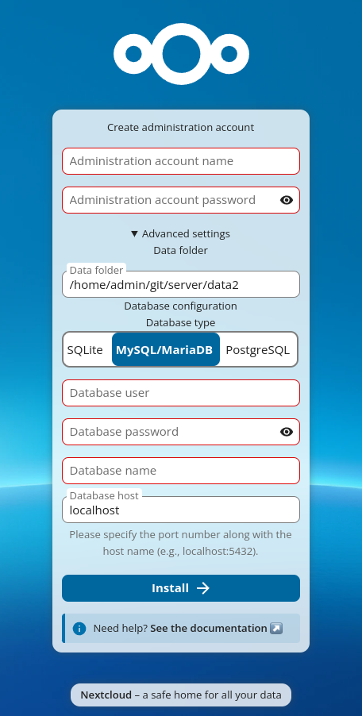
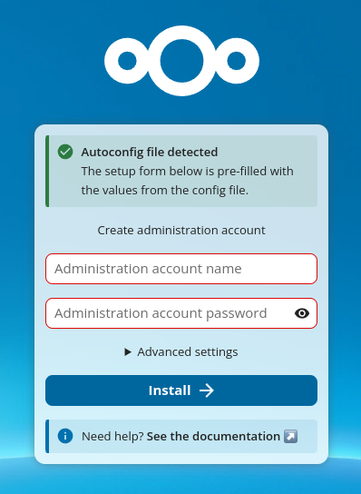
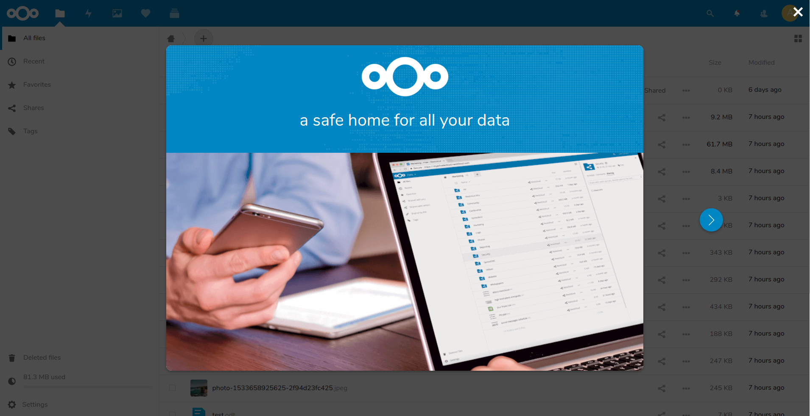
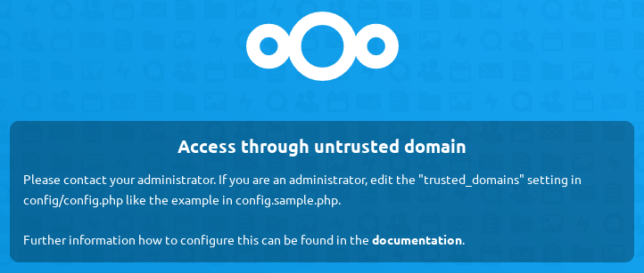

===================
Installation wizard
===================

Quick start
-----------

When Nextcloud prerequisites are fulfilled and all Nextcloud files are installed,
the last step to completing the installation is running the Installation
Wizard.
This is just three steps:

#. Point your Web browser to ``http://localhost/nextcloud``
#. Enter your desired administration account name and password.
#. Click **Install**.

You're finished and can start using your new Nextcloud server.

.. note::
   The wizard includes a real-time password strength indicator that rates your
   chosen password from "too weak" to "extremely strong". For security, choose
   a password rated at least "strong".

Of course, there is much more that you can do to set up your Nextcloud server for
best performance and security. In the following sections we will cover important
installation and post-installation steps.

* :ref:`Data Directory Location <data_directory_location_label>`
* :ref:`Database Choice <database_choice_label>`
* :ref:`Trusted Domains <trusted_domains_label>`

.. _data_directory_location_label:

Data directory location
-----------------------

Expand the **Storage & database** section to expose additional installation
configuration options for your Nextcloud data directory and database.

You should locate your Nextcloud data directory outside of your Web root if you
are using an HTTP server other than Apache, or you may wish to store your
Nextcloud data in a different location for other reasons (e.g. on a storage
server). It is best to configure your data directory location at installation,
as it is difficult to move after installation. You may put it anywhere; in this
example it is located in ``/opt/nextcloud/``. This directory must already exist,
and must be owned by your HTTP user.

.. note::
   If the wizard detects that your ``.htaccess`` file is not working (for
   example, because you are using Nginx or another non-Apache web server), it
   will display a **Security warning** indicating that your data directory and
   files may be accessible from the internet. Refer to the
   :doc:`../installation/harden_server` documentation for guidance on
   securing your data directory.

.. _database_choice_label:

Database choice
---------------

SQLite is the default database for Nextcloud Server. When SQLite is selected,
the wizard displays a **Performance warning**:

   *SQLite should only be used for minimal and development instances. For
   production we recommend a different database backend. If you use clients for
   file syncing, the use of SQLite is highly discouraged.*

Supported databases are MySQL, MariaDB, Oracle, and PostgreSQL, and we
recommend :doc:`MySQL/MariaDB <system_requirements>`. Your database and PHP
connectors must be installed before you run the Installation Wizard. When
you install Nextcloud from packages all the necessary dependencies will be
satisfied (see :doc:`source_installation` for a detailed listing of required
and optional PHP modules). If only one database driver is available, the wizard
will show a notice and a link to the documentation on how to install additional
PHP modules.

When you select a database other than SQLite, the wizard exposes additional
fields:

* **Database user**: The username to connect to the database server. If this
  user has sufficient privileges (e.g. the ability to query ``mysql.user`` for
  MySQL, or the ``CREATEROLE`` privilege for PostgreSQL), the wizard will
  attempt to create a dedicated Nextcloud database user with limited privileges
  (see below). If the user lacks those privileges, the wizard gracefully falls
  back to using the provided credentials directly.
* **Database password**: The password for the database user above.
* **Database name**: The name you want for your Nextcloud database. The wizard
  will create it if it does not already exist and the user has
  ``CREATE DATABASE`` privileges.
* **Database host**: The hostname (and optionally port) of your database
  server, e.g. ``localhost`` or ``db.example.com:3306``. The default is
  ``localhost``. You can also specify a Unix socket path here. The wizard
  shows a helper hint: *"Please specify the port number along with the host
  name (e.g., localhost:5432)."*
* **Database tablespace** *(Oracle only)*: Shown only when Oracle is selected.

Automatic database user creation
^^^^^^^^^^^^^^^^^^^^^^^^^^^^^^^^^

When the provided database user has administrative privileges, the installer
attempts to create a dedicated database user with privileges limited to the
Nextcloud database. This avoids storing your administrative database credentials
in ``config.php``.

If privileges are sufficient, the install creates a user named ``oc_admin``. 
If that user already exists, a numeric suffix is appended (``oc_admin1``, 
``oc_admin2``, etc.) until an available username is found.

A random password is generated for the new user. The resulting credentials are
written into ``config.php``::

  'dbuser' => 'oc_admin',
  'dbpassword' => 'pX65Ty5DrHQkYPE5HRsDvyFHlZZHcm',

If the provided user lacks the privileges to create new database users, the 
installer falls back to using the provided credentials directly.

.. tip::
   You can also explicitly prevent automatic user creation by setting the following
   in your ``config.php`` before running the wizard (or via an autoconfig file)::

      'setup_create_db_user' => false,

   This is useful when your database administrator has already created a dedicated
   user for Nextcloud. In that case the wizard will use the database credentials
   you provide directly, without attempting to create a new user or query
   administrative privileges.

Autoconfig
^^^^^^^^^^

If an autoconfig file is detected, the wizard displays a success notice:
*"Autoconfig file detected — The setup form below is pre-filled with the
values from the config file."* The **Storage & database** section is
automatically collapsed when the autoconfig provides valid values. For
details on autoconfig files, see :doc:`../configuration_server/automatic_configuration`.

Completing Installation
^^^^^^^^^^^^^^^^^^^^^^^

Click **Install**, and start using your new Nextcloud server.

Now we will look at some important post-installation steps.

.. _trusted_domains_label:

Trusted domains
---------------

All URLs used to access your Nextcloud server must be whitelisted in your
``config.php`` file, under the ``trusted_domains`` setting. Users
are allowed to log into Nextcloud only when they point their browsers to a
URL that is listed in the ``trusted_domains`` setting. This is not a
list of allowed client-side domains or IP addresses.
You may use IP addresses and domain names. Wildcard patterns using ``*`` are
also supported (e.g. ``*.example.com``).
A typical configuration looks like this::

 'trusted_domains' =>
   array (
    0 => 'localhost',
    1 => 'server1.example.com',
    2 => '192.168.1.50',
    3 => '[fe80::1:50]',
 ),

.. note::

   The loopback addresses ``localhost``, ``127.0.0.1``, and ``[::1]`` are
   always treated as trusted regardless of the ``trusted_domains``
   configuration. This means that as long as you have access to the physical
   server you can always log in. In the event that a load balancer or reverse
   proxy is in place there will be no issues as long as it sends the correct
   ``X-Forwarded-Host`` header.

When a user tries a URL that is not whitelisted the following error appears:

