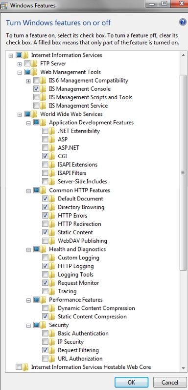
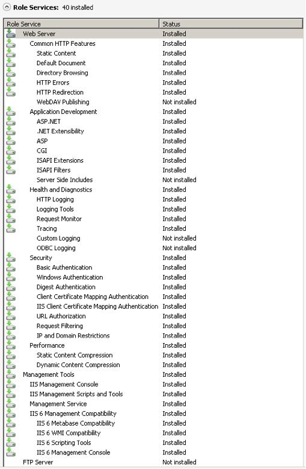

=================================================
Installation on Windows 7 and Windows Server 2008
=================================================

.. note:: While ownCloud will run in any standard PHP environment,
          including IIS or Apache on Windows, there are known issues.
          For the basic sync and share capabilities of ownCloud, Windows
          web servers (Apache and IIS) will function properly. However,
          as apps like external storage are added, particularly SMB mounts,
          and non-English characters are used in filenames, some of the known
          Windows and IIS/Apache challenges start to appear as bugs.
          
          ownCloud is not supported on the Internet Server Application 
          Programming Interface (ISAPI). 
          
          For these reasons, while ownCloud server will run on Windows, it is 
          not recommended at this time.

.. note:: You must move the data directory outside of your public root (See
          advanced installation settings)

This section describes how to install ownCloud on Windows with IIS 
(Internet Information Services).

These instructions assume that you have a standard, non-IIS enabled Windows 
machine using Windows 7 or Server 2008. After enabling IIS, the procedures are 
essentially identical for both Windows 7 and Windows Server 2008.

For installation, ownCloud physical access or a remote desktop connection is 
required. We recommend that you leverage MySQL as the backend database for 
ownCloud. If you do not want to use MySQL, you can use Postgres or SQLite 
instead.  However, Microsoft SQL Server is not yet supported.

Enabling SSL is not yet covered by this section.

.. note:: If you make your desktop machine or server available outside of your 
   LAN, you must maintain it. Make sure to monitor the logs, manage the access, 
   and apply patches to avoid compromising the system as a whole.

There are four primary steps to the installation, and then an added fifth step 
required for configuring everything to allow files larger than the
default 2 MB size.

1. Install IIS with CGI support – enable IIS on your Windows machine.

2. Install PHP – Grab, download and install PHP.

3. Install MySQL – Setup the MySQL server manager and enable ownCloud to create 
   an instance.

4. Install ownCloud – The whole reason we are here!

5. Configure upload sizes and timeouts to enable large file uploads – So that 
   you can upload larger files.

Activate IIS with CGI Support
~~~~~~~~~~~~~~~~~~~~~~~~~~~~~

Windows 7
^^^^^^^^^

To activate IIS on Microsoft Windows 7:

1. Navigate to :guilabel:`Start --> Control Panel --> Programs`.

2. Under Programs and Features, click on the link entitled :guilabel:`Turn 
   Windows Features on and Off`.

3. Expand the box labeled :guilabel:`Internet Information Services`.

4. Expand ``World Wide Web Services`` and all of the folders beneath it.

5. Select the folders as shown in the image below to launch the IIS server.

    **Windows Features required for ownCloud on Windows 7**

6. Because a running FTP server is not required, turn off that feature for your 
   server.

7. Ensure that you have the IIS Management Console. An IIS management console 
   is the easiest way to start, stop, and restart your server. This console 
   also enables you to change certificate options  and manage items like 
   file upload size.

8. Check the CGI checkbox under ``Application Development Features`` in order to 
   enable PHP on IIS.

9. Turn off WebDAV publishing to avoid conflicts between the Windows WebDAV and 
   the ownCloud WebDAV interface.

    .. note:: This feature might already be turned off for you.  However, we 
       recommend that you ensure that it remains off. The common HTTP features 
       are the features you would expect from a web server.

    After implementing the selections on this page, IIS serves up a web page.

10. Restart IIS by going to the IIS manager (:guilabel:`Start --> IIS Manager`).

11. Select your website.

    On the far right side of the opening page you will see a section titled 
    :guilabel:`Manage Server`.

12. Make sure that the service is started, or click :guilabel:`Start` to start 
    the services selected.

13. Go to a web browser and navigate to http://localhost.

    The standard IIS 7 splash page opens.  This page displays a static image 
    that indicates that your web server is running. Assuming you were able to 
    reach splash page, your web server is now up and running.

Continue by `installing PHP`_.

Windows Server 2008
^^^^^^^^^^^^^^^^^^^

1. Navigate to :guilabel:`Start --> Control Panel --> Programs`.

2. Under Programs and Features, click the link titled :guilabel:`Turn Windows 
   Features on and Off`. The Server Manager starts.

3. In the Server Manager, click ``Roles``

4. Click ``Add Roles``.

5. Use the :guilabel:`Add Roles Wizard` to add the web server role.

    **Server roles required for ownCloud**

6. Make sure that, at a minimum, the same boxes are checked in this wizard that 
   are checked in the Windows 7 Section. For example, make sure that the CGI 
   box is checked under Application Development Features, and that WebDAV 
   Publishing is turned off. With Remote Desktop Sharing turned on, the 
   detailed role service list looks like the figure “Role Services”.

7. Go to the IIS manager (:guilabel:`Start --> IIS Manager`) and restart IIS.

8. Select your website

9. Once this is complete, you should be able to go to a web browser and type
   `localhost`. This should open the standard IIS 7 splash page, which is just a
   static image that says your web server is running. Assuming you were able to 
   get the splash page, it is safe to say your web server is now up and 
   running.

Continue by `installing PHP`_.

Installing PHP
~~~~~~~~~~~~~~

1. Go to the `PHP for Windows`_ download page.

.. note:: The instructions below are for IIS only. If using a different server
          software, make sure to follow the hints on "Which version do I
          choose" on the left hand side of the page linked above.

2. Download the Installer for PHP 5.3, the "VC9 Non Thread Safe" version,
   either 32 or 64 bit, depending on your system.
3. Run the downloaded installation executable.
4. Read the license agreement, agree, select an install directory.
5. Then select IIS FastCGI as the install server.
6. Take the default selections for the items to install, and click next.
   Then click `install`.
7. Once the installer is finished, PHP is installed.

Continue by `installing MySQL`_.

Installing MySQL
~~~~~~~~~~~~~~~~

To install MySQL on your Windows machine:

1. Use your browser to migrate to http://dev.mysql.com/downloads/.

2. Download the latest community edition for your operating system, choosing 
   either the 32 or 64 bit version as applicable.

3. Download the **MSI Installer** to assist with the install.

4. Once the download completes, install MySQL (5.5 at the time of writing), 
   selecting the typical installation.

5. Once the installation completes, check the checkbox to launch the MySQL 
   Instance Configuration Wizard and click ``Finish``.

6. Select a standard configuration, as this will be the only version of MySQL on 
   this machine.

7. Select the option to install as a windows service, and Check the ``Launch the 
   MySQL Server Automatically`` button.

8. Select the modify security settings checkbox on the next page, and enter a 
   password.

    .. note:: Make sure to note your chosen password.  You will need this 
       password when you configure ownCloud.

9. Uncheck ``enable root access from remote machines`` for security reasons.

10. Click execute. The instance is created and launched.

11. Once the instance launches, click Finish.

Take particular note of your MySQL password, as the user name **root** and the 
password you select will be necessary later on in the ownCloud
installation. As an aside, the following link is an excellent resource for 
questions on how to configure your MySQL instance, and also to configure PHP to 
work with MySQL. This, however, is not strictly necessary as much of this is 
handled when you download ownCloud.

More information in this topic can be found in a `tutorial on the IIS web 
site`_.

.. _tutorial on the IIS web site:
   
http://learn.iis.net/page.aspx/353/install-and-configure-mysql-for-php-
applications-on-iis-7-and-above/

Installing ownCloud
~~~~~~~~~~~~~~~~~~~

1. Download the latest version of ownCloud from http://owncloud.org/download.    
   The file is downloaded in tar.bz2 format.

2. Unzip the file and save it locally.

    .. note:: You can use jZip for a free utility (like Peazip) to unzip the 
       file.

3. Copy the file to your ``wwwroot`` directory (for example, 
   **C:\\inetpub\\wwwroot**).

    .. note:: Only the administrator can install directly into the directory 
       **wwwroot** from an unzipping application. However, you can save the 
       file in a different folder and then move the files into **wwwroot** in 
       windows explorer. This process installs ownCloud locally in your root 
       web directory. You can use a subdirectory called owncloud (or whatever 
       name you choose).

4. To enable write access to the ownCloud directory to the ownCloud server, 
   navigate your windows explorer to  **inetpub/wwwroot/owncloud** (or the 
   installation directory you selected).

5. Right click and select properties.

6. Click the security tab, and select the button “to change permissions, click 
   edit”.

7. Select the “users” user from the list, and check the box “write”.

8. Apply these settings and close the window.

   Continue by following the :doc:`installation_wizard`. Select MySQL as the 
   database, and enter your MySQL database user name, password and desired 
   instance name – use the user name and password you setup during MySQL 
   installation, and pick any name for the database instance.

Ensure Proper HTTP-Verb Handling
~~~~~~~~~~~~~~~~~~~~~~~~~~~~~~~~

IIS must pass all HTTP and WebDAV verbs to the PHP/CGI handler, and must not 
attempt to handle them by itself or syncrhonizing with the Desktop and Mobile 
Clients will fail.

To ensure your configuration is correct:

1. Open IIS Manager7.

2. In the `Connections` bar, select your site below `Sites`, or choose the top 
   level entry if you want to modify the machine-wide settings.

3. Choose the `Handler Mappings` feature.

4. Click `PHP_via_fastCGI`.

5. Choose `Request Restrictions` and locate the `Verbs` tab.

6. Ensure `All Verbs` is checked.

7. Click `OK`.

7. Choose the `Request Filtering` feature from the IIS Manager.

8. Ensure that all verbs are permitted (or none are forbidden) in the `Verbs` 
   tab. You need to allow the verbs ``GET``, ``HEAD``, ``POST``, ``OPTIONS``, 
   ``PROPFIND``, ``PUT``, ``MKCOL``, ``MKCALENDAR``, ``DELETE``, ``COPY``, and 
   ``MOVE``.

    .. note:: Because ownCloud must be able to use WebDAV on the application 
       level, you must also ensure that you do not enable the WebDAV authoring 
       module.

Configuring ownCloud, PHP and IIS for Large File Uploads
~~~~~~~~~~~~~~~~~~~~~~~~~~~~~~~~~~~~~~~~~~~~~~~~~~~~~~~~

Before you begin to use ownCloud heavily, it is important to make a few 
configuration changes to enhance the service and make it more useful.  For 
example, you might want to increase the **max upload size**. The default upload 
is set to **2MB**, which is too small for many files (for example, most MP3 
files).

To adjust the maximum upload size, you must access your ``PHP.ini`` file.  You 
can locate this file in your **C:\\Program Files (x86)\\PHP** folder.

To adjust the maximum upload size, open the ``PHP.ini`` file in a text editor, 
find the following key attributes, and change them to what you want to use:

+ **upload_max_filesize** – Changing this value to something like 1G will enable 
  you to upload much larger files.
+ **post_max_size** – Change this value to be larger than your max upload size 
  you chose.

You can make other changes in the ``PHP.ini`` file (for example, the timeout 
duration for uploads).  However, most default settings in the **PHP.ini** file 
should function appropriately.

To enable file uploads on the web server larger than 30 MB, you must also change 
some settings in the IIS manager.

To modify the IIS Manager:

1. Go to the start menu, and type **iis manager**. IIS manager launches.

2. Select the website that you want to accept large file uploads.

3. In the main (middle) window, double click the icon **Request filtering**.    
   A window opens displaying a number of tabs across the top.

4. Select :guilabel:`Edit Feature Settings`

5. Modify the :guilabel:`Maximum allowed content length (bytes)` value to 4.1 
   GB.

    .. note:: This entry is in bytes, not kilobytes.

You should now have ownCloud configured and ready for use.

.. _PHP For Windows: http://windows.php.net/download/
