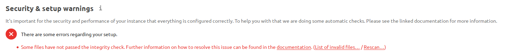

============
Code signing
============

.. sectionauthor:: Lukas Reschke <lukas@nextcloud.com>
.. _code_signing_label:

Nextcloud supports code signing for the core releases, and for Nextcloud
applications. Code signing gives our users an additional layer of security by
ensuring that nobody other than authorized persons can push updates.

It also ensures that all upgrades have been executed properly, so that no files
are left behind, and all old files are properly replaced. In the past, invalid
updates were a significant source of errors when updating Nextcloud.

FAQ
---

Why did Nextcloud add code signing?
^^^^^^^^^^^^^^^^^^^^^^^^^^^^^^^^^^^

By supporting Code Signing we add another layer of security by ensuring that
nobody other than authorized persons can push updates for applications, and
ensuring proper upgrades.

Do we lock down Nextcloud?
^^^^^^^^^^^^^^^^^^^^^^^^^^

The Nextcloud project is open source and always will be. We do not want to
make it more difficult for our users to run Nextcloud. Any code signing errors on
upgrades will not prevent Nextcloud from running, but will display a warning on
the Admin page. For applications that are not tagged "Official" the code signing
process is optional.

Not open source anymore?
^^^^^^^^^^^^^^^^^^^^^^^^

The Nextcloud project is open source and always will be. The code signing
process is optional, though highly recommended. The code check for the
core parts of Nextcloud is enabled when the Nextcloud release version branch has
been set to stable.

For custom distributions of Nextcloud it is recommended to change the release
version branch in version.php to something else than "stable".

Is code signing mandatory for apps?
^^^^^^^^^^^^^^^^^^^^^^^^^^^^^^^^^^^

Code signing is required for all applications on apps.nextcloud.com.

.. _code_signing_fix_warning_label:

Fixing invalid code integrity messages
--------------------------------------

A code integrity error message ("Some files have not passed the integrity check…") appears on your Nextcloud admin page under "Overview", which provides
the following options:

1. Link to this documentation entry.
2. Show a list of invalid files.
3. Trigger a rescan.

To debug issues caused by the code integrity check click on "List of invalid
files...", and you will be shown a text document listing the different issues. The
content of the file will look similar to the following example:

::

  Technical information
  =====================
  The following list covers which files have failed the integrity check. Please read
  the previous linked documentation to learn more about the errors and how to fix
  them.

  Results
  =======
  - core
  	- INVALID_HASH
  		- /index.php
  		- /version.php
  	- EXTRA_FILE
  		- /test.php
  - calendar
  	- EXCEPTION
  		- OC\IntegrityCheck\Exceptions\InvalidSignatureException
  		- Signature data not found.

  Raw output
  ==========
  Array
  (
      [core] => Array
          (
              [INVALID_HASH] => Array
                  (
                      [/index.php] => Array
                          (
                              [expected] =>
                              f1c5e2630d784bc9cb02d5a28f55d6f24d06dae2a0fee685f3
                              c2521b050955d9d452769f61454c9ddfa9c308146ade10546c
                              fa829794448eaffbc9a04a29d216
                              [current] =>
                              ce08bf30bcbb879a18b49239a9bec6b8702f52452f88a9d321
                              42cad8d2494d5735e6bfa0d8642b2762c62ca5be49f9bf4ec2
                              31d4a230559d4f3e2c471d3ea094
                          )

                      [/version.php] => Array
                          (
                              [expected] =>
                              c5a03bacae8dedf8b239997901ba1fffd2fe51271d13a00cc4
                              b34b09cca5176397a89fc27381cbb1f72855fa18b69b6f87d7
                              d5685c3b45aee373b09be54742ea
                              [current] =>
                              88a3a92c11db91dec1ac3be0e1c87f862c95ba6ffaaaa3f2c3
                              b8f682187c66f07af3a3b557a868342ef4a271218fe1c1e300
                              c478e6c156c5955ed53c40d06585
                          )

                  )

              [EXTRA_FILE] => Array
                  (
                      [/test.php] => Array
                          (
                              [expected] =>
                              [current] =>
                              09563164f9904a837f9ca0b5f626db56c838e5098e0ccc1d8b
                              935f68fa03a25c5ec6f6b2d9e44a868e8b85764dafd1605522
                              b4af8db0ae269d73432e9a01e63a
                          )

                  )

          )

      [calendar] => Array
          (
              [EXCEPTION] => Array
                  (
                      [class] => OC\IntegrityCheck\Exceptions\InvalidSignature
                      Exception
                      [message] => Signature data not found.
                  )

          )

  )

In above error output it can be seen that:

1. In the Nextcloud core (that is, the Nextcloud server itself) the files
   "index.php" and "version.php" do have the wrong version.
2. In the Nextcloud core the unrequired extra file "/test.php" has been found.
3. It was not possible to verify the signature of the calendar application.

The solution is to upload the correct "index.php" and "version.php" files, and
delete the "test.php" file. For the calendar exception contact the developer of
the application. For other means on how to receive support please take a look at
https://nextcloud.com/support/. After fixing these problems verify by clicking
"Rescan…".

.. note:: When using a FTP client to upload those files make sure it is using the
   ``Binary`` transfer mode instead of the ``ASCII`` transfer mode.

.. _rescans_label:

Rescans
-------

Rescans are triggered at installation, and by updates. You may run scans manually with the ``occ`` command. The first command scans the Nextcloud server files, and the second command scans the named app. There is not yet a command to manually scan all apps::

  occ integrity:check-core
  occ integrity:check-app $appid

See :doc:`../configuration_server/occ_command` to learn more about using ``occ``.

Errors
------

.. warning:: Please don't modify the mentioned ``signature.json`` itself.

The following errors can be encountered when trying to verify a code signature.

- ``INVALID_HASH``

  - The file has a different hash than specified within ``signature.json``. This
    usually happens when the file has been modified after writing the signature
    data.

- ``MISSING_FILE``

  - The file cannot be found but has been specified within ``signature.json``.
    Either a required file has been left out, or ``signature.json`` needs to be
    edited.

- ``EXTRA_FILE``

  - The file does not exist in ``signature.json``. This usually happens when a
    file has been removed and ``signature.json`` has not been updated. It also
    happens if you have placed additional files in your Nextcloud installation
    folder.

- ``EXCEPTION``

  - Another exception has prevented the code verification. There are currently
    these following exceptions:

    - ``Signature data not found.``

      - The app has mandatory code signing enforced but no ``signature.json``
        file has been found in its ``appinfo`` folder.

    - ``Certificate is not valid.``

      - The certificate has not been issued by the official Nextcloud Code
        Signing Root Authority.

    - ``Certificate is not valid for required scope. (Requested: %s, current: %s)``

      - The certificate is not valid for the defined application. Certificates
        are only valid for the defined app identifier and cannot be used for
        others.

    - ``Signature could not get verified.``

      - There was a problem with verifying the signature of ``signature.json``.
