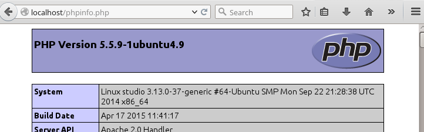

=======================
General troubleshooting
=======================

If you have trouble installing, configuring or maintaining Nextcloud, please 
refer to our community support channels:

* `The Nextcloud Forums`_
   The Nextcloud forums have a `FAQ page`_ where each topic corresponds
   to typical mistakes or frequently occurring issues

*  The Nextcloud IRC chat channel ``irc://#nextcloud@freenode.net`` on 
   freenode.net, also accessible via `webchat`_

Please understand that all these channels essentially consist of users like you 
helping each other out. Consider helping others out where you can, to contribute 
back for the help you get. This is the only way to keep a community like 
Nextcloud healthy and sustainable!

If you are using Nextcloud in a business or otherwise large scale deployment, 
note that Nextcloud GmbH offers commercial support options.

Bugs
----

If you think you have found a bug in Nextcloud, please:

* Search for a solution (see the options above)
* Double-check your configuration

If you can't find a solution, please use our `bugtracker`_. You can generate a 
configuration report with the :ref:`occ config command 
<config_commands_label>`, with passwords automatically obscured.

.. _the Nextcloud Forums: https://help.nextcloud.com
.. _FAQ page: https://help.nextcloud.com/c/faq
.. _bugtracker: https://github.com/nextcloud/server/issues
.. _webchat: http://webchat.freenode.net/?channels=nextcloud
   https://docs.nextcloud.org/server/14/developer_manual/bugtracker/index.html
.. TODO ON RELEASE: Update version number above on release

General troubleshooting
-----------------------

Check the Nextcloud :doc:`../installation/system_requirements`, especially 
supported browser versions.

When you see warnings about ``code integrity``, refer to :doc:`code_signing`.

Disable 3rdparty / non-shipped apps
^^^^^^^^^^^^^^^^^^^^^^^^^^^^^^^^^^^

It might be possible that 3rd party / non-shipped apps are causing various 
different issues. Always disable 3rd party apps before upgrades, and for 
troubleshooting. Please refer to the :ref:`apps_commands_label` on how
to disable an app from command line.

Nextcloud logfiles
^^^^^^^^^^^^^^^^^^

In a standard Nextcloud installation the log level is set to ``Normal``. To find 
any issues you need to raise the log level to ``All`` in your ``config.php`` 
file, or to **Everything** on your Nextcloud Admin page. Please see 
:doc:`../configuration_server/logging_configuration` for more information on 
these log levels.

Some logging - for example JavaScript console logging - needs debugging 
enabled. Edit :file:`config/config.php` and change ``'debug' => false,`` to 
``'debug' => true,`` Be sure to change it back when you are finished.

For JavaScript issues you will also need to view the javascript console. All 
major browsers have developer tools for viewing the console, and you 
usually access them by pressing F12.

.. note:: The logfile of Nextcloud is located in the data directory 
   ``nextcloud/data/nextcloud.log``.

.. _label-phpinfo:
   
PHP version and information
^^^^^^^^^^^^^^^^^^^^^^^^^^^

You will need to know your PHP version and configurations. To do this, create a 
plain-text file named **phpinfo.php** and place it in your Web root, for 
example ``/var/www/html/phpinfo.php``. (Your Web root may be in a different 
location; your Linux distribution documentation will tell you where.) This file 
contains just this line::

 <?php phpinfo(); ?>

Open this file in a Web browser by pointing your browser to 
``localhost/phpinfo.php``:

Your PHP version is at the top, and the rest of the page contains abundant 
system information such as active modules, active ``.ini`` files, and much more. 
When you are finished reviewing your information you must delete 
``phpinfo.php``, or move it outside of your Web directory, because it is a 
security risk to expose such sensitive data.

Debugging sync issues
^^^^^^^^^^^^^^^^^^^^^

.. warning:: The data directory on the server is exclusive to Nextcloud and must 
   not be modified manually.

Disregarding this can lead to unwanted behaviors like:

* Problems with sync clients
* Undetected changes due to caching in the database

If you need to directly upload files from the same server please use a WebDAV 
command line client like ``cadaver`` to upload files to the WebDAV interface at:

``https://example.com/nextcloud/remote.php/dav``

Common problems / error messages
^^^^^^^^^^^^^^^^^^^^^^^^^^^^^^^^

Some common problems / error messages found in your logfiles as described above:

* ``SQLSTATE[HY000] [1040] Too many connections`` -> You need to increase the
  connection limit of your database, please refer to the manual of your database
  for more information.
* ``SQLSTATE[HY000]: General error: 5 database is locked`` -> You're using 
  ``SQLite``
  which can't handle a lot of parallel requests. Please consider converting to
  another database like described in 
  :doc:`../configuration_database/db_conversion`.
* ``SQLSTATE[HY000]: General error: 2006 MySQL server has gone away`` -> Please
  refer to :ref:`db-troubleshooting-label` for more information.
* ``SQLSTATE[HY000] [2002] No such file or directory`` -> There is a problem
  accessing your SQLite database file in your data directory 
  (``data/nextcloud.db``). Please check the permissions of this folder/file or 
  if it exists at all. If you're using MySQL please start your database.
* ``Connection closed / Operation cancelled`` -> This could be caused by wrong 
  ``KeepAlive`` settings within your Apache config. Make sure that 
  ``KeepAlive`` is set to ``On`` and  also try to raise the limits of 
  ``KeepAliveTimeout`` and  ``MaxKeepAliveRequests``.
* ``No basic authentication headers were found`` -> This error is shown in your
  ``data/nextcloud.log`` file. Some Apache modules like ``mod_fastcgi``, ``mod_fcgid``
  or ``mod_proxy_fcgi`` are not passing the needed authentication headers to
  PHP and so the login to Nextcloud via WebDAV, CalDAV and CardDAV clients is
  failing. Information on how to correctly configure your environment can be
  found at the `forums <https://forum.owncloud.org/viewtopic.php?f=17&t=30646>`_.

Troubleshooting Web server and PHP problems
-------------------------------------------

Logfiles
^^^^^^^^

When having issues the first step is to check the logfiles provided by PHP, the 
Web server and Nextcloud itself.

.. note:: In the following the paths to the logfiles of a default Debian 
   installation running Apache2 with mod_php is assumed. On other Web servers, 
   Linux distros or operating systems they can differ.

* The logfile of Apache2 is located in ``/var/log/apache2/error.log``.
* The logfile of PHP can be configured in your ``/etc/php5/apache2/php.ini``. 
  You need to set the directive ``log_errors`` to ``On`` and choose the path
  to store the logfile in the ``error_log`` directive. After those changes you
  need to restart your Web server.
* The logfile of Nextcloud is located in the data directory 
  ``/var/www/nextcloud/data/nextcloud.log``.

Web server and PHP modules
^^^^^^^^^^^^^^^^^^^^^^^^^^

.. note:: Lighttpd is not supported with Nextcloud, and some Nextcloud features 
   may not work at all on Lighttpd.

There are some Web server or PHP modules which are known to cause various 
problems like broken up-/downloads. The following shows a draft overview of 
these modules:

1. Apache

* mod_pagespeed
* mod_evasive
* mod_security
* mod_reqtimeout
* mod_deflate
* libapache2-mod-php5filter (use libapache2-mod-php5 instead)
* mod_spdy together with libapache2-mod-php5 / mod_php (use fcgi or php-fpm 
  instead)
* mod_dav
* mod_xsendfile / X-Sendfile (causing broken downloads if not configured 
  correctly)

2. NginX

* ngx_pagespeed
* HttpDavModule
* X-Sendfile (causing broken downloads if not configured correctly)

3. PHP

* eAccelerator

.. _trouble-webdav-label:

Troubleshooting WebDAV
----------------------

Nextcloud uses SabreDAV, and the SabreDAV documentation is comprehensive and 
helpful.

.. note: Lighttpd is not supported on Nextcloud, and Lighttpd WebDAV does not 
   work with Nextcloud.

See:

* `SabreDAV FAQ <http://sabre.io/dav/faq/>`_
* `Web servers <http://sabre.io/dav/webservers>`_ (Lists lighttpd as not 
  recommended)
* `Working with large files <http://sabre.io/dav/large-files/>`_ (Shows a PHP 
  bug in older SabreDAV versions and information for mod_security problems)
* `0 byte files <http://sabre.io/dav/0bytes>`_ (Reasons for empty files on the 
  server)
* `Clients <http://sabre.io/dav/clients/>`_ (A comprehensive list of WebDAV 
  clients, and possible problems with each one)
* `Finder, OS X's built-in WebDAV client 
  <http://sabre.io/dav/clients/finder/>`_ 
  (Describes problems with Finder on various Web servers)

There is also a well maintained FAQ thread available at the `ownCloud Forums
<https://forum.owncloud.org/viewtopic.php?f=17&t=7536>`_
which contains various additional information about WebDAV problems.

.. _service-discovery-label:

Service discovery
-----------------

Some clients - especially on iOS/macOS - have problems finding the proper
sync URL, even when explicitly configured to use it.

If you want to use CalDAV or CardDAV clients or other clients that require service discovery
together with Nextcloud it is important to have a correct working setup of the following
URLs:

| ``https://example.com/.well-known/carddav``
| ``https://example.com/.well-known/caldav``
| ``https://example.com/.well-known/webfinger``
|

Those need to be redirecting your clients to the correct endpoints. If Nextcloud
is running at the document root of your Web server the correct URL is:

``https://example.com/remote.php/dav`` for CardDAV and CalDAV and
``https://example.com/public.php?service=webfinger``

and if running in a subfolder like ``nextcloud``:

``https://example.com/nextcloud/remote.php/dav``
``https://example.com/nextcloud/public.php?service=webfinger``

For the first case the :file:`.htaccess` file shipped with Nextcloud should do
this work for you when you're running Apache. You need to make sure that your
Web server is using this file. Additionally, you need the mod_rewrite Apache
module installed to process these redirects. When running Nginx please refer to
:doc:`../installation/nginx`.

If your Nextcloud instance is installed in a subfolder called ``nextcloud`` and
you're running Apache create or edit the :file:`.htaccess` file within the
document root of your Web server and add the following lines::

    <IfModule mod_rewrite.c>
      RewriteEngine on
      RewriteRule ^\.well-known/host-meta /nextcloud/public.php?service=host-meta [QSA,L]
      RewriteRule ^\.well-known/host-meta\.json /nextcloud/public.php?service=host-meta-json [QSA,L]
      RewriteRule ^\.well-known/webfinger /nextcloud/public.php?service=webfinger [QSA,L]
      RewriteRule ^\.well-known/carddav /nextcloud/remote.php/dav/ [R=301,L]
      RewriteRule ^\.well-known/caldav /nextcloud/remote.php/dav/ [R=301,L]
    </IfModule>

Make sure to change /nextcloud to the actual subfolder your Nextcloud instance is running in.

If you are running NGINX, make sure ``location = /.well-known/carddav {`` and ``location = /.well-known/caldav {`` are properly configured as described in :doc:`../installation/nginx`, adapt to use a subfolder if necessary. 

Now change the URL in the client settings to just use:

``https://example.com``

instead of e.g.

``https://example.com/nextcloud/remote.php/dav/principals/username``.

There are also several techniques to remedy this, which are described extensively at
the `Sabre DAV website <http://sabre.io/dav/service-discovery/>`_.

Troubleshooting contacts & calendar
-----------------------------------

Unable to update contacts or events
^^^^^^^^^^^^^^^^^^^^^^^^^^^^^^^^^^^

If you get an error like:

``PATCH https://example.com/remote.php/dav HTTP/1.0 501 Not Implemented``

it is likely caused by one of the following reasons:

Using Pound reverse-proxy/load balancer
  As of writing this Pound doesn't support the HTTP/1.1 verb.
  Pound is easily `patched 
  <http://www.apsis.ch/pound/pound_list/archive/2013/2013-08/1377264673000>`_ 
  to support HTTP/1.1.

Misconfigured Web server
  Your Web server is misconfigured and blocks the needed DAV methods.
  Please refer to :ref:`trouble-webdav-label` above for troubleshooting steps.

Troubleshooting data-directory
------------------------------

If you have a fresh install, consider reinstalling with your preferred directory location.

Unofficially moving the data directory can be done as follows:

1. Make sure no cron jobs are running
2. Stop apache
3. Move /data to the new location
4. Change the config.php entry
5. Edit the database: In oc_storages change the path on the local::/old-data-dir/ entry
6. Ensure permissions are still correct
7. Restart apache

.. warning
   However this is not supported and you risk breaking your database. 
   
For a safe moving of data directory, supported by Nextcloud, recommended actions are:

1. Make sure no cron jobs are running
2. Stop apache
3. Move /data to the new location
4. Create a symlink from the original location to the new location
5. Ensure permissions are still correct
6. Restart apache

.. warning
   Note, you may need to configure your webserver to support symlinks.

Other issues
------------

Some services like *Cloudflare* can cause issues by minimizing JavaScript
and loading it only when needed. When having issues like a not working
login button or creating new users make sure to disable such services
first.
