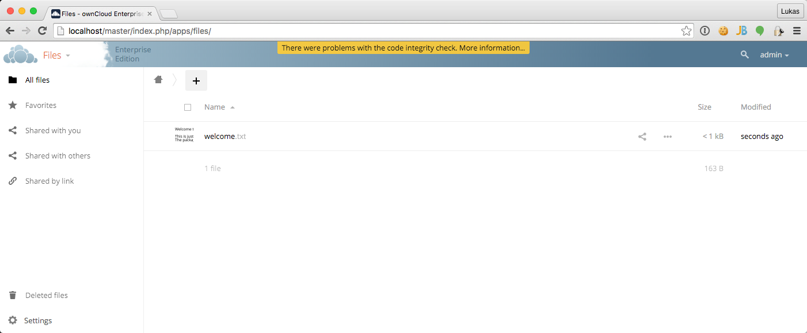
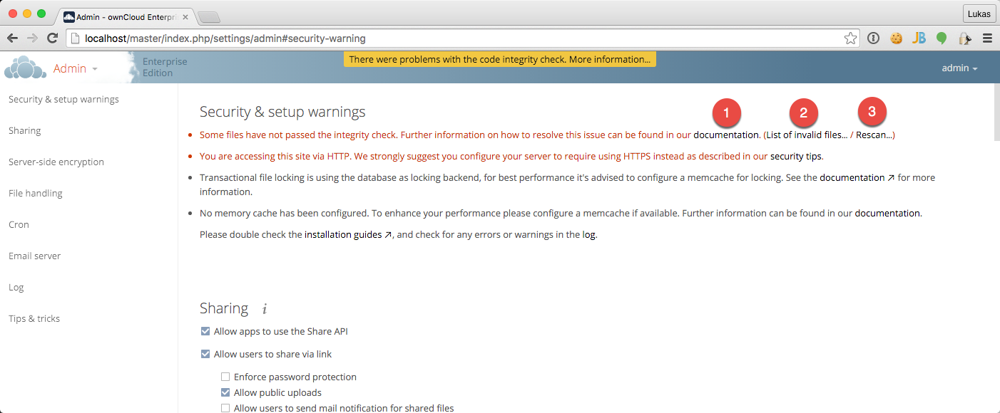

============
Code Signing
============

.. sectionauthor:: Lukas Reschke <lukas@owncloud.com>

ownCloud supports code signing for the core releases as well as dedicated applications. Code signing gives our users an
additional layer of security by ensuring that nobody else than authorized persons can push updates for your applications.

It furthermore ensures that all upgrades have been executed properly. This means that no additional files are left as well
as all old files have been properly replaced. In the past invalid performed updates where a major source of errors when
updating ownCloud.

FAQ
===

Why did ownCloud add Code Signing?
----------------------------------
By supporting Code Signing we add another layer of security by ensuring that nobody else than authorized persons can push
updates for applications. As well we do ensure that people properly updated their ownCloud instances.

Do we lock down ownCloud?
-------------------------
The ownCloud project is open-source and will always be that. We do have no intentions to make it harder for people to
manually adjust their instances. In fact, any fail with the code integrity of ownCloud core while upgrading will not
prevent the usage of ownCloud. It will barely display a notification to the administrator. For applications that are not
tagged "Official" the code signing process is purely optional.

Not open-source anymore?
------------------------
ownCloud is an open-source project and will always be that. In fact, the code signing process is purely optional. The
code check for the core parts of ownCloud is furthermore only enabled when the ownCloud release version branch has been
set to stable.

For custom distributions of ownCloud it is recommended to change the release version branch in version.php to something
else than "stable".

Is code signing mandatory for apps?
-----------------------------------

Code signing is purely optional for all third-party applications. Applications with a tag of "Official" on apps.owncloud.com
do however require Code Signing.

Fixing invalid code integrity
=============================

An error with the code integrity checker does usually imply that an update has been performed wrongly. As a logged-in
administrator you will notice this with the following notification ("There were problems with the code integrity check. More information…") which is displayed on each page:



Clicking on this link will lead you to the administrator page which offers you the following options:

1. Link to this documentation entry.
2. Show a list of invalid files.
3. Trigger a rescan.



To debug issues caused by the code integrity check please click on "List of invalid files…", you will be shown a text
document listing the different issues. The content of the file will look similar to the following one:

.. code-block:: text

  Technical information
  =====================
  The following list covers which files have failed the integrity check. Please read
  the previous linked documentation to learn more about the errors and how to fix
  them.

  Results
  =======
  - core
  	- INVALID_HASH
  		- /index.php
  		- /version.php
  	- EXTRA_FILE
  		- /test.php
  - calendar
  	- EXCEPTION
  		- OC\IntegrityCheck\Exceptions\InvalidSignatureException
  		- Signature data not found.

  Raw output
  ==========
  Array
  (
      [core] => Array
          (
              [INVALID_HASH] => Array
                  (
                      [/index.php] => Array
                          (
                              [expected] => f1c5e2630d784bc9cb02d5a28f55d6f24d06dae2a0fee685f3c2521b050955d9d452769f61454c9ddfa9c308146ade10546cfa829794448eaffbc9a04a29d216
                              [current] => ce08bf30bcbb879a18b49239a9bec6b8702f52452f88a9d32142cad8d2494d5735e6bfa0d8642b2762c62ca5be49f9bf4ec231d4a230559d4f3e2c471d3ea094
                          )

                      [/version.php] => Array
                          (
                              [expected] => c5a03bacae8dedf8b239997901ba1fffd2fe51271d13a00cc4b34b09cca5176397a89fc27381cbb1f72855fa18b69b6f87d7d5685c3b45aee373b09be54742ea
                              [current] => 88a3a92c11db91dec1ac3be0e1c87f862c95ba6ffaaaa3f2c3b8f682187c66f07af3a3b557a868342ef4a271218fe1c1e300c478e6c156c5955ed53c40d06585
                          )

                  )

              [EXTRA_FILE] => Array
                  (
                      [/test.php] => Array
                          (
                              [expected] =>
                              [current] => 09563164f9904a837f9ca0b5f626db56c838e5098e0ccc1d8b935f68fa03a25c5ec6f6b2d9e44a868e8b85764dafd1605522b4af8db0ae269d73432e9a01e63a
                          )

                  )

          )

      [calendar] => Array
          (
              [EXCEPTION] => Array
                  (
                      [class] => OC\IntegrityCheck\Exceptions\InvalidSignatureException
                      [message] => Signature data not found.
                  )

          )

  )

In above error output it can be seen that:

1. In the ownCloud core (that is, the ownCloud server itself) the files "index.php" and "version.php" do have the wrong version.
2. In the ownCloud core the unrequired extra file "/test.php" has been found.
3. It was not possible to verify the signature of the calendar application.

As an instance administrator one should now upload the correct "index.php" and "version.php" file as well as delete the
"test.php" file. For the calendar exception one should contact the developer of the application. For other means on how
to receive support please take a look at https://owncloud.org/support/. After you fixed these problems you can verify this
by clicking "Rescan…".

Errors
======

The following errors can be encountered when trying to verify a code signature.

- ``INVALID_HASH``

  - The file has a different hash than specified within ``signature.json``. This usually happens when the file has been modified again after writing the signature data.

- ``MISSING_FILE``

  - The file cannot be found but has been specified within ``signature.json``. This usually happens when a file has been forgotten to copy.

- ``EXTRA_FILE``

  - The file does not exist in ``signature.json``. This usually happens when a file has been forgotten to delete.

- ``EXCEPTION``

  - Another exception has prevented the code verification. There are currently the following exceptions:

    - ``Signature data not found.```

      - The app has mandatory code signing enforced but no ``signature.json`` file has been found in it's ``appinfo`` folder.

    - ``Certificate is not valid.``

      - The certificate has not been issued by the official ownCloud Code Signing Root Authority.

    - ``Certificate is not valid for required scope. (Requested: %s, current: %s)``

      - The certificate is not valid for the defined application. Certificates are only valid for the defined app identifier and cannot be used for others.

    - ``Signature could not get verified.``

      - There was a problem with verifying the signature of ``signature.json``.

