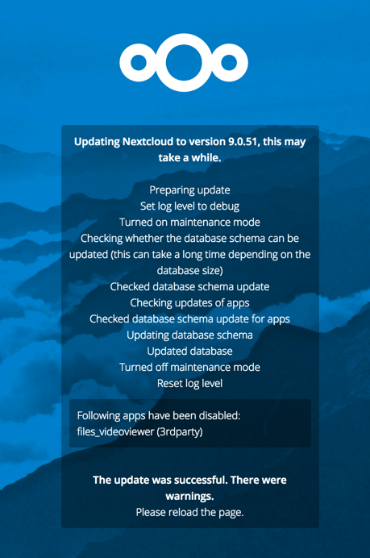

==============================
Upgrade ownCloud From Packages
==============================

.. note:: Starting with ownCloud 8.2 the Linux package repositories have 
   changed, and **you must configure your system to use these new 
   repositories** to install or upgrade ownCloud 8.2+. The new repositories are 
   at our `Open Build Service`_.
   
Upgrade Quickstart
------------------

The core upgrade notifier tells you when a new ownCloud release is available. 
If you click on it, it takes you to :doc:`upgrade`.

    interface.

The best method for keeping ownCloud current on Linux servers is by configuring 
your system to use ownCloud's `Open Build Service`_ repository. Then stay 
current by using your Linux package manager to install fresh ownCloud packages. 
After installing upgraded packages you must run a few more steps to complete the 
upgrade. These are the basic steps to upgrading ownCloud:

* :doc:`Disable <../installation/apps_management_installation>` all third-party 
  apps.
* Make a :doc:`fresh backup <backup>`.
* Install new packages from the ownCloud `Open Build Service`_.
* Take your ownCloud server out of :doc:`maintenance mode 
  <enable_maintenance>`.
* Run the :ref:`upgrade wizard <upgrade_wizard_label>` or 
  ``occ upgrade`` (optionally disabling the :ref:`migration test   
  <migration_test_label>`).
* :ref:`apply strong permissions <strong_perms_label>` to your 
  ownCloud directories.
* Re-enable third-party apps.

Upgrading With Your Linux Package Manager
-----------------------------------------

Upgrading ownCloud from our `Open Build Service`_ repository is just like any 
normal Linux upgrade. For example, on Debian or Ubuntu Linux this is the 
standard system upgrade command::

 apt-get update && apt-get upgrade
 
Or you can upgrade just ownCloud with this command::

 apt-get update && apt-get install owncloud
 
On Fedora, CentOS, and Red Hat Linux use ``yum`` to see all available updates::

 yum check-update
 
You can apply all available updates with this command::
 
 yum update
 
Or update only ownCloud::
 
 yum update owncloud
 
Your Linux package manager only downloads the current ownCloud packages. Then 
your ownCloud server is immediately put into maintenance mode. You may not see 
this until you refresh your ownCloud page.

.. figure:: images/upgrade-1.png
   :scale: 75%
   :alt: ownCloud status screen informing users that it is in maintenance mode.
   
   *Click to enlarge*

To complete the upgrade take your server out of maintenance mode. You can do 
this by changing ``'maintenance' => true,`` to ``'maintenance' => false,`` in 
``config.php``, or use the :doc:`occ command 
<../configuration_server/occ_command>`, like this example on Ubuntu::

 sudo -u www-data php occ maintenance:mode --off
 
You must run ``occ`` as your HTTP user.
 
.. _upgrade_wizard_label:
 
Upgrade Wizard
--------------
 
The final step is to run the upgrade wizard to perform the final steps of 
updating your apps and database. Refresh your ownCloud page and you will see a 
screen with some warnings about backups and a **Start Update** button. 
(Alternatively, you may use ``occ upgrade``, which is covered in the next 
section.) Click the **Start Update** button:

.. figure:: images/upgrade-2.png
   :scale: 75%
   :alt: ownCloud upgrade wizard screen.
  
   *Click to enlarge*
   
The wizard will put ownCloud back into maintenance mode, display a 
status screen while the upgrade is running, and when it is completed take it 
out of maintenance mode and return you to your ownCloud session.

   
   *Click to enlarge*

occ Upgrade
-----------

If you have shell access it is better to **not** click the **Start Update** 
button, but rather to use ``occ upgrade``. ``occ upgrade`` is more reliable, 
especially on installations with large datasets and large numbers of users 
because it avoids the risk of PHP timeouts. This example is for CentOS::

 sudo -u apache php occ upgrade
  ownCloud or one of the apps require upgrade - only a limited number of 
  commands are available
  Set log level to debug - current level: 'Warning'
  Turned on maintenance mode
  Checking whether the database schema can be updated (this can take a long 
  time depending on the database size)
  Checked database schema update
  Checking updates of apps
  Checked database schema update for apps
  Updating database schema
  Updated database
  Update successful
  Turned off maintenance mode
  Reset log level to 'Warning'
 
Remember, you must run ``occ`` as your HTTP user. When it is completed refresh 
your ownCloud Web page to return to your previous session.

.. _migration_test_label:

Migration Test
^^^^^^^^^^^^^^

ownCloud starts your upgrade by first running a simulation: it copies all 
database tables to a temporary directory, and then performs the upgrade on 
them to ensure that the upgrade will complete correctly. This can delay large 
installations by several hours, so you can omit this step with the 
``--skip-migration-test`` option, like this example on CentOS::

 $ sudo -u apache php occ upgrade --skip-migration-test

Setting Strong Directory Permissions
------------------------------------

After upgrading, verify that your ownCloud directory permissions are set 
according to :ref:`strong_perms_label`.

If the upgrade fails, then you must try a manual upgrade.

.. _Open Build Service: 
   https://download.owncloud.org/download/repositories/stable/owncloud/
