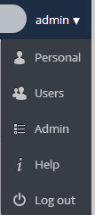

Updating ownCloud
-----------------

.. _updatingowncloud:

The Updater app provides a more automated method of updating ownCloud.  To use the Updater app, it must be enabled in your ownCloud instance.  The Updater is enabled in your ownCloud instance by default when you install.  

To update ownCloud:

1. Make a backup of the ownCloud folder and the database.
  See :doc:`backup` for details.

  .. note:: To update ownCloud, the Updater app must be enabled in your ownCloud instance. The Updater app is enabled in your ownCloud instance by default when you install.  However, to verify that it is enabled, or to enable the Updater app, see enablingupdaterapp_.

2. Navigate to the 'Admin' page.

3. Click the 'Update' tab.

4. Refresh the page using Ctrl+F5.

If this procedure doesn't work (for example, ownCloud 5.0.10 doesn't show new any new version) you could try to perform
a full upgrade to update to the latest point release (see below).

Verifying the Updater App is Enabled
^^^^^^^^^^^^^^^^^^^^^^^^^^^^^^^^^^^^
.. _verifyingupdaterapp:

However, to verify that the Updater is enabled in your ownCloud instance:

1. Select the "Admin" option from the "Personal Settings" dropdown menu.

2. Scroll down the resulting web page.  If the Updater app appears in this window, the app is enabled.  If not, then you must enable it.  See enablingupdaterapp_.

Enabling the Updater App
^^^^^^^^^^^^^^^^^^^^^^^^
.. _enablingupdaterapp:

The Updater app is enabled in your ownCloud instance by default when you install.  However, it is possible that it was disabled at some point.   To enable the Updater app:

1. Click the "+ App" function in the Apps Selection Menu.

  The "Select an App" window opens.

  .. figure:: ../images/oc_select_an_app_window.png

  **Select an App window**

2. Scroll down the list of apps on the left side of the web page and select the Update app.

  .. figure:: ../images/oc_updater_select.png

  **Selecting the Updater app**

3. In the App View window, click "Enable." 

  .. figure:: ../images/oc_updater_enable.png

  **Enabling the Updater app**

  ownCloud enables the Updater app.

Upgrading the ownCloud Server
=============================

The process for upgrading the ownCloud Server is fairly straightforward but requires planning and proper file and folder management.  

To upgrade your ownCloud Server:

1. Ensure that you are running the latest point release of your current major ownCloud version (for example, point release 5.0.14a in the version 5.0 series). To update to the latest point release see updatingowncloud_.

2. Deactivate all third party applications.

  .. note:: Not all third party applications are supported on all ownCloud Server versions.  Make sure to check version compatibility prior to upgrading your ownCloud server.

3. Back up your existing ownCloud Server database.  You can find these procedures in backingupowncloud_.

4. Download the latest ownCloud Server version to your working directory.

  For Linux operating systems, use the following command:

  ``wget http://download.owncloud.org/community/owncloud-latest.tar.bz2``

  For Windows operating systems:

  See the installation instruction in installationserverwindows_.

5. Stop your web server.

  Depending on your environment, you will be running either an Apache server or a Windows IIS server.  In addition, when running your server in a Linux environment, the necessary commands for stopping the Apache server might differ from one Linux operating system to another.

  To stop an Apache server, refer to the following table for specific commands to use in different Linux operating systems:

  +------------------+----------------------------------------------+
  | Operating System | Command (as root)                            | 
  +==================+==============================================+ 
  | CentOS (Redhat)  | ``apachectl stop``                           | 
  +------------------+----------------------------------------------+ 
  | Debian           |                                              |
  | or               | ``/etc/init.d/apache2 stop``                 |
  | Ubuntu           |                                              |
  +------------------+----------------------------------------------+ 
  | openSUSE         |                                              |
  | or               | ``/usr/sbin/rcapache2 stop``                 |
  | SUSE (SLE)       |                                              | 
  +------------------+----------------------------------------------+

  To stop the Windows IIS web server, you can use either the user interface (UI) or command line method as follows:

  +----------------------+-------------------------------------------------------------------------+
  | Method               | Procedure                                                               | 
  +======================+=========================================================================+ 
  | User Interface (UI)  | 1. Open IIS Manager and navigate to the Web server node in the tree.    |
  |                      |                                                                         |
  |                      | 2. In the **Actions** pane, click **Stop**.                             |
  +----------------------+-------------------------------------------------------------------------+ 
  | Command Line         | 1. Open a command line window as administrator.                         |
  |                      |                                                                         |
  |                      | 2. At the command prompt, type **net stop WAS** and press **ENTER**.    |
  |                      |                                                                         |
  |                      | 3. (Optional) To stop W3SVC, type **Y** and then press **ENTER**.       |
  +----------------------+-------------------------------------------------------------------------+

  .. note:: For specific instructions on how to stop, start, or manage your server, please refer to instructions for the server on your specific operating environment.

6. Copy, move, or rename your current owncloud directory (named ``/owncloud`` if installed using defaults) to another location for use in your new version of ownCloud.

  .. note:: This step ensures that you have a version of ownCloud available for backup purposes.

7. Replace the old version of ownCloud Server with the new version of ownCloud Server:

  Assuming that your installation directory is called ‘owncloud’, and that it resides in your working directory, the command to unpack the release tarball into the directory would be as follows::

    tar xjf owncloud-latest.tar.bz2

  In Microsoft Windows environments, you can unpack the release tarball using WinZip or a similar tool (for example, Peazip).

  Though you can upack the server code into an existing, populated directory, best practice is to unpack server code into an empty directory.

  .. note:: If you copied the installation directory, instead of moving or renaming, this step overwrites the old ownCloud Server version in the current location.

8. Copy and paste the ``/config/config.php`` file from the saved version of ownCloud to the ``/config`` directory of your new ownCloud version.

  .. note:: You must perform this step **before* restarting your web server.

9. If you chose to keep your /data directory in your ``/owncloud`` directory, copy and paste it from the old version of ownCloud to the ``/owncloud`` directory of your new ownCloud version.

  .. note:: We recommend storing your ``/data`` directory in a location other than your ``/owncloud`` directory.  If you have your ``/data`` directory already stored in another location, you can skip this step.  If you want to do so, now is a good time to change the location of your ``/data`` directory.  See advancedoptions_ for added details about changing the default database or data directory.

10. Restart your web server.

  Depending on your environment, you will be running either an Apache server or a Windows IIS server.  In addition, when running your server in a Linux environment, the necessary commands for stopping the Apache server might differ from one Linux operating system to another.

  To restart an Apache server, refer to the following table for specific commands to use in different Linux operating systems:

  +------------------+----------------------------------------------+
  | Operating System | Command (as root)                            | 
  +==================+==============================================+ 
  | CentOS (Redhat)  | ``apachectl start``                          | 
  +------------------+----------------------------------------------+ 
  | Debian           |                                              |
  | or               | ``/etc/init.d/apache2 start``                |
  | Ubuntu           |                                              |
  +------------------+----------------------------------------------+ 
  | openSUSE         |                                              |
  | or               | ``/usr/sbin/rcapache2 start``                |
  | SUSE (SLE)       |                                              | 
  +------------------+----------------------------------------------+

  To start the Windows IIS web server, you can use either the user interface (UI) or command line method as follows:

  +----------------------+-------------------------------------------------------------------------+
  | Method               | Procedure                                                               | 
  +======================+=========================================================================+ 
  | User Interface (UI)  | 1. Open IIS Manager and navigate to the Web server node in the tree.    |
  |                      |                                                                         |
  |                      | 2. In the **Actions** pane, click **Start**.                            |
  +----------------------+-------------------------------------------------------------------------+ 
  | Command Line         | 1. Open an elevated command line window.                                |
  |                      |                                                                         |
  |                      | 2. At the command prompt, type **net start W3SVC** and press **ENTER**. |
  |                      |    This command starts both WAS and W3SVC.                              |
  +----------------------+-------------------------------------------------------------------------+

  .. note:: For specific instructions on how to stop, start, or manage your server, please refer to instructions for the server on your specific operating environment.

11. Use a browser to your ownCloud server.

  This step is required.  Accessing the server using a browser connection launches the server upgrade.

12. If third party applications were running on your system, ensure that they provide versions compatible with the new ownCloud release. If compatible, you can reinstall and enable these applications.

  .. note:: Update procedures should run when necessary.
