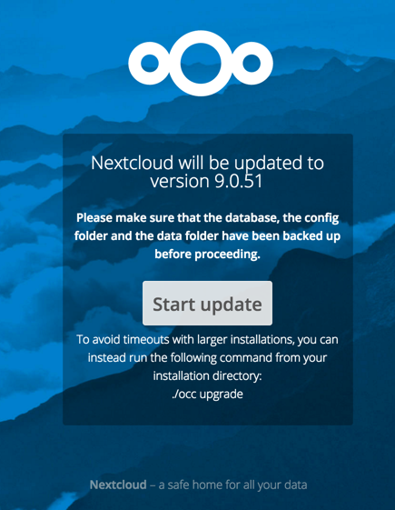

==========================================
Upgrading Nextcloud with the Nextcloud App
==========================================

The Updater app automates many of the steps of upgrading an Nextcloud 
installation. It is useful for installations that do not have root access, 
such as shared hosting, for installations with a smaller number of users 
and data, and it automates updating 
:doc:`manual installations <../installation/source_installation>`.

The Updater app has :ref:`command-line options <updater_cli_label>`.
   
   **Downgrading** is not supported and risks corrupting your data! If you want 
   to revert to an older Nextcloud version, install it from scratch and then 
   restore your data from backup. Before doing this, file a support ticket (if 
   you have paid support) or ask for help in the Nextcloud forums to see if your 
   issue can be resolved without downgrading.

You should maintain regular backups (see :doc:`backup`), and make a backup 
before every update. The Updater app does not backup your database or data 
directory.

The Updater app performs these operations:

* Creates an ``updater_backup`` directory under your Nextcloud data directory
* Downloads and extracts updated package content into the 
  ``updater_backup/packageVersion`` directory
* Makes a copy of your current Nextcloud instance, except for your data 
  directory, to ``updater_backup/currentVersion-randomstring``
* Moves all directories except ``data``, ``config`` and ``themes`` from the 
  current instance to ``updater_backup/tmp``
* Moves all directories from ``updater_backup/packageVersion`` to the current 
  version
* Copies your old ``config.php`` to the new ``config/`` directory

Using the Updater app to update your Nextcloud installation is just a few 
steps:

1.  You should see a notification at the top of any Nextcloud page when there is 
    a new update available.
   
2.  Even though the Updater app backs up important directories, you should 
    always have your own current backups (See :doc:`backup` for details.)
   
3.  Verify that the HTTP user on your system can write to your whole Nextcloud 
    directory; see the :ref:`set_updating_permissions_label` section below.
   
4.  Navigate to your Admin page and click the **Update Center** button under 
    Updater. This takes you to the Updater control panel.

5.  Click Update, and carefully read the messages. If there are any problems it 
    will tell you. The most common issue is directory permissions; your HTTP 
    user needs write permissions to your whole Nextcloud directory. (See 
    :ref:`strong_perms_label`.) Another common issue is SELinux rules 
    (see :ref:`selinux-config-label`.) Otherwise you will see messages 
    about checking your installation and making backups.

6.  Click Proceed, and then it performs the remaining steps, which takes a few 
    minutes.

7.  If your directory permissions are correct, a backup was made, and 
    downloading the new Nextcloud archive succeeded you will see the following 
    screen. Click the Start Update button to complete your update:

..  note:: If you have a large Nextcloud installation and have shell access,
    you should use the ``occ upgrade`` command, running it as your HTTP user, 
    instead of clicking the Start Update button, in order to avoid PHP 
    timeouts.
    
This example is for Ubuntu Linux::

     $ sudo -u www-data php occ upgrade
 
Before completing the upgrade, Nextcloud first runs a simulation by copying all 
database tables to new tables, and then performs the upgrade on them, to ensure 
that the upgrade will complete correctly. The copied tables are deleted after 
the upgrade. This takes twice as much time, which on large installations can be 
many hours, so you can omit this step with the ``--skip-migration-test`` 
option, like this example on Ubuntu::

 $ sudo -u www-data php occ upgrade --skip-migration-test 

See :doc:`../configuration_server/occ_command` to learn more.

8.  It runs for a few minutes, and when it is finished displays a success 
    message, which disappears after a short time.

Refresh your Admin page to verify your new version number. In the Updater 
section of your Admin page you can see the current status and backups. These 
are backups of your old and new Nextcloud installations, and do not contain your 
data files. If your update works and there are no problems you can delete the 
backups from this screen.

If the update fails, then you must update manually. (See :doc:`Manually 
upgrading <manual_upgrade>`.)

.. _set_updating_permissions_label:

Setting Permissions for Updating
--------------------------------
   
For hardened security we  highly recommend setting the permissions on your 
Nextcloud directory as strictly as possible. These commands should be executed 
immediately after the initial installation. Please follow the steps in 
:ref:`strong_perms_label`.
    
These strict permissions will prevent the Updater app from working, as it needs 
your whole Nextcloud directory to be owned by the HTTP user. Run this script to 
set the appropriate permissions for updating. Replace the ``ocpath`` variable 
with the path to your Nextcloud directory, and replace the ``htuser`` and 
``htgroup`` variables with your HTTP user and group.::

    #!/bin/bash
    # Sets permissions of the Nextcloud instance for updating
    
    ocpath='/var/www/nextcloud'
    htuser='www-data'
    htgroup='www-data'
    
    chown -R ${htuser}:${htgroup} ${ocpath}

You can find your HTTP user in your HTTP server configuration files. Or you can 
use :ref:`label-phpinfo` (Look for the **User/Group** line).

* The HTTP user and group in Debian/Ubuntu is ``www-data``.
* The HTTP user and group in Fedora/CentOS is ``apache``.
* The HTTP user and group in Arch Linux is ``http``.
* The HTTP user in openSUSE is ``wwwrun``, and the HTTP group is ``www``.

After the update is completed, re-apply the strong directory permissions 
immediately by running the script in :ref:`strong_perms_label`.

.. _updater_cli_label:

Command Line Options
--------------------

The Updater app includes command-line options to automate updates, to create 
checkpoints and to roll back to older checkpoints. You must run it as your HTTP 
user. This example on Ubuntu Linux displays command options::

 sudo -u www-data php updater/application.php list
 
See usage for commands, like this example for the ``upgrade:checkpoint`` 
command:: 

  sudo -u www-data php updater/application.php upgrade:checkpoint -h

You can display a help summary::
  
 sudo -u www-data php updater/application.php --help
 
When you run it without options it runs a system check:: 

 sudo -u www-data php nextcloud/updater/application.php
 Nextcloud updater 1.0 - CLI based Nextcloud server upgrades
 Checking system health.
 - file permissions are ok.
 Current version is 9.0.0.12
 No updates found online.
 Done
 
Create a checkpoint::

 sudo -u www-data php updater/application.php upgrade:checkpoint  --create 
 Created checkpoint 9.0.0.12-56d5e4e004964

List checkpoints::

 sudo -u www-data php updater/application.php upgrade:checkpoint --list
 
Restore an earlier checkpoint::

 sudo -u www-data php nextcloud/updater/application.php upgrade:checkpoint 
  --restore=9.0.0.12-56d5e4e004964

Add a line like this to your crontab to automatically create daily 
checkpoints::

 2 15 * * * sudo -u www-data php /path/to/nextcloud/updater/application.php 
 upgrade:checkpoint --create > /dev/null 2>&1
 
