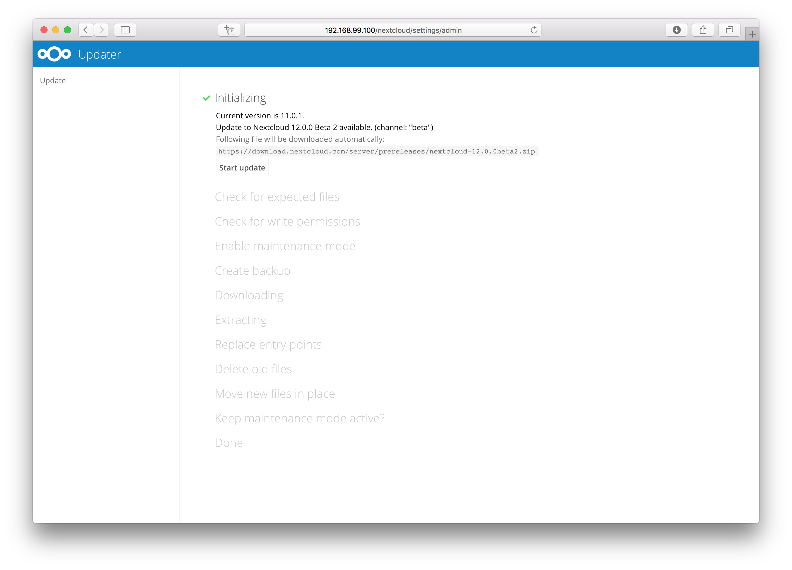
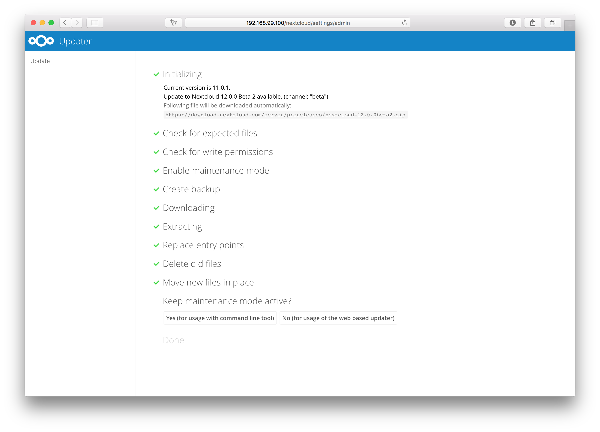
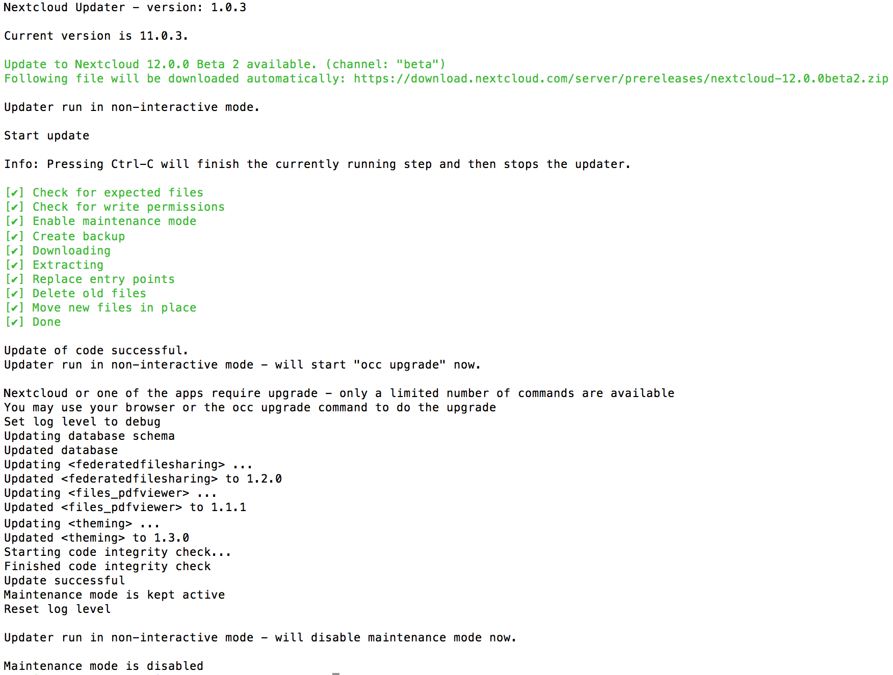

============================
Upgrade via built-in updater
============================

The built-in updater automates many of the steps of upgrading a Nextcloud
installation. It is useful for installations that do not have root access,
such as shared hosting, for installations with a smaller number of users
and data, and it automates updating
:doc:`manual installations <../installation/source_installation>`.

.. warning::
   **Downgrading** is not supported and risks corrupting your data! If you want
   to revert to an older Nextcloud version, install it from scratch and then
   restore your data from backup. Before doing this, file a support ticket if
   you have paid support or ask for help in the Nextcloud forums to see if your
   issue can be resolved without downgrading.

You should maintain regular backups (see :doc:`backup`), and make a backup
before every update. The built-in updater does not backup your database or data
directory.

What does the updater do?
-------------------------

.. note::
   The updater itself only replaces the existing files with the ones from the
   version it updates to. The migration steps needs to be executed afterwards.
   The command line mode provides a way to do this right after the code was
   successfully replaced.

The built-in updater performs these operations:

* **Check for expected files:** checks if only the expected files of a
  Nextcloud installation are present, because it turned out that some files
  that were left in the Nextcloud directory caused side effects that risked
  the update procedure.
* **Check for write permissions:** checks if all files that need to be
  writable during the update procedure are actually writable.
* **Enable maintenance mode:** enables the maintenance mode so that no other
  actions are executed while running the update of the code.
* **Create backup:** creates a backup of the existing code base in
  ``/updater-INSTANCEID/backups/nextcloud-CURRENTVERSION/`` inside of the
  data directory (this does not contain the ``/data`` directory nor the
  database).
* **Downloading:** downloads the code in the version it should update to. This
  is also shown in the web UI before the update is started. This archive is
  downloaded to ``/updater-INSTANCEID/downloads/``.
* **Extracting:** extracts the archive to the same folder.
* **Replace entry points:** replaces all Nextcloud entry points with dummy
  files so that when those files are replaced all clients still get the proper
  maintenance mode response. Examples for those endpoints are ``index.php``,
  ``remote.php`` or ``ocs/v1.php``.
* **Delete old files:** deletes all files except the above mentioned entry
  points, the data and config dir as well as non-shipped apps and themes. (And
  the updater itself of course)
* **Move new files in place:** moves the files from the extracted archive in
  place.
* **Keep maintenance mode active?:** asks you if the maintenance mode should
  be kept active. This allows the admin to use the web based updater but run
  the actual migration steps (``occ upgrade``) on the command line. If the
  maintenance mode is kept active command line access is required. To use the
  web based upgrade page disable the maintenance mode and click the link to
  get to the upgrade page. (This step is only available in the web based
  updater.)
* **Done** the update of the code is done and you either need to go to the
  linked page or to the command line to finish the upgrade by executing the
  migration steps.

Using the web based updater
---------------------------

Using the built-in updater to update your Nextcloud installation is just a few
steps:

1.  You should see a notification at the top of any Nextcloud page when there is
    a new update available. Go to the admin settings page and scroll to the
    section "Version". This section has a button to open the updater. This
    section as well as the update notification is only available if the update
    notification app is enabled in the apps management.

.. figure:: images/updater-1-update-available.png

2.  Click the button "Open updater".

3.  Verify the information that is shown and click the button "Start update"
    to start the update.

.. figure:: images/updater-3-running-step.png

4.  In case an error happens or the check failed the updater stops processing
    and gives feedback. You can now try to solve the problem and click the
    "Retry update" button. This will continue the update and re-run the failed
    step. It will not re-run the previous succeeded steps.

.. figure:: images/updater-4-failed-step.png

5. In case you close the updater, before it finished you can just open the
   updater page again and proceed at the last succeeded step. Closing the web
   page will still execute the running step but will not continue with the next
   one, because this is triggered by the open updater page.

.. figure:: images/updater-5-continue-update.png

6. Once all steps are executed the updater will ask you a final question:
   "Keep maintenance mode active?". This allows you to use either the web based
   upgrade page or the command line based upgrade procedure (``occ upgrade``).
   Command line access is required if the maintenance mode is kept active.

7. Done. You now can continue either to the web based upgrade page or run
   ``occ upgrade``. The two examples "Web based upgrade" and "Command line
   based upgrade" shows how the screens then look like.

**Web based upgrade**

This is how the web based update would continue:

.. image:: images/updater-7-disable-maintenance.png

.. image:: images/updater-9-upgrade-page.png

**Command line based upgrade**

This is how the command line based update would continue:

.. image:: images/updater-8-keep-maintenance.png

.. code::

    $ sudo -u www-data php ./occ upgrade
    Nextcloud or one of the apps require upgrade - only a limited number of commands are available
    You may use your browser or the occ upgrade command to do the upgrade
    Set log level to debug
    Updating database schema
    Updated database
    Updating <files_pdfviewer> ...
    Updated <files_pdfviewer> to 1.1.1
    Updating <gallery> ...
    Updated <gallery> to 17.0.0
    Updating <activity> ...
    Updated <activity> to 2.5.2
    Updating <comments> ...
    Updated <comments> to 1.2.0
    Updating <theming> ...
    Updated <theming> to 1.3.0
    Starting code integrity check...
    Finished code integrity check
    Update successful
    Maintenance mode is kept active
    Reset log level

Using the command line based updater
------------------------------------

The command line based updater works in the exact same way the web based
updater works. The steps and checks are the very same.

.. warning:: APCu is disabled by default on CLI which could cause issues with nextcloud's
   command line based updater. Please make sure you set the ``apc.enable_cli`` to ``1`` on your ``php.ini``
   config file or append ``--define apc.enable_cli=1`` to the command line based updater call
   (like ``sudo -u www-data php --define apc.enable_cli=1 /var/www/nextcloud/updater/updater.phar``).

The steps are basically the same as for the web based updater:

1.  You should see a notification at the top of any Nextcloud page when there is
    a new update available. Go to the admin settings page and scroll to the
    section "Version". This section has a button to open the updater. This
    section as well as the update notification is only available if the update
    notication app is enabled in the apps management.

.. image:: images/updater-1-update-available.png

2. Instead of clicking that button you can now invoke the command line based
   updater by going into the `updater/` directory in the Nextcloud directory
   and executing the `updater.phar` as the web server user. (i.e.
   ``sudo -u www-data php /var/www/nextcloud/updater/updater.phar``)

.. image:: images/updater-cli-2-start-updater.png
   :class: terminal-image

3.  Verify the information that is shown and enter "Y" to start the update.

.. image:: images/updater-cli-3-running-step.png
   :class: terminal-image

.. image:: images/updater-cli-4-failed-step.png
   :class: terminal-image

4.  In case an error happens or the check failed the updater stops processing
    and gives feedback. You can now try to solve the problem and re-run the
    updater command. This will continue the update and re-run the failed step.
    It will not re-run the previous succeeded steps.

.. image:: images/updater-cli-5-continue-update.png
   :class: terminal-image

6. Once all steps are executed the updater will ask you a final question:
   "Should the "occ upgrade" command be executed?". This allows you to directly
   execute the command line based upgrade procedure (``occ upgrade``). If you
   select "No" then it will finish with
   `Please now execute "./occ upgrade" to finish the upgrade.`.

.. image:: images/updater-cli-6-run-command.png
   :class: terminal-image

7. Once the ``occ upgrade`` is done you get asked if the maintenance mode
   should be kept active.

.. image:: images/updater-cli-7-maintenance.png
   :class: terminal-image

Batch mode for command line based updater
-----------------------------------------

It is possible to run the command line based updater in a non-interactive mode.
The updater then doesn't ask any interactive questions. It is assumed that if
an update is available it should be installed and the ``occ upgrade`` command
is executed as well. After finishing the maintenance mode will be turned off
except an error occured during the ``occ upgrade`` or the replacement of the
code.

To execute this, run the command with the ``--no-interaction`` option. (i.e.
``sudo -u www-data php /var/www/nextcloud/updater/updater.phar --no-interaction``)

