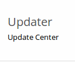
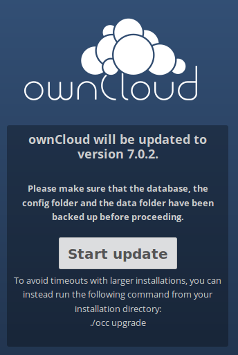
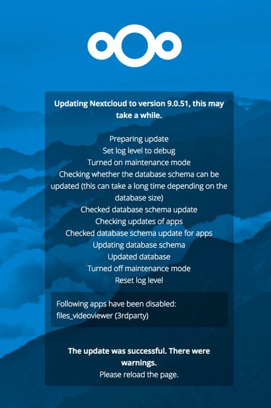

======================================
Updating ownCloud with the Updater App
======================================

The Updater app automates many of the steps of updating an ownCloud installation 
to the next point release. The Updater app should be enabled in your ownCloud 
Server instance by default, which you can easily confirm by looking on your 
Apps page.

.. note:: The Updater app is not included in ownCloud Enterprise Subscription.

Updating and upgrading your ownCloud installation are two different tasks. 
Updating means updating to the next point release, which is indicated 
by third digit of the version number. For example, 7.0.4 and
8.0.4 are point releases. (Look at the bottom of your Admin page to see your
version number.)

Major releases are indicated by the first and second digits. So 6.0, 7.0, and 8.0
are major releases. The Updater app is not for upgrades;
please see :doc:`upgrade` for instructions on upgrading to a major release.

You should maintain regular backups 
(see :doc:`backup`), and make a backup before every update/upgrade. 

The Updater app performs these operations:

* Creates a ``backup`` directory under your ownCloud data directory
* Download and extracts updated package content into the 
  ``backup/packageVersion`` directory
* Makes a copy of your current ownCloud instance, except for your data 
  directory, to  ``backup/currentVersion-randomstring``
* Moves all directories except ``data``, ``config`` and ``themes`` from the 
  current instance to ``backup/tmp``
* Moves all directories from ``backup/packageVersion`` to the current version
* Updates the ownCloud database
* Copies your old ``config.php`` to the new ``config/`` directory

Using the Updater app to update your ownCloud installation is just a few 
steps:

1. You should see a notification at the top of any ownCloud page when there is 
   a new update available:
   

   
2. Even though the Updater app backs up important directories, you should 
   always have your own current backups (See :doc:`backup` for details.)
   
3. Verify that the HTTP user on your system can write to your whole ownCloud 
   directory; see :ref:`setting_strong_permissions`.
   
4. Navigate to your 'Admin' page and click the 'Update Center' button under 
   Updater:

5. This takes you to the Updater control panel.

6. Click Update, and carefully read the messages. If there are any problems it 
   will tell you. The most common issue is directory permissions; see 
   :ref:`setting_strong_permissions`. Otherwise you will see a message about 
   checking your installation, making a backup, and moving files:

8. Click Proceed, and then it downloads the updates, which may take a few 
   minutes:

7. The Update app wants you to be very sure you want to update, and so you must 
   click one more button, the Start Update button:

.. note:: If you have a large ownCloud installation, at this point you
   should use the ``occ upgrade`` command, running it as your HTTP user, 
   instead of clicking Start Update, in order to avoid PHP timeouts. This 
   example is for Ubuntu Linux:

   $ sudo -u www-data php occ upgrade
   
   See :doc:`../configuration_server/occ_command` to learn more about using the 
   ``occ`` command. 

8. It works for a few minutes, and when it is finished displays a success 
   message, which disappears after a short time. 
   

Refresh your Admin page to verify your new version number.

If the Updater app fails, then you must update manually. See :doc:`upgrade` to 
learn how to upgrade manually. 

.. _setting_strong_permissions:

Setting Strong Permissions
--------------------------
   
For hardened security we  highly recommend setting the permissions on your 
ownCloud directory as strictly as possible. These commands should be executed 
immediately after the initial installation. Please follow the steps in the 
**Setting Strong Directory Permissions** section of 
:doc:`../installation/installation_wizard`.
    
These strict permissions will prevent the Updater app from working, as it needs 
your whole ownCloud directory to be owned by the HTTP user. The generic command 
to change ownership of all files and subdirectories in a directory to the HTTP 
user is::

    chown -R <http-user>:<http-user> /path/to/owncloud/

* This example is for Ubuntu 14.04 LTS server::
   
    chown -R www-data:www-data /var/www/owncloud

* Arch Linux::

    chown -R http:http /path/to/owncloud/

* Fedora::

    chown -R apache:apache /path/to/owncloud/
	
* openSUSE::

    chown -R wwwrun:www /path/to/owncloud/
    
After the Updater app has run, you should re-apply the strict permissions.