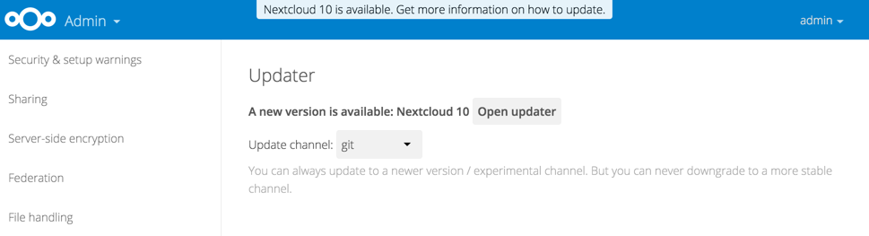

====================================
How to Upgrade Your Nextcloud Server
====================================

There are three ways to upgrade your Nextcloud server:

* With the :doc:`Updater App <update>` (Server Edition only).
* :doc:`Manually upgrading <manual_upgrade>` with the Nextcloud ``.tar`` archive
  from our `Download page <https://nextcloud.com/install/>`_.
* Manually upgrading is also an option for users on shared hosting; download
  and unpack the Nextcloud tarball to your PC. Delete your existing Nextcloud
  files, except ``data/`` and ``config/`` files, on your hosting account. Then
  transfer the new Nextcloud files to your hosting account, again
  preserving your existing ``data/`` and ``config/`` files.

When an update is available for your Nextcloud server, you will see a
notification at the top of your Nextcloud Web interface. When you click the
notification it brings you here, to this page.

**It is best to keep your Nextcloud server upgraded regularly**, and to install 
all point releases and major releases without skipping any of them, as skipping 
releases increases the risk of errors. Major releases are 9, 10, and
11. Point releases are intermediate releases for each major release. For
example, 9.0.52 and 10.0.2 are point releases. **Skipping major releases is not
supported.**

**Upgrading is disruptive**. Your Nextcloud server will be put into maintenance
mode, so your users will be locked out until the upgrade is completed. Large
installations may take several hours to complete the upgrade.

.. warning:: **Downgrading is not supported** and risks corrupting your data! If
   you want to revert to an older Nextcloud version, make a new, fresh
   installation and then restore your data from backup. Before doing this,
   file a support ticket (if you have paid support) or ask for help in the
   Nextcloud forums to see if your issue can be resolved without downgrading.

Update Notifications
--------------------

Nextcloud has an update notification app, that informs the administrator about
the availablilty of an update. Then you decide which update method to use.

   *Figure 1: The top banner is the update notification that is shown on every
   page, and the Updates section can be found in the admin page*

From there the web based updater can be used to fetch this new code. There is
also an CLI based updater available, that does exactly the same as the web
based updater but on the command line.

Prerequisites
-------------

You should always maintain :doc:`regular backups <backup>` and make a fresh
backup before every upgrade.

Then review third-party apps, if you have any, for compatibility with the new
Nextcloud release. Any apps that are not developed by Nextcloud show a 3rd party
designation. **Install unsupported apps at your own risk**. Then, before the
upgrade, all 3rd party apps must be disabled. After the upgrade is complete you
may re-enable them.
