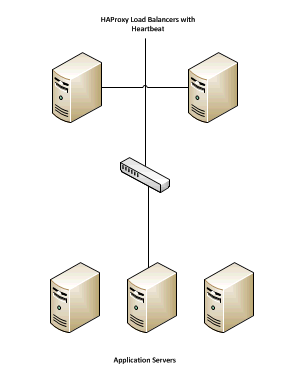
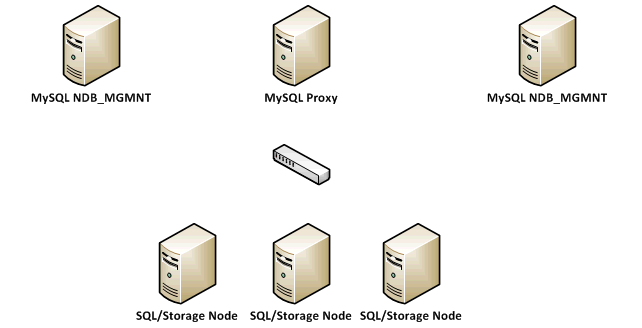
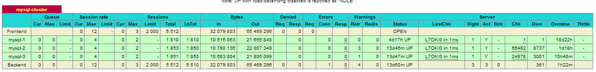
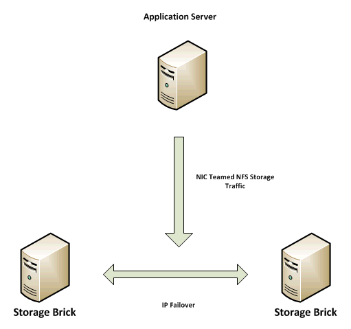
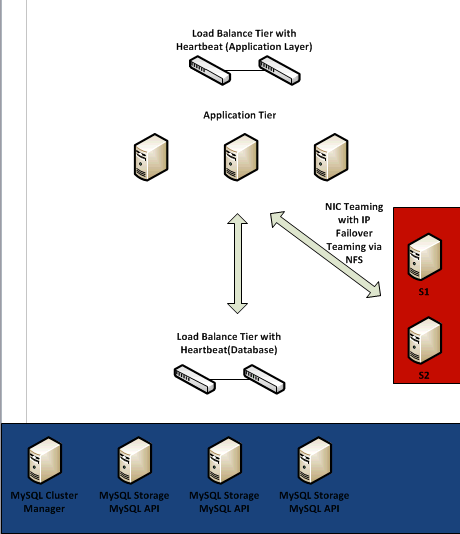

================================
Scaling Across Multiple Machines
================================

.. toctree::
    :maxdepth: 2
    :hidden:

This document will cover the reference architecture for the ownCloud Scale out
model for a single datacenter implementation.  The document will focus on the
three main elements of an ownCloud deployment:

*   Application layer
*   Database Layer
*   Storage Layer

At each layer the goal is to provide the ability to scale, while providing high
availability whole maintaining the needed level of performance.

Application Layer
=================

For the application layer of this reference architecture we used Oracle
Enterprise Linux as the front end servers to host the ownCloud code.  In this
instance we made httpd a permissive domain allowing it to operate within the
SELinux environment.  In this example we also used the standard directory
structure placing the ownCloud code in the apache root directory.  The
following components where installed on each application server:

*   Apache
*   PHP 5.4.x
*   PHP-GD
*   PHP-XML
*   PHP-MYSQL
*   PHP-CURL
*   SMBCLIENT

It is also worth mentioning that the appropriate exceptions where made in the
firewall to allow the ownCloud traffic (for the purposes for of testing we
enable both encrypted SSL via port 443 and unencrypted via port 80).

The next step was to generate and import the needed SSL certificates following
the standard process in the OEL documentation.

The next step is to create a scalable environment at the application layer,
which introduces the load balancer.  Because the application servers here are
stateless, simply taking the configuration above and replicating (once
configured with storage and database connections) and placing behind a load
balancer will provide a scalable and highly available environment.
For this purpose we chose HAProxy and configured it for HTTPS traffic following
the documentation found here `http://haproxy.1wt.eu/#doc1.5
<http://haproxy.1wt.eu/#doc1.5>`_

It is worth noting that this particular load balancer is not required, use of
any commercial load balancer (i.e. F5) will work here.  It is also worth noting
that the HAProxy servers where setup with a heartbeat and IP Shift to failover
the IP address should one fail.

.. Session Management (this section is a WIP pending testing based on customer feedback).

.. The load balancer is to be configured to spread the workload across the various
.. ownCloud application servers, with details to be filled in around session
.. management upon further testing.

Database Layer
==============

For the purposes of this example, we have chosen a MySQL cluster using the NDB
Storage engine.  The cluster was configured based on the documentation found
here `http://dev.mysql.com/doc/refman/5.1/en/mysql-cluster.html
<http://dev.mysql.com/doc/refman/5.1/en/mysql-cluster.html>`_ with a sample
looking like this:

Taking a closer look at the database architecture, we have created redundant
MySQL NDB Management nodes for redundancy and we have configured 3 NDB
SQL/Storage nodes across which we are able to spread the database traffic.  All
of the clients (ownCloud Application Servers) will connect to the database vi
the My SQL Proxy.  It is worth noting that MySQL proxy is still in beta, using
another load balancing method like HAProxy or F5 is supported, in that you will
be distributing traffic among the various SQL/Storage nodes.  Here, we simply
swap out the MySQL Proxy for a properly configured HAProxy giving us the
following:

In this example we have also added a second HAProxy server with Heartbeat to prevent any single point of failure.
We have also implemented NIC bonding to load balance the traffic across multiple physical NICs.

Storage Layer
=============

Storage was deployed using the Red Hat Storage server with the GlusterFS
(pre-configured as part of the Red Hat Storage Server offering).

The Red Hat Storage Servers where configured based on documentation found here
`https://access.redhat.com/site/documentation/en-US/Red_Hat_Storage/2.0/html/Administration_Guide/Admin_Guide_Part_1.html
<https://access.redhat.com/site/documentation/en-US/Red_Hat_Storage/2.0/html/Administration_Guide/Admin_Guide_Part_1.html>`_

For the purposes of scale and high availability we configured a distributed
replicated volume with IP Fail Over.  Configuring the storage on a separate
subnet with bonded NICs at the application server level.  We have chosen to
address the storage using NFS and for high availability we have chosen to
implement IP Failover of the storage as documented here
`https://access.redhat.com/site/documentation/en-US/Red_Hat_Storage/2.0/html/Administration_Guide/ch09s04.html
<https://access.redhat.com/site/documentation/en-US/Red_Hat_Storage/2.0/html/Administration_Guide/ch09s04.html>`_

We chose to deploy the storage in this fashion to address both HA and
extensibility of the storage, along with managing performance by simply adding
additional bricks to the storage volume, back-ended by additional physical
disk.

It is worth noting that several options are available for storage configuration
(Such as striped replicated volumes).  A discussion around the type of IO
performance required and the needed HA configuration needs to take place to
understand the best possible option here.

Adding up the parts:

If we add up the parts, we have the following:

* An application layer that supports dynamic expansion through the addition of additional servers and provides HA behind a load balancer
* A database layer that can also be scaled through the addition of additional SQL/Storage nodes and will provide HA behind a load balancer
* A storage layer that dynamically expand to meet storage needs, will scale based on backend hardware, and provides HA via IP Failover

