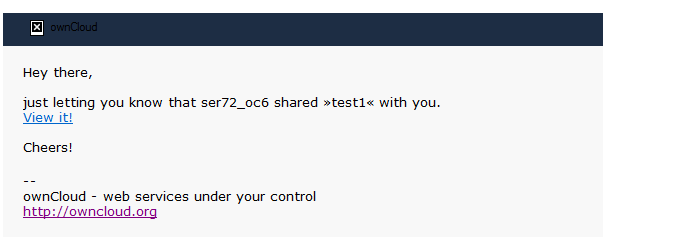
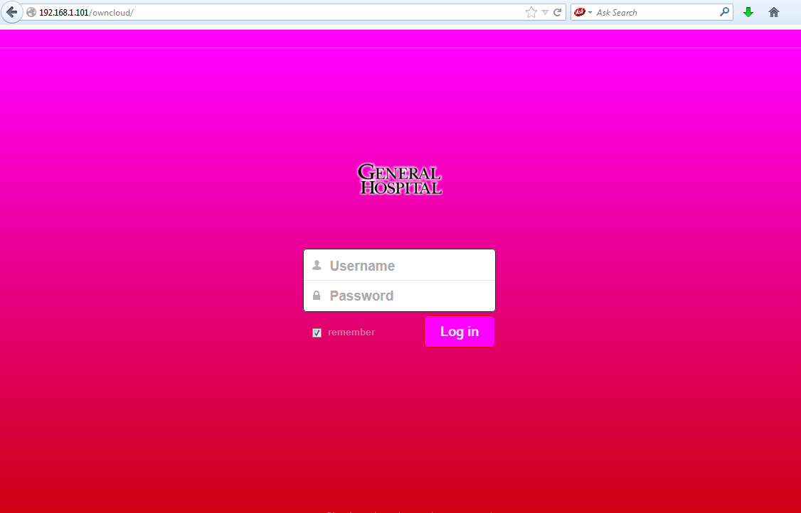
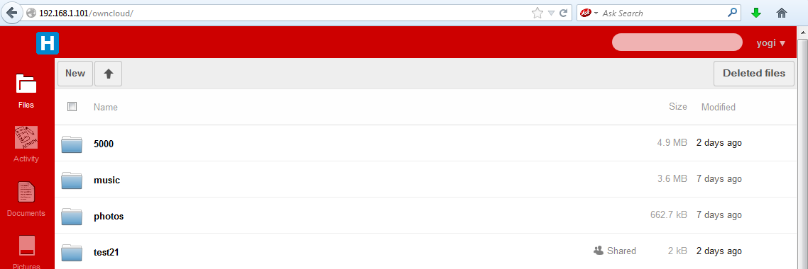
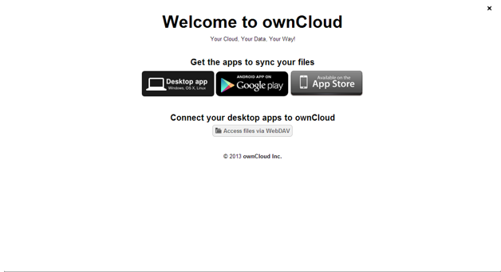
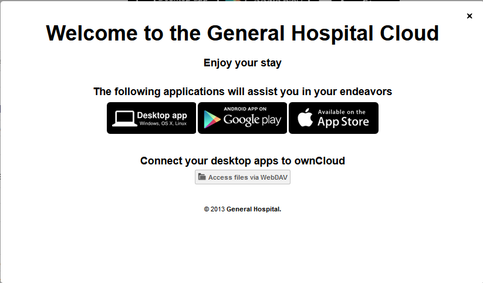

================
Theming ownCloud
================

.. toctree::
    :maxdepth: 2
    :hidden:

ownCloud supports themes, so you can customize its look without editing source code. This 
document covers the basic steps of theming, and then walks through a basic 
theming example.

Configuration
-------------

The themes directory (usually ``owncloud/themes``) contains all theming 
files. A default ownCloud installation comes with a helpful README in this directory. To 
add a new theme, copy a directory containing your themes files in this directory. The 
directory name is the theme name, and you configure ownCloud to use this theme by linking 
it in ``config.php`` with the ``theme`` directive:

.. code-block:: php

  'theme' => 'themename',

This theme overrides any Javascript files, images, templates and CSS files in other 
locations. Your directory structure should be the same as in ``owncloud/core/``::

   themename/
     core/
      css
      img
      js

Never edit the core template files-- always use ``owncloud/themes`` for customizations. 
Errors in theme files can break ownCloud, so you can always revert to the default theme 
while you fix your custom theme.

It is possible for a theme to break between major ownCloud releases, as there may be 
changes to the ownCloud file structure. This can easily be resolved by examining the path 
to the file being replaced and mirror that path within the themes directory structure.    

Customize the logo
------------------

Customized logos must meet the following specifications, and they go in the 
``themes/core/img`` directory.

Logo.svg
--------

This is the splash screen logo that appears above the ownCloud login page. The size of 
this image is approximately 252x122 pixels.  Any larger and the logo will not fit properly 
on the page.

Logo-wide.svg
-------------

This is the little logo that appears in the top left of the ownCloud navigation frame.  
The size of this image is 140x32 pixels. The width may be larger but the height is 
fixed.

Changing Colors
---------------

The color scheme is stored in the ``style.css`` file within the
``owncloud/core/css`` folder.

To change the color of the header bars, copy the ``core/css/style.css``
to ``themes/<themename>/core/css/style.css`` and edit.

This example shows a section in ``style.css`` that configures colors. There are several 
locations within this file that assign colors to various page elements.

.. code-block:: css

  #body-login {
          text-align: center;
          background: #1d2d44; /* Old browsers */
          background: url('../img/noise.png'), -moz-linear-gradient(top, #35537a 0%, #1d2d44 100%); /* FF3.6+ */
          background: url('../img/noise.png'), -webkit-gradient(linear, left top, left bottom, color-stop(0%,#35537a), color-stop(100%,#1d2d44)); /* Chrome,Safari4+ */
          background: url('../img/noise.png'), -webkit-linear-gradient(top, #35537a 0%,#1d2d44 100%); /* Chrome10+,Safari5.1+ */
          background: url('../img/noise.png'), -o-linear-gradient(top, #35537a 0%,#1d2d44 100%); /* Opera11.10+ */
          background: url('../img/noise.png'), -ms-linear-gradient(top, #35537a 0%,#1d2d44 100%); /* IE10+ */
          background: url('../img/noise.png'), linear-gradient(top, #35537a 0%,#1d2d44 100%); /* W3C */
          filter: progid:DXImageTransform.Microsoft.gradient( startColorstr='#35537a', endColorstr='#1d2d44',GradientType=0 ); /* IE6-9 */
  }

Theming emails
--------------

Your ownCloud server can send notification and password reset emails, like this 
notification of a new file share:

Email templates are stored in ``owncloud/core/templates/``
and may be modified by copying them to ``owncloud/themes/core/templates/mail.php``, and 
then customizing the copies. You may also edit email templates in the graphical template 
editor on your ownCloud Admin page.

Theming Example
---------------

General Hospital wants their own custom ownCloud theme, with custom logos and colors. 
Here is a step by step guide of how to build this theme.

Establishing a Directory Structure
----------------------------------

Avoid spaces in your custom theme names::

  themes/GeneralHospital

Next, create the directories for images and style sheets::

  themes/GeneralHospital/core/img
  themes/GeneralHospital/core/css

Configuration File
------------------

Next, add your new theme name to ``config.php``:

.. code-block:: php

  ‘theme’ => ‘GeneralHospital’,

Splash Screen Logo
------------------

This is the new logo for the login splash screen. It must be a 252x122 pixel SVG 
file:

The file must be named logo.svg and placed in the image folder::

  themes/GeneralHospital/core/img/logo.svg

Top Left Logo
-------------

This is the new custom logo for the top left of the ownCloud navigation frame:

It must be an SVG file at 142x32 pixels, named ``logo-wide.svg``. You can alter the 
width, but the height is fixed. This file also goes in the 
``themes/GeneralHospital/core/img/`` folder.

Modifying Colors
----------------

The color definitions are stored in ``core/css/style.css``.
The first step is to copy this file to ``themes/GeneralHospital/core/css/style.css``.

As stated in section Changing colors, edit the colors as desired in this section:

.. code-block:: css

  #body-login {
          text-align: center;
          background: #1d2d44; /* Old browsers */
          background: url('../img/noise.png'), -moz-linear-gradient(top, #35537a 0%, #1d2d44 100%); /* FF3.6+ */
          background: url('../img/noise.png'), -webkit-gradient(linear, left top, left bottom, color-stop(0%,#35537a), color-stop(100%,#1d2d44)); /* Chrome,Safari4+ */
          background: url('../img/noise.png'), -webkit-linear-gradient(top, #35537a 0%,#1d2d44 100%); /* Chrome10+,Safari5.1+ */
          background: url('../img/noise.png'), -o-linear-gradient(top, #35537a 0%,#1d2d44 100%); /* Opera11.10+ */
          background: url('../img/noise.png'), -ms-linear-gradient(top, #35537a 0%,#1d2d44 100%); /* IE10+ */
          background: url('../img/noise.png'), linear-gradient(top, #35537a 0%,#1d2d44 100%); /* W3C */
          filter: progid:DXImageTransform.Microsoft.gradient( startColorstr='#35537a', endColorstr='#1d2d44',GradientType=0 ); /* IE6-9 */
  }

This section of code handles the headers for many different browser types.
The default colors in the above example are ``#33537a`` (light blue) and
``#1d2d42`` (dark blue).  Some older browsers have only one color, however,
most support gradients.

The login page background is a horizontal gradient. The hex ``#33537a``
is the top color of the gradient at the login screen.  The ``#1d2d42``
is the bottom color of the gradient at the login screen.

To change the colors, modify these entries with the desired `hex color code`_.

.. _`hex color code`: http://cloford.com/resources/colours/500col.htm

Changing Application icons
--------------------------

App icons can be modified as well. App icons are in the ``owncloud/apps/<app>/img`` 
folder. Similarly, the modified icon should reside in the
``owncloud/themes/<themename>/apps/<app>/img`` folder.

General Hospital would like to modify the activity icon with the following image:

And the Documents icon with the following:

.. image:: ../images/theming-5.png

These must be converted to SVG format and placed in these locations::

  owncloud/themes/GeneralHospital/apps/activity/img/activity.svg
  owncloud/themes/GeneralHospital/apps/documents/img/documents.svg

Results
-------

After saving all files and refreshing the Web browser, you can see the new theme:

Theming the First Run Wizard
============================

The ownCloud First Run Wizard is a welcome screen which appears when a user
logs into your ownCloud server for the first time, and users can re-run anytime from 
their Personal pages. 
(See `:doc: ../installation/installation-wizard`)

You may customize the welcome screen. This is the default:

The base file containing the welcome window configuration is 
``apps/firstwunwizard/templates/wizard.php``.  Copy this file to your custom
themes directory. (Make sure the ``config.php`` file has been updated to
point to your themes directory.)

The ``wizard.php`` file performs checks to verify whether the community or
enterprise edition of ownCloud is running.  The welcome screen is slightly
different in the two instances.

As an enterprise customer, all modifications to the ``wizard.php`` file should be in the 
"Else" section of the following condition statements:

.. code-block:: php

  <?php if (OC_Util::getEditEditionString() === ''): ?>
    ...
  <?php else: ?>
    ...
  <?php endif; ?>

General Hospital wants to modify the welcome window, so modify ``wizard.php`` to apply the appropriate customizations. In this example several instances of ``ownCloud`` are replaced with ``General Hospital``.

.. code-block:: php

 

 <a id="closeWizard" class="close">
	">
 </a>
 <h1><?php p($l->t('Welcome to the General Hospital Cloud', array($theme->getTitle()))); ?></h1>
 <?php if (OC_Util::getEditionString() === ''): ?>
 
<?php p($l->t('Your personal web services. All your files, contacts, calendar and more, in one place.'));?>

 <?php else: ?>
 <h2><?php p($1->t('Enjoy your stay'));?></h2>
 <?php endif; ?>

 <h2><?php p($l->t('Get the apps to sync your files'));?></h2>
 <a target="_blank" href="<?php p($_['clients']['desktop']); ?>">
	" />
 </a>
 <a target="_blank" href="<?php p($_['clients']['android']); ?>">
	" />
 </a>
 <a target="_blank" href="<?php p($_['clients']['ios']); ?>">
	" />
 </a>

 <?php if (OC_Util::getEditionString() === ''): ?>
 <h2><?php p($l->t('Connect your desktop apps to %s', array($theme->getName()))); ?></h2>
 <a target="_blank" class="button" href="<?php p(link_to_docs('user-sync-calendars')) ?>">
	" /> <?php p($l->t('Connect your Calendar'));?>
 </a>
 <a target="_blank" class="button" href="<?php p(link_to_docs('user-sync-contacts')) ?>">
	" /> <?php p($l->t('Connect your Contacts'));?>
 </a>
 <a target="_blank" class="button" href="<?php p(link_to_docs('user-webdav')); ?>">
	" /> <?php p($l->t('Access files via WebDAV'));?>
 </a>
 <?php else: ?>
    
 <a target="_blank" class="button" href="<?php p(link_to_docs('user-manual')); ?>">
	" /> <?php p($l->t('Documentation'));?>
 </a>
 <a target="_blank" class="button" href="<?php p(link_to_docs('user-webdav')); ?>">
	" /> <?php p($l->t('Access files via WebDAV'));?>
 </a>
 <?php endif; ?>

 

 <?php if (OC_Util::getEditionString() === ''): ?>
 <?php print_unescaped($l->t('There’s more information in the <a target="_blank" href="%s">documentation</a> and on our <a target="_blank" href="http://owncloud.org">website</a>.', array(link_to_docs('user_manual')))); ?> 
 <?php print_unescaped($l->t('If you like ownCloud,
	<a href="mailto:?subject=ownCloud
		&body=ownCloud is a great open software to sync and share your files. 
		You can freely get it from http://owncloud.org">
		recommend it to your friends</a>
	and <a href="http://owncloud.org/promote"
		target="_blank">spread the word</a>!')); ?>
 <?php else: ?>
 © 2014 <a href="https://owncloud.com" target="_blank">General Hospital.</a>
 <?php endif; ?>
 

 

The resulting welcome window looks like this:

