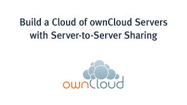
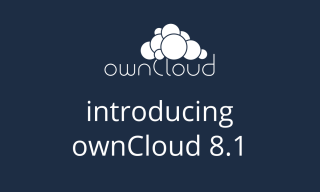

===============
ownCloud Videos
===============

Please visit the `owncloud.com YouTube channel
<https://www.youtube.com/user/ownCloudofficial/>`_ for howtos, demos, news, and Webinars
for both the Server and Enterprise versions of ownCloud.

The `ownclouders communty YouTube channel <https://www.youtube.com/user/ownclouders/>`_
gathers howtos and tutorials from all over the
web `in this playlist
<https://www.youtube.com/watch?v=NNfWIme5sFc&list=PLtZe22ggl2YBi1u2dH0qg9fgnym5DwYbW>`_.

You can find `more webinars, white papers and other resources on owncloud.com.
<https://owncloud.com/resources/>`_

Server to Server Sharing on ownCloud 7
--------------------------------------

`Build a Cloud of ownCloud Servers with Server to Server Sharing
<https://www.youtube.com/watch?v=h09ppkkYDNk>`_

..  :target: https://www.youtube.com/watch?v=h09ppkkYDNk

Create your own cloud of ownCloud servers with server-to-server sharing. 
Link specific shares to other ownCloud servers and have two-way synchronization.

Introducing ownCloud 7 Enterprise Edition
-----------------------------------------

`ownCloud 7 Enterprise Edition Enterprise File Sync and Share Software
<https://www.youtube.com/watch?v=SBn_8uVibLc>`_

ownCloud 7 Enterprise Edition introduces Universal File Access, which provides 
a single interface to all of your disparate systems and data silos. Integrate 
Sharepoint libraries, Windows network drives, link ownCloud servers with 
server-to-server sharing, and lots more.

ownCloud for Enterprise File Sync and Share
-------------------------------------------

`ownCloud for Enterprise File Sync and Share
<https://www.youtube.com/watch?v=2HTQcf1zccU>`_

.. figure:: oc-video-1.png
   :target: https://www.youtube.com/watch?v=2HTQcf1zccU 

ownCloud is an enterprise-grade file sync and share solution that is hosted in your data 
center, on your servers, using your storage. ownCloud integrates seamlessly into your IT 
infrastructure; you can leave data where it lives and still deliver file sharing services 
that meet your data security and compliance policies.
