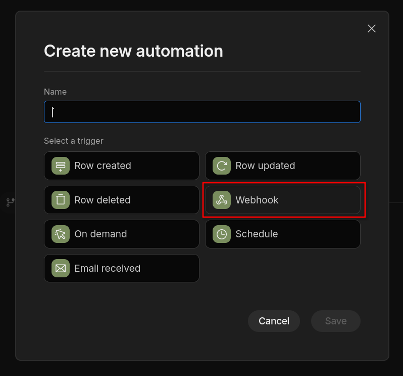
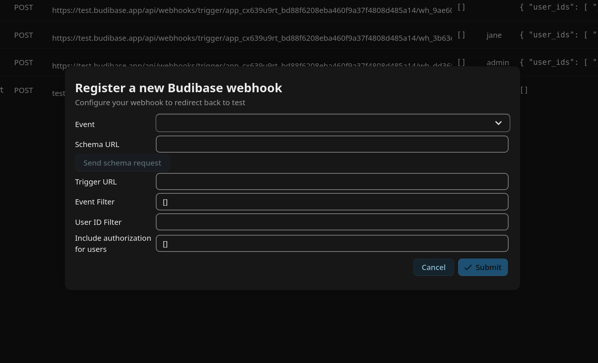

==================
Budibase workflows
==================

Budibase can easily be connected to Nextcloud and start automations reacting to Nextcloud events.

Using a Nextcloud webhook as automation trigger
-----------------------------------------------

When creating a new automation in Budibase, you can choose "Webhook" as trigger.

Budibase shows a schema request URL you can use to send the expected payload schema in advance. 

The easiest way to to this is to go to the Orchestration Gateway admin settings and click "Register new Budibase webhook":

Here you can fill in the event you want your automation to be started by and the schema URL, and then send the schema. Budibase will show 4 detected bindings upon successful sending. You can then fill in the trigger URL provided by Budibase, all needed filters and the authentication tokens that should be included in the callback, and save.
As soon as you have your automation deployed, it will now be triggered every time your chosen event happens in Nextcloud.

Use payload information in bindings
-----------------------------------

For every event, there are 4 bindings registered in Budibase:

* ``user``: the user that triggered the Nextcloud event
* ``time``: a timestamp for the triggering
* ``event``: an array containing additional information about the event (see the :ref:`list of webhook events<webhook_events>` for details)
* ``authentication``: the requested authentication tokens

These bindings can be used in any step of your automation to use the information given by the callback.
