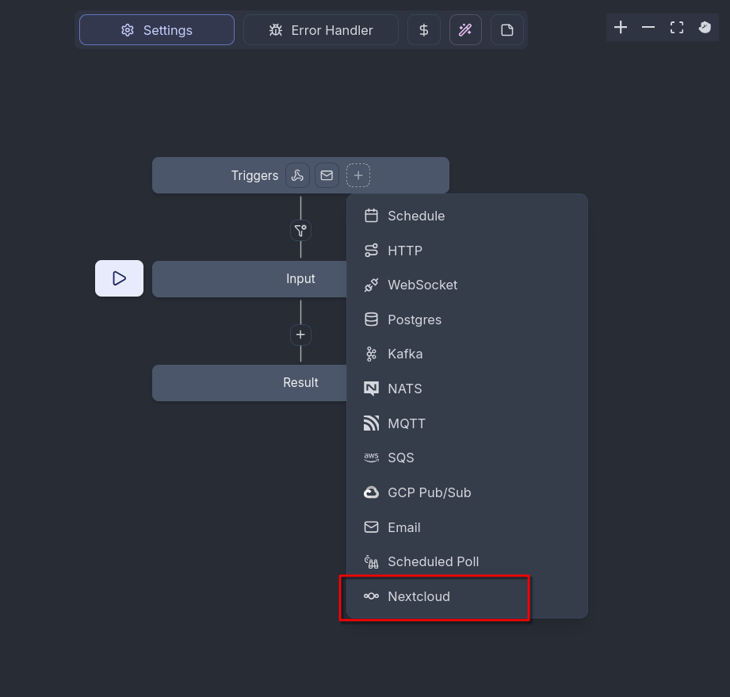

==================
Windmill Workflows
==================

Nextcloud integrates the `Windmill workflow engine <https://www.windmill.dev/>` to allow advanced custom workflows interacting with your Nextcloud instance.

Installation
------------

* Set up a Windmill instance
   * This should be a stand-alone instance. The External App "Flow" (see :ref:`External Apps<ai-app_api>`) made it possible to have a packaged instance installed in Nextcloud, but this is deprecated since Nextcloud 33. For more information, please check out the admin manual for Nextcloud 32.

* Enable the ``webhook_listeners`` app that comes with Nextcloud

.. code-block:: bash

   occ app:enable webhook_listeners

* Install the `Windmill integration <https://apps.nextcloud.com/apps/integration_windmill>`_

* Enable :ref:`pretty_urls_label` in your Nextcloud instance

Setting up the workspace connection
-----------------------------------

In Windmill, you have separate workspaces available. To enable Windmill to react to events happening on your Nextcloud instance, you need to connect a workspace to your Nextcloud connection. This is only possible for workspace admins. 

* In Windmill, open the workspace settings of the workspace you want to connect to Nextcloud via Settings -> Workspace
* Go to the Native Triggers tab and choose Nextcloud -> Configure OAuth 
* Follow the instructions to set up the OAuth connection
* Click on "Connect" and accept the OAuth connection **with a Nextcloud admin account** or an account that has webhook admin privileges
* If it shows "Connected", the workspace connection is successfully set up.

Every Flow configured in this workspace can now add Nextcloud triggers and scripts based on the credentials of the account you accepted the OAuth connection with.

Building a workflow
-------------------

Each workflow in Windmill is a listener to a Nextcloud Webhook Event.
If you are using the ExApp-packaged Windmill, it will automatically register webhooks for the workflows you build using the following mechanism.
If you are not using the ExApp-packaged windmill install then you will have to register
webhooks for your workflows manually via the webhook_listeners API:
see https://docs.nextcloud.com/server/33/developer_manual/_static/openapi.html#/operations/webhook_listeners-webhooks-index

Now you can choose an event out of a drop-down list  of events that your flow should react to. You can additionally fill in some parameters: 

* *Event filters* allows more fine grained filtering for which events should be used. The filter condition as well as the available events with their payloads is documented in the :ref:`webhook_listeners documentation<webhook_listeners>`.
* The *User ID filter* allows to define the user that can trigger a flow with their actions in Nextcloud. The webhook will only be called by requests from this user. Empty or null means no filtering.
* The *Headers* field allows to define an array of headers to be sent in a webhook call, which will mostly not be needed. 

You can add more than one trigger to a flow. 

Nextcloud Scripts
-----------------

Nextcloud makes available a variety of scripts to be used in Windmill for interfacing with Nextcloud apps. You can find them
at https://hub.windmill.dev/integrations/nextcloud and https://hub.windmill.dev/integrations/nextcloud/approvals
or in your windmill instance when selecting existing scripts for creating a new workflow.

If you want to use a function that is not already represented there, you can easily write your own scripts using a skeleton script and our OCS API that provides lots of endpoints. You can check out the available endpoints in the `Nextcloud OCS API documentation <https://docs.nextcloud.com/server/latest/developer_manual/_static/openapi.html>`_ or you can install our `OCS API Viewer app <https://apps.nextcloud.com/apps/ocs_api_viewer>`_ and check it out directly in your Nextcloud.

You can create your own Nextcloud-related scripts by taking one of the existing ones as example.
In a script, when sending a request to Nextcloud, make sure that the ``EX-APP-ID`` header is set to ``flow``.
Your custom scripts can make requests to any endpoint of the
`Nextcloud OCS API <https://docs.nextcloud.com/server/33/developer_manual/_static/openapi.html>`_ .

.. TODO ON RELEASE: Update version number above on release

.. code-block:: javascript

   import * as wmill from "windmill-client";
   import createClient, { type Middleware } from "openapi-fetch";

   type Nextcloud = {
      baseUrl: string,
      password: string,
      username: string
   };

   export async function main(
      nextcloud: Nextcloud,
      $PARAMETER: $TYPE,
      // add any input parameters you need here
   ) {

      // this part is the same for any script and should  not be changed

      const client = createClient<paths>({ baseUrl: nextcloud.baseUrl });
      const authMiddleware: Middleware = {
         async onRequest({ request, options }) {
            // fetch token, if it doesn’t exist
            // add Authorization header to every request
            request.headers.set("Authorization", `Basic ${btoa(nextcloud.username + ':' + nextcloud.password)}`);
            return request;
         },
      };
      client.use(authMiddleware);

      //starting here you can adapt the script

      data = await client.GET("/ocs/v2.php/apps/$APP/$PATH/{$PATHPARAMETER}", {
         params: {
            header: {
               "OCS-APIRequest": true,
            },
            query: {
               format: "json",
            },
            path: {
               $PATHPARAMETER: "$VALUE",
            },

         },
         body: {
            $BODYPARAMETER: $VALUE,
         },
      });

   return data;
   }

The endpoint path you have to fill in is provided in the API documentation.

OCS uses two kinds of parameters: Path parameters that are part of the endpoint URL, and body parameters that are transmitted in the request body. In the example script, you can provide both kinds in the function parameters.

Remember to also adapt the HTTP method (GET, POST, PUT etc.) if needed.

The :code:`data` variable receives the response of the HTTP request, so any data or error messages coming from the Nextcloud instance is available in there.

Authentication
~~~~~~~~~~~~~~

All the scripts we provide one input parameter in common: *nextcloud* needs to be an object of the type "Nextcloud" and contain what is necessary to authenticate against Nextcloud:

* baseUrl: the URL your instance is reachable at, e.g. :code:`https://example.cloud`
* userId: the user id of the user the script should authenticate with
* token: a password or token for that user

We advise to either add these credentials as a resource of the Nextcloud type to your workspace and refer to the resource in your script, or use the authentication credentials that are provided in the webhook callback. 
For every flow that is triggered by a Nextcloud event, there are 2 sets of temporary credentials included:

* the credentials for the user account that is saved in the initial OAuth connection, available as :code:`flow_input.authentication.owner`
* the credentials for the user account that triggered the event with their action, available as :code:`flow_input.authentication.trigger`

These temporary authentication credentials are valid for one hour after triggering the event.

Passing values between blocks
~~~~~~~~~~~~~~~~~~~~~~~~~~~~~

When specifying script inputs you can either fill the parameters with static values or make references to the workflow input and the previous workflow steps.

In order to reference the workflow input (details about the event that triggered the webhook), use the ``flow_input`` variable.
For example, ``flow_input.event.form.hash`` will reference the hash of a form from a nextcloud Forms event. As it is a JavaScript expression and not a static value, you have to switch the parameter input with the button next to it.

.. image:: images/windmill_js_expression.png
   :alt: Screenshot of adding a Nextcloud trigger in a workflow

The fields available for each event are listed in the :ref:`webhook_listeners documentation<webhook_listeners>`.

Each step in a workflow is automatically assigned a letter identifier.
In order to reference results from previous steps in your parameters, use the ``results`` variable with the id of the step
to reference as a sub property. For example, use ``results.e.submission.answers`` to use the answers of of a form submission
retrieved via the "Get form submission from Nextcloud Forms" script identified with the letter "e". You can identify the letters in the flow overview diagram.

Approval/Suspend steps
~~~~~~~~~~~~~~~~~~~~~~

Windmill allows using so-called approval steps, which are essentially asynchronous scripts that wait for the call to an additional webhook URL.
The most prominent use case for this are approval workflows where you get automated input from somewhere which needs to be approved by a human.
Once the human approves or disapproves by triggering the webhook URL the workflow will resume.

In order to turn a newly added step into an approval step, the workflow edit screen,
select the script and in the bottom right pan, go in the "Advanced" tab, "Suspend" sub tab and check "Suspend/Approval/Prompt".

.. image:: images/windmill_approval_step_config.png
   :alt: Screenshot of the workspace edit screen to turn a normal step into an Approval step

Using the scripts provided for Nextcloud, you can send approval links to the humans in charge of approving
via Nextcloud Talk or a simple notification in Nextcloud.
Of course, you may also use any of the other scripts for sending messages available in the Windmill hub.

Windmill has a default approval user interface at a specific URL, but it looks very technical.
We recommend using the `approve_links <https://apps.nextcloud.com/apps/approve_links>`_ app
which allows creating a beautiful temporary approval page with a custom message and approve and disapprove buttons.

FAQ
---

Can I create a script?
~~~~~~~~~~~~~~~~~~~~~~

If the Windmill Hub does not contain any script to perform the action you have in mind,
you can take an existing Nextcloud script as example and create your own.
Your custom scripts can make requests to any endpoint of the
`Nextcloud OCS API <https://docs.nextcloud.com/server/33/developer_manual/_static/openapi.html>`_ .

.. TODO ON RELEASE: Update version number above on release
