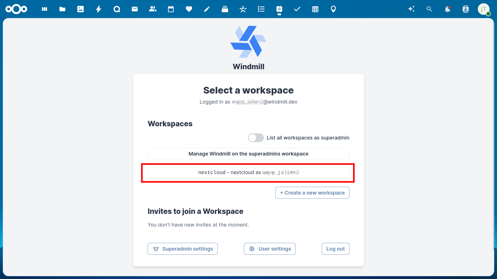
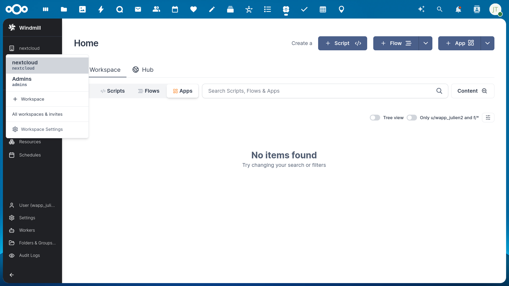

==================
Windmill Workflows
==================

Nextcloud integrates the Windmill workflow engine (https://www.windmill.dev/) to allow advanced custom workflows interacting with your Nextcloud instance.

Installation
------------

 * Install Windmill

   * Either as a standalone install or via the External App "Flow" in Nextcloud (see :ref:`External Apps<ai-app_api>`)

 * Enable the ``webhook_listeners`` app that comes with Nextcloud

.. code-block:: bash

   occ app:enable webhook_listeners

Selecting the right Workspace
-----------------------------

With Windmill installed as an ExApp, the first time one visits Windmill's web interface,
make sure to select the right workspace on the first run:
Only the pre-existing "nextcloud" workspace is hooked up to nextcloud's internal event system,
all other workspaces will need manual webhook setups for each workflow.
If the wrong workspace is selected on the first run, it is always possible to switch workspace later in the left sidebar.

If you wish to change to a different workspace at a later time, you can do so via the workspace selector in the left sidebar of Windmill.

Building a workflow
-------------------

Each workflow in Windmill is a listener to a Nextcloud Webhook Event.
If you are using the ExApp-packaged Windmill, it will automatically register webhooks for the workflows you build using the following mechanism.
If you are not using the ExApp-packaged windmill install then you will have to register
webhooks for your workflows manually via the webhook_listeners API:
see https://docs.nextcloud.com/server/latest/developer_manual/_static/openapi.html#/operations/webhook_listeners-webhooks-index

The magic listener script
~~~~~~~~~~~~~~~~~~~~~~~~~

The first script (after the "Input" block) in any workflow you build that should listen to a Nextcloud webhook must be ``CORE:LISTEN_TO_EVENT``. It must be an empty script with two parameters that you should fill statically: ``events``, which is a list of event IDs to listen to and ``filters`` a filter condition that allows more fine grained filtering for which events should be used. The filter condition as well as the available events with their payloads is documented in :ref:`the webhook_listeners documentation<webhook_listeners>`.

You can copy the following Deno script for this:

.. code-block:: typescript

   export async function main(events: string[], filters: object) { }

Nextcloud Scripts
-----------------

Nextcloud makes available a variety of scripts to be used in Windmill for interfacing with Nextcloud apps. You can find them
at https://hub.windmill.dev/integrations/nextcloud and https://hub.windmill.dev/integrations/nextcloud/approvals
or in your windmill instance when selecting existing scripts for creating a new workflow.

To synchronize the scripts with the ones provided by the Windmill hub,
you can run a flow named "Synchronize Hub Resource types with instance" in the Windmill admin workspace.

You can create your own Nextcloud-related scripts by taking one of the existing ones as example.
In a script, when sending a request to Nextcloud, make sure that the ``EX-APP-ID`` header is set to ``flow``.

All the scripts we provide have a set of common input parameters:

* nextcloudResource: This should be set to the path of the Windmill resource that was automatically created and contains what is necessary to authenticate against Nextcloud with the AppAPI authentication method. For example "u/wapp_user/appapi_nextcloud". You can find this path by looking at the resource list in Windmill.
* userId: This is the ID of the user you want the request to be authenticated as.
* useAppApiAuth: This is a boolean to choose between using the AppAPI authentication or basic auth. More details in the next section.

Authentication
~~~~~~~~~~~~~~

All bricks have the option to use "AppAPI Authentication" or normal authentication using a Nextcloud resource in Windmill.
When using normal authentication you will need to provide the correct password or app password of the user
on behalf of whom you want to execute the script. When using "AppAPI Authentication" you can impersonate any Nextcloud user.
This will only work when using the ExApp-packaged version of windmill.

Passing values between blocks
~~~~~~~~~~~~~~~~~~~~~~~~~~~~~

When specifying script inputs you can either fill the parameters with static values or make references to the workflow input and the previous workflow steps.

In order to reference the workflow input, use the ``flow_input`` variable.
For example, ``flow_input.event.form.hash`` will reference the hash of a form from a nextcloud Forms event.

Each step in a workflow is automatically assigned a letter identifier.
In order to reference results from previous steps in your parameters, use the ``results`` variable with the id of the step
to reference as a sub property. For example, use ``results.e.submission.answers`` to use the answers of of a form submission
retrieved via the "Get form submission from Nextcloud Forms" script identified with the letter "e".

Approval/Suspend steps
~~~~~~~~~~~~~~~~~~~~~~

Windmill allows using so-called approval steps, which are essentially asynchronous scripts that wait for the call to an additional webhook URL.
The most prominent use case for this are approval workflows where you get automated input from somewhere which needs to be approved by a human.
Once the human approves or disapproves by triggering the webhook URL the workflow will resume.

In order to turn a newly added step into an approval step, the workflow edit screen,
select the script and in the bottom right pan, go in the "Advanced" tab, "Suspend" sub tab and check "Suspend/Approval/Prompt".

.. image:: images/windmill_approval_step_config.png
   :alt: Screenshot of the workspace edit screen to turn a normal step into an Approval step

Using the scripts provided for Nextcloud, you can send approval links to the humans in charge of approving
via Nextcloud Talk or a simple notification in Nextcloud.
Of course, you may also use any of the other scripts for sending messages available in the Windmill hub.

Windmill has a default approval user interface at a specific URL, but it looks very technical.
We recommend using the `approve_links <https://apps.nextcloud.com/apps/approve_links>`_ app
which allows creating a beautiful temporary approval page with a custom message and approve and disapprove buttons.
