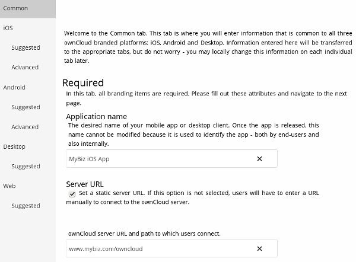
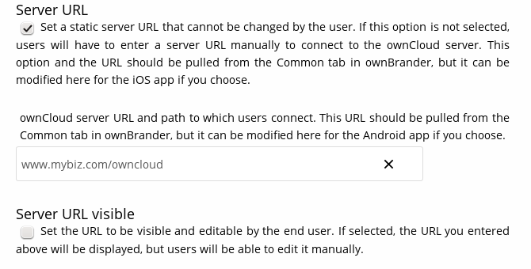
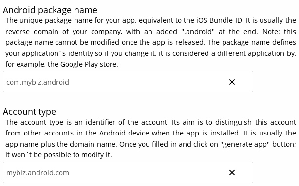
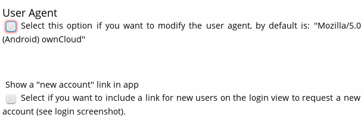
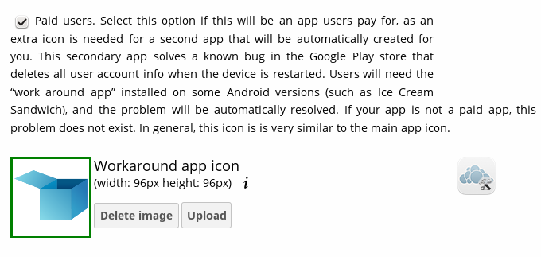

=================================
Building Your App With ownBrander
=================================

Building an Android app requires just a few images, and the wizard tells you 
their required dimensions. They must be the exact specified dimensions, 
preferably in PNG format.

First, start on the Common tab and enter your application name and the URL to 
your ownCloud server.  For testing purposes these can be anything. These are 
your global defaults, and you can change them when you create your apps. When 
you create production apps, then you must use your real app name, and the URL 
must point to your real ownCloud server.

Next, go to the Android tab. This has three sections: **Required**, 
**Suggested**, and **Advanced**. Start in the **Required** section with your 
application name and server URL, which should be already entered from the 
Common tab. You may change these, and optionally check **Server URL visible** 
to 
allow users to change it.

Now enter your Android package name. This is the unique name that identifies it 
to Google Play. Then enter your account type; this identifies it on your users' 
Android devices.

Your next three options are **Show multiaccount or disconnect**, **Enable send 
to other apps features**, and **Enable SAML**. When you enable **Show 
multiaccount or disconnect**, your users can configure multiple ownCloud 
accounts. When it is disabled they see only a disconnect button.

**Enable SAML** is for ownCloud servers that use SAML (Security Assertion 
Markup 
Language) authentication.

**Enable send to other apps features** allows your users to open ownCloud files 
with other Android apps, such as file managers and photo galleries.

Next, upload your images. The wizard tells you the exact size they must be, and 
you can click the images on the right to see some example screenshots.

.. image:: images/ownbrander-7.png

You may enter a custom user agent, if you wish, and display a new account link 
button to your users. You need this to enable multiaccounts.

.. _sign_android_app:

Signing Android Client
----------------------

The next option is **Sign Android Client**. You can upload your signing 
certificate in the wizard so that is signed during the build process, or you 
can optionally sign your app after we build it. See 
:doc:`publishing_android_app` to learn how to sign your app after it is built.

.. note:: Google Play Store requires that certificates have a validity period 
   ending after October 22, 2033. See 
   `<http://developer.android.com/intl/es/tools/publishing/app-signing.
   html#considerations>`_.

**Root folder name** displays the root folder name on your user's devices.

**Help url** is for entering a link to your help page for the app.

**Activate "Recommend" option** displays a "recommend this app" option via 
email.

Use **Activate the option feedback** to display an email address for user 
feedback.

**Imprint URL** is for the about page on your Web site, or any page that has 
information about your company.

Enter any custom download link in **URL to download the app**.

Finally, if you are creating a paid app then check the checkbox for **Paid 
Users** and upload an icon. 

The **Suggested** and **Advanced** sections allow you to further customize your 
branding with custom colors and images.

When you are finished click the **Generate Android App** button, and you will 
either see a success message, or an error message telling you what you need to 
fix. Note also that at the bottom of the wizard, the name and version of 
your new app is displayed, for example **The version that it will be generated 
is: oc-android-2.0.0_signed**. When all of your options are 
entered correctly and you click the Generate 
Android App button, it takes up to 48 hours for your app to appear in your 
`Customer.owncloud.com <https://customer.owncloud.com/owncloud/>`_ account.

.. image:: images/ownbrander-12.png
