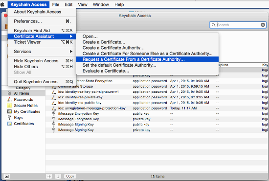
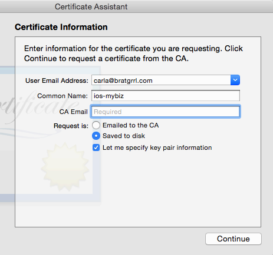
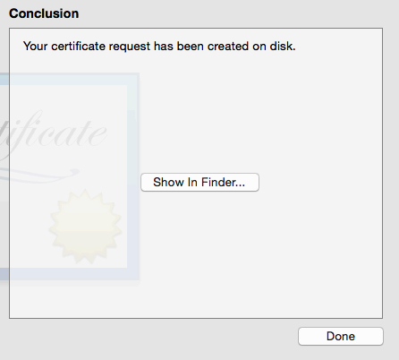
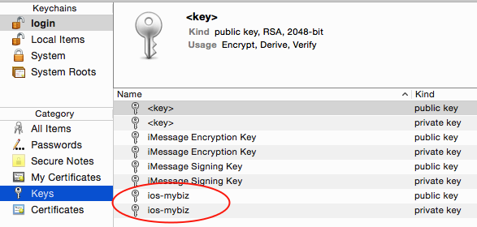
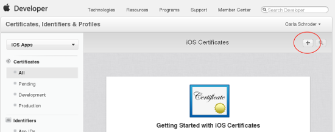
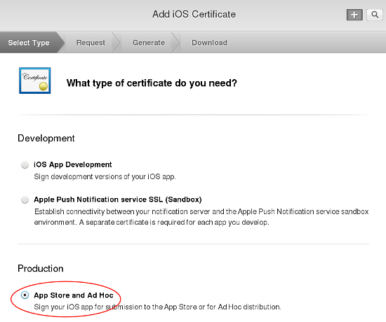
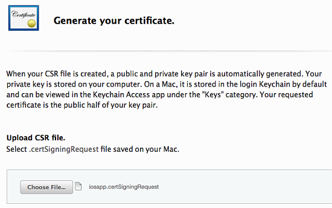
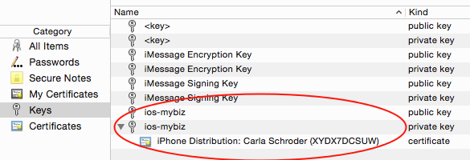

==================================
Create Certificate Signing Request
==================================

Start by creating a :file:`.certSigningRequest` (CSR) file on your Mac, using 
Keychain Access. Open Finder, and then open Keychain Access from the Utilities 
folder.
    
.. figure:: images/mac-1.png
   :alt: Open Keychain Access from the Utilities folder.

Next, open **Keychain Access > Certificate Assistant > Request a Certificate 
From a Certificate Authority**.
      

      
Enter the email address that you use in your Apple developer account, and enter 
a common name. The common name can be anything you want, for example a helpful 
descriptive name like "ios-mybiz". Check **Saved to disk** and **Let me specify 
key pair information**, then click **Continue**.

    
Give your CSR a helpful descriptive name, such as 
**iosapp.certSigningRequest**, and choose the location to save it on your hard 
drive, then click **Save**.

.. figure:: images/mac-4.png 
   :alt: Give your CSR a helpful descriptive name.
    
In the next window, set the **Key Size** value to **2048 bits** and 
**Algorithm** to **RSA**, and click **Continue**. This will create and save 
your certSigningRequest file (CSR) to your hard drive. 
      
.. figure:: images/mac-5.png
   :alt: Set key size and algorithm.

In the next screen your certificate creation is verified. Click a 
button to view it, or click **Done** to go to the next step.

    
You also get a corresponding public and private key pair, which you can see in 
the **Login > Keys** section of Keychain.
      

Double-click on your new private key to open the Access Control dialog. Check 
**Allow all applications to access this item**.

.. figure:: images/mac-8.png
   :alt: The Access Control dialog.

Now login to the **Member Center** on `<https://developer.apple.com/>`_. 
Click **Certificates, Identifiers, & Profiles**.

.. figure:: images/cert-1.png
   :alt: Apple developer Member Center.
    
Then click **iOS Apps > Certificates**.

.. figure:: images/cert-2.png
   :alt: Certificates, Identifiers, & Profiles.

Next, click the add button (the little plus sign) in the top right corner of 
the 
**iOS Certificate** page.

Under "What type of certificate do you need?" check **App Store and Ad Hoc**, 
then click the **Continue** button at the bottom of the page.

The next screen, **About Creating a Certificate Signing Request (CSR)** has 
information about creating a CSR in Keychain Access. You already did this, so 
go to the next screen. "Add iOS Certificate", to upload the CSR you already 
created, then click the **Generate** button.

    
Your new certificate is named **ios_distribution.cer**. Download it to your 
Mac; 
then find it and double-click on it to install it properly in Keychain.

.. figure:: images/cert-6.png
   :alt: Confirmation and download screen.

After installing it, you should see it stored with its corresponding private 
key in Keychain.

    
Remember to make backups of your keys and certificates and keep them in a safe 
place.
