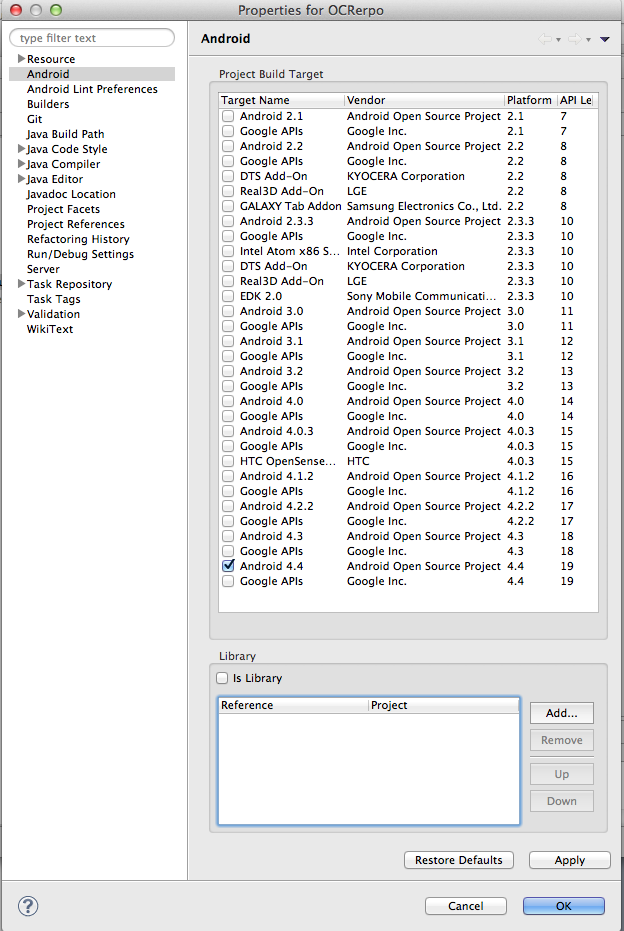

Library Installation
====================

Obtaining the library
---------------------

The ownCloud Android library may be obtained from the following Github repository:

`https://github.com/owncloud/android-library <https://github.com/owncloud/android-library>`_

Once obtained, this code should be compiled. The Github repository not only contains the library, but also a sample project, sample_client
sample_client  properties/android/librerias
, which will assist in learning how to use the library.

Add the library to a project
----------------------------

There are different methods to add an external library to a project, then we will describe one of them.

#.  Compile the ownCloud Android Library

#.  Define a dependency within your project.

For that, access to
Properties > Android > Library
** **
and click on add and select the ownCloud Android library

|1000000000000270000003A317117674_png|

Then all the public classes and methods of the library will be available for your own app.

