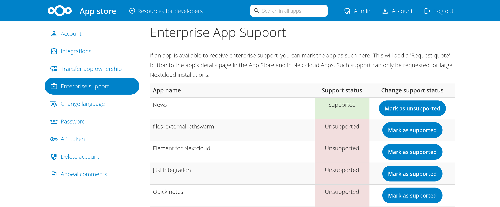

.. _app-store-monetizing:

===================
Monetizing your app
===================

.. sectionauthor:: Edward Ly <contact@edward.ly>

The Nextcloud app store offers various features that enable app developers to receive some financial compensation for their work.

Donations
---------

App developers can add optional donation links/buttons that lead to configurable URLs.
This could be done by adding one or more donation tags in the app's ``info.xml`` file::

   <donation title="Donate to the developers with PayPal" type="paypal">https://paypal.com/example</donation>
   <donation type="stripe">https://stripe.com/example</donation>
   <donation>https://other.service.com/example</donation>

The currently supported types include ``paypal`` and ``stripe``.
Having a type will display the corresponding service logo next to the donation link (or a generic logo if the type is not specified or is set to ``other``).
If a link/button title is not specified, it defaults to ``Donate to support this app``.
These buttons will appear in the appstore and in the app settings, and clicking on them will open their links in a new browser tab.

.. note:: All donations received go directly to the developers. Nextcloud does not keep any commissions.

Enterprise support
------------------

App developers can also add an optional ``Request quote`` button that will be shown in the appstore and app settings.
This button leads to the `Nextcloud sales form <https://nextcloud.com/get-a-quote/>`_ where enterprise support for the app can be requested.
If Nextcloud receives an interesting request, the sales team will reach out to the developers to discuss a partnership to provide support together (similar to other apps such as Collabora and OnlyOffice).
Enterprise support targets larger Nextcloud installations of 100 users or more.

To enable or disable the button, head to the **Enterprise support** page in the appstore account settings and click on **Mark as supported/unsupported** as appropriate next to the desired apps.

