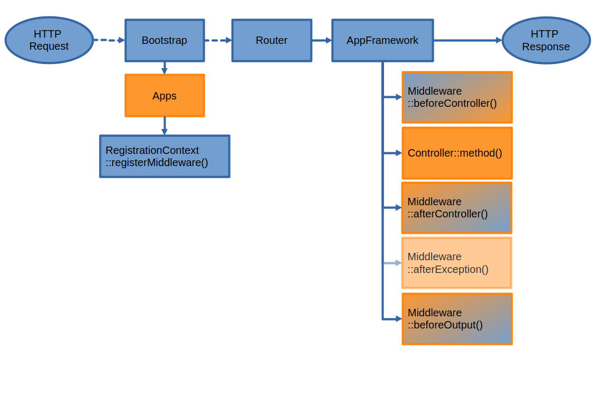

===========
Middlewares
===========

.. sectionauthor:: Bernhard Posselt <dev@bernhard-posselt.com>

Middleware is logic that is run before and after each request and is modeled after `Django's Middleware system <https://docs.djangoproject.com/en/dev/topics/http/middleware/>`_. It offers the following hooks:

* ``beforeController``: This is executed before a controller method is being executed. This allows you to plug additional checks or logic before that method, like for instance security checks
* ``afterException``: This is being run when either the beforeController method or the controller method itself is throwing an exception. The middleware is asked in reverse order to handle the exception and to return a response. If the middleware can't handle the exception, it throws the exception again
* ``afterController``: This is being run after a successful controller method call and allows the manipulation of a Response object. The middleware is run in reverse order
* ``beforeOutput``: This is being run after the response object has been rendered and allows the manipulation of the outputted text. The middleware is run in reverse order

To generate your own middleware, simply inherit from the Middleware class and overwrite the methods that should be used.

.. code-block:: php

  <?php

  namespace OCA\MyApp\Middleware;

  use \OCP\AppFramework\Middleware;

  class CensorMiddleware extends Middleware {

      /**
       * this replaces "bad words" with "********" in the output
       */
      public function beforeOutput($controller, $methodName, $output): string {
          return str_replace('bad words', '********', $output);
      }

  }

The middleware can be registered in the app's ``Application`` class:

.. code-block:: php
    :caption: lib/AppInfo/Application.php
    :emphasize-lines: 20

    <?php

    declare(strict_types=1);

    namespace OCA\MyApp\AppInfo;

    use OCA\MyApp\Middleware\CensorMiddleware;
    use OCP\AppFramework\App;
    use OCP\AppFramework\Bootstrap\IBootContext;
    use OCP\AppFramework\Bootstrap\IBootstrap;
    use OCP\AppFramework\Bootstrap\IRegistrationContext;

    class Application extends App implements IBootstrap {

        public function __construct() {
            parent::__construct('myapp');
        }

        public function register(IRegistrationContext $context): void {
            $context->registerMiddleware(CensorMiddleware::class);
        }

        public function boot(IBootContext $context): void {}

    }

.. _global_middlewares:

Global Middlewares
------------------

.. versionadded:: 26

Registered middleware will only intercept requests of the same app by default. To make a middleware *global* and trigger for other apps' middleware, add `true` as the second argument of the ``registerMiddleware`` call:

.. code-block:: php
    :caption: lib/AppInfo/Application.php
    :emphasize-lines: 20

    <?php

    declare(strict_types=1);

    namespace OCA\MyApp\AppInfo;

    use OCA\MyApp\Middleware\MonitoringMiddleware;
    use OCP\AppFramework\App;
    use OCP\AppFramework\Bootstrap\IBootContext;
    use OCP\AppFramework\Bootstrap\IBootstrap;
    use OCP\AppFramework\Bootstrap\IRegistrationContext;

    class Application extends App implements IBootstrap {

        public function __construct() {
            parent::__construct('myapp');
        }

        public function register(IRegistrationContext $context): void {
            $context->registerMiddleware(MonitoringMiddleware::class, true);
        }

        public function boot(IBootContext $context): void {}

    }

Dependency Injection Container Registration
-------------------------------------------

.. deprecated:: 20

Middleware can also be added using the **registerMiddleware** method of the container:

.. code-block:: php
  :caption: lib/AppInfo/Application.php
  :emphasize-lines: 14-17

  <?php

  namespace OCA\MyApp\AppInfo;

  use OCP\AppFramework\App;
  use OCP\IServerContainer;
  use OCA\MyApp\Middleware\CensorMiddleware;

  class MyApp extends App {

      public function __construct(array $urlParams = []) {
          parent::__construct('myapp', $urlParams);

          $container = $this->getContainer();

          // executed in the order that it is registered
          $container->registerMiddleware(CensorMiddleware::class);
      }
  }

.. note::

  The order is important! The middleware that is registered first gets run first in the **beforeController** method. For all other hooks, the order is being reversed, meaning: if a middleware is registered first, it gets run last.

Parsing annotations
-------------------

Sometimes it is useful to conditionally execute code before or after a controller method. This can be done by defining custom annotations. An example would be to add a custom authentication method or simply add an additional header to the response. To access the parsed annotations, inject the **ControllerMethodReflector** class:

.. code-block:: php

  <?php

  namespace OCA\MyApp\Middleware;

  use OCP\AppFramework\Middleware;
  use OCP\AppFramework\Utility\IControllerMethodReflector;
  use OCP\AppFramework\Http\Response;

  class HeaderMiddleware extends Middleware {

    private $reflector;

    public function __construct(IControllerMethodReflector $reflector) {
        $this->reflector = $reflector;
    }

    /**
     * Add custom header if @MyHeader is used
     */
    public function afterController($controller, $methodName, Response $response): Response {
        if($this->reflector->hasAnnotation('MyHeader')) {
            $response->addHeader('My-Header', 3);
        }
        return $response;
    }
  }

.. note:: An annotation always starts with an uppercase letter
