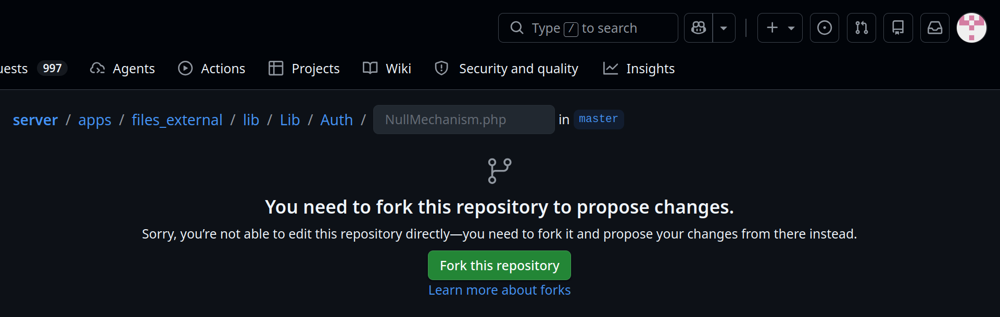
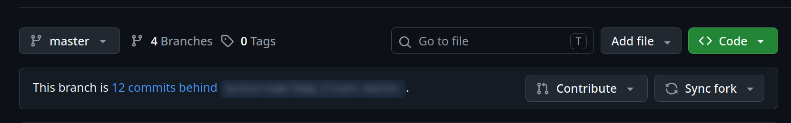
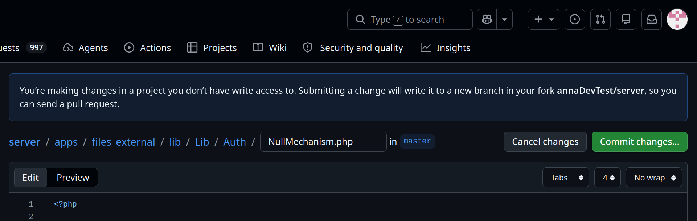
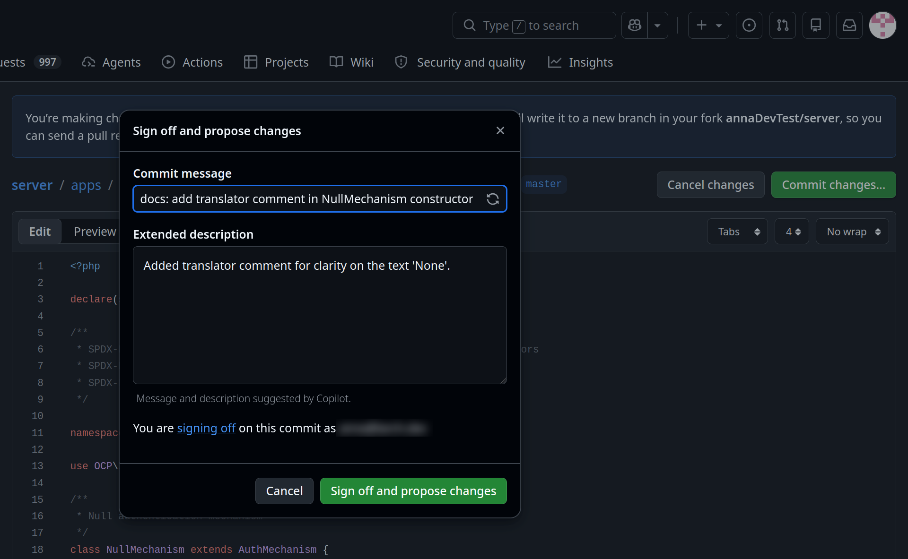

.. _Translations:

============
Translations
============

.. sectionauthor:: Bernhard Posselt <dev@bernhard-posselt.com>, Kristof Hamann

Nextcloud provides mechanisms for internationalization (make an application translatable) and localization (add translations for specific languages). This section provides detailed instructions for both aspects.
In order to make your app translatable (internationalization), you should use Nextcloud's methods for translating strings. They are available for both the server-side (PHP, Templates) as well as for the client-side (JavaScript).

PHP Backend
-----------

If localized strings are used in the backend code, simply inject the ``\OCP\IL10N`` class into your service via type hinting it in the constructor. You will automatically get the language object containing the translations of your app:

.. code-block:: php

    <?php
    class AuthorService {
        public function __construct(
            private \OCP\IL10N $l,
        ) {
        }

        …
    }

Strings can then be translated in the following way:

.. code-block:: php

    <?php
    class AuthorService {

        …

        public function getLanguageCode() {
            // Get the language code of the current language
            return $this->l->getLanguageCode();
        }

        public sayHello() {
            // Simple string
            return $this->l->t('Hello');
        }

        public function getAuthorName($name) {
            // String using a parameter
            return $this->l->t('Getting author %1$s', [$name]);
        }

        public function getAuthors($count, $city) {
            // Translation with plural
            return $this->l->n(
                '%n author is currently in the city %1$s', // singular string
                '%n authors are currently in the city %1$s', // plural string
                $count, // number to decide which plural to use
                [$city] // further parameters are possible
            );
        }
    }

Language of other users
^^^^^^^^^^^^^^^^^^^^^^^

If you need to get the language of another user, e.g. to send them an email or inside a background job, there are also
the ``force_language`` and ``default_language`` configuration options to consider. To make this easier, the
``OCP\L10N\IFactory`` class comes with a ``getUserLanguage`` method:

.. code-block:: php

    <?php
    class SendEmail {
        public function __construct(
            private \OCP\L10N\IFactory $l10nFactory,
         ) {
        }

        public function send(IUser $user): void {
            $lang = $this->l10nFactory->getUserLanguage($user);
            $l = $this->l10nFactory->get('myapp', $lang);

            // …
        }

PHP Templates
-------------

In every template the global variable ``$l`` can be used to translate the strings using its methods ``t()`` and ``n()``:

.. code-block:: php

    // Simple text string
    <button><?php p($l->t('Hide')); ?></button>

    // Text with a placeholder
    
<?php p($l->t('Show files of %1$s', [$user])); ?>

    // Date string
    <em><?php p($l->l('date', time())); ?></em>

JavaScript / TypeScript / Vue
-----------------------------

There are global functions ``t()`` and ``n()`` available for translating strings in javascript code.
If your app is build, you can import the translation functions from the `@nextcloud/l10n package <https://github.com/nextcloud-libraries/nextcloud-l10n>`_.
They differ a bit in terms of usage compared to php:

* First argument is the appId e.g. ``'myapp'``
* Placeholders (apart from the count in plurals) use single-mustache brackets with meaning-full descriptors.
* The parameter list is an object with the descriptors as key.

.. code-block:: js

    t('myapp', 'Hello World!');
    t('myapp', '{name} is available. Get {linkstart}more information{linkend}', {name: 'Nextcloud 16', linkstart: '<a href="...">', linkend: '</a>'});
    n('myapp', 'Import %n calendar into {collection}', 'Import %n calendars into {collection}', selectionLength, {collection: 'Nextcloud'});

ExApps (Python)
---------------

For ExApps, Python is currently only supported for automated Transifex translations.

Alongside the usual ``l10n/*.json`` and ``l10n/*.js`` files, translation source files located in ``translationfiles/<lang>/*.po`` are also included in the Transifex sync.
These ``.po`` files can be compiled into ``.mo`` files, which are typically used by the ExApp backend for runtime translations.

For more details, see :ref:`ex_app_translations_page`.

Guidelines
----------

Please also look through the following hints to improve your strings and make them better translatable by the community
and therefore improving the experience for non-english users.

Dos and Don'ts
^^^^^^^^^^^^^^

.. list-table::
   :header-rows: 1

   * - Bad
     - Good
     - Description
   * - ``´`` or ``’``
     - ``'``
     - Use ascii single quote
   * - ``Loading...``
     - ``Loading …``
     - | Use **Unicode triple-dot** character.
       | Add a **non-breaking space** before the triple-dot when trimming a sentence instead of a word.
   * - | ``Loading …``
       | (a general space ``U+0020``)
     - | ``Loading …``
       | (a non-breaking space ``U+00A0``)
     - | Only use a **non-breaking space** before the triple-dot (``U+00A0``).
   * - Don't
     - Do not
     - Using the spelled out version is easier to understand and makes translating easier.
   * - Won't
     - Will not
     - Using the spelled out version is easier to understand and makes translating easier.
   * - Can not
     - Cannot
     - Using the combined version is easier to understand and makes translating easier.
   * - id
     - ID
     - Full uppercase for shortcutting "identifier"
   * - Users
     - Accounts / People
     - Use **accounts** when you refer to a profile/entity. Use **people** when referring to humans.
   * - Admin / Administrator
     - Administration
     - | Refer to administration as a non-human organizational entity
       | instead of a single or multiple persons.
   * - Headline
     - Headline:
     - Include colons ``:`` in the translations as some languages add a space before the colon.
   * - | " Leading space"
       | "Trailing space "
     - | "No leading space"
       | "No trailing space"
     - | Leading or trailing spaces mostly indicate that strings are concatenated.
       | For translators it is often helpful to have all the content in a single translation,
       | as order and references between words and sentences might get lost otherwise.
   * - "Error:" $error
     - "Error: %s"
     - Instead of concatenating errors or part messages, make them a proper placeholder

Correct plurals
^^^^^^^^^^^^^^^

If you use a plural, you **must** also use the ``%n`` placeholder. The placeholder defines the plural and the word without the number preceding is wrong. If you don't know/have a number for your translation, e.g. because you don't know how many items are going to be selected, just use an undefined plural. They exist in every language and have one form. They do not follow the normal plural pattern.

PHP Example:

.. code-block:: php

    // BAD: Plural without count
    $title = $l->n('Import calendar', 'Import calendars', $selectionLength)
    // BETTER: Plural has count, but disrupting to read and unnecessary information
    $title = $l->n('Import %n calendar', 'Import %n calendars', $selectionLength)
    // BEST: Simple string with undefined plural not using any number in the string
    $title = $l->t('Import calendars')

Opposed to the normal placeholders in javascript, the plural number also uses the ``%n`` syntax:

JS Example:

.. code-block:: js

    /* BAD: Plural without count */
    n('myapp', 'Import calendar', 'Import calendars', selected.length)
    /* BETTER: Plural has count, but disrupting to read and unnecessary information */
    n('myapp', 'Import %n calendar', 'Import %n calendars', selected.length)
    /* BEST: Simple string with undefined plural not using any number in the string */
    t('myapp', 'Import calendars')

.. important::
   General rule: Whenever a variable with varying values (numbers) is part of a string, the plural form must be used.

There are languages with multi-plural forms. See https://en.wikipedia.org/wiki/Plural#Use_in_systems_of_grammatical_number

Example

.. code-block:: php

   "Vault will be locked in %1$d seconds"

This means that even though the value ‘seconds’ is always greater than 1, translators on Transifex are unable to produce valid translations in the plural form for some languages.

Bad: Only one string provided

.. code-block:: php

   "Vault will be locked in %1$d seconds"

Good: Two strings in source code.

.. code-block:: php

   "Vault will be locked in %1$d second"
   "Vault will be locked in %1$d seconds"

.. _improving-translations:

Improving your translations
^^^^^^^^^^^^^^^^^^^^^^^^^^^

Starting with the following example, improving it step by step:

.. code-block:: php

  <?php p($l->t('Select file from')) . ' '; ?><a href='#' id="browselink"><?php p($l->t('local filesystem'));?></a><?php p($l->t(' or ')); ?><a href='#' id="cloudlink"><?php p($l->t('cloud'));?></a>

Step 1: String split
""""""""""""""""""""

You shall **never split** sentences and **never concatenate** two translations (e.g. "Enable" and "dark mode" can not be combined to "Enable dark mode", because languages might have to use different cases)! Translators lose the context and they have no chance to possibly re-arrange words/parts as needed.

Translators will translate:

* ``Select file from``
* ``local filesystem``
* ``or`` (with leading and trailing whitespace)
* ``cloud``

Translating these individual strings results in  ``local filesystem`` and ``cloud`` losing case. The two white spaces surrounding ``or`` will get lost while translating as well. For languages that have a different grammatical order it prevents the translators from reordering the sentence components.

So the following code is a bit better, but suffers from another issue:

.. code-block:: php

  <?php p($l->t('Select file from <a href="#" id="browselink">local filesystem</a> or <a href="#" id="cloudlink">cloud</a>'));?>

Step 2: HTML Markup
"""""""""""""""""""

In this case the translators can re-arrange as they like, but have to deal with your markup and can mess it up easily. It is better to **keep the markup out** of your code, so the following translation is even better:

.. code-block:: php

  <?php p($l->t('Select file from %slocal filesystem%s or %scloud%s', ['<a href="#" id="browselink">', '</a>', '<a href="#" id="cloudlink">', '</a>']));?>

But there is one last problem with this.

Step 3: Placeholders
""""""""""""""""""""

In case the language has to turn things around, your code will still insert the parameters in the given order and they can not re-order them. To prevent this last hurdle simply **use positioned placeholders** like ``%1$s``:

.. code-block:: php

  <?php p($l->t('Select file from %1$slocal filesystem%2$s or %3$scloud%4$s', ['<a href="#" id="browselink">', '</a>', '<a href="#" id="cloudlink">', '</a>']));?>

This allows translators to have the cloudlink before the browselink in case the language is e.g. right-to-left.

.. _Hints:

Provide context hints for translators
^^^^^^^^^^^^^^^^^^^^^^^^^^^^^^^^^^^^^

Some translation strings can be translated wrongly because they have multiple meanings.
Strings that contain only a single word are especially prone to this.
The most famous example in the Nextcloud code base is ``Share``, which can be the verb and action
``To share something`` or the noun ``A share``.
Adding a context hint resolves the ambiguity, and the hint is shown to translators in the Transifex web interface.

.. warning::

   A ``// TRANSLATORS`` comment is only associated with the **first** translation string on the following line.
   If a single line of code contains two or more translation strings, the comment applies to the first one only,
   and the remaining strings will have no context hint. Refactor the code so that each line holds a single
   translation call, placing its own ``// TRANSLATORS`` comment on the line above.

   .. code-block:: php

       // BAD: only "Save" gets the context hint, "Cancel" has none
       // TRANSLATORS Confirm or discard the current changes
       return [$l->t('Save'), $l->t('Cancel')];

       // GOOD: one translation per line, each with its own hint
       // TRANSLATORS Confirm the current changes
       $save = $l->t('Save');
       // TRANSLATORS Discard the current changes
       $cancel = $l->t('Cancel');
       return [$save, $cancel];

PHP
"""

Place the comment on the line before the ``->t()`` or ``->n()`` call:

.. code-block:: php

    // TRANSLATORS Will be shown inside a popup and asks the user to add a new file
    p($l->t('Add new file'));

    // TRANSLATORS The placeholder refers to the software product name, e.g. "Add to your Nextcloud"
    $l->t('Add to your %s', [$productName]);

For multi-line context or example output, use consecutive comment lines:

.. code-block:: php

    // TRANSLATORS
    // Indicates when a calendar event will happen, shown on invitation emails.
    // Output example: "In 1 hour on July 1, 2024 for the entire day"
    $l->t('In %1$s on %2$s for the entire day', [$relativeTime, $date]);

JavaScript / TypeScript
"""""""""""""""""""""""

Place the comment on the line before the ``t()`` or ``n()`` call:

.. code-block:: javascript

    // TRANSLATORS: name that is appended to copied files, will be put in parenthesis with a number for the second+ copy
    var copyNameLocalized = t('files', 'copy');

    // TRANSLATORS: {relativeDueDate} will be replaced with a relative time, e.g. "2 hours ago" or "in 3 days"
    t('files_reminders', 'We will remind you of this file {relativeDueDate}', { relativeDueDate })

Vue
"""

In the ``<template>`` block, use an HTML comment on the line above the element:

.. code-block:: html

    <!-- TRANSLATORS: Making this question necessary to be answered when submitting to a form -->
    {{ t('forms', 'Required') }}

In the ``<script>`` block, use the same ``//`` style as JavaScript.

.. note::

   The marker depends on the extraction toolchain, and the examples below are **not** all
   ``TRANSLATORS``. The gettext-based projects - PHP, JavaScript/TypeScript and Vue - require the
   comment to start with ``TRANSLATORS``, because that is the prefix the extractor is configured to
   look for. Android uses a plain XML comment and ``TRANSLATORS`` there is a project convention
   rather than a requirement. **Qt and iOS use their own markers** - ``//:`` for ``lupdate`` and a
   ``/* ... */`` comment for the iOS string tooling - and writing ``TRANSLATORS`` in those files
   produces no hint at all, because the extractor never looks for it.

C++ (Qt) / Desktop client
"""""""""""""""""""""""""

.. code-block:: c++

    //: Example text: "Progress of sync process. Shows the currently synced filename"
    fileProgressString = tr("Syncing %1").arg(allFilenames);

Android
"""""""

.. code-block:: xml

    <!-- TRANSLATORS List of deck boards -->
    <string name="simple_boards">Boards</string>

iOS
"""

.. code-block:: swift

    /* The title on the navigation bar of the Scanning screen. */
    "wescan.scanning.title"             = "Scanning";

Contributing a context hint without a local checkout
^^^^^^^^^^^^^^^^^^^^^^^^^^^^^^^^^^^^^^^^^^^^^^^^^^^^

Context hints are one of the few code changes that are worth making even if you do not develop
Nextcloud. Translators are usually the people who notice that a string is ambiguous, and a hint is a
single comment line. You do not need git, a development environment or a checkout to add one - the
GitHub web editor is enough.

Find the string
"""""""""""""""

Search the repository the string belongs to for the text in quotes. If you do not know which
repository that is, the Transifex resource name matches the app: a string in the ``files_external``
resource lives in ``apps/files_external/`` in ``nextcloud/server``, and a string in the ``deck``
resource lives in ``nextcloud/deck``.

Edit the file
"""""""""""""

Open the file on GitHub and click the pencil icon.

Unless you are a member of the Nextcloud organisation, you will not land in the editor. GitHub stops
you with **"You need to fork this repository to propose changes"** and a **Fork this repository**
button. Nothing has gone wrong. A fork is your own copy of the repository under your own account: you
make the change there, and the pull request asks the Nextcloud maintainers to take it from your copy
into theirs. Click the button; it takes a moment and then opens the editor.

         "Fork this repository" button

   What an outside contributor sees instead of the editor. This is expected.

**You only do this once.** The fork stays on your account, so the next hint you add starts in the
editor straight away.

If it has been a while since you last contributed, your fork will be behind the original repository.
Go to your fork - ``github.com/<your-username>/<repository>`` - and look at the bar above the file
list. When the fork is out of date, a line there reads *"This branch is N commits behind ..."*, with
a **Sync fork** button at its right-hand end, next to **Contribute**. Use it, then **Update branch**,
before you start editing, so your change is made against the current files rather than an old copy.
If no such line is shown, your fork is already up to date and there is nothing to do.

         Contribute and Sync fork buttons at the right

   An out-of-date fork. The **Sync fork** button only appears while there is something to sync.

Once you are in the editor a banner reads *"You're making changes in a project you don't have write
access to. Submitting a change will write it to a new branch in your fork ..., so you can send a pull
request."* That is the expected state for an outside contributor.

         branch in the contributor's fork, and a "Commit changes..." button

   After forking: the banner names your fork, and the editor opens as normal.

Add the comment **on the line directly above** the translation call, in the style that matches the
file type (see the examples above), and match the surrounding indentation exactly. The editor's
**Tabs / width / wrap** controls, above the top-right of the text area, show what the file uses.

.. code-block:: php

    // TRANSLATORS Name of the SMB/CIFS share on the server, not the verb "to share"
    'share' => $l->t('Share'),

Commit and open the pull request
""""""""""""""""""""""""""""""""

Click **Commit changes...**. A dialog headed **Sign off and propose changes** opens, with a commit
message, an extended description, and a **Sign off and propose changes** button that takes you to the
pull request form. You are not asked to choose a branch: a change to a fork always goes to a new
branch, which is what the pull request is opened from.

* Nextcloud uses `conventional commits <https://www.conventionalcommits.org/>`_, so the message needs
  a type and a short summary, for example ``docs: add translator comment for "None"``. Check the
  repository's recent history for the types it actually uses.
* **Do not accept a pre-filled message without reading it.** The dialog may arrive with the message
  and description already written - if Copilot is enabled for your account it suggests them, and the
  dialog says so underneath. The suggestion describes the change accurately enough but has no type
  prefix, for example *"Add translator comment in NullMechanism constructor"*. Putting ``docs:`` in
  front of it is normally the whole fix. This is the most likely reason a first pull request fails a
  check.
* You do **not** need to add a ``Signed-off-by`` line by hand. The dialog signs the commit off for
  you and shows which address it is using, which satisfies the DCO check. If you have enabled
  **Keep my email addresses private** in your GitHub settings, that address is your
  ``@users.noreply.github.com`` one.

         description, and a note showing the address the commit is signed off with

   The commit dialog, with the suggested message already corrected to a conventional commit.

Avoiding the automated checks, rather than fixing them
""""""""""""""""""""""""""""""""""""""""""""""""""""""

Pull requests run linters and coding-style checks, and there is generally no way to run or fix those
from the web interface. It is therefore worth avoiding a failure in the first place:

* Put the comment on its own line. Do not append it to an existing line of code.
* Copy the indentation of the line below it, including tabs versus spaces.
* Leave no trailing whitespace at the end of the comment.
* Change nothing else in the file, so that the diff is the single added line.

If a check does fail, say so in the pull request. A maintainer can push the fix to your branch.

What happens next
"""""""""""""""""

A Nextcloud maintainer will review the pull request. You do not need to request a review, add labels
or assign anyone - an outside contributor cannot do those things, and it is not a sign that anything
is missing from your pull request. If nothing happens for a while, a polite comment on the pull
request is the right nudge.

You are also welcome to tell the translation community about it. Other translators hit the same
ambiguous strings, and it is the easiest way to let them know a hint is on its way:

* the `translation chat room <https://cloud.nextcloud.com/call/xs25tz5y>`_ is open to the public and
  needs no account, and is the quickest way to say something
* the `Translations category of the Nextcloud forum
  <https://help.nextcloud.com/c/translations/23>`_ keeps the note findable afterwards. Anyone can
  read it, but posting needs a free forum account

Post the link to your pull request and a sentence about the string you clarified.

Once it is merged, the hint still does not reach translators immediately. It reaches them when the
source strings are next extracted and synchronised to Transifex, so allow for that delay before
looking for it in the web interface.

Adding translations
-------------------

The steps how to set up translations for an app have been moved to it's own page in the "App development" chapter: :ref:`Translation`

Testing translations
--------------------

You can use the query parameter ``forceLanguage`` to force a specific language for a web request (API or frontend). See :ref:`Forcing language for a given call<api-force-language>`.

Console commands
----------------

l10n\:createjs
^^^^^^^^^^^^^^

Generate JavaScript translation files for an app from its ``l10n/`` source
files. Pass the app ID and optionally a specific language code::

 sudo -E -u www-data php occ l10n:createjs myapp
 sudo -E -u www-data php occ l10n:createjs myapp de

When no language is specified, JavaScript files are generated for all
available languages. The output files are written to the app's ``l10n/``
directory as ``<lang>.js`` and ``<lang>.json``.

.. note::

   This command is intended for development and CI pipelines. In production,
   JavaScript translation files are generated automatically during app
   installation and updates.
