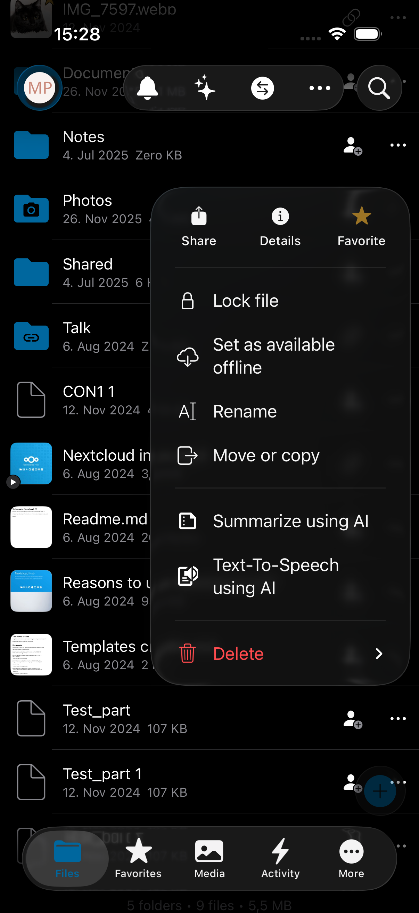
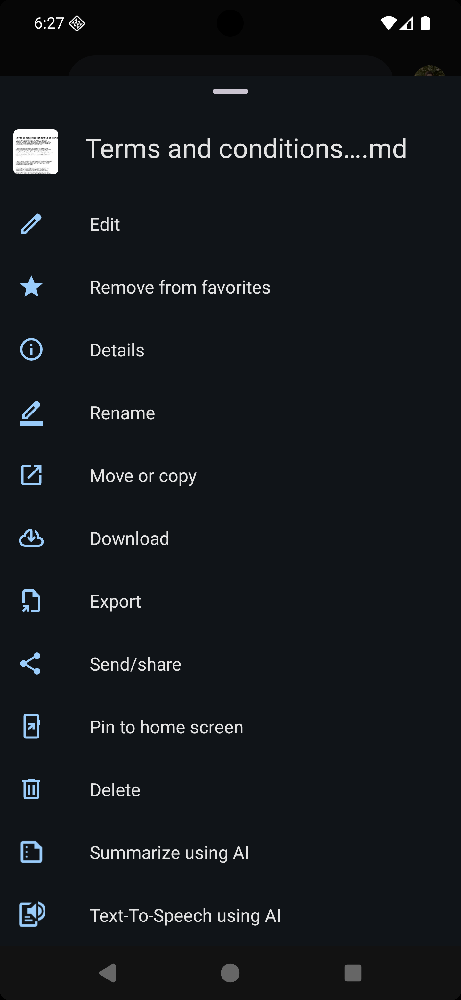

.. _clientintegrationindex:

==================
Client Integration
==================

With Nextcloud Hub 26 Winter we are introducing a new client integration API. It allows server side apps to expose integrations on Desktop and Mobile.
For now we support adding app-defined actions to a "context menu" of files and folders.

It allows providing easy integration of specific actions on clients without the need to write and maintain code on those platforms.

Supported clients
-----------------

Android: 3.36.0 and above

Desktop: 4.1.0 and above

iOS: 7.3.0 and above

Supported server apps
---------------------
richdocuments: Convert .docx to .md

assistant: Transcribe audio file

files_zip: Zip a file or folder

contacts: Create new contact from vfc

Exposing actions via capability
-------------------------------

Each app can add new actions via capabilities, following the syntax "app-id", "hook-name" and list of all endpoints.

.. code-block:: javascript 

    'client_integration' => [
        Application::APP_ID => [
            'version' => 0.1,
			'context-menu' => [
                … endpoints …
            ]
        ]
    ]

Hooks
-----

Currently only "context-menu" is supported.

Endpoint
--------
The endpoint tells the client how the menu entry should look like and how the client can send a request to the server.

Requirements:
- Every text need to be translated by the app
- Current predefined params are fileId and filePath
- {fileId} and {filePath} will be replaced on clients with actual values
- url placeholder are always replaced
- mimetype_filters is a comma-separated list of filters (matches anything that starts with the filter). If there is no filter, the action is shown for every file/folder.
- all urls must be relative
- params is used for body params (currently only POST)
- Icons are always svgs
- Method: supports POST/GET

.. code-block:: javascript 
    [
        'name' => 'translated title',
        'url' => '/ocs/v2.php/apps/abc',
        'method' => 'POST/GET',
        'mimetype_filters' => 'text/, application/pdf', // will match text/* and PDFs
        'params' => ['file_id' => '{fileId}','file_path' => '{filePath}'], // only for POST; the key can vary depending on the app
        'icon' => '/apps/abc/img/app.svg'
    ],

Response
--------
When clicking on a menu entry the client sends a predefined request to the server.
The app in question can then handle the request and can send two different response types:

Declarative UI
^^^^^^^^^^^^^^
The declarative UI response allows the app to send back a new UI to be rendered by the client: 
- version: Indicates which version it is. Clients will be backwards compatible. If server sends a newer version than the client can understand the response will be ignored.
- tooltip: Translated text, which will be shown as tooltip / snackbar.

.. code-block:: javascript 

    {
      "ocs": {
        "meta": {
          "status": "ok",
          "statuscode": 200,
          "message": "OK"
        },
        "data": {
          "version": 0.1,
          "root": {
            "orientation": "vertical",
            "rows": [
              {
                "children": [
                  {
                    "element": "URL",
                    "text": "Link created",
                    "url": "/some/link/to/a/page"
                  }
                ]
              }
            ]
          }
        }
      }
    }

At the moment only rows with text and url elements are supported, but in the future we will add more elements and options.

Tooltip Response
^^^^^^^^^^^^^^^^
The tooltip response is a regular DataResponse type, with payload:
- version: Indicates which version it is. Clients will be backwards compatible. If server sends a newer version than the client can understand the response will be ignored.
- tooltip: Translated text, which will be shown as tooltip / snackbar.

.. code-block:: javascript 
    {
      "ocs": {
        "meta": {
          "status": "ok",
          "statuscode": 200,
          "message": "OK"
        },
        "data": {
          "version": "0.1",
          "tooltip": "Task submitted successfully"
        }
      }
    }

Example:
----------
Here is an example of using the Assistant app. 

**Capabilities:**

`ocs/v1.php/cloud/capabilities` returns the following capability:

.. code-block:: javascript 
  
     "client_integration": {
          "assistant": {
            "version": 0.1,
            "context-menu": [
              {
                "name": "Summarize using AI",
                "url": "/ocs/v2.php/apps/assistant/api/v1/file-action/{fileId}/core:text2text:summary",
                "method": "POST",
                "mimetype_filters": "text/, application/msword, application/vnd.openxmlformats-officedocument.wordprocessingml.document, application/vnd.oasis.opendocument.text, application/pdf",
                "icon": "/apps/assistant/img/client_integration/summarize.svg"
              },
              {
                "name": "Transcribe audio using AI",
                "url": "/ocs/v2.php/apps/assistant/api/v1/file-action/{fileId}/core:audio2text",
                "method": "POST",
                "mimetype_filters": "audio/",
                "icon": "/apps/assistant/img/client_integration/speech_to_text.svg"
              },
              {
                "name": "Text-To-Speech using AI",
                "url": "/ocs/v2.php/apps/assistant/api/v1/file-action/{fileId}/core:text2speech",
                "method": "POST",
                "mimetype_filters": "text/, application/msword, application/vnd.openxmlformats-officedocument.wordprocessingml.document, application/vnd.oasis.opendocument.text, application/pdf",
                "icon": "/apps/assistant/img/client_integration/text_to_speech.svg"
              }
            ]
          },
        },

The Assistant integration has a few endpoints for the client to show and execute. They appear like this on the client side:

    alt: "Client integration on iOS"

    alt: "Client integration on Android"

Looking at the "Summarize using AI" action, it will only show for files with mimetypes starting with "text/" or the specified document and PDF mimetypes, as described in `mimetype_filters`.
When clicking on the action, the client will send a POST request to the specified URL, replacing {fileId} with the actual file id. The app can then handle the request and for example send a tooltip response back to the client. The client will show the tooltip to the user:

.. code-block:: javascript 

    {
        "ocs": {
            "meta": {
                "status": "ok",
                "statuscode": 200,
                "message": "OK"
            },
            "data": {
                "version": 0.1,
                "tooltip": "Summarization task submitted successfully"
            }
        }
    }

Issues/Bugs
-----------

Please report issues, bugs or feature requests at https://github.com/nextcloud/files-clients with label "Client integration".

