Atomic components
=================

.. _Buttons:

Buttons
-------

`Buttons Vue component <https://nextcloud-vue-components.netlify.app/#/Components/NcButton>`_.
`Penpot buttons <https://design.penpot.app/#/view/db3839da-807b-8052-8002-576401e9a375?page-id=3f784c86-6c27-80c6-8002-6ab157b6bd27&section=interactions&index=0&share-id=11fde340-21f4-802e-8002-8d8d305e7ab5>`_

Buttons are used to initiate actions in your app. This may be a primary action, or it may be used to confirm an action in a dialog, or simply be used for any major action in your app.

There are generally different types of buttons for different purposes:

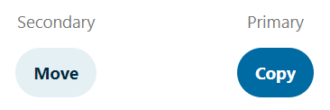

* Primary buttons are used to indicate the main action ("Start call" button in Talk, "Move" in Files). The primary buttons are stylized in Nextcloud blue by default or the theming color when themed.
* Secondary buttons are used for actions that have lesser weight than the primary action ("Today" button in Calendar, "Copy" in Files)

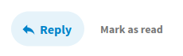

* Tertiary buttons, which are the buttons without a background, can be used for other actions in your app which are important, but not the main focus. These buttons are usually combined with a primary and/or secondary button.

* The icon-only buttons can be used if the action is frequently used and the icon is easily recognizable, and therefore does not require any text to support it (mute/video/screenshare actions in Talk video call).

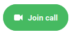

* Success buttons are used for a positive action ("Join call" button in Talk)

* Danger buttons are used to signify a potentially dangerous or negative action ("Remove account" button in the confirmation dialog when you want to remove an account in Mail, or "Delete conversation" in Talk).

.. _Action menu:

Action menu
-----------

`Action menu Vue component <https://nextcloud-vue-components.netlify.app/#/Components/NcActions>`_.
`Penpot action menu <https://design.penpot.app/#/view/db3839da-807b-8052-8002-576401e9a375?page-id=3f784c86-6c27-80c6-8002-6ab157b6bd27&section=interactions&index=4&share-id=11fde340-21f4-802e-8002-8d8d305e7ab5>`_

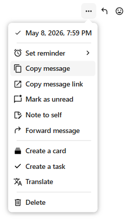

The action menu contains commonly used actions associated with an item. Each entry in the action menu has some text accompanied by a suitable icon. In some cases, the action menu may also contain:

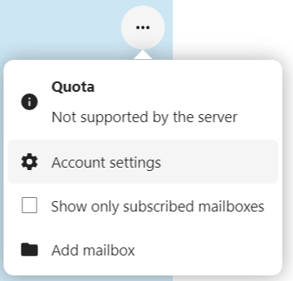

* checkboxes to quickly toggle a state, like in Mail

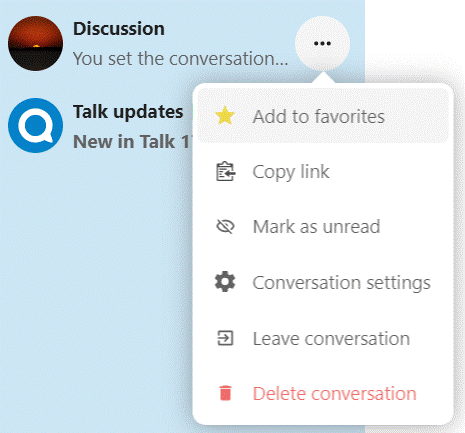

* radio buttons to select from a few options, like chat notifications in Talk

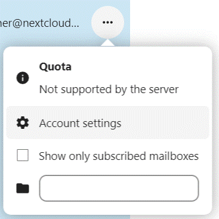

* new entry elements to quickly add items, like add a new mailbox in Mail

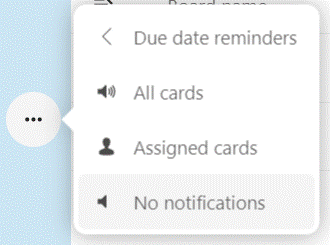

* a second level of actions, like to configure custom permissions for link shares in Files

Some commonly used actions in the action menu are favoriting, renaming, downloading and deleting. Delete should always be at the last position as to not be confused with other actions.

It is important to keep the action menu simple and its length at a minimum. Too many entries in the action menu can lead to confusion and people not finding what they are looking for.

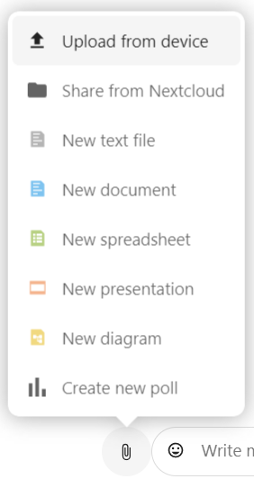

In most cases the action menu is accessed through a 3-dot menu. In certain cases, it is better to use a specific icon instead of the generic 3-dot icon. For example in Talk a paperclip icon is used for attachments.

For Android and iOS, the action menu is generally opened as a bottom sheet.

.. _Input fields:

Input fields
------------

`Input field Vue component <https://nextcloud-vue-components.netlify.app/#/Components/NcFields?id=ncinputfield>`_.
`Penpot text fields <https://design.penpot.app/#/view/db3839da-807b-8052-8002-576401e9a375?page-id=3f784c86-6c27-80c6-8002-6ab157b6bd27&section=interactions&index=2&share-id=11fde340-21f4-802e-8002-8d8d305e7ab5>`_

.. _Text input:

Text input
^^^^^^^^^^

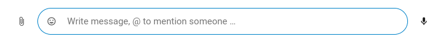

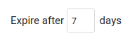

Text inputs are usually used for free-form inputs. Make sure that the label for a text input field is simple and clear. It may also be a good idea to use placeholder text in the field.

.. _Dropdowns:

Dropdowns
^^^^^^^^^

`Dropdown Vue component <https://nextcloud-vue-components.netlify.app/#/Components/NcSelect>`_.
`Penpot dropdowns <https://design.penpot.app/#/view/db3839da-807b-8052-8002-576401e9a375?page-id=3f784c86-6c27-80c6-8002-6ab157b6bd27&section=interactions&index=1&share-id=11fde340-21f4-802e-8002-8d8d305e7ab5>`_

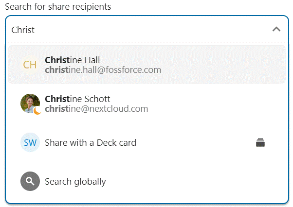

Dropdowns allow the user to select one or more items from a list. Dropdowns can have predefined options from which the user can select one or more items, as seen in Contacts for selecting the type of phone number.

Although not always necessary, it is generally a good idea to have a default item already selected, especially when a dropdown menu is a key element which will be used a lot. This can be decided based on the context.

Another variation of the dropdown allows the user to find their preferred option by typing it in, like in Mail where the "To" field in the composer allows you to type an email address, and as you type it suggests contacts.

.. _Checkboxes and radio buttons:

Checkboxes and radio buttons
^^^^^^^^^^^^^^^^^^^^^^^^^^^^

`Checkbox and radio button Vue components <https://nextcloud-vue-components.netlify.app/#/Components/NcCheckboxRadioSwitch>`_.
`Penpot checkboxes and radio buttons <https://design.penpot.app/#/view/db3839da-807b-8052-8002-576401e9a375?page-id=3f784c86-6c27-80c6-8002-6ab157b6bd27&section=interactions&index=5&share-id=11fde340-21f4-802e-8002-8d8d305e7ab5>`_

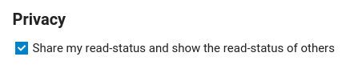

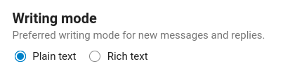

Checkboxes and radio buttons are very common input methods. They are most commonly used in the :ref:`action menu`, :ref:`sidebar` and :ref:`settings`.

They should have a concise label, especially if they are inside an action menu. If more explanation is needed, you can also add a subline.

Pickers
-------

.. _Datetime picker:

Datetime picker
^^^^^^^^^^^^^^^

`Datetime picker Vue component <https://nextcloud-vue-components.netlify.app/#/Components/NcPickers?id=ncdatetimepicker>`_.

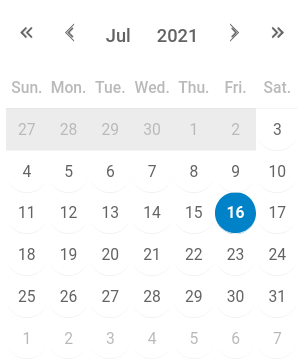

A user can quickly select dates, times and date ranges using the datetime picker. Use good default dates relevant to the task at hand. For example, in the case of setting an expiration date, unless there is a reason otherwise, it is best to default to a date in the future.

.. _Color picker:

Color picker
^^^^^^^^^^^^

`Color picker Vue component <https://nextcloud-vue-components.netlify.app/#/Components/NcPickers?id=nccolorpicker>`_.

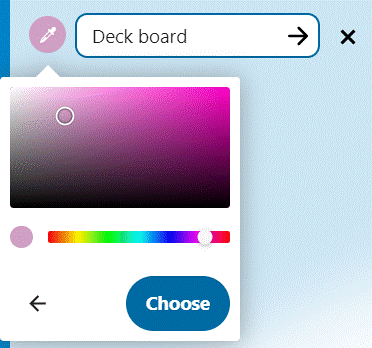

For certain elements of your UI you might want to allow people to set colors. This can easily be achieved using a color picker with some predefined colors. Be cautious about using different colors so the UI stays coherent.

In addition to these 2 pickers, there is also the `emoji picker <https://nextcloud-vue-components.netlify.app/#/Components/NcPickers?id=ncemojipicker>`_ and the `timezone picker <https://nextcloud-vue-components.netlify.app/#/Components/NcPickers?id=nctimezonepicker>`_.

.. _Tags:

Tags
----

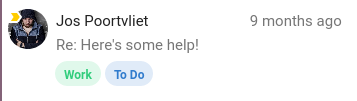

Tags are used by users to manage their items. They can be colored for easy identification, but make sure to use subtle colors if colored tags are a main part of the UI, as seen in Mail.

.. _Modal:

Modal
-----

`Modal Vue component <https://nextcloud-vue-components.netlify.app/#/Components/NcModal>`_.
`Penpot modals <https://design.penpot.app/#/view/db3839da-807b-8052-8002-576401e9a375?page-id=3f784c86-6c27-80c6-8002-6ab157b6bd27&section=interactions&index=12&share-id=11fde340-21f4-802e-8002-8d8d305e7ab5>`_

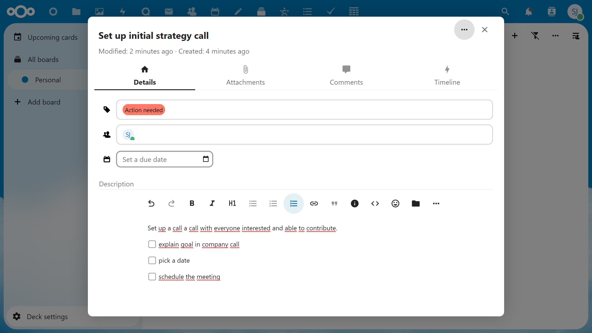

A modal is an element on top of the main UI, and interaction with the main element is disabled.

The modal is used when there is a specific task or information that the user needs to focus on. Modals are a good idea if the showing some information on the main UI would clutter the UI too much, and the information does not necessarily depend on the UI. Modals are also used for confirmation when performing dangerous tasks such as permanent deletion.

Examples of modals are:

* Settings modal found in Talk and Mail
* the modal view for a card in Deck
* Move or copy dialog in Files
* the file picker in Mail and Talk

On Android and iOS, content which is in a modal would usually be shown as a full-screen overlay, like for example composing a new mail in `iOS Mail <https://developer.apple.com/documentation/messageui/mfmailcomposeviewcontroller>`_.

.. _Avatar:

Avatar
------

`Avatar Vue component <https://nextcloud-vue-components.netlify.app/#/Components/NcAvatar>`_.
`Penpot avatars <https://design.penpot.app/#/view/db3839da-807b-8052-8002-576401e9a375?page-id=3f784c86-6c27-80c6-8002-6ab157b6bd27&section=interactions&index=3&share-id=11fde340-21f4-802e-8002-8d8d305e7ab5>`_

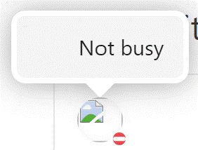

An avatar is used when referring to any user and displays their photo or initials. The avatar component also shows a menu for that user when clicked.

When using an avatar it is usually accompanied by the name of the user as well, and sometimes it can also show the status of the user, although not always necessary. Statuses can be useful when the user is interacting with another user and is expecting a response, for example when @mentioning someone else in Talk, or in any sharing view.

When multiple people are working on or are assigned to the same element, like in Text, Office, a Deck card, or in the Files list for sharing, they are shown as overlapped.

.. note::

   Starting with Nextcloud 25, generated avatars support dedicated dark-theme
   variants. If your app requests avatar URLs directly, prefer dark-theme aware
   avatar URLs in dark UI contexts.

   Deprecated avatar sizes are also normalized to supported sizes. Requests up
   to ``64`` return a ``64x64`` avatar, while requests above ``64`` return a
   ``512x512`` avatar.

.. _Progress bars and meters:

Progress bars and meters
------------------------

`Progress bar Vue component <https://nextcloud-vue-components.netlify.app/#/Components/NcProgressBar>`_.

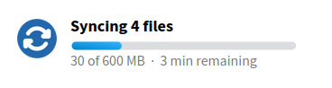

Progress bars shows progress for a potentially lengthy process such as uploading, downloading, or syncing. When using a progress bar it can also be a good idea to have a text-based indication of the progress, such as percentage or time remaining, and make sure to provide feedback when the process has been completed.

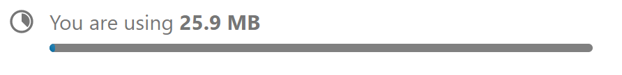

The progress bar component is also sometimes used as a meter to visualize data as seen in the settings for Files to show the quota.

.. _User bubbles:

User bubbles
------------

`User bubble Vue component <https://nextcloud-vue-components.netlify.app/#/Components/NcUserBubble>`_.
