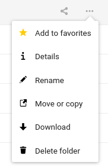
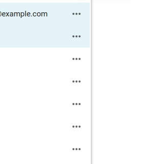
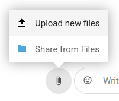
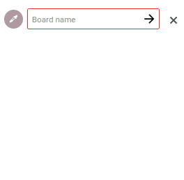
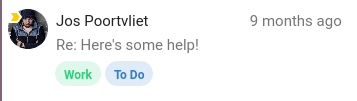

Atomic components
=================

.. _Buttons:

Buttons
-------

`Buttons Vue component <https://nextcloud-vue-components.netlify.app/#/Components/NcButton>`_.
`Penpot buttons <https://design.penpot.app/#/view/db3839da-807b-8052-8002-576401e9a375?page-id=3f784c86-6c27-80c6-8002-6ab157b6bd27&section=interactions&index=0&share-id=11fde340-21f4-802e-8002-8d8d305e7ab5>`_

Buttons are used to initiate actions in your app. This may be a primary action, or it may be used to confirm an action in a dialog, or simply be used for any major action in your app.

There are generally different types of buttons for different purposes:

.. image:: ../images/button-primary-secondary.png
   :alt: Primary button "Move" and secondary button "Copy" in Files 

* Primary buttons are used to indicate the main action ("Start call" button in Talk, "Move" in Files). The primary buttons are stylized in Nextcloud blue by default or the theming color when themed. These should only be used sparingly and ideally only for 1 visible action at a time.
* Secondary buttons are used for actions that have lesser weight than the primary action ("Today" button in Calendar, "Copy" in Files)

.. image:: ../images/button-tertiary.png
   :alt: Tertiary button "Mark as read" in desktop tray menu

* Tertiary buttons, which are the buttons without a background, can be used for other actions in your app which are important, but not the main focus. These buttons are usually combined with a primary or secondary button. For example, "Mark as read" is a tertiary button used alongside a secondary button

.. image:: ../images/button-icon-only.png
   :alt: Mute, video, screenshare and 3-dot buttons in Talk video call

* The icon-only buttons can be used if the action is frequently used and the icon is easily recognizable, and therefore does not require any text to support it (mute/video/screenshare actions in Talk, and the 3-dot menu icon)

.. image:: ../images/button-success.png
   :alt: Success button "Join call" in Talk

* Success buttons are used for a positive action ("Join call" button in Talk)

.. image:: ../images/button-danger.png
   :alt: Danger button "Remove email" in Mail

* Danger buttons are used to signify a potentially dangerous or negative action ("Remove account" button in the confirmation dialog when you want to remove an account in Mail, or "Delete conversation" in Talk conversation settings)

.. _Action menu:

Action menu
-----------

`Action menu Vue component <https://nextcloud-vue-components.netlify.app/#/Components/NcActions>`_.
`Penpot action menu <https://design.penpot.app/#/view/db3839da-807b-8052-8002-576401e9a375?page-id=3f784c86-6c27-80c6-8002-6ab157b6bd27&section=interactions&index=4&share-id=11fde340-21f4-802e-8002-8d8d305e7ab5>`_

The action menu contains commonly used actions associated with an item. Each entry in the action menu has some text accompanied by a suitable icon. In some cases, the action menu may also contain:

.. image:: ../images/action-menu-checkbox.png
   :alt: Checkbox in action menu in Mail

* checkboxes to quickly toggle a state, like in Mail

.. image:: ../images/action-menu-radio-button.gif
   :alt: Radio button in action menu in Files link sharing

* radio buttons to select from a few options, like chat notifications in Talk

* new entry elements to quickly add items, like add a new mailbox in Mail

.. image:: ../images/action-menu-second-level.gif
   :alt: Second level of actions in action menu to configure custom permissions for link shares in Files

* a second level of actions, like to configure custom permissions for link shares in Files

Some commonly used actions in the action menu are favoriting, renaming, downloading and deleting. Delete should always be at the last position as to not be confused with other actions.

It is important to keep the action menu simple and its length at a minimum. Too many entries in the action menu can lead to confusion and people not finding what they are looking for.

In most cases the action menu is accessed through a 3-dot menu. In certain cases, it is better to use a specific icon instead of the generic 3-dot icon. For example in Talk a paperclip icon is used for accessing the action menu for attaching an item, and a heading icon is used in Text formatting bar for heading level selection.

For Android and iOS, the action menu is generally opened as a bottom sheet.

.. _Input fields:

Input fields
------------

`Input field Vue component <https://nextcloud-vue-components.netlify.app/#/Components/NcFields?id=ncinputfield>`_.
`Penpot text fields <https://design.penpot.app/#/view/db3839da-807b-8052-8002-576401e9a375?page-id=3f784c86-6c27-80c6-8002-6ab157b6bd27&section=interactions&index=2&share-id=11fde340-21f4-802e-8002-8d8d305e7ab5>`_

.. _Text input:

Text input
^^^^^^^^^^

.. image:: ../images/talk-text-input.png
   :alt: Talk text input

Text inputs are usually used for free-form inputs. Make sure that the label for a text input field is simple and clear. It may also be a good idea to use placeholder text in the field.

.. _Dropdowns:

Dropdowns
^^^^^^^^^ 

`Dropdown Vue component <https://nextcloud-vue-components.netlify.app/#/Components/NcSelect>`_.
`Penpot dropdowns <https://design.penpot.app/#/view/db3839da-807b-8052-8002-576401e9a375?page-id=3f784c86-6c27-80c6-8002-6ab157b6bd27&section=interactions&index=1&share-id=11fde340-21f4-802e-8002-8d8d305e7ab5>`_

.. image:: ../images/dropdown-find-as-you-type.gif
   :alt: Dropdown menu in Files sharing

Dropdowns allow the user to select one or more items from a list. Dropdowns can have predefined options from which the user can select one or more items, as seen in Contacts for selecting the type of a phone number. If there are not too many entries, you may also think about using a set of :ref:`checkboxes and radio buttons` instead.

Although not always necessary, it is generally a good idea to have a default item already selected, especially when a dropdown menu is a key element which will be used a lot. This can be decided by a number of factors such as most selected item for that user, most recently selected item, etc. For example, when you add a new phone number in Contacts, the type "Home" is automatically set in the dropdown.

Another variation of the dropdown allows the user to find their preferred option by typing it in, like in Mail where the "To" field in the composer allows you to type an email address, and as you type it shows a dropdown with the results matching the input. This kind of dropdown is useful for when there are many options and the user would already know what they are looking for. It can also be a good idea to allow new inputs if there are no matches.

.. _Checkboxes and radio buttons:

Checkboxes and radio buttons
^^^^^^^^^^^^^^^^^^^^^^^^^^^^

`Checkbox and radio button Vue components <https://nextcloud-vue-components.netlify.app/#/Components/NcCheckboxRadioSwitch>`_.
`Penpot checkboxes and radio buttons <https://design.penpot.app/#/view/db3839da-807b-8052-8002-576401e9a375?page-id=3f784c86-6c27-80c6-8002-6ab157b6bd27&section=interactions&index=5&share-id=11fde340-21f4-802e-8002-8d8d305e7ab5>`_

.. image:: ../images/checkboxes-settings.png
   :alt: Checkbox in Talk settings

.. image:: ../images/radiobuttons-settings.png
   :alt: Radio buttons in Mail settings

Checkboxes and radio buttons are very common input methods. They are most commonly used in the :ref:`action menu`, :ref:`sidebar` and :ref:`settings`.

They should have a concise label, especially if they are inside an action menu. If more explanation is needed, you can also add a subline. 

Pickers
-------

.. _Datetime picker:

Datetime picker
^^^^^^^^^^^^^^^

`Datetime picker Vue component <https://nextcloud-vue-components.netlify.app/#/Components/NcPickers?id=ncdatetimepicker>`_.

.. image:: ../images/files-date-picker.png
   :alt: Files date picker

A user can quickly select dates, times and date ranges using the datetime picker. Use good default dates relevant to the task at hand. For example, in the case of setting an expiration date, unless the server has something enforced as default, 1 week is a good default. 

.. _Color picker:

Color picker
^^^^^^^^^^^^

`Color picker Vue component <https://nextcloud-vue-components.netlify.app/#/Components/NcPickers?id=nccolorpicker>`_.

For certain elements of your UI you might want to allow people to set colors. This can easily be achieved using a color picker with some predefined colors. Be cautious about using different colors in the UI. In most Nextcloud apps like Deck and Calendar, user defined colors for UI elements are used sparingly and shown as a circle next to the element they refer to. 

In addition to these 2 pickers, there is also the `emoji picker <https://nextcloud-vue-components.netlify.app/#/Components/NcPickers?id=ncemojipicker>`_ and the `timezone picker <https://nextcloud-vue-components.netlify.app/#/Components/NcPickers?id=nctimezonepicker>`_ which can be also be used in your app. 

.. _Tags:

Tags
----

Tags are used by users to manage their items. They can be colored for easy identification, but make sure to use subtle colors if colored tags are a main part of the UI, as seen in Mail.

.. _Modal:

Modal
-----

`Modal Vue component <https://nextcloud-vue-components.netlify.app/#/Components/NcModal>`_. 
`Penpot modals <https://design.penpot.app/#/view/db3839da-807b-8052-8002-576401e9a375?page-id=3f784c86-6c27-80c6-8002-6ab157b6bd27&section=interactions&index=12&share-id=11fde340-21f4-802e-8002-8d8d305e7ab5>`_

.. image:: ../images/deck-card-modal.png
   :alt: Deck card modal

A modal is an element on top of the main UI, and interaction with the main element is disabled.

The modal is used when there is a specific task or information that the user needs to focus on. Modals are a good idea if the showing some information on the main UI would clutter the UI too much, and the information does not necessarily depend on the UI. Modals are also used for confirmation when performing dangerous tasks such as permanent deletion.

Examples of modals are:

* Settings modal found in Talk and Mail
* the modal view for a card in Deck
* Move or copy dialog in Files
* the file picker in Mail and Talk

On Android and iOS, content which is in a modal would usually be shown as a full-screen overlay, like for example composing a new mail in `iOS Mail <https://developer.apple.com/documentation/messageui/mfmailcomposeviewcontroller>`_.

.. _Avatar:

Avatar
------

`Avatar Vue component <https://nextcloud-vue-components.netlify.app/#/Components/NcAvatar>`_.
`Penpot avatars <https://design.penpot.app/#/view/db3839da-807b-8052-8002-576401e9a375?page-id=3f784c86-6c27-80c6-8002-6ab157b6bd27&section=interactions&index=3&share-id=11fde340-21f4-802e-8002-8d8d305e7ab5>`_

.. image:: ../images/avatar-talk.gif
   :alt: Avatars in Talk

An avatar is used when referring to any user and displays their photo or initials. The avatar component also shows a menu for that user when clicked.

When using an avatar it is usually accompanied by the name of the user as well, and sometimes it can also show the status of the user, although not always necessary. Statuses can be useful when the user is interacting with another user and is expecting a response, for example when @mentioning someone else in Talk, or in any sharing view.

When multiple people are working on or are assigned to the same element, like in Text, Office, a Deck card, or in the Files list for sharing, they are shown as overlapped.

.. _Progress bars and meters:

Progress bars and meters
------------------------

`Progress bar Vue component <https://nextcloud-vue-components.netlify.app/#/Components/NcProgressBar>`_.

.. image:: ../images/progress-bar.png
   :alt: Desktop syncing progress bar

Progress bars shows progress for a potentially lengthy process such as uploading, downloading, or syncing. When using a progress bar it can also be a good idea to have a text-based indication of the progress, such as percentage or time remaining, and make sure to provide feedback when the process has been completed.

.. image:: ../images/meter-settings.png
   :alt: Meter in Files for storage quota

The progress bar component is also sometimes used as a meter to visualize data as seen in the settings for Files to show the quota.

.. _User bubbles:

User bubbles
------------

`User bubble Vue component <https://nextcloud-vue-components.netlify.app/#/Components/NcUserBubble>`_.
`Penpot user bubbles <https://design.penpot.app/#/view/db3839da-807b-8052-8002-576401e9a375?page-id=3f784c86-6c27-80c6-8002-6ab157b6bd27&section=interactions&index=6&share-id=11fde340-21f4-802e-8002-8d8d305e7ab5>`_

.. image:: ../images/talk-user-bubble.png
   :alt: Talk user bubble

When referring to a user inline in your app, a user bubble element can be used. In Talk and Comments, user bubbles are used in the content when someone mentions a user. In Mail, it is used in the header for the recipients of the message. 

.. _Counter bubbles:

Counter bubbles
---------------

`Counter bubble Vue component <https://nextcloud-vue-components.netlify.app/#/Components/NcCounterBubble>`_.
`Penpot counter bubbles <https://design.penpot.app/#/view/db3839da-807b-8052-8002-576401e9a375?page-id=3f784c86-6c27-80c6-8002-6ab157b6bd27&section=interactions&index=7&share-id=11fde340-21f4-802e-8002-8d8d305e7ab5>`_

.. image:: ../images/talk-counter-bubble.png
   :alt: Talk counter bubble

In Talk, it is used for showing which chats are unread and if you or your group is mentioned. 

.. _Empty content:

Empty content
-------------

`Empty content component <https://nextcloud-vue-components.netlify.app/#/Components/NcEmptyContent>`_.
`Penpot empty content <https://design.penpot.app/#/view/db3839da-807b-8052-8002-576401e9a375?page-id=3f784c86-6c27-80c6-8002-6ab157b6bd27&section=interactions&index=10&share-id=11fde340-21f4-802e-8002-8d8d305e7ab5>`_

.. image:: ../images/empty-content.png
   :alt: Bookmarks empty content

The empty content state provides feedback that a view is empty, e.g. a new folder. This is to differentiate it from the state of loading, or having loaded and showing data.

Make sure that empty content views only show when the view is really empty, and not while it is loading – otherwise people will be shocked as to where their data is gone. The wording on the empty content view should be friendly and helping people out of the situation, for example in the Bookmarks app.

.. _Skeleton screens:

Skeleton screens
----------------

.. image:: ../images/skeleton-screen-talk.png
   :alt: Talk skeleton screen
	 :scale: 50%

While the app is loading, it is best to show a skeleton view of the apps probable contents as loading feedback. A good example for this is Talk on web as well as Files and Talk on Android.
