==========
Components
==========

These are usage guidelines for common components used across Nextcloud. For a full list of components go to the `Nextcloud Vue component library <https://nextcloud-vue-components.netlify.app>`__.

.. _Buttons:

Buttons
-------

Buttons `(NcButton) <https://nextcloud-vue-components.netlify.app/#/Components/NcButton>`__ are used to initiate actions in your app. This may be a primary action, or it may be used to confirm an
action in a dialog, or simply be used for any major action in your app.

-  Primary buttons have a background of the primary color and are used to indicate the main action for a flow or screen. Use primary buttons for positive actions like creating and joining.

   -  Do not use primary buttons for negative actions like deleting and exiting.
   -  Ideally use only one visible primary button on a screen.

-  Tertiary buttons, which are the buttons without a background, can be used for other actions in your app which are important, but not the main focus. Use tertiary buttons when an action is
   low-priority or dismissive, like going back to a previous step.

   -  Do not use tertiary buttons for important actions like signing up or for permanent destructive actions like deleting.

-  Icon-only buttons can be used for simple actions with a widely recognized icon, and as an entry point for an action menu.

   -  Always use outlined Material Symbols for icons.
   -  Do use generally accepted icons for icon-only buttons like a star icon for favoriting.

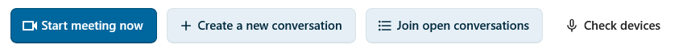

.. _List item:

List item
---------

List items `(NcListItem) <https://nextcloud-vue-components.netlify.app/#/Components/NcListItems?id=nclistitem>`__ are the rows of a content list such as conversations in Talk, messages in Mail,
and boards in Deck.

-  List items are flexible, always having a leading avatar or icon, a name, and an action menu on the right, and optionally a preview line, a timestamp or a counter bubble.

-  Single-line list items show only the name and suit dense, navigation-like lists. Use them when the name alone is enough to identify the row.
-  Two-line list items show a name or title on the first line and a preview or metadata on the second line. Use them for messages, conversations, and notes where extra information helps the user.

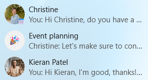

.. _Counter bubbles:

Counter bubbles
---------------

Counter bubbles `(NcCounterBubble) <https://nextcloud-vue-components.netlify.app/#/Components/NcCounterBubble>`__ are small badges that show a number count next to an item, often in the
navigation. A counter bubble is not interactive.

-  Filled primary bubbles can be used to highlight counters that may need attention like direct mentions.
-  Outlined bubbles can be used for less important counters.

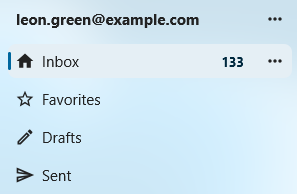

.. _Avatars:

Avatars
-------

Avatars `(NcAvatar) <https://nextcloud-vue-components.netlify.app/#/Components/NcAvatar>`__ represent a user, group, or contact. They show the user's profile picture when available, the user's
initials otherwise, and a generic icon for non-users like external email addresses or integrations. An avatar should almost always sit next to a display name.

-  User avatars are the default and automatically show the user's profile picture and status. Use them whenever you have a real Nextcloud user.
-  Non-user avatars represent external email addresses, guests, and integrations. For example, external recipients in Mail and guests in Talk.
-  32px as the default size for avatars, but they can be as small as 24px in dense lists, , and as large as 44-64px in headers and profile cards. Keep the size consistent within a single list or row.

-  Avoid placing an avatar alone in flowing text without a name next to it. For inline mentions of a user inside a sentence, use a User bubble.

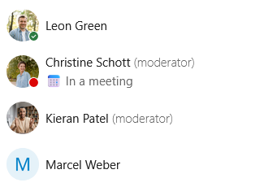

.. _Chips:

Chips
-----

Chips `(NcChip) <https://nextcloud-vue-components.netlify.app/#/Components/NcChip>`__ are small, compact labels for short pieces of metadata like tags, categories, selected values inside an input,
or filter options above a list. Do not use chips for triggering major actions, use a button instead.

-  Removable chips have a small close button and represent a value that can be removed. Use them inside multi-value inputs like recipient pickers, tag editors, and label fields.
-  Filter chips toggle a filter on or off and visually indicate when they are active. Use them for small filter sets above a list, like "Unread" or "Flagged" in Mail.
-  Colored chips work well for user-defined labels like tags and calendar categories.
-  When there are many options or a lack of space, consider using a dropdown instead.

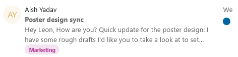

.. _User bubbles:

User bubbles
------------

User bubbles `(NcUserBubble) <https://nextcloud-vue-components.netlify.app/#/Components/NcUserBubble>`__ represent a user inside flowing content like chat messages, comments, and text documents.

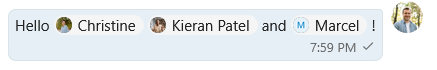

.. _Note card:

Note card
---------

Note cards `(NcNoteCard) <https://nextcloud-vue-components.netlify.app/#/Components/NcNoteCard>`__ are persistent inline message boxes that can be used to provide additional information about an
element, communicate state, warn the user, or surface a problem. They come in four types: info, success, warning, and error.

-  Info note cards explain context or share a tip. Use them for helpful additional information like "Your date of birth is needed for age verification".
-  Success note cards can show persistent positive information like "Your software is up-to-date".
-  Warning note cards can be used to indicate an unfavorable but non-blocking state or guide users through a risky operation. For example, Talk shows a "High-performance backend is not installed"
   warning to indicate it may result in connectivity issues for participants in a call.
-  Error note cards mark a real problem in the current view, like "Could not connect to mail server".

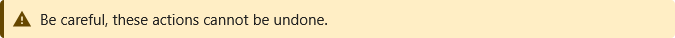

.. _Dropdown:

Dropdown
--------

Dropdowns `(NcSelect) <https://nextcloud-vue-components.netlify.app/#/Components/NcSelect>`__ let the user pick one or more values from a list. They support search, free-text entry, and loading
options on the fly.

-  Single-select dropdowns let the user pick one value.

   -  If your dropdown has many options, do add an option to search. For example, it is possible to search for a time zone.
   -  Do not use them for a small number of mutually exclusive options. A radio group is clearer in that case.

-  Multi-select dropdowns allow several values and show each selection as a chip inside the input. Use them for things like selecting multiple users and tags.

   -  Do let the user type and add their own option whenever applicable, for example while adding recipient email addresses to an email.

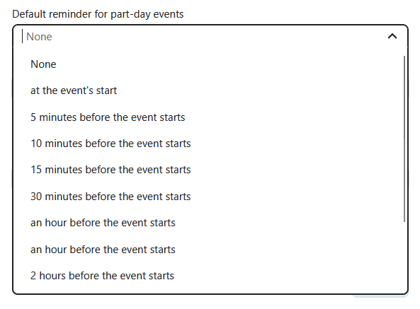

.. _Input fields:

Input fields
------------

Input fields allow the user to enter text, numbers, passwords, and more. Input fields often have labels, helper text, and errors.

-  Use text inputs `(NcTextField) <https://nextcloud-vue-components.netlify.app/#/Components/NcFields?id=nctextfield>`__ for single-line text like names, titles, subjects, search queries, and
   URLs.
-  Use the password input `(NcPasswordField) <https://nextcloud-vue-components.netlify.app/#/Components/NcFields?id=ncpasswordfield>`__ for passwords which obscures the text being typed and has a
   reveal-password button.
-  A text area `(NcTextArea) <https://nextcloud-vue-components.netlify.app/#/Components/NcFields?id=nctextarea>`__ is for multi-line input like descriptions, notes, plain-text email bodies, and
   card details.
-  Every input field should have a label. The default is a floating label which appears floating at the border when the input is active or filled. Use external labels when there are many inputs in a
   column.
-  When something is wrong with the text the user has entered, for example an invalid email address format, show an error state together with a short helper message that tells the user how to fix it.
-  Do use a leading icon when it helps identify the field (a magnifying glass for search, or an envelope for email), and a trailing button for inline actions like clearing, copying, or revealing a
   password.

-  Do choose the right text type (email, URL, search) so mobile keyboards adapt and the browser can help.

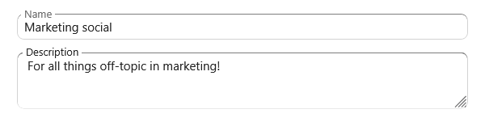

Formattable text area
^^^^^^^^^^^^^^^^^^^^^

Use the rich text content `(NcRichContenteditable) <https://nextcloud-vue-components.netlify.app/#/Components/NcRichContenteditable>`__ when the user may want to enter text with formatting via
markdown syntax. This can be used for messages, comments, and long descriptions. To display the results of the text entered in this text area, use the ``NcRichText`` component which renders the
formatted text.

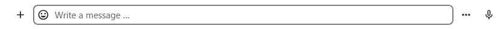

.. _Pickers:

Pickers
-------

Pickers are specialized inputs that open a popover or modal to choose a structured value like a date, a timezone, a color, an emoji, or a file.

Datetime picker
^^^^^^^^^^^^^^^

The datetime picker can be used to enter a date and time for scheduling events, setting reminders, and selecting dates of birth.

-  Use the native picker `(NcDateTimePickerNative) <https://nextcloud-vue-components.netlify.app/#/Components/NcPickers?id=ncdatetimepickernative>`__ as a default. It uses the browser's native
   date and time controls and is more accessible than a custom one.
-  Use the custom picker `(NcDateTimePicker) <https://nextcloud-vue-components.netlify.app/#/Components/NcPickers?id=ncdatetimepicker>`__ when the user benefits from seeing a calendar
   persistently, like for selecting a slot while booking an appointment.
-  Do use a sensible default date and time, for example, a user setting their work hours may benefit from a default of 9:00 AM as their starting availability and 5:00 PM as ending availability.

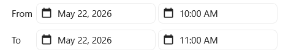

Timezone picker
^^^^^^^^^^^^^^^

The timezone picker `(NcTimezonePicker) <https://nextcloud-vue-components.netlify.app/#/Components/NcPickers?id=nctimezonepicker>`__ is a specialized dropdown preloaded with all named timezones.

-  Do use it only when a timezone is needed. Often the user's default home timezone may be sufficient for the action.

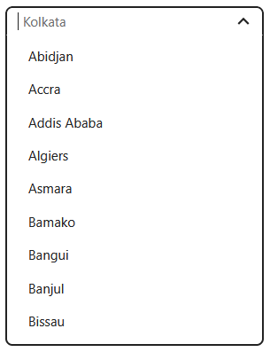

Color picker
^^^^^^^^^^^^

The color picker `(NcColorPicker) <https://nextcloud-vue-components.netlify.app/#/Components/NcPickers?id=nccolorpicker>`__ opens a small popover with a preset color palette. It can be used for
setting colors for various items like Deck boards, calendars, and tags. The color picker should color a specific item, not large areas of the UI.

-  Use the default Nextcloud palette so colors stay consistent across different Nextcloud apps.
-  Enable the advanced fields (hex, RGB) only when fine control matters, for example, for personal theming.

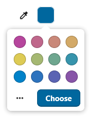

Emoji picker
^^^^^^^^^^^^

The emoji picker `(NcEmojiPicker) <https://nextcloud-vue-components.netlify.app/#/Components/NcPickers?id=ncemojipicker>`__ opens a popover for choosing an emoji, with search, skin-tone selection,
and a recently-used row.

-  Do use it for user-generated content like reactions in Talk, conversation icons, and user-created pages in Collectives.
-  Do not use it as a generic icon picker for navigation entries or system items. Those use Material Symbols.

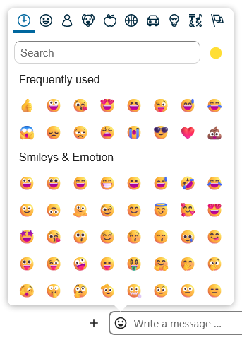

File picker
^^^^^^^^^^^

The file picker `(NcFilePicker) <https://nextcloud-vue-components.netlify.app/#/Components/NcPickers?id=ncfilepicker>`__ opens a modal of the user's files on Nextcloud. It supports filtering by
file type, picking one or several items, and choosing folders.

-  Use the file picker when the user can attach a file from their Nextcloud. Also let the user upload a file from their local filesystem.
-  The file picker can also be useful for moving or copying files.
-  Do filter by file type when only certain formats are valid.
-  Do label the primary button with a verb that matches the action like "Attach", "Insert", or "Choose".

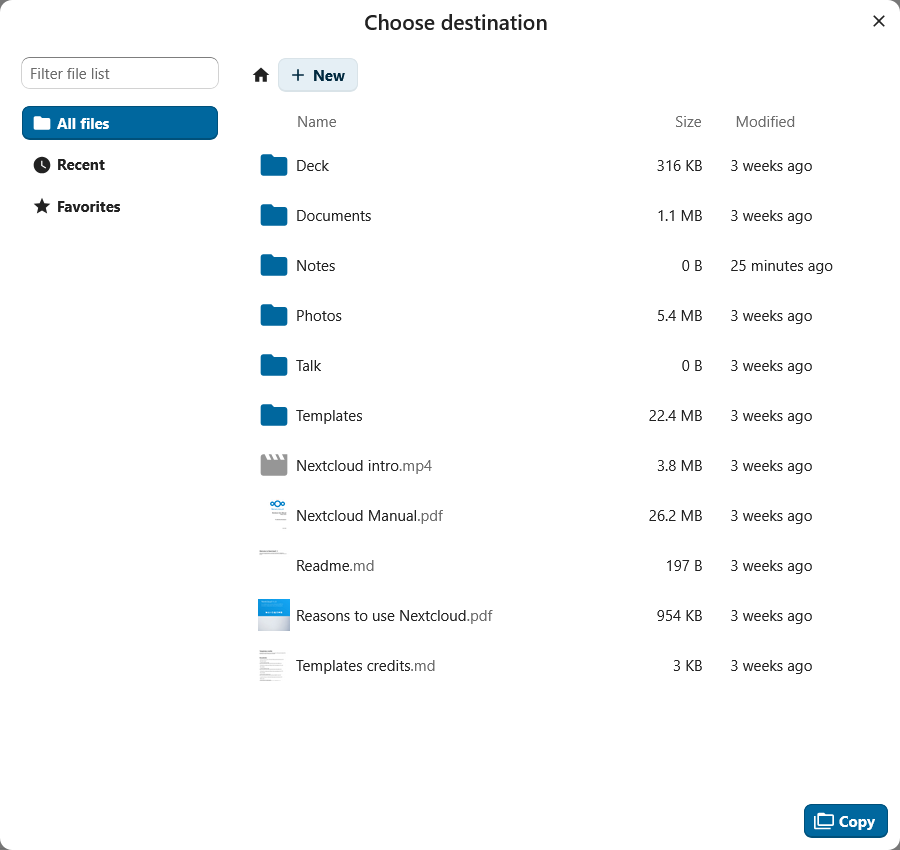

.. _Checkboxes and toggles:

Checkboxes and toggles
--------------------------------------

Checkboxes and toggles `(NcCheckboxRadioSwitch) <https://nextcloud-vue-components.netlify.app/#/Components/NcCheckboxRadioSwitch>`__ are selection controls that share a
single component.

-  Checkboxes allow users to select multiple options from a list. for example, per-folder share permissions.
-  Toggles (switches) are used for enabling and disabling a single setting.

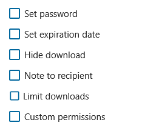

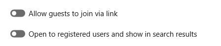

Radio groups
^^^^^^^^^^^^

Radio buttons allow users to select exactly one option from a defined radio group `(NcRadioGroup) <https://nextcloud-vue-components.netlify.app/#/Components/NcRadioGroup>`__ . It also has a button variant which displays the options as buttons. When there are many options, use a dropdown instead.

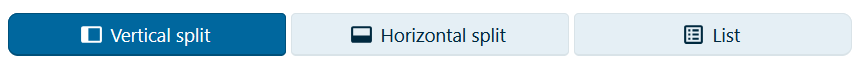

.. _Action menus:

Action menus
------------

Action menus `(NcActions) <https://nextcloud-vue-components.netlify.app/#/Components/NcActions>`__ are command menus attached to a trigger button. The trigger opens a popover with a list of
actions like "Rename", "Move", "Share", or "Delete".

-  The most common trigger for an action menu is an action button with a three-dot icon. In some apps the button uses a specific icon; for example, a paperclip icon is used for Talk's attachment menu.
-  In lists where one or two actions are common and the rest are rare, the common actions can be shown inline, with the remaining actions in the menu.

-  Do keep menus short. A long list of unrelated commands is hard to scan. Split it up or group it.
-  Do put destructive actions like "Delete" or "Remove" last and separated from the rest of the menu.
-  Do not use an action menu to pick an item from a list, use a dropdown instead.

.. image:: ../images/action-menu.png
   :alt: Action menu in Talk

.. _Empty content:

Empty content
-------------

Empty content `(NcEmptyContent) <https://nextcloud-vue-components.netlify.app/#/Components/NcEmptyContent>`__ is a message used when a view has no items to show. It has an icon, a heading, a short
description, and an optional button.

-  Do use helpful wording. "Drop files here to upload" is better than "No items".
-  Do show a button with a helpful next step whenever possible like "Create event" and "Add a card".
-  Do not use an empty content element while content is still loading. Use a skeleton screen while loading and the empty state only once the load finishes with nothing.
-  Do not use empty content for error states. If the loading failed, show a recoverable error message with a retry option.

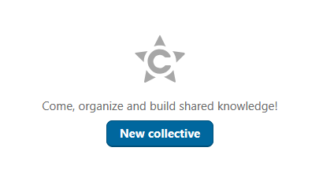

.. _Modals:

Modals
------

Modals are overlays that demand the user's focused attention. In the component library there are two components: a dialog
`(NcDialog) <https://nextcloud-vue-components.netlify.app/#/Components/NcDialog>`__ used for confirmations and short forms, and a modal
`(NcModal) <https://nextcloud-vue-components.netlify.app/#/Components/NcModal>`__ for custom content like viewers and slideshows. These components are used when there is a specific task or
information that the user needs to focus on.

-  The dialog component is commonly used for confirming a permanent action. Do use descriptive buttons for proceeding like "Save", "Move file", "Delete file".
-  Do not use generic words in the buttons like "OK", especially when the action is destructive.
-  Choose an appropriately sized dialog for your flow. if the dialog contains only small input fields, use a small dialog.
-  Avoid opening a modal over another modal.

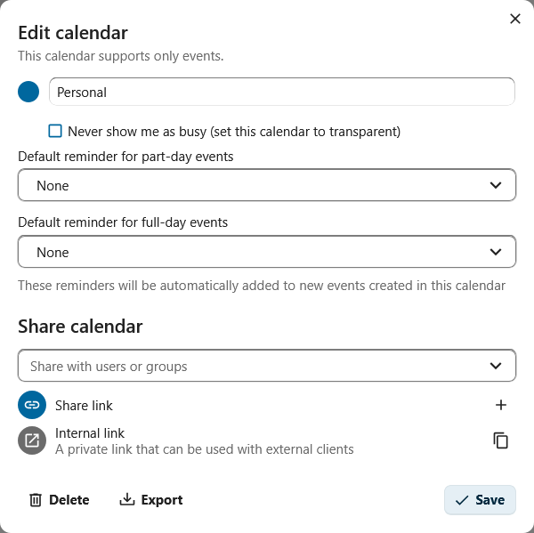

.. _Navigation:

Navigation
----------

The app navigation `(NcAppNavigation) <https://nextcloud-vue-components.netlify.app/#/Components/App%20containers/NcAppContent?id=ncappnavigation>`__ is the left column of an app. It contains the
primary structure of the app like the list of mailboxes, boards, calendars, or folders.

-  A prominent "new" button `(NcAppNavigationNew) <https://nextcloud-vue-components.netlify.app/#/Components/App%20containers/NcAppContent/NcAppNavigation?id=ncappnavigationnew>`__ is always at
   the top of the navigation and carries out the most common create action for the app. For example, "New message" in Mail, "New event" in Calendar, "New conversation" in Talk.
-  There can also be a search field at the top
   (`NcAppNavigationSearch <https://nextcloud-vue-components.netlify.app/#/Components/App%20containers/NcAppContent/NcAppNavigation?id=ncappnavigationsearch>`__ ) which allows the user to search
   through the items of the navigation.
-  The body of the navigation is a flat list of items
   (`NcAppNavigationItem <https://nextcloud-vue-components.netlify.app/#/Components/App%20containers/NcAppContent/NcAppNavigation?id=ncappnavigationitem>`__). Each item can have a small action
   menu at the end for actions like "Rename" or "Mark all as read", or a counter (for example, unread email count in Mail).
-  Do group items under section headings
   (`NcAppNavigationCaption <https://nextcloud-vue-components.netlify.app/#/Components/App%20containers/NcAppContent/NcAppNavigation?id=ncappnavigationcaption>`__) if there are many items or
   different categories of items like "Calendars", "Meeting proposals", and "Appointment schedules" in Calendar.
-  The bottom of the navigation is reserved for the settings entry
   (`NcAppSettingsDialog <https://nextcloud-vue-components.netlify.app/#/Components/App%20containers/NcAppContent/NcAppSettings?id=ncappsettingsdialog>`__) that opens the app's settings dialog.

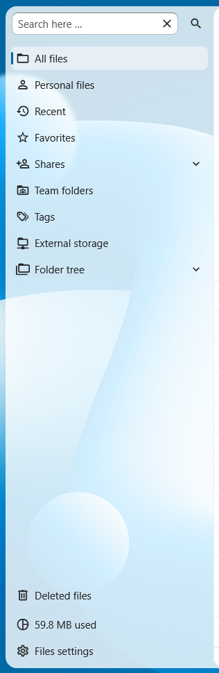

.. _Settings:

Settings
--------

The settings dialog (`NcAppSettingsDialog <https://nextcloud-vue-components.netlify.app/#/Components/App%20containers/NcAppContent/NcAppSettings?id=ncappsettingsdialog>`__) holds an app's per-user
preferences and opens from the cog at the bottom of the app navigation.

-  Inside the dialog, settings are organized into sections
   (`NcAppSettingsSection <https://nextcloud-vue-components.netlify.app/#/Components/App%20containers/NcAppContent/NcAppSettings?id=ncappsettingssection>`__) on the left. Each section should cover
   one topic. If there are more than around ten sections, consider reorganizing them and removing some settings.
-  Under each section are form boxes (`NcFormBox <https://nextcloud-vue-components.netlify.app/#/Components/NcFormBox>`__) containing the actual settings, so that settings look and feel the same
   across every Nextcloud app.
-  Settings can be grouped into a form group (`NcFormGroup <https://nextcloud-vue-components.netlify.app/#/Components/NcFormGroup>`__) with an appropriate label.
-  If the app has no per-user preferences to offer, the settings dialog can be omitted entirely.

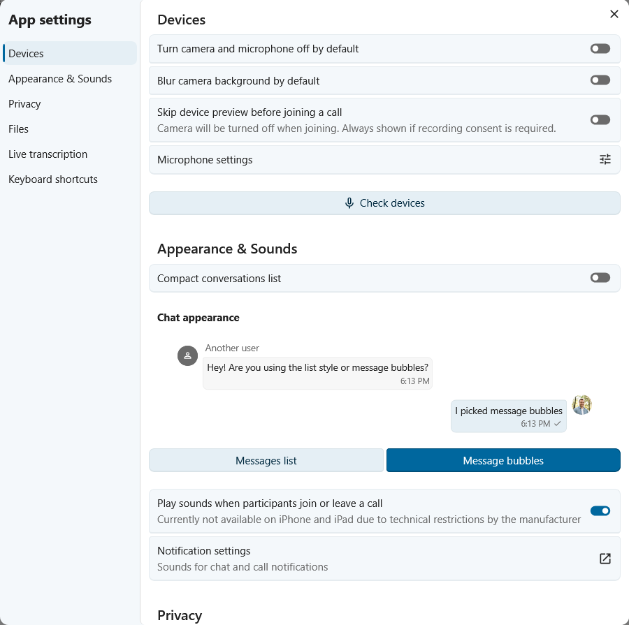

.. _Sidebar:

Sidebar
-------

The sidebar (`NcAppSidebar <https://nextcloud-vue-components.netlify.app/#/Components/App%20containers/NcAppContent?id=ncappsidebar>`__) can be used to show supporting information and actions for
an item. For example, Files uses a sidebar to show information about the selected file such as activity and comments.

-  The sidebar usually contains a header (`NcAppSidebarHeader <https://nextcloud-vue-components.netlify.app/#/Components/App%20containers/NcAppContent/NcAppSidebar?id=ncappsidebarheader>`__) with
   the title of the associated item and some metadata, and tabs
   (`NcAppSidebarTab <https://nextcloud-vue-components.netlify.app/#/Components/App%20containers/NcAppContent/NcAppSidebar?id=ncappsidebartab>`__) for the various groups of information or actions.
-  Do not use more than 3 tabs in the sidebar, the names of the tabs then start getting cut off.

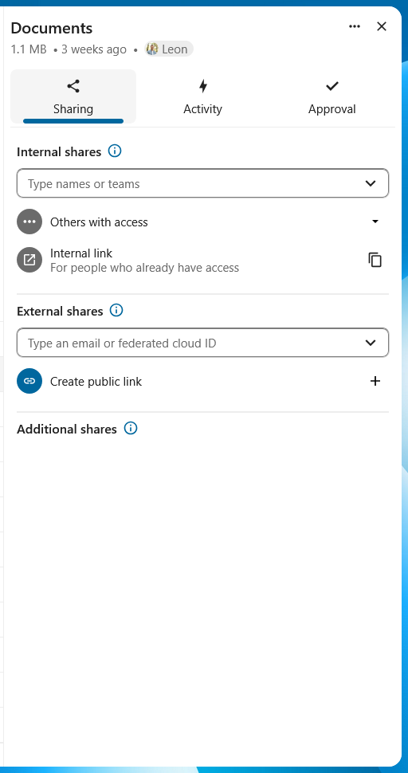
