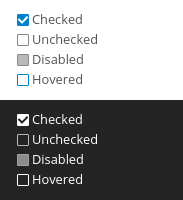
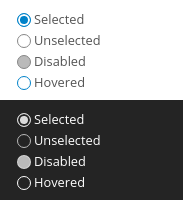

.. sectionauthor:: John Molakvoæ <skjnldsv@protonmail.com>
.. codeauthor:: John Molakvoæ <skjnldsv@protonmail.com>
..  _html:

=============
HTML elements
=============

Progress bar
=============

Nextcloud support and provides an already themed progress bar.

Please use the html5 ``progress`` element.

.. code-block:: html

    <progress value="42.79" max="100"></progress>

Checkboxes and radios
======================

As default html5 checkboxes & radios are **not** customizable, we created an override using label and ``::after`` elements.

There are 2 colors:

* Default themed with the primary color.
* White colored.

Requirements:

* You need to have a ``label`` element **directly** after the ``input`` element.
* The input **must** have the ``checkbox`` or ``radio`` class.
* To use the white theme, you **need** to also add the ``checkbox--white`` or ``radio--white`` class.
* Your label **must** have an associated text for accessibility.

.. code-block:: html

    <input type="checkbox" id="test1" class="checkbox"
           checked="checked">
    <label for="test1">Selected</label> 
    <input type="checkbox" id="test2" class="checkbox">
    <label for="test2">Unselected</label> 
    <input type="checkbox" id="test3" class="checkbox"
           disabled="disabled">
    <label for="test3">Disabled</label> 
    <input type="checkbox" id="test4" class="checkbox">
    <label for="test4">Hovered</label> 

.. code-block:: html

    <input type="radio" id="test1" class="radio"
           checked="checked">
    <label for="test1">Selected</label> 
    <input type="radio" id="test2" class="radio">
    <label for="test2">Unselected</label> 
    <input type="radio" id="test3" class="radio"
           disabled="disabled">
    <label for="test3">Disabled</label> 
    <input type="radio" id="test4" class="radio">
    <label for="test4">Hovered</label> 

Buttons
==================
