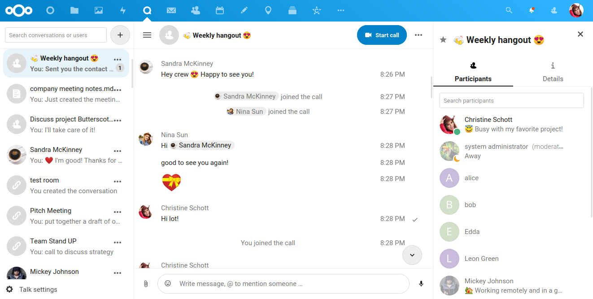

Layout
======

These layout guidelines mainly focus on our web interface. On Android and iOS we closely follow the platform guidelines, namely `Material Design <https://material.io/design>`_\ , and `Apple Human Interface Guidelines <https://developer.apple.com/design/human-interface-guidelines/>`_. 

While deciding how you want your app to look, there are a number of factors to consider:

* Consistency with other Nextcloud apps
* Responsiveness for different browsers, browser sizes and devices
* Typical interface patterns in other similar apps in the market

The `content Vue component <https://nextcloud-vue-components.netlify.app/#/Components/App%20containers/NcAppContent?id=ncappcontent-1>`_ wraps your entire app. While the arrangement of components in your app is dependent on what your app does, most Nextcloud apps typically have 3 levels of hierarchy. Some commonly used layouts are:
`Penpot empty template <https://design.penpot.app/#/view/db3839da-807b-8052-8002-576401e9a375?page-id=2783d7ad-98f2-804a-8002-750c2585d4f1&section=interactions&index=5&share-id=11fde340-21f4-802e-8002-8d8d305e7ab5>`_

* Navigation → content → sidebar (and a couple of variations of it, e.g. without the sidebar)
* Navigation → list → content

Navigation → Content → Sidebar
------------------------------

`Penpot Files layout <https://design.penpot.app/#/view/db3839da-807b-8052-8002-576401e9a375?page-id=2783d7ad-98f2-804a-8002-750c2585d4f1&section=interactions&index=3&share-id=11fde340-21f4-802e-8002-8d8d305e7ab5>`_

This layout is used in Files, Calendar, Deck, and Tasks.

This layout has the :ref:`Navigation` on the left, the :ref:`Content` in the middle, and a :ref:`Sidebar` on the right. The main content depends on the navigation, and the sidebar which is closed by default contains details of an item in the main content.

For example, in the Files app, the files in the main content varies based on what is selected in the navigation. The sidebar would open when the user wants to see the details of a file.

On mobile, the content is shown by default. The navigation and sidebar are expandable using icons on the sides.

Special case: no sidebar
^^^^^^^^^^^^^^^^^^^^^^^^

	 
Typically, a sidebar is used to show more information about an item. Sometimes this is not necessary as in the case of Activities. Then, the layout will have only a navigation and the main content.

Special case: list in navigation
^^^^^^^^^^^^^^^^^^^^^^^^^^^^^^^^

`Penpot Talk layout <https://design.penpot.app/#/view/db3839da-807b-8052-8002-576401e9a375?page-id=2783d7ad-98f2-804a-8002-750c2585d4f1&section=interactions&index=0&share-id=11fde340-21f4-802e-8002-8d8d305e7ab5>`_

Another variation of this layout is where the :ref:`List` of entries take up the left space instead of navigation, as seen in Talk. It shows the list of chats on the left, and the main content contains the messages in a chat, while opening the right sidebar shows the details of a chat like the description and participants. Talk also collapses the left list and right sidebar during a video call, so that the entire screen is taken up by just the call.

Navigation → List → Content
---------------------------

.. image:: ../images/mail-layout.png
   :alt: Mail layout

This layout is used in Mail and Contacts.

In this layout, the 3 levels of hierarchy are shown by default. On the left there is the :ref:`Navigation`, right next to it is a :ref:`List` of entries for the navigation chosen, and the main content is for the entry selected in the list.

A good example of this layout is in the Mail app. The left navigation section contains the different inboxes and categories. The list then shows the emails of the selected inbox or folder and the main content shows the contents of the email which is currently open.

On mobile, the list is shown by default. The navigation is expandable using an icon in the top left, and the content can be opened by selecting an entry from the list. Navigation back up from a content can be done via a "Back" arrow action in the top left, in place of the navigation icon.

