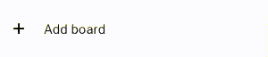
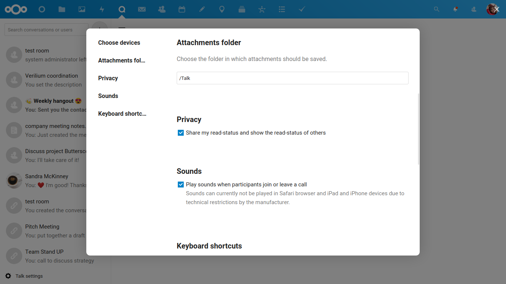
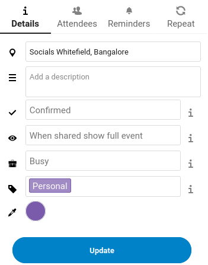

Layout components
=================

All Nextcloud apps are built using individual reusable components for consistency and efficiency. Currently, these components are written in Vue and can be found at the `nextcloud-vue repository on Github <https://github.com/nextcloud/nextcloud-vue/>`_ with the documentation available at `the Nextcloud Vue components style guide <https://nextcloud-vue-components.netlify.app/>`_.

Navigation
----------

`Vue component for the app navigation <https://nextcloud-vue-components.netlify.app/#/Components/App%20containers/NcAppNavigation?id=ncappnavigation-1>`_.

`Penpot navigation items <https://design.penpot.app/#/view/db3839da-807b-8052-8002-576401e9a375?page-id=3f784c86-6c27-80c6-8002-6ab157b6bd27&section=interactions&index=8&share-id=11fde340-21f4-802e-8002-8d8d305e7ab5>`_

.. image:: ../images/contacts-navigation.png
   :alt: Contacts navigation

The left navigation provides a way for users to move around different sections of your app.

The navigation consists of 4 main elements:

* Main action button
* Navigation entries
* New item element (optional)
* Settings menu (optional)

Main action button
^^^^^^^^^^^^^^^^^^

`Navigation AppNew Vue component <https://nextcloud-vue-components.netlify.app/#/Components/App%20containers/NcAppNavigation?id=ncappnavigationnew>`_.

`Penpot buttons <https://design.penpot.app/#/view/db3839da-807b-8052-8002-576401e9a375?page-id=3f784c86-6c27-80c6-8002-6ab157b6bd27&section=interactions&index=0&share-id=11fde340-21f4-802e-8002-8d8d305e7ab5>`_

.. image:: ../images/mail-primary-action-button.png
   :alt: Mail primary action button.png

For most apps, the first element in the navigation is the main action button. For example:

* Mail has a "New message" button to compose a new mail
* Contacts has a "New contact" button
* in Talk, you can create a new conversation
* in Calendar there is a "New event" button
* Forms has a "New form" action

Navigation entries
^^^^^^^^^^^^^^^^^^

`Navigation entries Vue component <https://nextcloud-vue-components.netlify.app/#/Components/App%20containers/NcAppNavigation?id=ncappnavigationitem>`_.

`Penpot navigation items <https://design.penpot.app/#/view/db3839da-807b-8052-8002-576401e9a375?page-id=3f784c86-6c27-80c6-8002-6ab157b6bd27&section=interactions&index=8&share-id=11fde340-21f4-802e-8002-8d8d305e7ab5>`_

.. image:: ../images/mail-navigation-entries.png
   :alt: Mail navigation entries

The different sections of your app would be organized by different navigation entries. For example, the Files app contains different categories of files in its navigation, and the Contacts app contains different groups and circles. When creating your navigation, make sure that the entries in this section:

* are easy to understand
* are frequently used
* are organized
* do not change positions frequently

Top-level navigation entries ideally have a suitable icon left next to them. Optionally they may also have:

* a 3 dot action menu (seen in Mail)
* a counter (seen in Contacts and Mail)

A sublevel of navigation is possible, but can lead to entries being hard to discover. It is only advised if there is actually a hierarchy like for folders in Mail or News.

New item element
^^^^^^^^^^^^^^^^

`New item Vue component <https://nextcloud-vue-components.netlify.app/#/Components/App%20containers/NcAppNavigation?id=ncappnavigationnewitem>`_.

Users can easily create a new item with a suitable name by using the new item element. This element can be used in the navigation, as in the case of Deck, or in the content. Other apps which use this:

* "Create a new group" in Contacts
* "Add mailbox" in Mail
* "New calendar" in Calendar

.. _Settings:

Settings
^^^^^^^^

`Settings Vue component <https://nextcloud-vue-components.netlify.app/#/Components/App%20containers/NcAppNavigation?id=ncappnavigationsettings>`_.

`Penpot modals <https://design.penpot.app/#/view/db3839da-807b-8052-8002-576401e9a375?page-id=3f784c86-6c27-80c6-8002-6ab157b6bd27&section=interactions&index=12&share-id=11fde340-21f4-802e-8002-8d8d305e7ab5>`_

The user-specific settings for your app may be shown in a settings modal, which can be accessed through a settings entry at the bottom of the navigation. Try to keep the settings to a minimum, as too many configurable options can be a burden to the user. If no settings are needed for the app, that is great and the settings modal can be omitted. Within the modal, categorizing your settings can sometimes offer a better experience if you have a lot of settings. If this is required, the categories are placed in the left of the settings modal.

You can also include a "Help" as an entry in the settings of your app and provide some simple information about your app and how to use it. Some apps like Talk and Mail also include keyboard shortcuts, if they are not disabled by the user.
The global javascript function ``OCP.Accessibility.disableKeyboardShortcuts()`` can be used to check that.

Also see: :ref:`Modal`

.. _List:

List item
----------

`List item Vue component <https://nextcloud-vue-components.netlify.app/#/Components/NcListItems>`_.

`Penpot list item <https://design.penpot.app/#/view/db3839da-807b-8052-8002-576401e9a375?page-id=3f784c86-6c27-80c6-8002-6ab157b6bd27&section=interactions&index=9&share-id=11fde340-21f4-802e-8002-8d8d305e7ab5>`_

.. image:: ../images/list-item.gif
   :alt: Talk list

List items can be used to display a collection of elements from which one can be selected. List items are seen in the left list of chats in Talk, as well as the list of messages in Mail and the list of contacts in Contacts. List items usually have an avatar or a descriptive icon, a main line and optionally a subline. A list item may also contain:

* an :ref:`Action menu` which has commonly used actions for that type of item
* a counter bubble: Talk for example uses an unread messages counter

.. _Content:

Content
-------

The content section of your app takes up the most screen space, and is the core of what your app does. The content of every app is unique, but do make sure that it follows some basic rules like responsiveness, accessibility, and support in different languages so that it can be used by everyone. The layout of your content depends on what your app does, as the content of almost every Nextcloud app looks different. The `appContent Vue component <https://nextcloud-vue-components.netlify.app/#/Components/App%20containers?id=appcontent>`_ should be used for the content of your app.

Views
^^^^^

Some apps offer different views on their content so people can pick a preference which should be remembered automatically. It is important to consider which should be the default one and whether to have different views at all, since most people do not change the default.

* Files (web, Android & iOS), Bookmarks: List view or grid view
* Calendar: Month view, week view, day view, list view / agenda
* Talk (web, Android & iOS): Speaker view and grid view in a call

The content is also the section where you can quickly explain to people how to get started with your app, for example using an :ref:`Empty content` atomic component.

Sizing
^^^^^^

For text-based apps like chat, mails, and other paragraphs of text, the width of the content should not go over a certain width to facilitate readability. In Nextcloud Text for example the width is limited to 650px and we do it similarly in Mail and Talk, even if the screen size is larger.

For every clickable element in your interface, make sure it has a minimum clickable area of at least 44px by 44px (48px for Android). Anything smaller than this will make your app inaccessible and difficult for users to use your app on mobile as they might miss while trying to tap on the element.

Spacing between elements in your app should be in multiples of 4px.

.. _Sidebar:

Sidebar
-------

`Sidebar Vue component <https://nextcloud-vue-components.netlify.app/#/Components/App%20containers/NcAppSidebar?id=ncappsidebar-1>`_.

`Penpot sidebar <https://design.penpot.app/#/view/db3839da-807b-8052-8002-576401e9a375?page-id=3f784c86-6c27-80c6-8002-6ab157b6bd27&section=interactions&index=11&share-id=11fde340-21f4-802e-8002-8d8d305e7ab5>`_

Details of a particular entry in your content, as well as some actions associated with it, are shown in the right sidebar. In apps where the sidebar is used, it only opens when required. The sidebar is never used in the 3-column layout (Navigation + list + content). It contains the main information and sometimes a preview of the selected item, as well as a maximum of 3 possible tabs.

Commonly used tabs in the sidebar are:

Details
^^^^^^^

`Sidebar Tabs Vue component <https://nextcloud-vue-components.netlify.app/#/Components/App%20containers/NcAppSidebar?id=ncappsidebartabs>`_.

`Penpot sidebar <https://design.penpot.app/#/view/db3839da-807b-8052-8002-576401e9a375?page-id=3f784c86-6c27-80c6-8002-6ab157b6bd27&section=interactions&index=11&share-id=11fde340-21f4-802e-8002-8d8d305e7ab5>`_

The details tab contains information about the entry it refers to, which is often editable using various input fields. The details included here will depend upon your app. For example, the details tab in the sidebar of the Calendar app contains information about the selected event, like location, description, and status. Also see :ref:`Input fields` in the atomic components section for more details about the various input fields that can be used here.

Activity
^^^^^^^^

Major changes done to the selected item, as well as comments left by users, are shown in the activity tab. These details are shown by latest activity up top.

If your app includes comment support, the "Write comment" input box should be placed here so it is nicely integrated.

If there is the possibility to restore earlier versions, this can be integrated using a 3-dot action menu on any past activity.

Sharing
^^^^^^^

.. image:: ../images/sidebar-sharing.png
   :alt: Proposed sharing tab in the sidebar

The sharing tab allows users to share the selected item with others in different ways. An item can be shared with specific users or groups on the instance by simply selecting whom you want to share with. Another very simple way of sharing is through a share link, which can optionally also be configured using the "Advanced settings" option.
