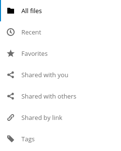

.. sectionauthor:: John Molakvoæ <skjnldsv@protonmail.com>
.. codeauthor:: John Molakvoæ <skjnldsv@protonmail.com>
..  _navigation:

===============
App Navigation
===============

Introduction
=============

The main navigation menu represents the main navigation of your app.

It needs to be:

* Organised
* Simple
* Responsive

Nextcloud provides a very organized way of building menus.
We implemented various essential functions and provide easy way of using them.

Basic layout
=============

.. rst-class:: figure-with-code

.. code:: html

    

        <ul>
            <li><a href="#">First level entry</a></li>
            <li>
                <a href="#">First level container</a>
                <ul>
                    <li><a href="#">Second level entry</a></li>
                    <li><a href="#">Second level entry</a></li>
                </ul>
            </li>
        </ul>
    

Utils
======

Each entry is allowed to have a counter and/or a button for user interaction.

* The ``app-navigation-entry-utils`` snippet need to be placed right next to the main link of your entry.
* Maximum **two** items are allowed into the utils section. You can have:
    * Two :ref:`buttons <navigation_buttons>`
    * One :ref:`button <navigation_buttons>` and one :ref:`button <navigation_counter>`
* You **can't** have more than two buttons, if you need more, you need to add a menu.
* The order of the button and the counter are **not** interchangeable. You need to put the counter before the menu.

.. code:: html

    

        <ul>
            <li class="app-navigation-entry-utils-counter">1</li>
            <li class="app-navigation-entry-utils-menu-button">
                <button></button>
            </li>
        </ul>
    

.. _navigation_menu:

Menu
^^^^^^

If you need to add a few interactions for your entry, you can put everything in a popover menu.
The menu needs to be placed after the ``app-navigation-entry-utils``.

For the global rules and/or layout, you can check the dedicated :ref:`popover menu section <popovermenu>`.

.. rst-class:: figure-with-code

.. figure:: ../images/navigation-menu.png
   :alt: Navigation menu

.. code:: html

    

        <ul>
            <li>
                <a href="#">
                    
                    Add
                </a>
            </li>
            <li>
                <a href="#">
                    
                    Edit
                </a>
            </li>
            <li>
                <a href="#">
                    
                    Remove
                </a>
            </li>
        </ul>
    

.. _navigation_counter:

Counter
^^^^^^^^

If you need to add a counter to your menu entry, you can simply use this structure.
Do not change the alignment of the text. If you're using

.. rst-class:: figure-with-code

.. figure:: ../images/navigation-counter.png
   :alt: Navigation entry with counter

.. code:: html

    <li class="app-navigation-entry-utils-counter">1</li>

.. _navigation_buttons:

Buttons
^^^^^^^^^

The same way we display the menu three-dot-icon button, you're allowed to use up to 2 buttons in a single entry.

* The icon class goes directly on the ``button`` element.
* If no class is set, the three-dot-icon will be used by default

.. rst-class:: figure-with-code

.. code:: html

    

        <ul>
            <li class="app-navigation-entry-utils-menu-button">
                <button class="icon-edit"></button>
            </li>
            <li class="app-navigation-entry-utils-menu-button">
                <button class="icon-delete"></button>
            </li>
        </ul>
    

Drag and drop
==============
The class which should be applied to a first level element **li** that hosts or can host a second level is **drag-and-drop**.
This will cause the hovered entry to slide down giving a visual hint that it can accept the dragged element.
In case of jQuery UI's droppable feature, the **hoverClass** option should be set to the **drag-and-drop** class.

.. code:: html

    

        <ul>
            <li><a href="#">First level entry</a></li>
            <li class="drag-and-drop">
                <a href="#" class="icon-folder">Folder name</a>
                <ul>
                    <li><a href="#">Folder contents</a></li>
                    <li><a href="#">Folder contents</a></li>
                </ul>
            </li>
        </ul>
    

Collapsible entry
==================

By default, all sub-entries are shown.
This behavior can be changed by creating a collapsible menu.
This way, the menu will be hidden and an arrow will be added in in front of it (replacing the icon if any).

The opening of the menu is activated and animated by the class ``open`` on the main ``li``.

* You can **not** have a collapsible menu on a sub-item, this can only exist on a top-level element.
* You can set the open class by default if you want.
* Do **not** use the collapsible menu if your element does not have sub-items.
* You **still** need to use JS to handle the click event.

.. IMPORTANT::
    * If your top-level link is only used as a header, the **entire** ``a`` needs to be used to toggle the ``open`` class.
    * If your top-level link is used to redirect the user or to trigger something else, you **need** to add the collapsible button and use it as the ``open`` class toggle trigger.

.. rst-class:: figure-with-code

.. figure:: ../images/navigation-collapsible.*
   :alt: Collapsible navigation entry

.. code:: html

    <li class="collapsible open">
        <button class="collapse"></button> This is optional
        <a href="#" class="icon-folder">Folder collapsed menu</a>
        <ul>
            <li><a href="#">Simple entry</a></li>
            <li><a href="#">Simple entry</a></li>
            <li><a href="#">Simple entry</a></li>
            <li>
                <a class="icon-folder" href="#">Simple folder</a>
            </li>
        </ul>
    </li>

Entry bullet
=============

Undo entry
===========

Edit entry
===========

Pinned entry
=============
