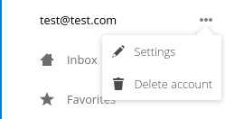

.. sectionauthor:: John Molakvoæ <skjnldsv@protonmail.com>
.. codeauthor:: John Molakvoæ <skjnldsv@protonmail.com>
..  _navigation:

===============
App Navigation
===============

Introduction
=============

The main navigation menu represents the main navigation of your app.

It needs to be:

* Organised
* Simple
* Responsive

Nextcloud provides a very organized way of building menus.
We implemented various essential functions and provide easy way of using them.

.. figure:: ../images/navigation.png
   :alt: Navigation screenshot

Basic layout
=============

.. code-block:: html

	

	    <ul>
	        <li><a href="#">First level entry</a></li>
	        <li>
	            <a href="#">First level container</a>
	            <ul>
	                <li><a href="#">Second level entry</a></li>
	                <li><a href="#">Second level entry</a></li>
	            </ul>
	        </li>
	    </ul>
	

Utils
======

Each entry is allowed to have a counter and/or a button for user interaction.

* The ``app-navigation-entry-utils`` snippet need to be placed right next to the main link of your entry.
* Maximum **two** items are allowed into the utils section. You can have:
	* Two buttons
	* One button and one counter
* You **can't** have more than two buttons, if you need more, you need to add a menu.
* The order of the button and the counter are **not** interchangeable. You need to put the counter before the menu.

.. code-block:: html

	

	    <ul>
	        <li class="app-navigation-entry-utils-counter">1</li>
	        <li class="app-navigation-entry-utils-menu-button">
	            <button></button>
	        </li>
	    </ul>
	

.. _navigation_menu:

Menu
^^^^^

If you need to add a few interactions for your entry, you can put everything in a popover menu.
The menu needs to be placed after the ``app-navigation-entry-utils``.

For the global rules and/or layout, you can check the dedicated :ref:`popover menu section <popovermenu>`.

.. code-block:: html

	

	    <ul>
	        <li>
	            <a href="#">
	                
	                Add
	            </a>
	        </li>
	        <li>
	            <a href="#">
	                
	                Edit
	            </a>
	        </li>
	        <li>
	            <a href="#">
	                
	                Remove
	            </a>
	        </li>
	    </ul>
	

Counter
^^^^^^^^

If you need to add a counter to your menu entry, you can simply use this structure.
Do not change the alignment of the text. If you're using

.. code-block:: html

	<li class="app-navigation-entry-utils-counter">1</li>

Drag and drop
==============
The class which should be applied to a first level element **li** that hosts or can host a second level is **drag-and-drop**.
This will cause the hovered entry to slide down giving a visual hint that it can accept the dragged element.
In case of jQuery UI's droppable feature, the **hoverClass** option should be set to the **drag-and-drop** class.

.. code-block:: html

	

	    <ul>
	        <li><a href="#">First level entry</a></li>
	        <li class="drag-and-drop">
	            <a href="#" class="icon-folder">Folder name</a>
	            <ul>
	                <li><a href="#">Folder contents</a></li>
	                <li><a href="#">Folder contents</a></li>
	            </ul>
	        </li>
	    </ul>
	

Collapsible entry
==================

Entry bullet
=============

Undo entry
===========

Edit entry
===========

Pinned entry
=============
