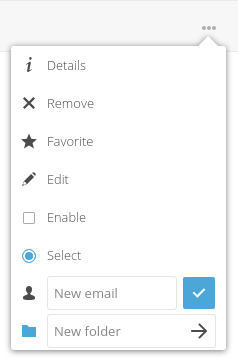
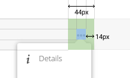

.. sectionauthor:: John Molakvoæ <skjnldsv@protonmail.com>
.. codeauthor:: John Molakvoæ <skjnldsv@protonmail.com>
..  _popovermenu:

===============
Popover Menu
===============

What is a popover menu
=======================

This is a quick menu that open on click. For menus, we use the three-dot-icon.

This is exactly the same as the :ref:`navigation menu <navigation_menu>`. The only difference is the popovermenu class.

Basic layout
=============

.. code:: html

    

        <ul>
            <li>
                <a href="#" class="icon-details">
                    Details
                </a>
            </li>
            <li>
                <button class="icon-details">
                    Details
                </button>
            </li>
            <li>
                <button>
                    
                    Details
                </button>
            </li>
            <li>
                <a>
                    
                    Details
                </a>
            </li>
        <ul>
    

Technical details
==================

* The only allowed menu items elements are **a** and **button**.
* You can mix between a and button on the same menu (in case of form or direct link) like the example above
* You need to put the entire menu just after the three dot icon ``

...

``
* You do not need JS, CSS only is ok for positioning. JS is **still** required to handle the hide/show.
* Only **one** ul is allowed.
* Only **one level** of menu is allowed.
* Every entry **needs** to have its own icon. This greatly improves the UX.
* The required **right** distance to the border (or padding, whatever you want to use) of the three-dot icon should be 14px (5 for menu margin and 6 for arrow position)

Alignment
==========
If you want to align your menu, you can add the class to the main popovermenu div.

* Center: ``menu-center``
* Left: ``menu-left``
* Right is by default
