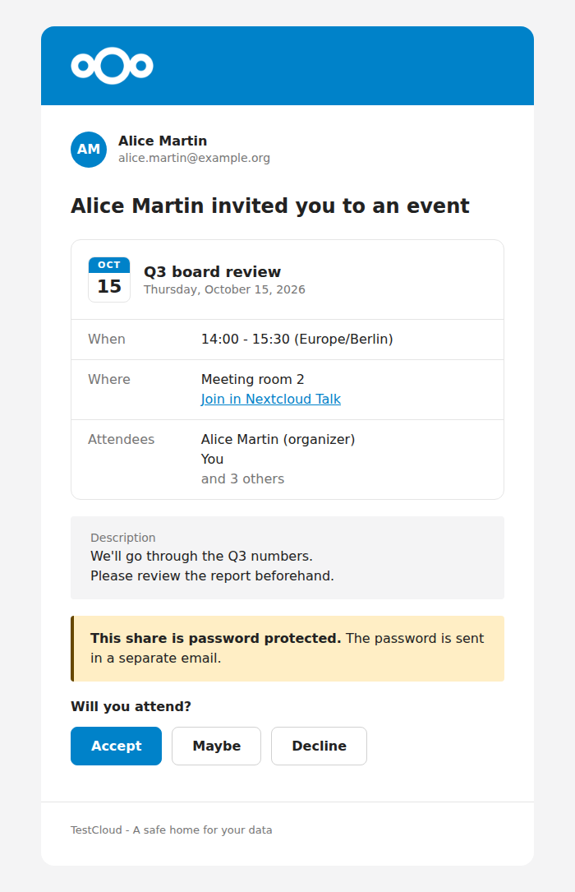

.. _email:

=====
Email
=====

Nextcloud has a mailer component to send email from an admin-defined account.

Basic usage
-----------

The mailer is hidden behind the ``\OCP\Mail\IMailer`` interface that can be :ref:`injected<dependency-injection>`:

.. code-block:: php
    :caption: lib/Service/MailService.php

    <?php

    use OCP\Mail\IMailer;

    class MailService {
        private IMailer $mailer;

        public function __construct(IMailer $mailer) {
            $this->mailer = $mailer;
        }

        public function notify(string $email): void {
            $message = $this->mailer->createMessage();
            $message->setSubject("Hello from Nextcloud");
            $message->setPlainBody("This is some text");
            $message->setHtmlBody(
                "<!doctype html><html><body>This is some <b>text</b></body></html>"
            );
            $message->setTo([$email]);
            $this->mailer->send($message);
        }
    }

Email templates
---------------

Most emails should not build their own HTML. ``IMailer::createEMailTemplate()`` returns an
``\OCP\Mail\IEMailTemplate`` that renders a themed HTML email and a matching plain text version,
with dark mode support for the mail clients that have it. Attach it to a message with
``IMessage::useTemplate()``:

.. code-block:: php

    $template = $this->mailer->createEMailTemplate('myapp.ProjectShared', [
        'project' => $projectName,
    ]);
    $template->setLanguage($l->getLanguageCode());
    $template->setSubject($l->t('%s shared a project with you', [$sharerName]));
    $template->addHeader();
    $template->addHeading($l->t('%s shared a project with you', [$sharerName]));
    $template->addBodyText($l->t('You can now see and edit the project.'));
    $template->addBodyButton($l->t('Open project'), $projectUrl);
    $template->addFooter();

    $message = $this->mailer->createMessage();
    $message->setTo([$recipientEmail]);
    $message->useTemplate($template);
    $this->mailer->send($message);

The first argument of ``createEMailTemplate()`` identifies the email (``<app>.<EmailName>``), and
the second one passes data to custom templates (see `Modifying the look of emails
<https://docs.nextcloud.com/server/latest/admin_manual/configuration_server/email_configuration.html>`_
in the administration manual).

Write the email in the recipient's language: get an ``IL10N`` for their language from
``\OCP\L10N\IFactory`` and pass its code to ``setLanguage()``. The template then sets the right
``lang`` and ``dir`` attributes, mirrors the layout for right-to-left languages like Arabic or
Hebrew, and writes the default footer in that language. Call it before ``addFooter()``.

Building blocks
^^^^^^^^^^^^^^^

Since Nextcloud 36, the template has blocks to show who an email is about, a highlighted note, a
card with details, and a row of buttons. Unlike ``addBodyText()`` with a separate plain text, these
blocks never take HTML: every value is escaped by the template, URLs included, and each block
writes its own plain text version.

   A sender, a details card, two notes and a row of buttons.

``addBodySender()``
    The person the email is sent for (sharer, organizer...), with an initials circle, their name
    and an optional second line such as their email address. Add it before the heading.

``addBodyNote()``
    A highlighted box. Use ``IEMailTemplate::NOTE_NEUTRAL`` (the default) for text written by a
    user, like a share note or an event description, with the label shown above it. Use
    ``NOTE_INFO``, ``NOTE_WARNING`` or ``NOTE_ERROR`` for messages from the server, with the label
    as a bold title. Line breaks are kept.

``addBodyDetails()``
    A card describing an item: title, subtitle, an initials circle or a calendar badge, and
    labelled rows. See below.

``addBodyButtons()``
    Any number of buttons, the first one is the primary action, with an optional question above
    them like "Will you attend?".

The details card is built with ``\OCP\Mail\EMailDetails``. Each row holds one or more parts, each
rendered on its own line: plain text, a link, or muted secondary text.

.. code-block:: php

    use OCP\Mail\EMailDetails;
    use OCP\Mail\IEMailTemplate;

    $template->addHeader();
    $template->addBodySender($organizerName, $organizerEmail);
    $template->addHeading($l->t('%s invited you to an event', [$organizerName]));

    $details = (new EMailDetails($eventTitle))
        ->setSubtitle($l->l('date', $start, ['width' => 'full']))
        ->setDateBadge($l->l('date', $start, ['width' => '~MMM']), $l->l('date', $start, ['width' => '~d']));
    $details->addRow($l->t('Where'))
        ->text($location)
        ->link($l->t('Join in Nextcloud Talk'), $talkUrl);
    $details->addRow($l->t('Attendees'))
        ->text($firstAttendee)
        ->muted($l->n('and %n other', 'and %n others', $remaining));
    $template->addBodyDetails($details);

    $template->addBodyNote($description, $l->t('Description'));
    $template->addBodyButtons([
        ['text' => $l->t('Accept'), 'url' => $acceptUrl],
        ['text' => $l->t('Decline'), 'url' => $declineUrl],
    ], $l->t('Will you attend?'));
    $template->addFooter();

Use ``setInitials($name)`` instead of ``setDateBadge()`` to show an initials circle, for example
for a conversation or a team. The badge strings are passed as is, so localize them yourself.

A short note about a shared item goes before its details card. Longer content, like an event
description, goes after it.

Footer
^^^^^^

``addFooter()`` without a text adds the default footer: the instance name and slogan, then
"This is an automatically sent email, please do not reply.". When the email has a sender block,
the second line becomes "This email was sent from <instance> on behalf of <name>." instead.
Pass a text to ``addFooter()`` to replace the default footer entirely.

Inline attachments
------------------

Inline attachments can be appended to a message with ``IMessage::attachInline``:

.. code-block:: php

    /** @var IMessage $message */
    $message->attachInline(
        "this is a test", // Body
        "test.txt",       // Name
        "text/plain"      // Content type
    );
    $this->mailer->send($message);
