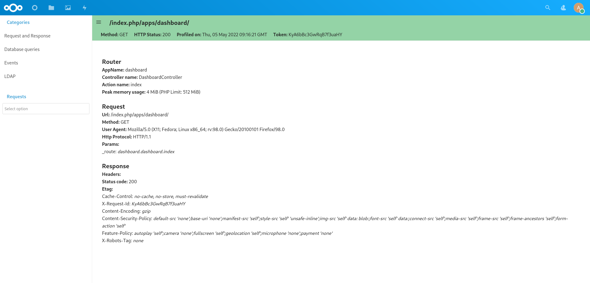
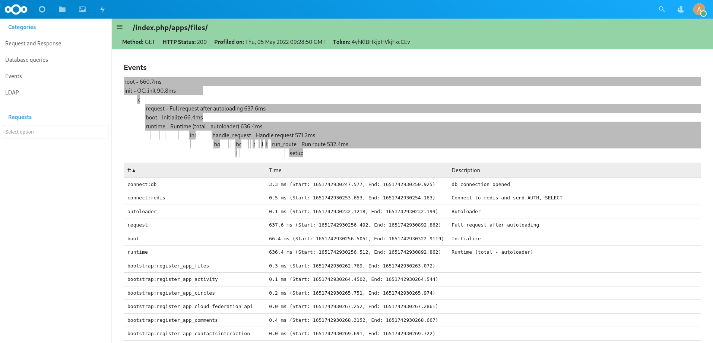
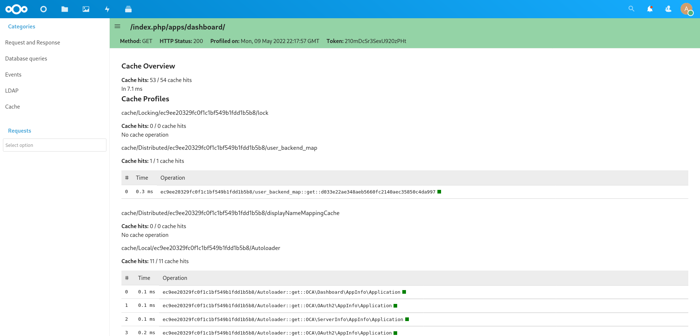

Profiler
========

Nextcloud offers a built-in profiler that can help you identifying performance issues
with your Nextcloud application. This feature is available starting from Nextcloud 24.

Get the app
-----------

The profiler application is available on `GitHub <https://github.com/nextcloud/profiler>`_
you need to clone the stableX branch if you are using Nextcloud X or master if you are
using the latest development version of Nextcloud.

.. code-block:: bash

   cd apps/
   git clone --branch stableX https://github.com/nextcloud/profiler.git
   # adapt X to your Nextcloud version: php occ version | grep -oP 'Nextcloud \K\d+'
   cd profiler
   cd ../..

Enable the app
--------------

.. warning::

   Do not run this application on production. This will slow down considerably your server
   as collection profiling information consume a lot of CPU and memory.

To enable the app, you can run the following commands:

.. code-block:: bash

   npm ci && npm run build
   occ app:enable profiler
   occ profiler:enable # This will also enable the debug mode if not already enabled

Disable the app
---------------

.. code-block:: bash

   occ profiler:disable
   occ config:system:set debug --value false --type bool # to also disable the debug mode

Using the app
-------------

When enabled, the profiler application will inject a toolbar at the bottom of the screen.
This toolbar provides you information about the current HTTP request, the time it took to
run, how many database and LDAP requests it did, how often did the cache hit and also
the toolbar track the XHR requests created by the JavaScript frontend.

.. image:: ../images/profiler-toolbar.png

You can hover on top of the toolbar information to show more detailed information and also
click on the toolbar to show all the information collected.

There is for the moment 5 views:

1. The general request and response view
2. The database queries view
3. The event view
4. The LDAP queries view
5. The cache view

The General Request and Response View
.....................................

This view gives you general information about the request. For example,
which Controller and method was used, what where the response headers, the
request parameters, ...

The Database Queries View
.........................

This view gives you a list of all the database queries done for your request and
how much time it took for the database to execute. Additionally you can also explain
the query to see if an index was used and also see the backtrace to better understand
why the query was executed.

.. image:: ../images/profiler-database.png

It's important to keep the number of queries executed to a minimum since the database
is often a limiting factor in a Nextcloud installation. In particular try to avoid the
`N+1 problem <https://stackoverflow.com/questions/97197/what-is-the-n1-selects-problem-in-orm-object-relational-mapping>`_ as this can be really slow on big Nextcloud instance and make sure that
your queries are using Database indexes when possible.

The LDAP View
.............

This view is very similar to the database queries view and display all the database
queries.

The Event View
..............

This view display all the logged events and allow you to determine in which part of the
programe the more time is spent.

The Cache View
..............

This view display all the access to the cache. It allows to detect cache hits and miss
as well as getting an idea of the time spent on Redis.

Contributing
------------

Contribution to improve the profiler are always welcome. Some future work could include
a way to display Redis queries and not only give a statistic of them. And more type of data
could be collected, e.g. HTTP requests to external APIs, IMAP call for the mail app, usage of
the mailer service, ...

To extend the profiler app, you will need to provide your own `DataCollector`.

.. code-block:: php

   <?php

   declare(strict_types=1);

   namespace OCA\MyApp\DataCollector;

   use OC\AppFramework\Http\Request;
   use OCP\AppFramework\Http\Response;
   use OCP\DataCollector\AbstractDataCollector;

   class MyAppDataCollector extends AbstractDataCollector {
       public function getName(): string {
           return 'myappcollector'; // default to the class' name
       }

       public function collect(Request $request, Response $response, \Throwable $exception = null): void {
            $this->data = [
                'mydata' => 42
           ];
       }
   }

You also need to register the `DataCollector` in your app `boot` method:

.. code-block:: php

   <?php

   declare(strict_types=1);

   class Application extends App implements IBootstrap {
       public function boot(IBootContext $context): void {
           $server = $context->getServerContainer();

           /** @var IProfiler $profiler */
           $profiler = $server->get(IProfiler::class);
           $profiler->add(new MyAppDataCollector());

You can find some examples in the `profiler app git repo <https://github.com/nextcloud/profiler/tree/master/lib/DataCollector>`_.
