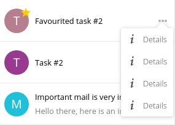

.. sectionauthor:: John Molakvoæ <skjnldsv@protonmail.com>
.. codeauthor:: John Molakvoæ <skjnldsv@protonmail.com>

=============
Content list
=============

Introduction
=============

On the main content, you may want to have a list of items displayed (like the contacts, or the mail app).
We provide a standardized structure for this specific purpose.

Basic layout
=============

.. code-block:: html

    

        

            <a href="#" class="app-content-list-item">
                <input type="checkbox" id="test1" class="app-content-list-item-checkbox checkbox" checked="checked"><label for="test1"></label>
                
C

                
Contact 1

                

            </a>
            <a href="#" class="app-content-list-item">
                

                
T

                
Favourited task #2

                

            </a>
            <a href="#" class="app-content-list-item">
                
T

                
Task #2

                

            </a>
            <a href="#" class="app-content-list-item">
                
M

                
Important mail is very important! Don't ignore me

                
Hello there, here is an important mail from your mom

            </a>
            <a href="#" class="app-content-list-item">
                
N

                
Important mail with a very long subject

                
Hello there, here is an important mail from your mom

                8 hours ago
                

            </a>
            <a href="#" class="app-content-list-item">
                
N

                
New contact

                
blabla@bla.com

                

            </a>
        

        

        

    

Rules and information
======================

* You need to have the following structure for your global content:

.. code-block:: html

    

        
HERE YOUR CONTENT LIST

        
HERE YOUR GLOBAL CONTENT

    

* The first code/screenshot example show all the combination allowed/available.
* When displaying the checkbox, the star will automatically be hidden.
* The checkboxes are hidden by default. They're shown when checked or when hover/focus/active
* If you want to show **all** the checkboxes, apply the ``selection`` class to the ``app-content-list``.
* You can **NOT** have more than one button in an entry. You need to create a :ref:`popover menu <popovermenu>` if multiple options are needed.
   * In case of a popovermenu, see the :ref:`popover menu <popovermenulist>`.
   * As always, the **JS** is still needed to toggle the ``open`` class on this menu
* If you use the ``app-content-list`` standard, the ``app-content-details`` div will be hidden in mobile mode (full screen).
  You will need to add the ``showdetails`` class to the ``app-content-list`` to show the main content. 
  On mobile view, the whole list/details section (depending on which is shown) will scroll the body.

.. _popovermenulist:

Popovermenu in item
====================

If you need a menu inside an item, you need to wrap it with the ``icon-more`` ``div`` inside a ``app-content-list-menu`` div.

.. code-block:: html

    

        

        

            <ul>
                <li>
                    <a href="#" class="icon-details">
                        Details
                    </a>
                </li>
                <li>
                    <button class="icon-details">
                        Details
                    </button>
                </li>
                <li>
                    <button>
                        
                        Details
                    </button>
                </li>
                <li>
                    <a>
                        
                        Details
                    </a>
                </li>
            </ul>
        

    

