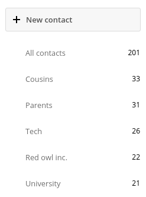
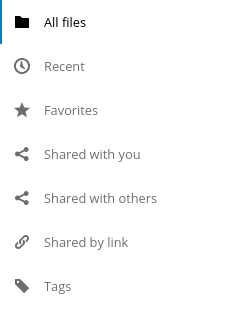
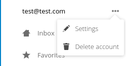
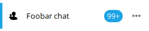
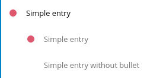
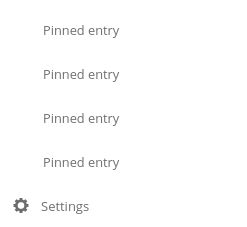

.. sectionauthor:: John Molakvoæ <skjnldsv@protonmail.com>
.. codeauthor:: John Molakvoæ <skjnldsv@protonmail.com>

===============
Introduction
===============

The navigation section of any Nextcloud app is the left sidebar.
It is basically composed of

* a primary action button
* a menu
* a settings area

The primary action button and the settings area are optional.

===============
New button
===============

Introduction
-------------

A primary action button is just a stylised button located above the navigation part of your app.
The goal is to have an homogeneity of design across all apps using this button.

Basic layout
-------------

.. code-block:: html

    

        

            <button type="button" class="icon-add">
                Add user
            </button>
        

        <!-- Your navigation here -->
        <!-- Your settings here -->

    

Rules
------

* Stay simple, don't use overcomplicated text in this button.
* Avoid using sentences longer than one line.
* Do not edit the styling of this button.
* Only **one** button is allowed here.

..  _appnavigation:

=====================
App navigation menu
=====================

Introduction
------------

The main navigation menu represents the main navigation of your app.

It needs to be:

* Organised
* Simple
* Responsive

Nextcloud provides a very organized way of building menus.
We implemented various essential functions and provide easy way of using them.

Basic layout
------------

.. code-block:: html

    

        <!-- Your primary action button here -->

        <ul>
            <li><a href="#">First level entry</a></li>
            <li>
                <a href="#">First level container</a>
                <ul>
                    <li><a href="#">Second level entry</a></li>
                    <li><a href="#">Second level entry</a></li>
                </ul>
            </li>
        </ul>

        <!-- Your settings here -->

    

Basic rules
-----------

* You can **not** change the default padding of the navigation elements.
* We encourage you to add icons on every top-level item of your navigation for accessibility.
* Do **not** override the default structure and/or CSS. Everything has been carefully tuned.

Utils: menu, counter & buttons
------------------------------

Each entry is allowed to have a counter and/or a button for user interaction.

* The ``app-navigation-entry-utils`` snippet need to be placed right next to the main link of your entry.
* Maximum **two** items are allowed into the utils section. You can have:
    * Two :ref:`buttons <navigation_buttons>`
    * One :ref:`button <navigation_buttons>` and one :ref:`button <navigation_counter>`
* You **can't** have more than two buttons, if you need more, you need to add a menu.
* The order of the button and the counter are **not** interchangeable. You need to put the counter before the menu.

.. code-block:: html

    

        <ul>
            <li class="app-navigation-entry-utils-counter">1</li>
            <li class="app-navigation-entry-utils-menu-button">
                <button></button>
            </li>
        </ul>
    

.. _navigation_menu:

Menu
^^^^

If you need to add a few interactions for your entry, you can put everything in a popover menu.
The menu needs to be placed after the ``app-navigation-entry-utils``.

For the global rules and/or layout, you can check the dedicated :ref:`popover menu section <popovermenu>`.

.. code-block:: html

    

        <ul>
            <li>
                <a href="#">
                    
                    Add
                </a>
            </li>
            <li>
                <a href="#">
                    
                    Edit
                </a>
            </li>
            <li>
                <a href="#">
                    
                    Remove
                </a>
            </li>
        </ul>
    

The menu is hidden by default and has to be triggered by adding the ``open`` class to the ``app-navigation-entry-menu`` div.
In case of AngularJS the following small directive can be added to handle all the display and click logic out of the box:

.. code-block:: js

    app.run(function ($document, $rootScope) {
        'use strict';
        $document.click(function (event) {
            $rootScope.$broadcast('documentClicked', event);
        });
    });

    app.directive('appNavigationEntryUtils', function () {
        'use strict';
        return {
            restrict: 'C',
            link: function (scope, elm) {
                var menu = elm.siblings('.app-navigation-entry-menu');
                var button = $(elm)
                    .find('.app-navigation-entry-utils-menu-button button');

                button.click(function () {
                    menu.toggleClass('open');
                });

                scope.$on('documentClicked', function (scope, event) {
                    if (event.target !== button[0]) {
                        menu.removeClass('open');
                    }
                });
            }
        };
    });

.. _navigation_counter:

Counter
^^^^^^^

If you need to add a counter to your menu entry, you can simply use this structure.
Do not change the alignment of the text. If you're using

.. code-block:: html

    <li class="app-navigation-entry-utils-counter">1</li>

The counter should be limited to 999 and turn to 999+ if any higher number is given. If AngularJS is used the following filter can be used to get the correct behavior:

.. code-block:: js

    app.filter('counterFormatter', function () {
        'use strict';
        return function (count) {
            if (count > 999) {
                return '999+';
            }
            return count;
        };
    });

Use it like this:

.. code-block:: html

    <li class="app-navigation-entry-utils-counter">{{ count | counterFormatter }}</li>

Highlighted counter
"""""""""""""""""""

The counter can also be highlighted to attract some focus, e.g. for unread chat messages

.. code-block:: html

    <li class="app-navigation-entry-utils-counter highlighted">99+</li>

.. _navigation_buttons:

Buttons
^^^^^^^

The same way we display the menu three-dot-icon button, you're allowed to use up to 2 buttons in a single entry.

* The icon class goes directly on the ``button`` element.
* If no class is set, the three-dot-icon will be used by default

.. code-block:: html

    

        <ul>
            <li class="app-navigation-entry-utils-menu-button">
                <button class="icon-edit"></button>
            </li>
            <li class="app-navigation-entry-utils-menu-button">
                <button class="icon-delete"></button>
            </li>
        </ul>
    

Drag and drop
-------------

The class which should be applied to a first level element **li** that hosts or can host a second level is **drag-and-drop**.
This will cause the hovered entry to slide down giving a visual hint that it can accept the dragged element.
In case of jQuery UI's droppable feature, the **hoverClass** option should be set to the **drag-and-drop** class.

.. code-block:: html

    

        <ul>
            <li><a href="#">First level entry</a></li>
            <li class="drag-and-drop">
                <a href="#" class="icon-folder">Folder name</a>
                <ul>
                    <li><a href="#">Folder contents</a></li>
                    <li><a href="#">Folder contents</a></li>
                </ul>
            </li>
        </ul>
    

Collapsible entry
-----------------

By default, all sub-entries are shown.
This behavior can be changed by creating a collapsible menu.
This way, the menu will be hidden and an arrow will be added in in front of it (replacing the icon if any).

The opening of the menu is activated and animated by the class ``open`` on the main ``li``.

* You can **not** have a collapsible menu on a sub-item, this can only exist on a top-level element.
* You can set the open class by default if you want.
* Do **not** use the collapsible menu if your element does not have sub-items.
* You **still** need to use JS to handle the click event.

.. IMPORTANT::
    * If your top-level link is only used as a header, the **entire** ``a`` needs to be used to toggle the ``open`` class.
    * If your top-level link is used to redirect the user or to trigger something else, you **need** to add the collapsible button and use it as the ``open`` class toggle trigger.

.. figure:: ../images/navigation-collapsible.*
   :alt: Collapsible navigation entry
   :figclass: figure-with-code

.. code-block:: html

    <li class="collapsible open">

        <!-- This is optional -->
        <button class="collapse"></button>

        <a href="#" class="icon-folder">Folder collapsed menu</a>
        <ul>
            <li><a href="#">Simple entry</a></li>
            <li><a href="#">Simple entry</a></li>
            <li><a href="#">Simple entry</a></li>
            <li>
                <a class="icon-folder" href="#">Simple folder</a>
            </li>
        </ul>
    </li>

Entry bullet
------------

Every entry can have a colored marker in front of it.
We call it a `bullet`.

* You can **not** combine an icon with a bullet.
* You need to use the CSS to define the bullet color.

.. code-block:: html

    <li>
        

        <a href="#">Entry with bullet</a>
    </li>

Undo entry
----------

* Undo entries can be used on any level you want.
* When an entry is deleted, please use the usual **7 seconds delay feedback** before final deletion.
* Please use the sentence *Deleted XXXX* as the feedback message.
* You need to use the ``deleted`` class to trigger the animated hide/show of the undo entry.

.. figure:: ../images/navigation-undo.*
   :alt: Navigation entry with undo action
   :figclass: figure-with-code

.. code-block:: html

    <li class="deleted">
        <a href="#" class="hidden">Important entry</a>
        

            <ul>
                <li class="app-navigation-entry-utils-menu-button">
                    <button class="icon-delete"></button>
                </li>
            </ul>
        

        

            
Deleted important entry

            <button class="app-navigation-entry-deleted-button icon-history" title="Undo"></button>
        

    </li>

Edit entry
----------

* Editable entries can be used on any level you want.
* You can replace the ``form`` by a ``div`` if you wish to do your request with JS.
* You need to use the ``editing`` class to trigger the animated hide/show of the input.
* You're allowed to use only one submit input. It **must** be the validation button.
* The input **must** have the same value as the entry link text.

.. figure:: ../images/navigation-edit.*
   :alt: Editable navigation entry
   :figclass: figure-with-code

.. code-block:: html

    <li class="editing">
        <a href="#" class="icon-folder">Folder entry</a>
        

            <ul>
                <li class="app-navigation-entry-utils-menu-button">
                    <button class="icon-rename"></button>
                </li>
            </ul>
        

        

            <form>
                <input type="text" value="Folder entry">
                <input type="submit" value="" class="icon-close">
                <input type="submit" value="" class="icon-checkmark">
            </form>
        

    </li>

Pinned entry
------------

Every top-level entry can be `pinned` at the bottom.

* All the pinned entries can be mixed between non-pinned entries.
* All the pinned entries **must** have the ``pinned`` class.
* The **first** pinned entry **must** also have the ``first-pinned`` class.

.. code-block:: html

    <ul>
        <li><a href="#">Non-pinned entry</a></li>
        <li><a href="#">Non-pinned entry</a></li>
        <li class="pinned first-pinned">
            <a href="#">Pinned entry</a>
        </li>
        <li class="pinned"><a href="#">Pinned entry</a></li>
        <li><a href="#">Non-pinned entry</a></li>
        <li><a href="#">Non-pinned entry</a></li>
        <li class="pinned"><a href="#">Pinned entry</a></li>
        <li class="pinned"><a href="#">Pinned entry</a></li>
    </ul>

Various information
-------------------

* You can add the ``icon-loading-small`` class to any ``li`` element to set it in a `loading` state.
* Every element as a ``min-height`` of 44px as that is the minimum recommended touch target. It also helps with clickability and separation on desktop environments.

=========
Settings
=========

Introduction
-------------

To create a settings area create a div with the id ``app-settings`` inside the ``app-navigation`` div.

* The data attribute ``data-apps-slide-toggle`` slides up a target area using a jQuery selector and hides the area if the user clicks outside of it.
* Max height of the settings area is 300px. Do **not** change that.
* Keep it clear, organized and simple.

Basic layout
-------------

.. figure:: ../images/settings.*
   :alt: Settings
   :figclass: figure-with-code

.. code-block:: html

    

        <!-- Your primary action button here -->
        <!-- Your navigation here -->

        

            

                <button class="settings-button"
                        data-apps-slide-toggle="#app-settings-content">
                    Settings
                </button>
            

            

                <!-- Your settings content here -->
            

        

    

