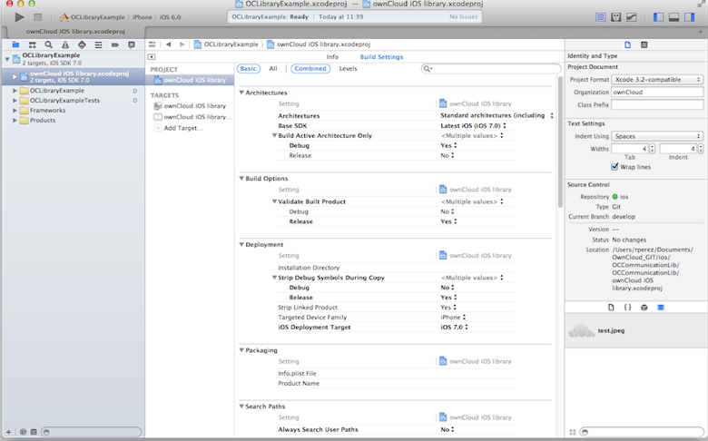
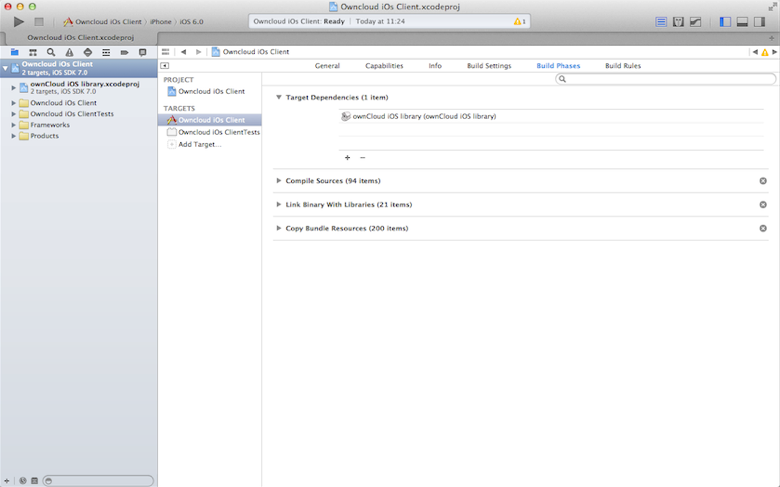
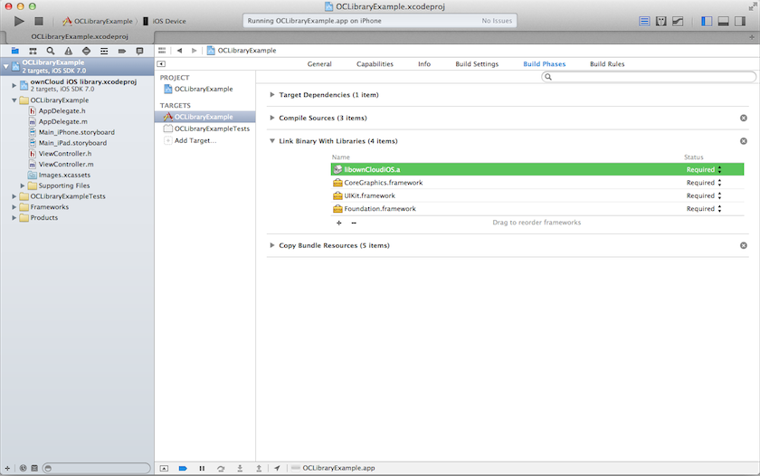
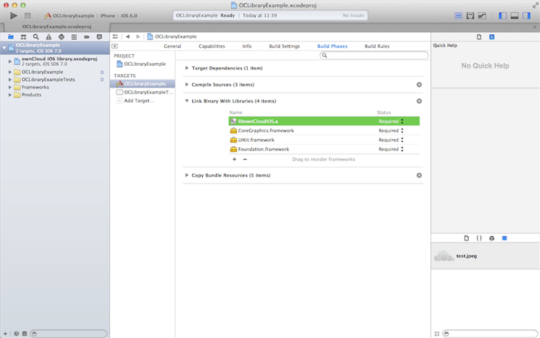
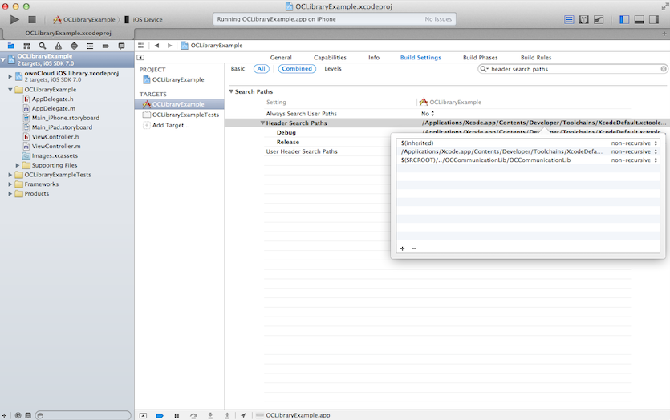
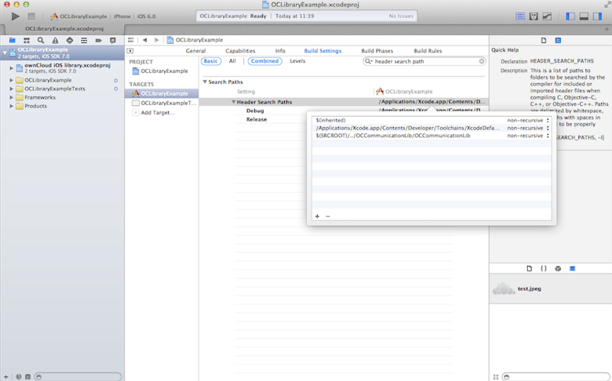
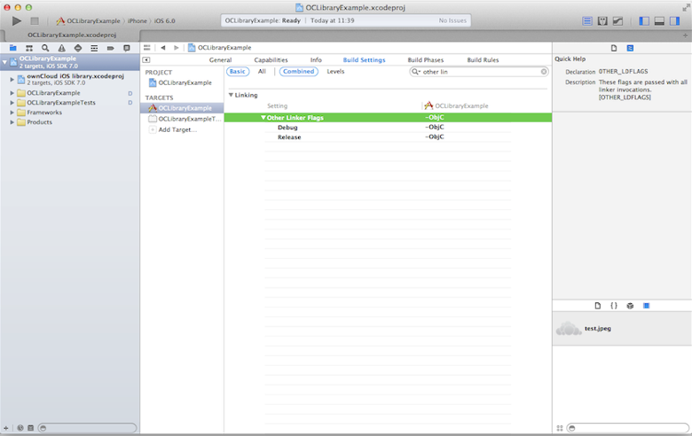

Library Installation
====================

Obtaining the library
---------------------

The ownCloud iOS library may be obtained from the following Github repository:

`git@github.com:owncloud/ios-library.git
<mailto:git@github.com:owncloud/ios-library.git>`_

Once obtained, this code should be compiled with Xcode 6.  The Github
repository not only contains the library, ownCloud iOS library, but also
contains a sample project, OCLibraryExample, which will assist in learning how
to use the library.

Add the library to a project
----------------------------

There are two methods to add this library to a project.

* Reference the headers and library binary file (``.a``) directly.
* Include the library as a subproject.

Which method to choose depends on user preference as well as whether the source
code and project file of the static library are available.

Reference headers and library binary files
~~~~~~~~~~~~~~~~~~~~~~~~~~~~~~~~~~~~~~~~~~

Follow these steps if this is the desired method.

1. Compile the ownCloud iOS library and run the project.  A ``libownCloudiOS.a``
file will be generated.

The following files are required:

**Library file**

* ``libownCloudiOS.a`` (Library)

**Library Classes**

*   ``OCCommunication.h`` (Accessors) Import in the communication class
*   ``OCErrorMsg.h`` (Error Messages) Import in the communication class
*   ``OCFileDto.h`` and ``OCFileDto.m`` (File/Folder object) Import when using
*   ``readFolder`` and ``readFile`` methods
*   ``OCFrameworkConstants.h`` (Customize constants)

2.  Add the library file to the project.  From the “Build Phases” tab, scroll
to “Link binary files” and select the ‘+’ to add a library.  Select the library
file.

|10000201000003480000020EC688993D_png|

3.  Add the path of the library header files.  Under the “Build Settings” tab,
select the target library and add the path in the “Header Search Paths” field.

|10000201000003430000020C65A3C5A7_png|

4.  Remaining in the “Build Setting” tab, add the flag ``-Obj-C`` under the
“Other Linker Flags” option.

|100002010000034700000211B6BE4A2B_png|

At this stage, the library is included on your project and you can start
communicating with the ownCloud server.

Include the library as a subproject
~~~~~~~~~~~~~~~~~~~~~~~~~~~~~~~~~~~

Follow these steps if this is the desired method.

5. Add the file ``ownCloud iOS library.xcodeproj`` to the project via drag and
drop.

|100000000000030C000001E61DFDBF76_png|

6. Within the project, navigate to the “Build Phases” tab.  Under the “Target
Dependencies” section, select the ‘+’ and choose the library target.

|100000000000030C000001E7A7A01884_png|

7.  Link the library file to the project target.  Under the “Build Phases” tab,
select the ‘+’ under the “Link Binary with Libraries” section and select the
library file.

|100000000000030C000001E8AB4C3306_png|

8.  Add the flag ``-Obj-C`` to “Other Linker Flags” under the project target on
the “Build Settings” tab.

|100000000000030C000001ECB85120C2_png|

9.  Finally add the path of the library headers.  Under the “Build Settings”
tab, add the path under the “Header Search Paths” option.

|100000000000030C000001E637605044_png|

Sources
-------

* `Creating a static library in iOS tutorial (raywenderlich.com)`_
* `Apple iOS static library documentation`_

.. |100002010000034700000211B6BE4A2B_png| image:: images/100002010000034700000211B6BE4A2B.png
 :width: 16.261cm
 :height: 10.246cm

.. _`Creating a static library in iOS tutorial (raywenderlich.com)`: http://www.raywenderlich.com/41377/creating-a-static-library-in-ios-tutorial
.. _`Apple iOS static library documentation`: https://developer.apple.com/library/ios/technotes/iOSStaticLibraries/Articles/configuration.html#/apple_ref/doc/uid/TP40012554-CH3-SW2
