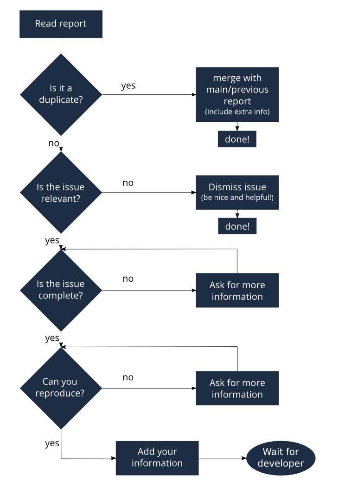

======================
Nextcloud bug triaging
======================

.. toctree::
   :maxdepth: 2
   :hidden:

Bug Triaging is the process of checking bug reports to see if they are still valid (the problem might be solved since the bug was reported), reproducing them when possible (to make sure it really is a Nextcloud issue and not a configuration problem) and in general making sure the bug is useful for a developer who wants to fix it. If the bug is not useful and can't be augmented by the original reporter or the triaging contributor, it has to be closed.

Why do you want to join
-----------------------

Helping to bring the number of issues down makes it easier for developers to spend their time productively and bug triagers thus **contribute greatly to Nextcloud development**! Triaging a bug doesn’t take long so the work comes in small chunks and you don’t need many skills, just some patience and sometimes perseverance.

Bug triagers who contribute significantly should ask to be listed as an active contributor on the `nextcloud.com <https://nextcloud.com>`_ page!

How do you triage bugs
----------------------

The process of checking, reproducing and closing invalid issues is called ‘bug triaging‘. Issues can be divided in one of three kinds:

1. Bugs or feature requests which come with all needed information to allow a developer to fix or work on them
2. Incomplete or duplicate bug reports or feature requests
3. Irrelevant or wrong bug reports or feature requests

The job of a bug triager is to identify the One’s for developers to look at, help remove, merge or improve any Two to a One and dismiss Three’s in a friendly and emphatic way.

Triaging follows these steps:

* Find an issue somebody should look at
* Be that somebody and see if the issue content is useful for a developer
* Reply and close, ask a question, add information or a label
* Find the next bug-to-be-dealt-with and repeat!

General considerations
----------------------

* You need a `GitHub account <https://github.com>`_ to contribute to bug triaging.
* If you are not familiar with the GitHub issue tracker interface (which is used by Nextcloud to handle bug reports), you `may find this guide useful <https://guides.github.com/features/issues/>`_.
* You will initially only be able to comment on issues. The ability to close issues or assign labels will be given liberally to those who have shown to be willing and able to contribute.
* Read `our bug reporting guidelines <https://github.com/nextcloud/server/blob/master/CONTRIBUTING.md#submitting-issues>`_ so you know what a good report should look like and where things belong. The `issue template <https://raw.github.com/nextcloud/server/master/issue_template.md>`_ asks specifically for some information developers need to solve issues.
* It might even be fixed, sometimes! It can also be fruitful to contact the developers. Tell them you're triaging bugs and share what problem you bumped into.
* To ensure no two people are working on the same issue, we ask you to simply add a comment like "I am triaging this" in the issue you want to work on, and when done, before or after executing the triaging actions, note similarly that you're done.

    To be able to tag and close issues, you need to have access to the repository. For the core and sync app repositories this also means having signed the contributor agreement. However, this isn't really needed for triaging as you can comment after you're done triaging and somebody else can execute those actions.

Finding bugs to triage
----------------------

GitHub offers several search queries which can be useful to find a list of bugs which deserve a closer look:

* `The bugs least recently commented on <https://github.com/search?q=is%3Aissue+user%3Anextcloud+is%3Aopen+sort%3Aupdated-asc+is%3Apublic+>`_
* `Least commented issues <https://github.com/search?q=is%3Aissue+user%3Anextcloud+is%3Aopen+no%3Aassignee+no%3Amilestone+no%3Alabel+sort%3Acomments-asc+>`_
* `Bugs which need info <https://github.com/search?q=is%3Aissue+user%3Anextcloud+is%3Aopen+label%3A%22Needs+info%22+sort%3Acreated-asc+>`_

But there are more methods. For example, if you are a user of Nextcloud with a specific setup like using nginx as Web server, a custom external storage or using the encryption app, you could look for bugs with these keywords. You can then use your knowledge of your installation and your installation itself to see if bugs are (still) valid or reproduce them.

Once you have picked an issue, add a comment that you've started triaging:

    "I am triaging this bug"

Checking if the issue is useful
-------------------------------

Much content from https://community.kde.org/Guidelines_and_HOWTOs/Bug_triaging

The goal of triaging is to have only useful bug reports for the developers. And you don't have to know much to be able to judge at least some bug reports to be less than useful. There are duplications, incomplete reports and so on. Here is the work flow for each bug:

Let's go over each step.

Finding duplicates
^^^^^^^^^^^^^^^^^^

To find duplicates, the search tool in GitHub is your first stop.
In `this screen <https://github.com/nextcloud/server/issues>`_ you can easily search for a few keywords from the bug report.
If you find other bugs with the same content, decide what the best bug report is (often the oldest or the one where one or more developers have already started to engage and discuss the problem).
That is the 'prime' bug report, you can now close the other one (or comment that it can be closed as duplicate).

If the bug report you were reviewing contains additional information, you can add that information to the 'prime' bug report in a comment.
Mention this bug report (using #<bug report number>) so a developer can look up the original, closed, report and perhaps ask the initial reporter there for additional information.

If you can't find anything, look in closed bug reports.
The problem might be solved already and be listed there!
Of course, these other bug reports might be closed as duplicates of the one you are looking at now - if you can't find one that is solved nor can find any duplicates, you can move on to the next step.
If you are unsure, just add a comment: "might be a duplicate of #<bug nr here>" will usually suffice.

When the issue is a feature request, you can be helpful in the same way: merge related requests by adding information of one to the other and closing the first.

.. note:: Be polite: when you need to request information or feedback be clear and polite, and you will get more information in less time. Think about how you'd like to be treated, were you to report a bug!
.. note:: You can answer more quickly and friendly using one of `these templates <https://gist.github.com/jancborchardt/6155185#clean-up-inactive-issues>`_. 
.. note:: Often our GitHub issue tracker is a place for discussions about solutions. Be friendly, inclusive and respect other people's position.

Determining relevance of issue
^^^^^^^^^^^^^^^^^^^^^^^^^^^^^^

Not all issues are relevant for Nextcloud. Bugs can be due to a specific configuration or unsupported platforms. Raspberry Pi's suffer from SQLite time-outs, nginx has problems Apache doesn't and Microsoft Server with IIS is not well supported. While external issues are not always a reason to close a report, be sure that they are clear: does the user use the 'standard' platform? Ask for information if this is missing.

Last but not least, the problem might be due to the user doing something that simply does not work. Your general Nextcloud knowledge might be helpful here - if this is the case, you can often swiftly close the issue with a comment about what went wrong.

.. note:: You might have to say no to some requests, for example when a problem has been solved in a new release but won't become available for the release the reporter is using; or when a solution has been chosen which the reporter is unhappy about. Be considerate. People feel surprisingly strong about Nextcloud, and you should take care to explain that we don't aim to ignore them; on the contrary. But sometimes, decisions which benefit the majority of users don't help an individual. The extensibility and open availability of the code of Nextcloud is here to relieve the pain of such decisions.

Determining if the report is complete
^^^^^^^^^^^^^^^^^^^^^^^^^^^^^^^^^^^^^^

Now that you know that the bug report is unique, and that is not an external issue, you need to check all the needed information is there.

Check `our bug reporting guidelines <https://github.com/nextcloud/server/blob/master/CONTRIBUTING.md#submitting-issues>`_ and make sure bug reports comply with it! The information asked in the `issue template <https://raw.github.com/nextcloud/server/master/issue_template.md>`_ is needed for developers to solve issues.

Once you added a request for more information, add a #needinfo tag.

If there has been a request for more information on the report, either by you, a developer or somebody else, but the original reporter (or somebody else who might have the answer) has not responded for 1 month or longer, you can close the issue. Be polite and note that whoever can answer the question can re-open the issue!

Reproducing the issue
^^^^^^^^^^^^^^^^^^^^^

An important step of bug triaging is trying to reproduce the bugs, this means, using the information the reporters added to the bug report to force (recreate, reproduce, repeat) the bug in the application.

This is needed in order to differentiate random/race condition bugs of reproducible ones (which may be reproduced by developers too; and they can fix them).

If you can't reproduce an issue in a newer version of Nextcloud, it is most likely fixed and can be closed. Comment that you failed to reproduce the problem, and if the reporter can confirm (or doesn't respond for a long time), you can close the issue. Also, be sure to add what exactly you tested with - the Nextcloud Master or a branch (and if so, when), or did you use a release, and if so - what version?

Finalizing and tagging
^^^^^^^^^^^^^^^^^^^^^^

Once you are done reproducing an issue, it is time to finish up and make clear to the developers what they can do:

* If it is a genuine bug (or you are pretty sure it is) add the 'bug' label.
* If it is a genuine feature request (or you are pretty sure it is) add the 'enhancement' label.
* If the issue is clearly related to something specific, set the specific feature label and @mention a maintainer

Now, the developers can pick the issue up. Note that while we wish we would always pick up and solve problems promptly, not all areas of Nextcloud get the same amount of attention and contribution, so this can occasionally take a long time.

**Credit:** this document is in debt to the extensive `KDE guide to bug triaging <https://community.kde.org/Guidelines_and_HOWTOs/Bug_triaging>`_.

