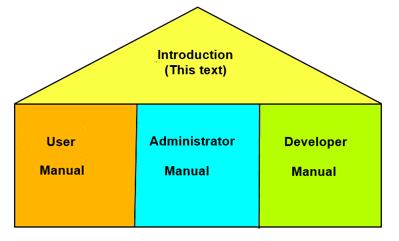
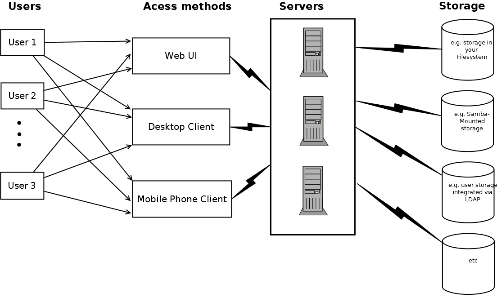
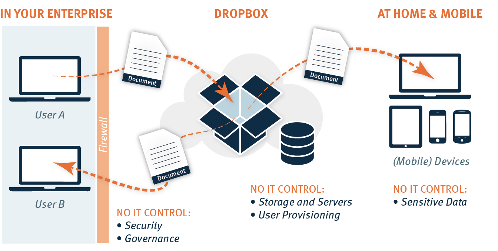
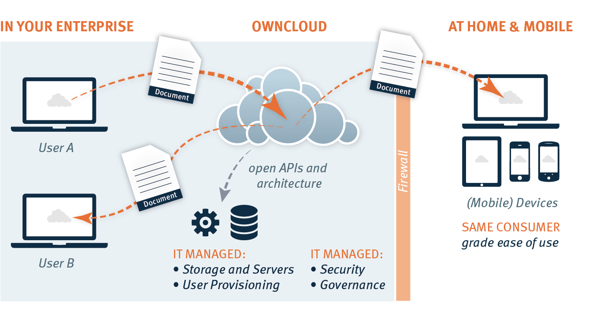
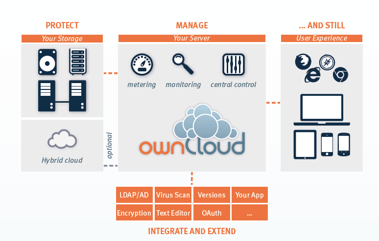
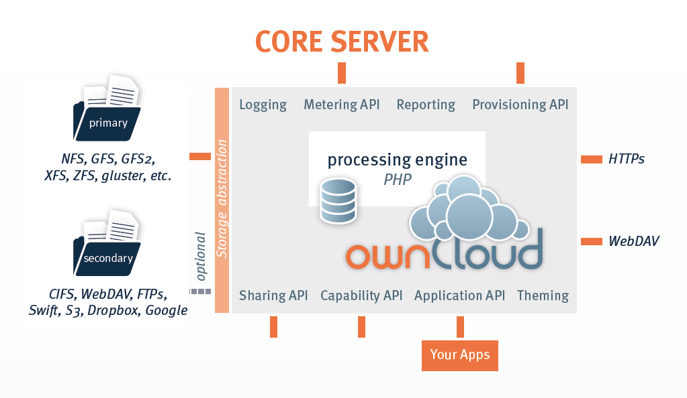
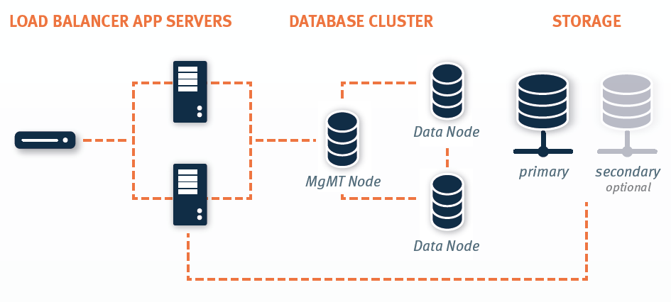

Welcome to ownCloud
===================
If you are new to ownCloud, then this document is a good place to start. This document describes the core features and architecture of the ownCloud solution at a very high level. As depicted below, this is simply an introduction, that provides the basic knowledge you need before digging into the more complex technical documentation:

There are three roles associated with ownCloud:

* User
* Administrator
* Developer

These roles may be contained in one person, but the document refers to these roles separately to make it easier to understand. The installation can be easily installed for a single user system, and also for a complex enterprise web application implementation. 
You may want to supply all three mentioned as one person, which is yourself. Of course this text refers also to users, that want to have their stuff hosted by a local institution having its own administrator(s) and developer(s)

Motivation
==========
The most common use case for ownCloud is as a replacement for consumer cloud based sync and share services, such as DropBox and Google Drive. This means that a user wants to:

* Share files with a group, other uses on the system and / or third parties
* Syncing defined files from the local filesystem to a server automatically
* Syncing defined files from a mobile device to a server automatically
* access files from any machine with any browser any time
Users may also want to specify certain groups of users, which have different authorization to see or share different parts of this online storage. 
By hosting ownCloud, the users of the system own their data.

A quick overview over the ownCloud setting
==========================================
In Figure2 you can see a very abstract scheme of ownCloud:

From left to right:

* Users connect to the system with mobile devices, web browsers, desktop sync clients and also standard WebDAV clients.  These connections show a user's files, and the files shared with the user in one convenient interface.
* Server host the ownCloud application, manage files actions and provide processing for actions called by user. The storage and the access-control is provided by our webserver, having ownCloud software installed, to the internet. All data can be found at a specified point of your webadress (e.g. http://yourserver.org/yourstorage).
* A variety of storage systems can be used by the server to store user files.  This can be everything from an object store or cloud storage system to locally attached storage and SANs.

The next section highlights why many of our customers use the ownCloud solution.

The „Dropbox Problem“
=======================
Employees are using cloud-based services to share sensitive company data with vendors, customers and partners. They are syncing data to their personal devices and home computers, all in an effort to get their job done faster and easier, and all without IT‘s permission. Consumer cloud-based file sharing services have your sensitive company data stored on servers outside of your control, outside of your policy and regulatory guidelines – maybe even outside your country – and not managed by you. The potential for data leakage, security breeches and harm to the business is enormous.
Figure3 shows a typical dropbox-constellation, that leads to the anomalies, mentioned in the picture and described below.

  
1.  **No IT control:** data is no longer under your control
2.  **Security:** the fact, that you see a file or  a directory at one place does not mean, that it physically resides at this one place. It can be spread over different storage, even over different machines, which are owned by anyone else.
3.  **Governance/User provisioning:** anyone may establish a piece of storage anywhere and use it for company-purposes. Due to this no administrator has an overview, what data exists at all and can therefore not decide, wich general rights shall be given to whom, to make the data  effectively  useable.
4.  **Sensitive data/ data loss:** the data may be no longer accessible for a company, if the employee, which created the dropbox-space, quits the company. It is very likely, that this data is never deleted later on. So your data persists at places anywhere inside the internet-cloud and you have no access any longer.

ownCloud in Action 
==================
Figure4 shows how ownCloud prevents this problems:

  
1.    **Protection and management:** sensitive data remains on-site: This means, that for storage purposes you use your own hardware, your own servers and mange it to your policies.
2.    **Integration:** integrate data-accsess seamlessly into existing infrastructure.**
3.    **Extension:** extend functionality through extensive APIs.
4.    **Easy to use access:** still consumer-grade services are implemented.

Basic Requirements
==================
Software, that you need to have at least on your sever before you can install/use ownCloud:

* A Server-computer, running a common operation system
* A Database Server (e.g. MySQL)
* a webserver (e.g. apache)
* PHP

A closer look to Solution Architecture Overview 
===============================================
The core of the ownCloud solution is the ownCloud server. Unlike consumer cloud-based services and other applications with third-party storage, ownCloud‘s server enables IT to protect and manage every element associated with ownCloud on-site from file storage to user provisioning and data processing. ownCloud monitors every activity that occurs, and logs these activities into a file for later auditing and analysis. The server provides a secure web portal through which the entire system is controlled by the administrator, providing the ability to enable and disable features, set policies, create backups and manage users. The server also manages and secures API access to ownCloud, while providing the internal processing engine needed to deliver file sync and share. 
The ownCloud server stores user files in standard file system formats, and can use most file systems. With ownCloud, if you can mount storage on your server, ownCloud can use it. Practically, this means just about any standard file system and storage device combination can be used – ownCloud is file system and storage agnostic. The storage can be physically located in your data center (or be “mounted” to third-party storage), enabling you to protect your files as you would any other element of your infrastructure, from standard backups and intrusion detection, to log managers and Data Loss Prevention (DLP) solutions. 
It is simple to Integrate ownCloud with existing IT infrastructure through the use of plug-in applications. These plug-ins can be enabled through the server control panel, provide functionality such as Active Directory (AD) and Lightweight Directory Access Protocol (LDAP) integration for user account provisioning and authentication. If an integration is not included out of the box, it is simple to extend ownCloud through open APIs and plug-in applications. Features such as the online text editor, virus scanner, and file versioning are included in ownCloud and other applications, such as the enhanced logging and audit plug-ins, are available to our customers. ownCloud customers have integrated a wide variety of new functionality into ownCloud, from training video streaming to contact and calendar syncing, custom authentication mechanisms, automated Optical Character Recognition back ends, and API-based storage. In short, unlike our competitors, ownCloud can be easily extended to do far more than basic file sync and share.

  
While ownCloud provides the ability to manage and protect, integrate and extend file sync and share in the enterprise, ownCloud still provides the core file sync and share functionality that users demand. Simple, web-based access through a standard browser to access, share, rollback and manage files is critical to satisfy users and remain in control of sensitive data. ownCloud also offers access to browse, download, edit, and upload files while on a mobile device or tablet, and the desktop client, which automatically syncs the latest files with the server. ownCloud also provides the ability for standard WebDAV clients to access ownCloud files, enabling users to continue to use standards-based productivity tools to access their files in addition to the standard ownCloud access tools.

Server Architecture Overview
============================
At its core, ownCloud is a web application, written in PHP, running on top of a webserver such as IIS, if on Windows or Apache, if on Linux. This PHP application manages every other aspect of ownCloud, from user management to plug-ins, file sharing and storage. Attached to the PHP-application is a database, where ownCloud stores users, user-shared file details, plug-in application states, and the ownCloud file cache to accelerate access to files. As ownCloud accesses the database through an abstraction layer, support is provided for Oracle, MySQL, MS-SQL Server, Postgres and SQLite. Complete webserver logging is provided via the webserver logs, and user and system logs are provided in a separate ownCloud log, or can be configured to a syslog log file.
To make it possible to access and use many different types of storage, ownCloud has a built-in storage abstraction layer. As a result, ownCloud can leverage just about any storage protocol that can be mounted on your ownCloud server – from CIFS, NFS and GFS2, to cluster file systems like Gluster. Other optional storage can also be mounted on the system using an optional external file system application, enabling admins and users to mount FTPs, WebDAV, CIFS and even external cloud storage services S3, Swift, Google Drive and Dropbox if desired. Individual users can also be configured to have dynamically allocated storage locations, depending on their user directory entries – enabling data segregation and basic multi-tenancy.

Integration of other systems or components
==========================================
  
** ownCloud includes also a variety of open APIs for integrating with other systems such as:**

**External provisioning:**

Provides the ability to add and remove users remotely, and enables admins to query metering information about ownCloud storage usage and quota. 

**Applications:**

The most powerful API, enabling customers to expand ownCloud out of the box, to integrate with existing infrastructure and systems, and to create new plug-in applications. Examples of this API in use include the custom authentication back ends, music and video streaming applications, a bit.ly inspired app called shorty, and an image preview application.

**Capability:**

Offers information about the installed ownCloud capabilities, so that ownCloud and third party applications can query for the enabled features and plug-in applications.

**Sharing:**

Enables external systems to initiate the sharing of files or folders between users without using the web interface.

**Themeing:**

A simplified mechanism for branding the ownCloud server to match your corporate look and feel, enabling colors and logos to be updated with style sheets.

In addition to delivering the core of ownCloud, the ownCloud server also includes the ownCloud web portal, which provides a central location for administrative control and configuration of the system, and also a central point for users to control access to files and folders. Employees are set up in the system as users, administrators, or both. Administrators can add, enable, and disable features within ownCloud through the settings menu, can add and remove users and groups, and can also manage various ownCloud settings and administrative tasks, such as migration and backup. Users access the web portal to browse and manage their files, and to set granular permissions on files and folders shared with others on the system. Users can also access enabled applications through the web portal, such as text and image previews, file and folder sharing, previous versions roll back, and much more. The ownCloud web portal is compatible with Firefox, Safari, Chrome and Internet Explorer on Windows, Mac OS and Linux machines.

Deployment Scenario
===================

With the ownCloud solution and server architectures outlined above, this paper now looks at how ownCloud is deployed on site, how it is integrated with storage back ends and existing infrastructure tools, and the flexibility provided by the APIs. To understand how all that works, it is important first to understand how ownCloud is deployed in production environments.segregation and basic multi-tenancy.

  
In production, ownCloud is most often deployed as an highly scaled, load balanced web application running in an on-site data center. ownCloud can be deployed to physical, virtual, or private cloud servers, as required. There is always a load balancer out front of the entire deployment connected to at least two app servers. The ownCloud application servers host the PHP code, and are most often deployed on Apache over Linux, though IIS and Apache on Windows are also supported. All of the app servers are then connected to a database, most often a MySQL instance in a redundant configuration for storing user information, including the virtualized file cache, user and group information, shared file lists, and storage required by enabled ownCloud apps (Oracle and Postgres are also supported). The app servers are also all connected to the same back-end storage. With this configuration, ownCloud can be scaled up easily to meet load requirements, while providing the minimum redundancy required for an installation.

On-Site Storage
---------------
For nearly all deployment scenarios, connecting ownCloud to back-end storage is as simple as mounting on-site storage on the server, such as mount point /data/ storagedevice. Nearly all storage devices and file systems – from direct attached NTFS to cluster systems like Gluster – have well tested, high-performance Linux drivers that make this easy. Once the storage device is mounted in the desired location, the ownCloud configuration file is edited with the storage device path, and all ownCloud storage is immediately changed to that path. Each user gets a directory, and all versions, folders and files are stored in that location. 
In larger installations, it may be necessary to create more than one storage location for an ownCloud instance. Perhaps policy requires high performance, fully redundant storage for one group, and less expensive storage for another group. In this situation, it is possible to leverage ownCloud‘s built in integration with LDAP or Active Directory servers to dynamically assign a storage path to each user. The LDAP/AD plug-in is further described below, but once connected, the storage path attribute can be inherited, and users can be directed to two or more different storage paths based on these entries. Simply mount the storage devices on the server in the desired mount point, such as /data/high-endstorage1 and /data/lowendstorage2, and user files and versions will be saved to the specified path. 
Occasionally ownCloud needs to connect to REST API-based storage. In some cases, this API accessed storage replaces the mounted file system described above, and in some cases it augments the storage. ownCloud can handle either scenario through the use of plug-in applications. In one instance, ownCloud was deployed leveraging a custom REST-based storage system similar to many Content Management Systems. When enabled, the custom-developed plug-in application redirected POSIX commands to the REST API. While ownCloud did retain a file system mount, it was primarily retained for log storage purposes on the server. In other instances, the out-of-the-box External Fileystem plug-in leverages a mix of APIs, providing the admins the flexibility to connect openStack SWIFT, CIFS, FTPs, WebDAV and other storage systems in addition to the existing file system storage. 
Ultimately it is the administrator‘s decision on which storage system to use, how to configure user access, and whether or not to mix and match the storage based on existing infrastructure, security policies, and end-user requirements. ownCloud provides the mechanisms to enable the administrator to leverage the right mixture of on-site storage, and put them back in control of corporate data, while still providing the capabilities that users demand.

Infrastructure Integration
==========================
The most common infrastructure request is to integrate with the corporate directory, or other standard authentication mechanisms. ownCloud provides out-of-the-box integration with AD, LDAP and OAuth 2.0. Administrators simply enable the ownCloud AD / LDAP plug-in application, configure the server addresses, protocols and filters, and users are authenticated against the corporate directory. With the appropriate settings, user group memberships, quotas and even, as outlined above, storage paths can be centrally managed and applied to ownCloud. The first time a user logs into ownCloud with the corporate directory user name and password, ownCloud provisions the user and they are off and running. Administrators can also enable custom attributes, such as custom display names, to make it easier for users to find each other when sharing documents. All corporate policies governing the account, such as failed login account lockout, are still managed out of the corporate directory, with ownCloud enforcing the result. 
Beyond AD / LDAP integration, ownCloud offers a wide range of other integration capabilities with other tools. For example, it is possible to leverage the user provisioning API to use an automation solution to provision a new ownCloud user. In some very large deployment scenarios, it is far more efficient to provision new users in this manner than to use a corporate directory. The provisioning API can also be used to report on user activity, shared file information, and to disable an account if needed. The WebDAV API can also be used to provide authenticated access to ownCloud files and folder based on user account information, something many tablet users like to do, and something that desktop users often choose as way to access ownCloud from a file explorer. While most deployed customers limit themselves to AD / LDAP integration and WebDAV access, these other ownCloud APIs exist to provide flexibility to integrate as needed into an existing environment. 
Beyond the existing integration points, ownCloud also provides mechanisms for creating plug-in applications to integrate with existing systems. One use case that is often delivered is the custom authentication mechanism. While ownCloud supports AD and LDAP integration and OAuth2.0 out of the box, several custom user authentication and authorization plug-ins have been created, from token to user name and password-based plug-ins. Others integrations have included log managers, Data Loss Prevention tools, and anti-virus mechanisms, to name a few. 
As an n-Tier web application, ownCloud integrates into most corporate web farms. Intrusion detection systems work, network management tools work, and firewalls simply leverage existing ports and SSL certificates. Backup systems take a server and database backup as with any other web application, and user experience systems wrap around the existing ownCloud application. For unique requirements, the ownCloud APIs provide extensive flexibility. All of this gets managed with enterprise tools, in an enterprise data center, to enterprise policies, to put IT back in control of corporate data, and still provide end users the capabilities they demand. 

Available types of client access
================================
Direct Server Acess
-------------------
1.  **Via Web Browser:** actually you must not have installed any kind of special client software on your accessing computer.  All access can be done via a normal webserver. The access via the webinterface provides additional features for each user. Its recommended to use Mozilla Firefox, Google Chrome, Safari or Microsoft Internet Explorer.
2.  **Via WebDAV:** WebDAV is an enhancement of the HTTP-protokoll and provides in this context a method to mount your server-storage directly, so that no redundand data on the connected client is generated. It is  not yet generally possible with any client but we are working on this. This is possible via Unix/Linux or MacOS.

File-Syncing with the „ownCloud Desktop Client“
-----------------------------------------------
The most common way of accessing shared data is via the desktop client, which is installed normally on the computer you are working with. If one member of a group of users makes any change within the shared data, all other connected desktop clients will be synchronized with the new data. This means also, that changes that are done on a laptop computer for example while it is offline will be updated as soon as it goes online again to all other file sharing users.

This client is available for:

* Linux
* Windows
* Mac

Mobile access with „ownCloud mobile apps“
-----------------------------------------
For certain mobile devices (i.e. Smartphones or tablets) a mobile app is available. Therfore file synchronization (sometimes called filesynch or just synch) is also possible for these devices. 

* Android
* iOS

A closer look to the storage you are going to provide
=====================================================
Possible providing methods are:

* Providing storage out of your own filesystem
* Mounting storage from your local network (further machines/NAS)
* Mounting storage from any location, which you may access
