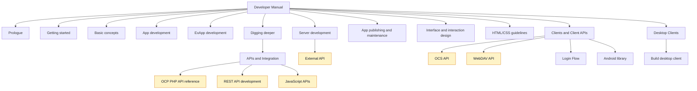
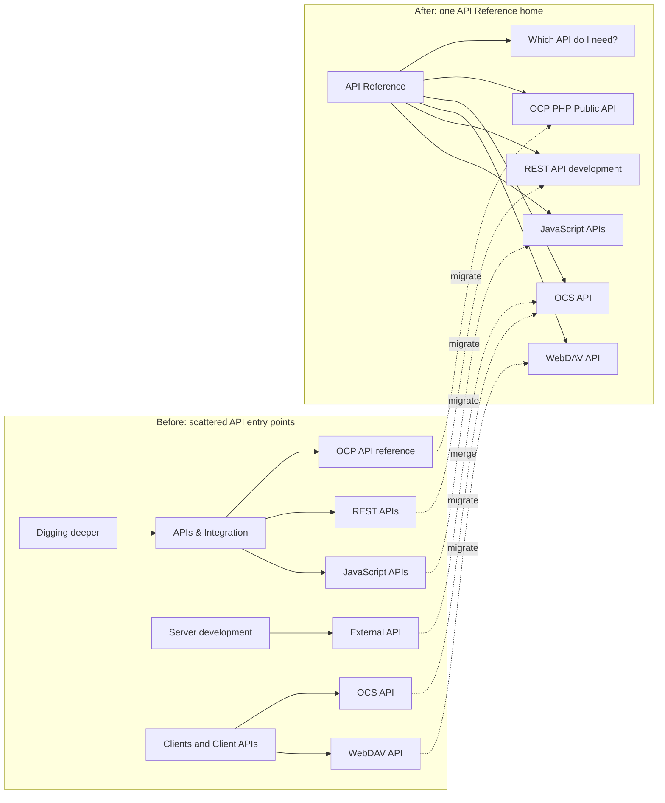

# Nextcloud Developer Manual Restructure Proposal

Prepared by Eeshaan Sawant for the Nextcloud Developer Relations challenge.

## Executive Summary

This proposal recommends restructuring the Nextcloud Developer Manual around a clearer developer journey, with a dedicated top-level API Reference section for OCP, OCS, WebDAV, REST API development, and JavaScript APIs.

The current manual contains strong technical content, but some content has outgrown its original navigation model. In particular, API documentation is spread across several sections, "Digging deeper" has become a broad catch-all, and design/front-end guidance is split across separate top-level areas. These are natural documentation scaling problems for a mature platform like Nextcloud.

I propose two alternative hierarchies:

- **Hierarchy A: Journey-Based** - a conventional developer-docs structure that follows the path from orientation, to app development, to APIs, to extension areas, to publishing and server contribution.
- **Hierarchy B: Audience-Based** - a persona-oriented structure organized around what a developer is trying to build.

My recommendation is **Hierarchy A**. It solves the API discoverability problem directly, reduces the number of top-level sections from 12 to 9, gives "Digging deeper" a meaningful replacement, merges closely related design guidance, and preserves a familiar documentation shape for engineers who maintain the manual daily.

## Analysis of Current Structure

The current Developer Manual has 12 top-level sections:

1. Prologue
2. Getting started
3. Basic concepts
4. App development
5. ExApp development
6. Server development
7. Digging deeper
8. App publishing and maintenance
9. Interface & interaction design
10. HTML/CSS guidelines
11. Clients and Client APIs
12. Desktop Clients

The content is valuable, but the structure creates several discoverability issues.

### 1. "Digging deeper" Has Become a Catch-All

"Digging deeper" now contains a wide range of unrelated topics: AI and machine learning, API reference material, authentication, groupware workflows, discovery/search, developer tools, and server internals. The recent partial grouping inside this section is a good step, but the top-level label still does not tell a developer what they will find there.

For a newcomer, "Digging deeper" sounds like optional advanced reading. In practice, it contains core material such as API guidance, JavaScript APIs, HTTP client documentation, notifications, Talk integration, and server internals.

### 2. API Documentation Is Scattered Across Multiple Locations

API discoverability is the most important structural issue.

Today, a developer looking for "the Nextcloud API docs" has to inspect several areas:

- **OCP PHP Public API**: `Digging deeper -> APIs & Integration -> API reference`, which then links to the generated OCP reference on Netlify.
- **OCS API**: `Clients and Client APIs -> OCS`.
- **WebDAV API**: `Clients and Client APIs -> WebDAV`.
- **REST API development**: `Digging deeper -> APIs & Integration -> REST APIs`.
- **External API / OCS controller guidance**: `Server development -> External API`.
- **JavaScript APIs**: `Digging deeper -> APIs & Integration -> JavaScript APIs`.

This means there is no single canonical "API Reference" landing page that answers the first question most developers have: **Which API do I need?**

### 3. "Clients and Client APIs" Mixes Two Different Concerns

The current "Clients and Client APIs" section contains both client-development material and API reference material. For example, Login Flow, Android library, Remote Wipe, and Client Integration belong naturally to client development, while OCS and WebDAV are server APIs used by many audiences.

This makes the section harder to scan because the organizing principle changes from "building a client" to "using a protocol" inside the same navigation area.

### 4. The Developer Journey Is Not Obvious

The manual has many strong entry points, but the top-level navigation does not clearly answer:

- I am new. Where do I start?
- Should I build a PHP app or an ExApp?
- Where do I learn the platform concepts before using APIs?
- Where do I look up stable interfaces?
- Where do I go when I want to publish or maintain my app?

The current structure exposes many categories at once. That is useful for maintainers, but harder for a new contributor or integration partner who needs a path.

### 5. Design and UI Guidance Is Split Across Two Top-Level Sections

"Interface & interaction design" and "HTML/CSS guidelines" are closely related. Keeping both as top-level sections makes the front-end/design area look larger and more fragmented than it needs to be.

These sections would be easier to discover as one design/front-end guidance area, either inside app development or as part of a unified design system reference.

### 6. "Desktop Clients" Does Not Justify a Top-Level Section

The Desktop Clients section is currently a single page about building the desktop client. It is important content, but its current size does not justify a top-level navigation item.

It fits more naturally under Client Development, alongside Android, Login Flow, Remote Wipe, and client integration guidance.

### 7. App vs. ExApp Needs a Clearer Decision Point

Nextcloud now supports both traditional PHP apps and Docker-based ExApps. That is powerful, but also a choice point for developers.

The manual should introduce this decision earlier, ideally in Getting Started, with a short "Choose your path" page that explains when to build:

- a PHP app,
- an ExApp,
- a client integration,
- a server contribution,
- or an external integration using OCS/WebDAV APIs.

## Current Structure Diagram

This diagram highlights the current top-level navigation and the scattered API paths.



## Hierarchy A: Journey-Based

**Organizing principle:** follow the developer's journey from orientation to implementation, reference, extension topics, and maintenance.

This structure is newcomer-friendly while still preserving clear domain boundaries for experienced developers.

```text
1. Welcome & Community
   - Code of conduct
   - Help and communication
   - Bugtracker
   - Security guidelines
   - App ecosystem compatibility

2. Getting Started
   - Choose your path: PHP app, ExApp, client, integration, or server contribution
   - Development process
   - Development environment
   - Coding standards
   - First app tutorial

3. App Development
   - Core Concepts
     - Request lifecycle
     - Routing
     - Controllers
     - Dependency injection
     - Middleware
     - Events
   - Back-End
     - Storage and database
     - Caching
     - Configuration and settings
     - Security
     - Background jobs
     - Logging
     - Translations
   - Front-End
     - JavaScript and Vue
     - NPM and asset building
     - Design system
     - HTML/CSS guidelines
     - Icons
   - Testing & Quality
     - Unit testing
     - Static analysis
     - CI guidance

4. ExApp Development
   - Introduction
   - Development setup
   - Development overview
   - Technical details
   - FAQ

5. API Reference
   - Which API do I need?
   - OCP: PHP Public API
   - OCS: REST-style API
   - WebDAV API
   - REST API development
   - JavaScript APIs

6. Extending Nextcloud
   - AI & Machine Learning
   - Files & Storage
   - Groupware & Workflows
   - Users & Authentication
   - Search & Discovery
   - Communication: Talk, email, notifications
   - Server Internals: repair steps, deadlocks, classloader, PSR, and related internals

7. Client Development
   - Overview
   - Login Flow
   - Android library
   - Desktop client
   - Remote Wipe
   - Activity API
   - Client integration

8. Publishing & Maintenance
   - Maintainer responsibilities
   - Release process
   - App Store publishing
   - Monetization
   - App Store rules
   - Code signing
   - Release automation
   - Upgrade guide

9. Server Core Development
   - Architecture
   - Front-end code
   - Back-end code
   - Static analysis
   - Unit testing
   - How-to-test guides
```

### Hierarchy A Diagram

```mermaid
flowchart TD
    Manual[Developer Manual]

    Manual --> Welcome[Welcome & Community]
    Manual --> Start[Getting Started]
    Manual --> App[App Development]
    Manual --> ExApp[ExApp Development]
    Manual --> API[API Reference]
    Manual --> Extend[Extending Nextcloud]
    Manual --> Client[Client Development]
    Manual --> Publish[Publishing & Maintenance]
    Manual --> Core[Server Core Development]

    Start --> Path[Choose your path]
    Start --> DevEnv[Development environment]
    Start --> Tutorial[First app tutorial]

    App --> Concepts[Core Concepts]
    App --> Backend[Back-End]
    App --> Frontend[Front-End]
    App --> Quality[Testing & Quality]

    API --> APIRouter[Which API do I need?]
    API --> OCP[OCP: PHP Public API]
    API --> OCS[OCS: REST-style API]
    API --> WebDAV[WebDAV API]
    API --> REST[REST API development]
    API --> JS[JavaScript APIs]

    Extend --> AI[AI & Machine Learning]
    Extend --> Files[Files & Storage]
    Extend --> Groupware[Groupware & Workflows]
    Extend --> Auth[Users & Authentication]
    Extend --> Discovery[Search & Discovery]
    Extend --> Comms[Communication]
    Extend --> Internals[Server Internals]

    Client --> Login[Login Flow]
    Client --> Android[Android]
    Client --> Desktop[Desktop]
    Client --> Remote[Remote Wipe]

    classDef api fill:#dcfce7,stroke:#16a34a,color:#111827
    class API,APIRouter,OCP,OCS,WebDAV,REST,JS api
```



### Rationale for Hierarchy A

Hierarchy A gives the manual a clearer reading order without making it too rigid. A new developer can start at Welcome, choose a path, follow Getting Started, build an app, then use API Reference or Extending Nextcloud as needed.

The key decisions are:

- **Move all API entry points into one top-level API Reference section.** This is the central improvement. OCP, OCS, WebDAV, REST API development, External API/OCS controller guidance, and JavaScript APIs should be discoverable from one landing page.
- **Rename "Digging deeper" to "Extending Nextcloud."** This better describes the content and makes the section sound useful rather than optional.
- **Separate client development from API reference.** Client developers still use OCS and WebDAV, but those APIs are not only client concerns.
- **Merge design and HTML/CSS guidance into App Development -> Front-End.** This makes UI guidance easier to find while reducing top-level clutter.
- **Move Desktop Clients under Client Development.** The content remains visible but no longer occupies a top-level slot by itself.
- **Keep Server Core Development separate from App Development.** Contributing to `nextcloud/server` is a different audience and workflow than building an app.

## Hierarchy B: Audience-Based

**Organizing principle:** organize the manual by who the reader is and what they are trying to accomplish.

This approach is more explicitly task-oriented. It can be very effective for DevRel because the navigation reads like a set of developer intents.

```text
1. Welcome
   - Code of conduct
   - Communication
   - Bugtracker
   - Choosing your path

2. Build a Nextcloud App
   - Tutorial
   - Development environment
   - Development process
   - Core concepts
   - Back-end development
   - Front-end development
   - Testing and quality
   - Publishing and maintenance

3. Build a Docker-Based ExApp
   - Introduction
   - Setup
   - Development overview
   - Technical details
   - FAQ

4. Extend Nextcloud's Capabilities
   - AI and machine learning
   - Files and storage
   - Groupware and workflows
   - Users and authentication
   - Search and discovery
   - Talk, notifications, and email

5. Use Nextcloud's APIs
   - API landscape overview
   - Which API do I need?
   - OCP: PHP Public API
   - OCS: REST-style API
   - WebDAV API
   - REST API development
   - JavaScript APIs

6. Build a Nextcloud Client
   - Authentication overview
   - Login Flow
   - Android library
   - Desktop client
   - Remote Wipe
   - Activity API
   - Client integration

7. Contribute to the Server
   - Architecture
   - Front-end code
   - Back-end code
   - Coding standards
   - Static analysis
   - Unit testing
   - How-to-test guides

8. Reference & Tooling
   - Debugging
   - Profiler
   - CI
   - Performance
   - Design system
   - Classloader
   - PSR and server internals
```

### Hierarchy B Diagram

```mermaid
flowchart TD
    Manual[Developer Manual]

    Manual --> Welcome[Welcome]
    Manual --> BuildApp[Build a Nextcloud App]
    Manual --> BuildExApp[Build a Docker-Based ExApp]
    Manual --> Extend[Extend Nextcloud's Capabilities]
    Manual --> UseAPIs[Use Nextcloud's APIs]
    Manual --> BuildClient[Build a Nextcloud Client]
    Manual --> Contribute[Contribute to the Server]
    Manual --> Reference[Reference & Tooling]

    BuildApp --> AppTutorial[Tutorial]
    BuildApp --> CoreConcepts[Core concepts]
    BuildApp --> Backend[Back-end]
    BuildApp --> Frontend[Front-end]
    BuildApp --> Publishing[Publishing]

    UseAPIs --> Landscape[API landscape]
    UseAPIs --> ChooseAPI[Which API do I need?]
    UseAPIs --> OCP[OCP]
    UseAPIs --> OCS[OCS]
    UseAPIs --> WebDAV[WebDAV]
    UseAPIs --> REST[REST development]
    UseAPIs --> JS[JavaScript APIs]

    BuildClient --> Login[Login Flow]
    BuildClient --> Android[Android]
    BuildClient --> Desktop[Desktop]
    BuildClient --> Integration[Client integration]

    Reference --> Debug[Debugging]
    Reference --> Profiler[Profiler]
    Reference --> Design[Design system]
    Reference --> Internals[Internals]

    classDef api fill:#dbeafe,stroke:#2563eb,color:#111827
    class UseAPIs,Landscape,ChooseAPI,OCP,OCS,WebDAV,REST,JS api
```



### Rationale for Hierarchy B

Hierarchy B is strong when the main goal is empathy and fast self-identification. A visitor can map themselves to a section: "I want to build an app," "I want to use APIs," or "I want to contribute to the server."

Its strengths are:

- It makes the navigation feel action-oriented.
- It exposes the different developer personas Nextcloud serves.
- It gives APIs a clear home under "Use Nextcloud's APIs."
- It reduces top-level navigation from 12 to 8 sections.

Its tradeoffs are:

- It may feel less conventional than established open-source documentation structures.
- It risks duplication because publishing, design, testing, and tooling can belong to multiple audiences.
- It may create more maintenance decisions about whether a page belongs under a persona section or under Reference & Tooling.
- Some section titles are longer and more conversational, which may not fit the existing tone of the Nextcloud documentation.

## Recommendation

I recommend **Hierarchy A: Journey-Based**.

It gives Nextcloud the strongest balance between discoverability, maintainability, and familiarity.

### Why Hierarchy A Wins

#### 1. It Solves API Discoverability Most Directly

The most important change is not cosmetic. It is structural: create a top-level **API Reference** section.

That gives developers one obvious place to find:

- OCP: PHP Public API
- OCS: REST-style API
- WebDAV API
- REST API development guidance
- JavaScript APIs
- External API / OCS controller guidance

This is consistent with how developers expect mature technical documentation to work. API reference should not be hidden inside "Clients and Client APIs," "Server development," or "Digging deeper."

#### 2. It Gives "Digging deeper" a Meaningful Replacement

"Extending Nextcloud" better matches the current content. It tells developers that this section contains platform extension areas: AI, files, groupware, users, search, Talk, notifications, and internals.

This also preserves the good work already done to group "Digging deeper" internally, but gives that work a clearer top-level label.

#### 3. It Keeps a Familiar Documentation Shape

Hierarchy A resembles patterns used by mature developer documentation:

- orientation,
- getting started,
- development guides,
- API reference,
- advanced extension topics,
- client development,
- publishing,
- server contribution.

That shape is easier for maintainers to reason about than a purely persona-based structure.

#### 4. It Reduces Top-Level Navigation Without Hiding Important Content

The current 12 top-level sections become 9:

- Design and HTML/CSS guidance move together into App Development -> Front-End.
- Desktop Clients moves under Client Development.
- API pages move into API Reference.
- Digging deeper becomes Extending Nextcloud.

The result is simpler navigation without removing important material.

#### 5. It Handles App vs. ExApp Without Forcing One Model

The proposed Getting Started section includes a "Choose your path" page, while App Development and ExApp Development remain separate top-level sections.

This respects the fact that PHP apps and ExApps are different development models. The manual should clarify the choice early, then let each path have its own focused documentation.

#### 6. It Creates Less Duplication Than Hierarchy B

Hierarchy B is appealing from a DevRel perspective, but it may require more cross-linking and repeated context. For example, testing, publishing, design, APIs, and tooling may apply to app developers, ExApp developers, client developers, and server contributors.

Hierarchy A keeps shared topics in stable homes and uses routing pages to guide readers.

## Special Focus: API Discoverability

The API problem deserves its own migration focus because it affects several developer groups:

- app developers using OCP interfaces,
- external integrators using OCS or WebDAV,
- client developers using Login Flow, OCS, and WebDAV,
- front-end developers using JavaScript APIs,
- server contributors maintaining public API guarantees.

### Proposed API Reference Landing Page

The new **API Reference** section should start with a routing page titled **Which API do I need?**

That page should answer practical questions before listing protocols:

| Developer goal | Recommended API | Why |
| --- | --- | --- |
| Build a PHP app that runs inside Nextcloud | OCP PHP Public API | Stable public interfaces for apps running on the server |
| Create or consume app endpoints | OCS API / REST API development | OCS is the established Nextcloud API pattern for app endpoints |
| Access files, comments, trashbin, versions, or search remotely | WebDAV API | WebDAV is the standard interface for file-oriented client operations |
| Build a web front-end inside a Nextcloud app | JavaScript APIs | Provides browser-side integration with Nextcloud UI and app behavior |
| Build a mobile or desktop client | Login Flow plus OCS/WebDAV | Login Flow handles authentication; OCS and WebDAV handle data operations |
| Contribute to stable server interfaces | OCP API policy and generated reference | Clarifies public API stability, attributes, and compatibility expectations |

This page should also define terms plainly:

- **OCP**: PHP public API for apps running in Nextcloud.
- **OCS**: REST-style API format used by Nextcloud apps and clients.
- **WebDAV**: HTTP-based protocol for file and file-related operations.
- **REST API development**: guidance for app developers creating their own endpoints.
- **JavaScript APIs**: browser-side APIs and packages used by Nextcloud app front-ends.

### API Before and After



### Suggested API Reference Structure

```text
API Reference
|-- Which API do I need?
|-- OCP: PHP Public API
|   |-- API stability and compatibility
|   |-- Consumable, Implementable, Listenable, and related attributes
|   |-- Generated OCP reference
|   `-- Unstable NCU namespace policy
|-- OCS: REST-style API
|   |-- Overview and authentication
|   |-- Creating OCS endpoints
|   |-- Share API
|   |-- Sharee API
|   |-- Status API
|   |-- Recommendations API
|   |-- Task processing API
|   |-- Text processing API
|   |-- Translation API
|   |-- Out-of-office API
|   `-- OpenAPI description
|-- WebDAV API
|   |-- Basics
|   |-- Files
|   |-- Search
|   |-- Comments
|   |-- Trashbin
|   `-- Versions
|-- REST API Development
|   |-- Controllers and routing
|   |-- CORS
|   |-- Versioning
|   `-- OCS vs REST guidance
`-- JavaScript APIs
   |-- Browser-side app APIs
   |-- Nextcloud packages
   `-- Front-end integration patterns
```

### API Documentation Principles

The API section should follow these principles:

- **Start with developer goals, then protocols.** Most developers do not arrive knowing whether they need OCP, OCS, WebDAV, or JavaScript APIs.
- **Keep generated reference and conceptual guidance linked but distinct.** The generated OCP reference is lookup material; the manual should explain stability, usage patterns, and examples.
- **Group OCS sub-APIs by domain.** As the OCS catalog grows, it should remain browsable by purpose, not only by file name.
- **Preserve deep links with redirects.** Existing links from search engines, GitHub issues, and forum answers should continue to work.

## References and Documentation Patterns

This proposal is informed by established documentation frameworks and high-quality developer documentation examples.

### Diataxis Framework

[Diataxis](https://diataxis.fr/) separates documentation into four modes:

- **Tutorials**: learning-oriented lessons.
- **How-to guides**: goal-oriented steps.
- **Reference**: accurate lookup material.
- **Explanation**: conceptual understanding.

It is influential across modern technical documentation and is visible in the way projects such as Django, CNCF projects, and Gatsby separate learning material from task guidance and reference.

The current Developer Manual often mixes these modes within the same navigation areas. For example, tutorials, conceptual platform explanations, generated API reference, and server internals can appear close together. The proposed structure does not need to implement Diataxis rigidly, but it uses the same core insight: readers need different documentation modes at different moments.

Hierarchy A maps well to Diataxis:

- Getting Started contains tutorial and orientation material.
- App Development and Extending Nextcloud contain how-to and explanation material.
- API Reference contains lookup and API policy material.
- Server Core Development contains contribution-focused explanation and how-to material.

### Stripe Docs

[Stripe's documentation](https://docs.stripe.com/) is a strong example of API discoverability. It combines task-oriented navigation with deep API reference. Developers can start from a goal, then move into protocol and endpoint detail.

The relevant lesson for Nextcloud is not to copy Stripe's product structure, but to make the API entry point obvious. For a platform with multiple API surfaces, a single API landing page is essential.

### Django Documentation

[Django's documentation](https://docs.djangoproject.com/) is a useful open-source comparison because it separates learning paths, topic guides, how-to guides, reference, and internals. It also keeps a famous tutorial as a clear newcomer path while preserving detailed reference material for experienced users.

The lesson for Nextcloud: keep the app tutorial and getting-started journey visible, but do not mix that journey with API lookup or internals.

### Twilio Docs

[Twilio's documentation](https://www.twilio.com/docs) organizes complex APIs around tasks such as sending a message or making a call. This shows that multi-API platforms benefit when the first navigation layer reflects developer goals.

For Nextcloud, the proposed "Which API do I need?" page applies the same principle without renaming the whole manual around tasks.

### React Documentation

[React's documentation](https://react.dev/) demonstrates the value of fewer, cleaner top-level sections: Learn, Reference, and Community. React keeps learning material separate from reference material, which helps both newcomers and experienced developers.

For Nextcloud, the same lesson supports reducing top-level sections and separating the app-development journey from API reference.

## Migration Considerations

The restructure should be implemented in phases to reduce disruption for maintainers and users.

### Phase 1: Create the New API Reference Landing Page

Start with the highest-impact improvement:

1. Add `API Reference` as a top-level section.
2. Create `Which API do I need?` as the first page.
3. Move or cross-link OCP, OCS, WebDAV, REST API development, External API, and JavaScript APIs into this section.
4. Add redirects from the old locations.

This phase produces immediate value even before the rest of the navigation changes.

### Phase 2: Rename and Restructure "Digging deeper"

Rename "Digging deeper" to "Extending Nextcloud" and keep the recently introduced internal groupings where they work.

Potential groups:

- AI & Machine Learning
- Files & Storage
- Groupware & Workflows
- Users & Authentication
- Search & Discovery
- Communication
- Server Internals

This phase should include a review with maintainers who own those areas, because some pages may belong better in API Reference, App Development, or Server Core Development.

### Phase 3: Consolidate Front-End and Design Guidance

Merge "Interface & interaction design" and "HTML/CSS guidelines" into a unified Front-End or Design System area under App Development.

This should preserve existing pages but place them under a more discoverable section for app developers.

### Phase 4: Move Desktop Clients Under Client Development

Move the single Desktop Clients page into Client Development. This simplifies the top-level navigation while keeping the page visible to the right audience.

### Phase 5: Add Decision Pages and Cross-Links

Add short routing pages that reduce ambiguity:

- `Choose your path`: PHP app vs ExApp vs client vs external integration vs server contribution.
- `Which API do I need?`: OCP vs OCS vs WebDAV vs REST development vs JavaScript APIs.

These pages do not need to be long. Their purpose is to reduce wrong turns.

### Redirects and Backward Compatibility

Because documentation links are widely shared in GitHub issues, forum posts, blog posts, and search results, redirects are important.

Priority redirects should include:

- `digging_deeper/api` -> `api_reference/ocp`
- `digging_deeper/rest_apis` -> `api_reference/rest_api_development`
- `digging_deeper/javascript-apis` -> `api_reference/javascript_apis`
- `client_apis/OCS` -> `api_reference/ocs`
- `client_apis/WebDAV` -> `api_reference/webdav`
- `server/externalapi` -> `api_reference/ocs/creating_endpoints` or equivalent
- `desktop` -> `client_development/desktop`

### Stakeholder Input

Before finalizing the migration, I would recommend a short review with:

- DevRel, to confirm newcomer journeys and terminology.
- App ecosystem maintainers, to validate PHP app and ExApp separation.
- Server maintainers, to validate OCP stability language and generated reference links.
- Client maintainers, to confirm Login Flow, OCS, WebDAV, Android, and desktop placement.
- Design/front-end maintainers, to decide whether the unified front-end/design area lives under App Development or as a separate reference area.

## Closing Recommendation

Nextcloud's Developer Manual already has the raw material of a strong platform documentation set. The opportunity is to make the structure match how developers approach the ecosystem today.

The highest-impact change is a dedicated **API Reference** section with a practical **Which API do I need?** landing page. Around that, Hierarchy A provides a clean and maintainable structure: orient developers, help them choose a path, support app and ExApp development, make APIs easy to find, rename extension topics clearly, and keep publishing/client/server contribution workflows discoverable.

That is why I recommend **Hierarchy A: Journey-Based** as the best next structure for the Nextcloud Developer Manual.