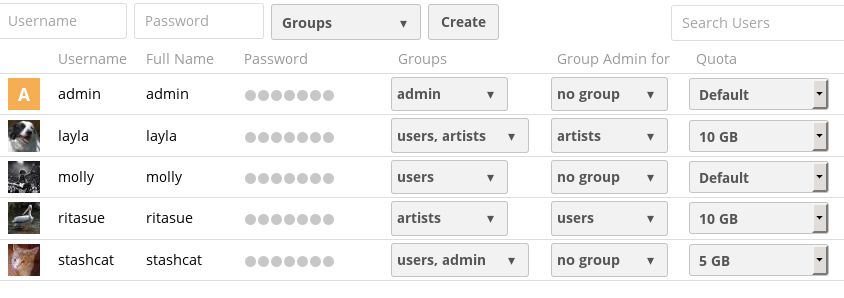

=============================
Nextcloud manuals style guide
=============================

See the `Documentation README <https://github.com/nextcloud/documentation/blob/master/README.rst>`_
for information on setting up your documentation build environment.

See `reStructuredText Primer <https://www.sphinx-doc.org/en/master/usage/restructuredtext/basics.html>`_
for a complete Sphinx/RST markup reference.

This is the official style guide for the Nextcloud Administration and User
manuals. Please follow these conventions for consistency, and easier
proofreading and copyediting.

When you are writing your text, make it as literal and specific as possible. Put
yourself in the place of the person who is using Nextcloud and looking for
instructions on performing a task. Don't make them guess, but spell
out every step in order, and tell exactly what buttons to click or what form
fields to fill out. Give complete information; for example, when configuring a
timeout value be sure to say if it is in seconds or some other value. Say
``config.php`` rather than "the configuration file". When you are describing
features of a GUI administration form use the exact literal names of buttons,
form fields, and menus. Specify if menus are dropdown, right-click,
left-click, or mouseover.

Page filenames
--------------

Use lowercase filenames with underscores, for example file_name_config.rst.

Page titles and headings
------------------------

There are many ways to markup headings and subheadings. This is the official 
Nextcloud way. Use sentence case. Three levels is enough; if you find that you want more, 
then re-think the organization of your text::

 ==============
 Page title, h1
 ==============

 Subhead, h2
 -----------

 Subhead, h3
 ^^^^^^^^^^^
 
This is how they render:

==============
Page title, h1
==============

Subhead, h2
-----------

Subhead, h3
^^^^^^^^^^^

Labels and code
---------------

Elements in a GUI configuration form are in bold, and should be described as 
literally as possible, so that your description matches what your reader sees 
on the screen. For example, on the User listing page describe the various 
elements like these examples::

 **Username** field
 **Password** field
 **Groups** dropdown menu
 **Create** button
 **Full Name** field
 **Quota** dropdown menu
 
This is how they render:
 
**Username** field

**Password** field

**Groups** dropdown menu

**Create** button

**Full Name** field

**Quota** dropdown menu

   
   *Figure 1: The Nextcloud user listing and administration page.*
   
Use double-backticks for inline code and command examples::
  
  ``sudo -E -u www-data php occ files:scan --help``
  ``maintenance:install``
  
This is how they render:

``sudo -E -u www-data php occ files:scan --help``

``maintenance:install``

When you are giving hyperlinks as examples, use double-backticks rather than 
creating a live hyperlink::

 ``https://example.com``

Images
------

Use lowercase with hyphens for image names, for example image-name.png.

Images should be in .png format. Keep your screenshots focused on the items you 
are describing. When you need an image of something large like a configuration 
form on the Nextcloud admin page, narrow your Web browser to fold the fields 
into a smaller space, because a long skinny graphic is not very readable. Think 
square.

Both images and figures must have brief and descriptive alt tags and all 
figures must have captions with figure numbers. Sphinx RST markup does not 
have a tag for figure numbers, so you must 
use the caption element. You may use simple numbering like "Figure 1, Figure 2", 
or add a caption. Captions must follow a blank line and be italicized, like this example::

  .. figure:: images/users-config.png
     :alt: User listings and administration page.
     
     *Figure 1: The Nextcloud user listing and administration page.*

Images must go into a sub-directory of the directory containing your manual 
page. Currently the manuals have both a single master images directory, and 
image directories local to each chapter. A single master images directory is 
difficult to maintain and inevitably becomes cluttered with obsolete images. Eventually
the single master directories will be gone.

Example URL
-----------

Use ``https://example.com`` in your examples where you want to include an URL.

Voice and tone
--------------

Write in the **second person** ("you") and use **active voice** wherever
possible. Active voice is clearer and more direct::

  Active:   Click **Save** to apply the changes.
  Passive:  The changes are applied when Save is clicked.

Use the **present tense** to describe what the software does::

  Correct:  The panel displays the current status.
  Avoid:    The panel will display the current status.

Keep sentences short. One idea per sentence. Avoid jargon and marketing
language. When abbreviations are used, spell them out on first occurrence.

Line length
-----------

Wrap prose lines at **120 characters** where practical. Lines that cannot be
wrapped without harm to readability — such as long URLs, code examples, or
table cells — may exceed this limit. Blank lines between paragraphs and after
directives should always be present; do not add trailing spaces.

Admonitions
-----------

Sphinx provides several admonition directives. Use them sparingly so they
retain their visual impact. The general guidance is:

``.. note::``
   Use for information that is helpful but not critical — supplementary
   context, alternative approaches, or clarifications::

     .. note::
        This setting only applies to the default storage backend.

``.. tip::``
   Use for optional advice that helps the reader work more efficiently::

     .. tip::
        You can bulk-select files by holding :kbd:`Shift` and clicking.

``.. warning::``
   Use when incorrect actions may lead to data loss, security issues, or
   significant misconfiguration::

     .. warning::
        Changing this value requires a full rescan of the file system.

``.. important::``
   Use for requirements that must be met for the feature to function
   correctly. Reserve for mandatory prerequisites::

     .. important::
        Redis must be running before you enable this option.

``.. danger::``
   Use only when an action can cause irreversible damage or a serious
   security breach::

     .. danger::
        Enabling this option exposes the admin panel to unauthenticated users.

Do **not** nest admonitions or use them as a substitute for normal prose.

Code blocks
-----------

Always specify the language for code blocks so that syntax highlighting works
correctly. The most common languages used in this documentation are:

``.. code-block:: bash``
   Shell commands and terminal output::

     .. code-block:: bash

        sudo -E -u www-data php occ maintenance:install

``.. code-block:: php``
   PHP code and ``config.php`` snippets. When showing a single key from
   ``config.php``, include enough context to make the placement clear::

     .. code-block:: php

        $CONFIG = [
            // ...
            'memcache.local' => '\OC\Memcache\APCu',
        ];

``.. code-block:: nginx`` / ``.. code-block:: apache``
   Web server configuration blocks.

``.. code-block:: xml`` / ``.. code-block:: yaml`` / ``.. code-block:: json``
   Configuration files in the respective formats.

``.. code-block:: console``
   Use for interactive terminal sessions that mix commands and output, or when
   the exact shell is unknown.

``.. code-block:: text``
   Plain text with no syntax highlighting — for log output, error messages, or
   file paths that do not fit another category.

Use ``.. code-block:: none`` only as a last resort when no other type is
appropriate.

Version-specific content
------------------------

Use Sphinx version directives to mark content that applies to a specific
Nextcloud release. These directives render a formatted notice in the output.

``.. versionadded:: X.Y``
   Mark features introduced in release X.Y::

     .. versionadded:: 29.0
        The **Background jobs** section has been moved to its own admin panel.

``.. versionchanged:: X.Y``
   Mark behaviour that changed in release X.Y::

     .. versionchanged:: 28.0
        The default value changed from ``1`` to ``3``.

``.. deprecated:: X.Y``
   Mark features that are deprecated and will be removed in a future release::

     .. deprecated:: 27.0
        This setting is replaced by ``maintenance_window_start`` in
        ``config.php``.

When referring to a Nextcloud version in running text, write the version number
without a leading "v": **Nextcloud 29**, not "Nextcloud v29". For version
ranges write "Nextcloud 28 and later" or "Nextcloud 27–29".

Internal cross-references
--------------------------

Prefer internal cross-references over hard-coded URLs so that links survive
page moves.

**Same manual — use** ``:doc:``
   When the target page is in the same manual as the current page, always use a
   ``:doc:`` reference with a path relative to the current file. Never use a
   hard-coded ``https://docs.nextcloud.com`` URL for within-manual links::

     See :doc:`../configuration_server/config_sample_php_parameters` for all
     available options.

**Different manual — use a** ``docs.nextcloud.com/latest/`` **URL**
   When linking from one manual to a page in a different manual (e.g. from the
   User Manual to the Administration Manual), use an absolute URL with
   ``/latest/`` as the version segment. The build system automatically replaces
   ``/latest/`` with the correct version number for stable branches::

     See `Backup configuration <https://docs.nextcloud.com/latest/admin_manual/maintenance/backup.html>`_
     for details.

``:doc:``
   Reference another page by its path relative to the current file::

     See :doc:`../configuration_server/config_sample_php_parameters` for all
     available options.

``:ref:``
   Reference a labelled anchor anywhere in the documentation. Add a label
   directly above the target section::

     .. _two-factor-auth:

     Two-factor authentication
     -------------------------

   Then reference it from anywhere::

     See :ref:`two-factor-auth` for setup instructions.

``:guilabel:``
   Use for GUI element names as an alternative to bold when the element is
   being referenced rather than named inline::

     Click :guilabel:`Save` to confirm.

``:kbd:``
   Use for keyboard shortcuts::

     Press :kbd:`Ctrl+S` to save.

``:file:``
   Use for file paths to ensure consistent rendering::

     Edit :file:`config/config.php`.

``:command:``
   Use for command names::

     Run :command:`occ` as the web server user.

``:class:`` / ``:meth:`` / ``:func:``
   Use in the **Developer Manual** for PHP class, method, and function
   references. Ensure the target is present in the API documentation.

Shared content with ``.. include::``
-------------------------------------

Use ``.. include::`` to embed a common snippet in multiple pages. Store shared
files in the ``_shared_assets/`` directory and use a leading underscore in
their name to signal that they are partials::

  .. include:: ../../_shared_assets/_warning_config_autogenerated.rst

Guidelines:

* Keep included files small and self-contained — a single admonition, a
  repeated parameter table, or a standard disclaimer.
* Do not include entire sections; include only the smallest reusable unit.
* Document at the top of the included file that it is a shared partial.

Tables
------

Use RST grid tables for tables with multiple columns or complex cell content,
and simple list tables (``.. list-table::``) when the content is uniform::

  .. list-table:: Configuration parameters
     :header-rows: 1
     :widths: 30 15 55

     * - Parameter
       - Default
       - Description
     * - ``maintenance``
       - ``false``
       - Enable maintenance mode to block regular logins.

Guidelines:

* Always add a ``:header-rows: 1`` option so the first row is rendered as a
  header.
* Provide a ``:widths:`` hint to keep columns readable.
* For plain grid tables keep cell content short; use list tables when cell
  content is longer than ~40 characters.
* Add a title after the directive name (e.g. ``.. list-table:: Title``) when
  the table needs to be referenced or cited.
