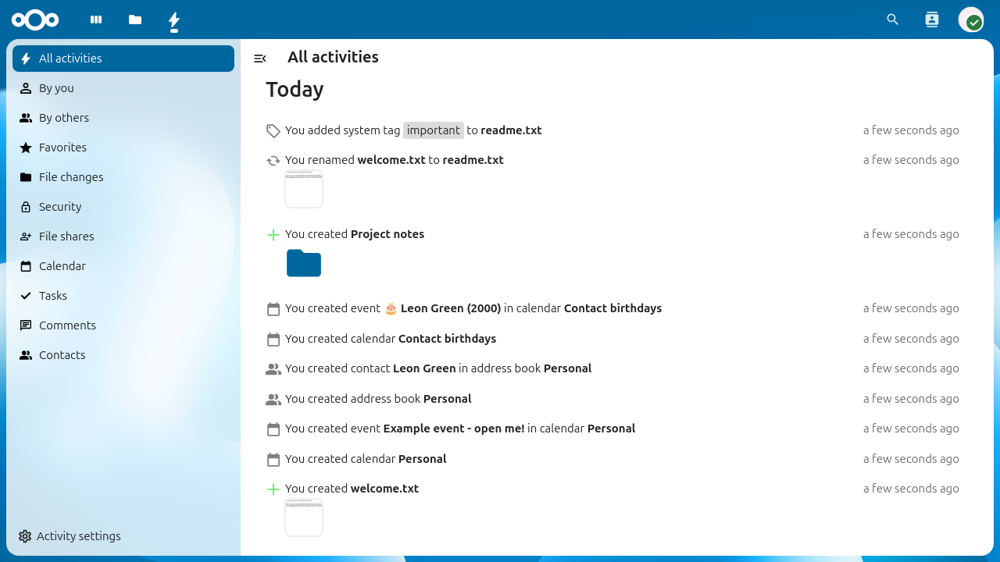
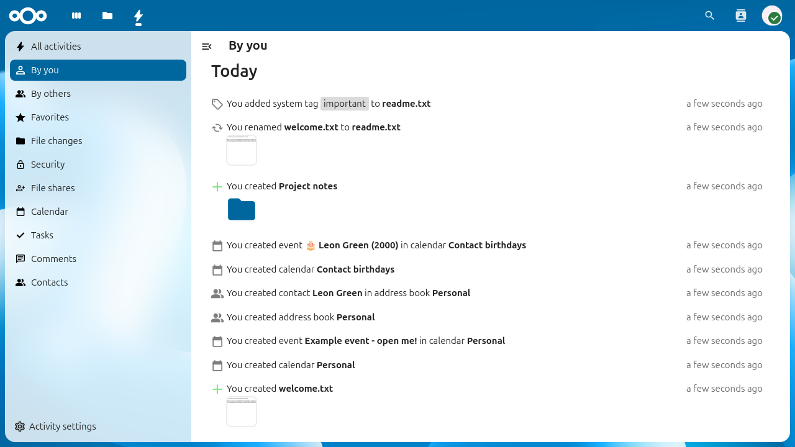
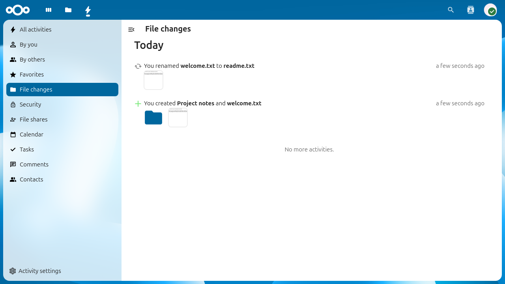
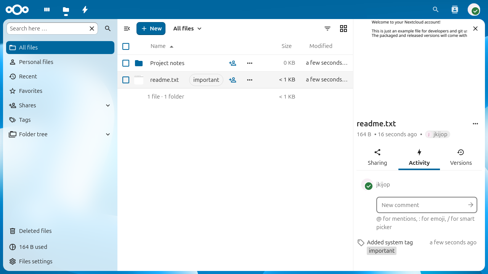
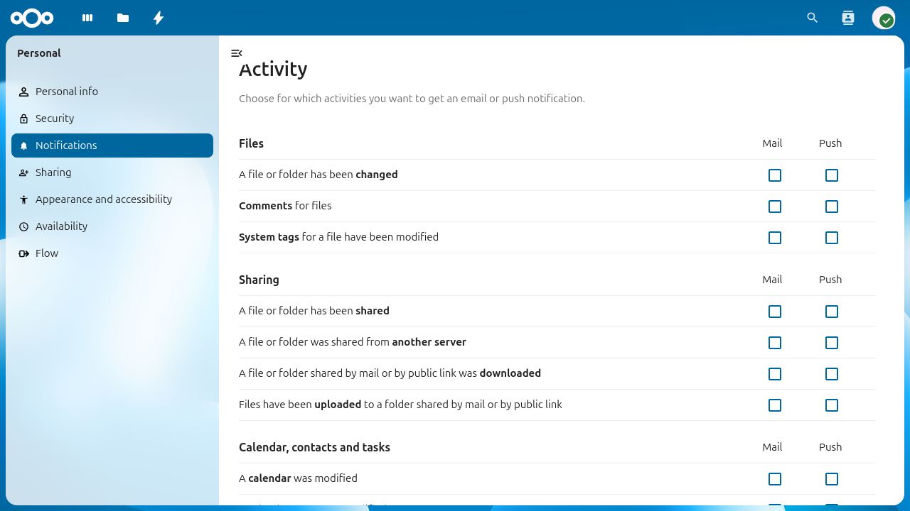

.. _activity:

======================
Using the Activity app
======================

The Activity app keeps track of everything happening in your Nextcloud.
It records events such as file changes, shares, calendar updates, and
more, giving you a chronological overview of what happened and when.

The Activity app is enabled by default.

   *The Activity stream showing all recent activities.*

Viewing your activity stream
----------------------------

To view your activity stream, click on the **Activity** icon in the
top navigation bar or navigate to ``/apps/activity`` in your browser.

The stream shows all events grouped by day. Each entry shows what
happened, which file or object was affected, and how long ago the
event occurred. Entries from other apps such as Calendar, Contacts,
or Talk also appear in the stream if those apps are installed.

Filtering activities
^^^^^^^^^^^^^^^^^^^^

The left sidebar provides filters to narrow down the activity stream:

* **All activities** shows everything.
* **By you** shows only activities that you triggered yourself.
* **By others** shows only activities triggered by other users.
* **File changes** shows only file and folder events (create, modify,
  delete, rename, move).

Additional filters may appear depending on which apps are installed
on your Nextcloud instance (e.g. **Favorites**, **Calendar**,
**Contacts**).

   *The activity stream filtered to show only your own activities.*

   *The activity stream filtered to file changes only.*

Activity in the Files sidebar
-----------------------------

You can also view activities for a specific file or folder directly
from the Files app. Select a file, open the sidebar and click on the
**Activity** tab. This shows only the events related to that
particular file, such as when it was created, modified, shared, or
tagged.

   *The Activity tab in the Files sidebar showing per-file events.*

RSS feed
--------

The Activity app can provide your activity stream as an RSS feed,
allowing you to follow your Nextcloud activity from any feed reader.

To enable the RSS feed:

1. Open the Activity app.
2. Click **Activity settings** at the bottom of the left sidebar.
3. Enable the **Enable RSS feed** toggle.
4. Copy the RSS feed link that appears.

.. note:: The RSS feed link contains a secret token. Do not share it
   with others, as it provides unauthenticated access to your activity
   stream.

Notification settings
---------------------

You can choose how you want to be notified about different types of
activities. Go to **Settings** > **Personal** > **Notifications** to
configure your preferences.

   *Personal notification settings for the Activity app.*

The settings are organized by category (e.g. **Files**, **Sharing**,
**Calendar, contacts and tasks**). For each activity type you can
choose to receive:

* **Mail** notifications (email)
* **Push** notifications (mobile and desktop)

Check or uncheck the corresponding boxes to enable or disable
notifications for each activity type.

Email notification frequency
^^^^^^^^^^^^^^^^^^^^^^^^^^^^

Below the notification matrix you can choose how often email
notifications are sent:

* **As soon as possible** sends an email shortly after each event.
* **Hourly** batches notifications and sends them once per hour.
* **Daily** sends a single email per day.
* **Weekly** sends a single email per week.

Daily activity summary
^^^^^^^^^^^^^^^^^^^^^^

You can enable a daily summary email that is sent every morning with
an overview of the previous day's activities. This option is available
as a separate toggle below the notification frequency setting:

* Check **Send daily activity summary in the morning** to enable it.

The daily summary is independent of the per-event notifications above
and provides a convenient digest of all activity.
