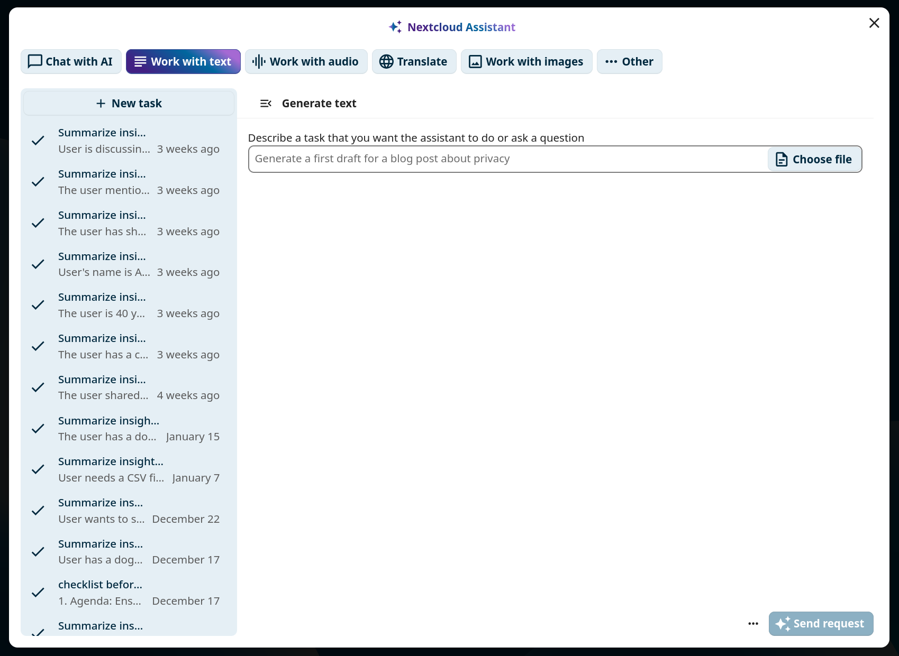
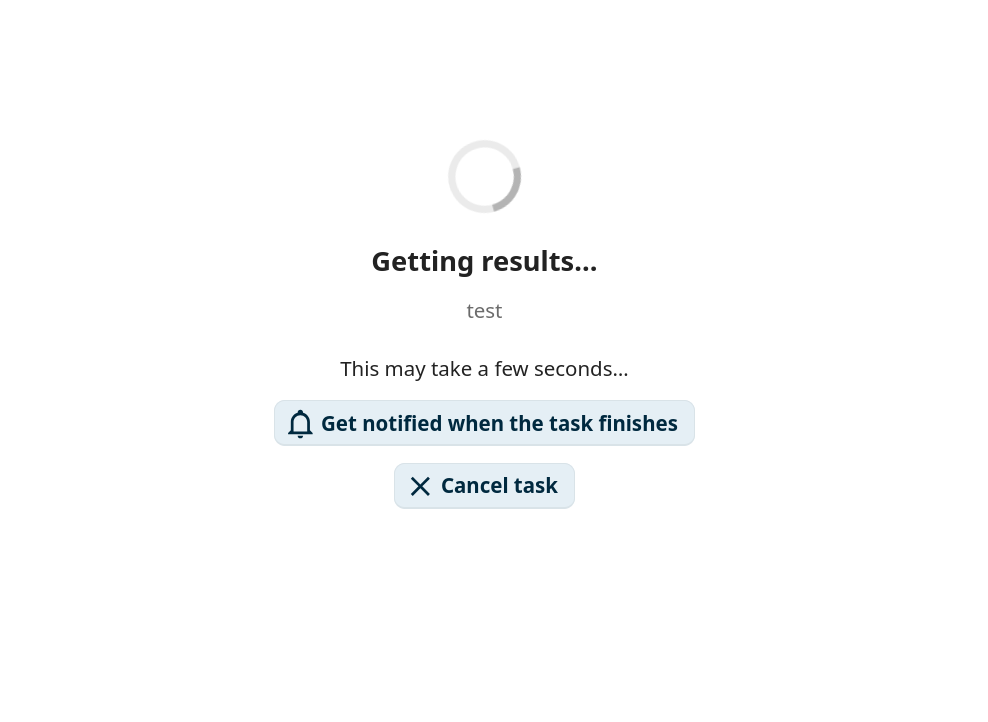
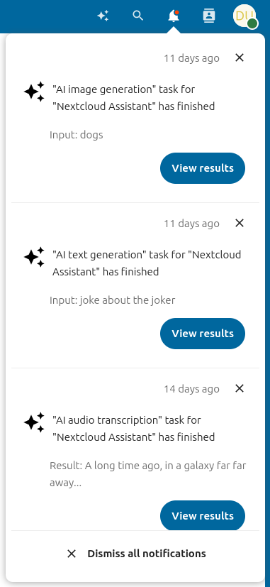
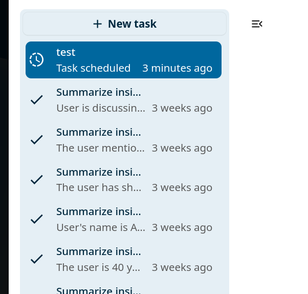
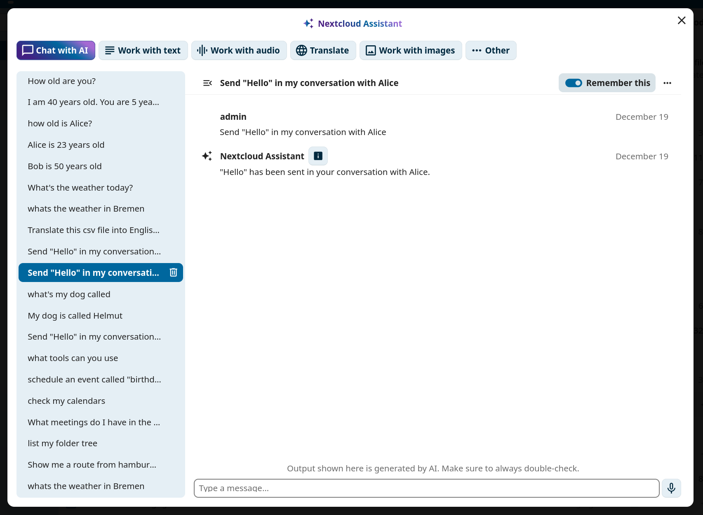
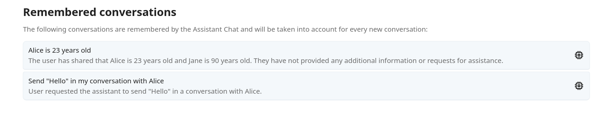
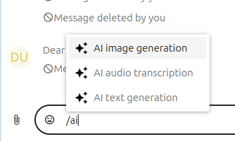
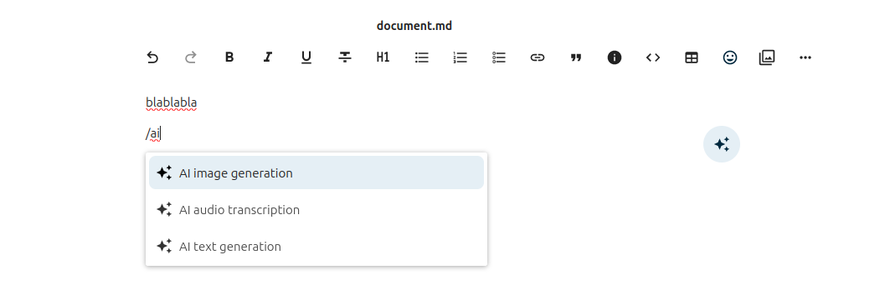

.. _ai-assistant:

============
AI assistant
============

The Nextcloud AI assistant gives you access to AI-powered tools directly from the web interface.
You can run tasks such as text summarization, image generation, and speech transcription, have
back-and-forth conversations with a connected language model, and insert AI-generated content
into documents and messages using smart pickers.

.. note::
   The AI assistant requires at least one AI backend app to be installed and configured by your
   administrator. See the
   `AI assistant administration documentation
   <https://docs.nextcloud.com/server/latest/admin_manual/ai/app_assistant.html>`_
   for details.

Personal settings
-----------------

The assistant personal settings are in **Personal settings** under the **Artificial intelligence**
section. You can disable the assistant top menu entry there, and enable or disable the
AI-related smart pickers.

Running a task
--------------

To open the assistant, click the assistant icon in the top-right navigation bar.

   *Figure 1: The assistant icon in the top-right navigation bar.*

Choose a task type at the top of the assistant panel, fill in the input form, and click the
submit button at the bottom right.

   *Figure 2: The assistant task form.*

Your task will run immediately if possible, or be scheduled for later execution.

   *Figure 3: Waiting for task results.*

Notifications
-------------

If a task was scheduled, you can request to receive a notification when it finishes. Click the
**View results** button in the notification to display the task output.

   *Figure 4: Task completion notification.*

Task history
------------

The left panel of the assistant shows a task history list filtered to the currently selected task
type. You can relaunch, delete, or cancel previous tasks from this list.

   *Figure 5: Task history in the left panel.*

Chat with AI
------------

The **Chat with AI** tab in the assistant lets you have a back-and-forth conversation with the
connected AI. Type a message into the text field at the bottom and press :kbd:`Enter` to send.
Click **New conversation** to start a separate conversation thread.

   *Figure 6: Chat with AI interface.*

Each conversation has its own context. Toggle **Remember this** on a conversation to add it to
the AI's long-term memory so that its context is available in any future conversation. Toggle it
off again to remove the conversation from memory.

In the **AI assistant** section of your Personal settings, you can review all your remembered
conversations.

   *Figure 7: Remembered conversations listed in personal settings.*

Smart pickers
-------------

The assistant app provides three smart pickers accessible in Talk, Text editor, and any other
place where rich text editing is available. Type ``/`` followed by ``ai`` to see the filtered
provider list.

In Talk:

   *Figure 8: AI smart picker in Talk.*

In Text editor:

   *Figure 9: AI smart picker in the Text editor.*

Any result generated through the smart picker can be inserted directly into the current context.
