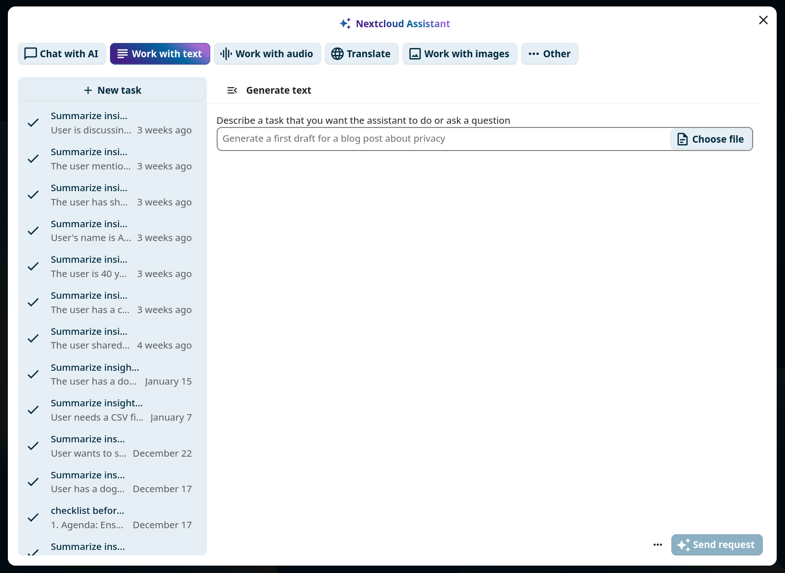
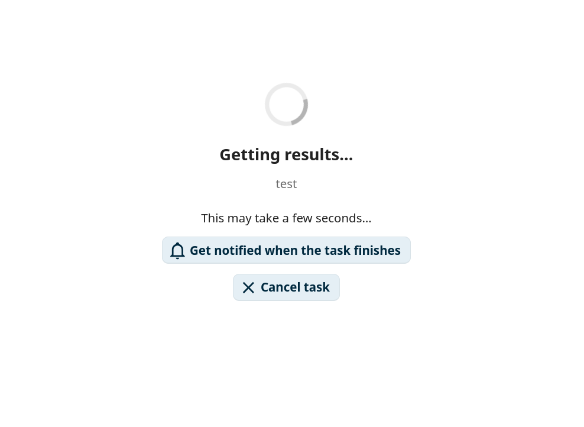
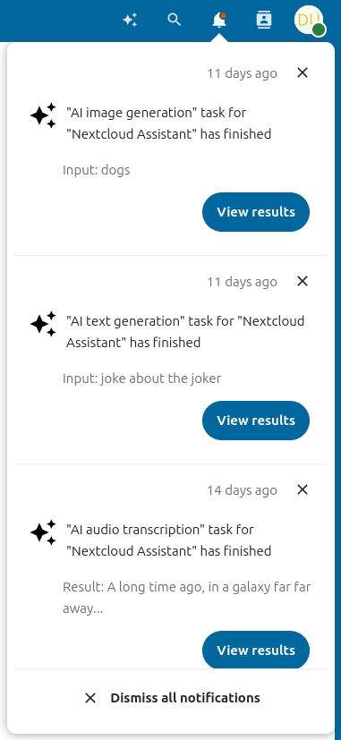
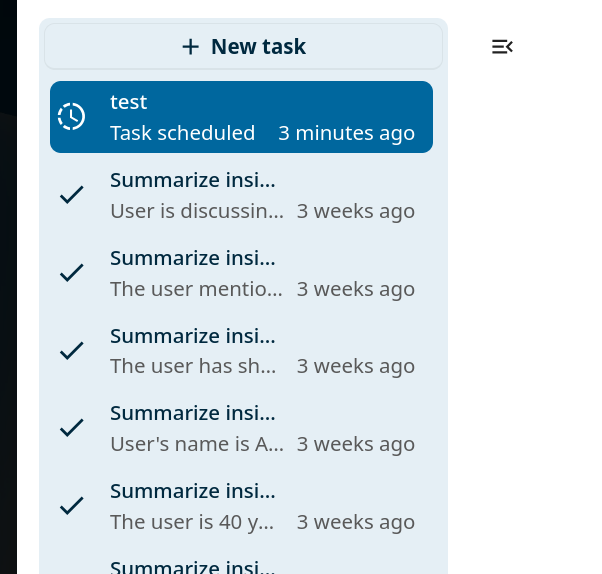
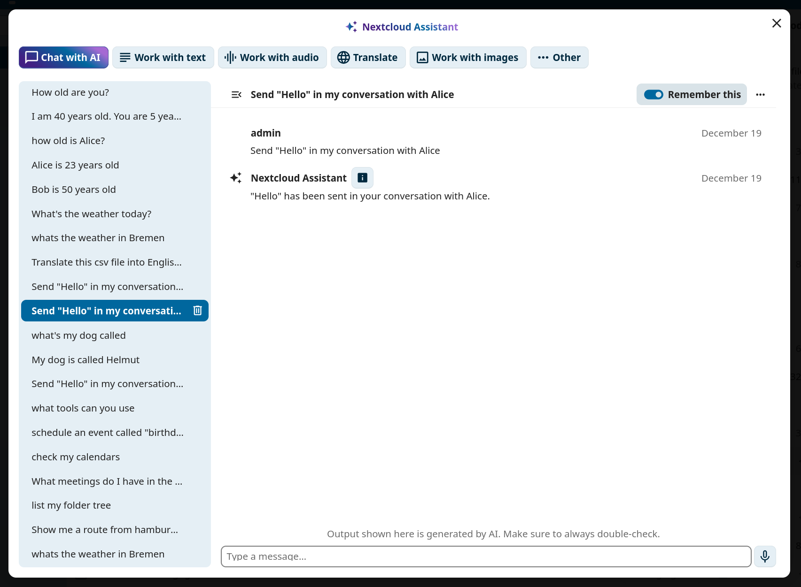
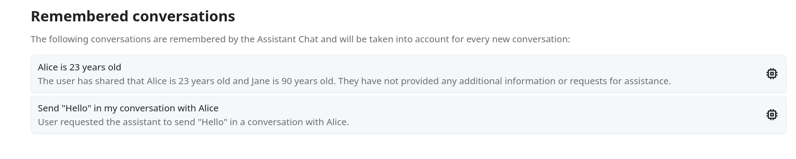
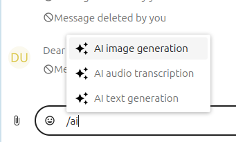
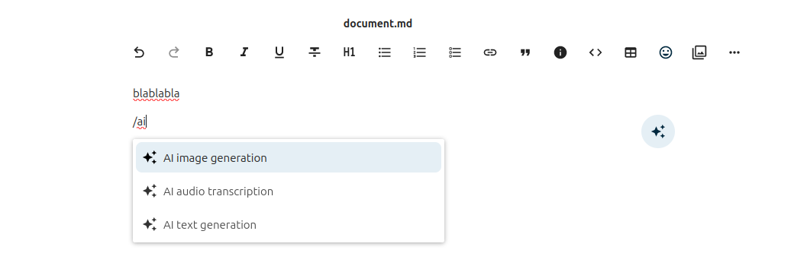

.. _ai-assistant:

============
AI assistant
============

The Nextcloud AI assistant gives you access to AI-powered tools directly from the web interface.
You can run tasks such as text summarization, image generation, and speech transcription, have
back-and-forth conversations with a connected language model, and insert AI-generated content
into documents and messages using smart pickers.

.. note::
   The AI assistant requires at least one AI backend app to be installed and configured by your
   administrator. See the
   `AI assistant administration documentation
   <https://docs.nextcloud.com/server/latest/admin_manual/ai/app_assistant.html>`_
   for details.

Personal settings
-----------------

The assistant personal settings are in **Personal settings** under the **Artificial intelligence**
section. You can disable the assistant top menu entry there, and enable or disable the
AI-related smart pickers.

Running a task
--------------

To open the assistant, click the assistant icon in the top-right navigation bar.

   *Figure 1: The assistant icon in the top-right navigation bar.*

Choose a task type at the top of the assistant panel, fill in the input form, and click the
submit button at the bottom right.

   *Figure 2: The assistant task form.*

Your task will run immediately if possible, or be scheduled for later execution.

   *Figure 3: Waiting for task results.*

Notifications
-------------

If a task was scheduled, you can request to receive a notification when it finishes. Click the
**View results** button in the notification to display the task output.

   *Figure 4: Task completion notification.*

Task history
------------

The left panel of the assistant shows a task history list filtered to the currently selected task
type. You can relaunch, delete, or cancel previous tasks from this list.

   *Figure 5: Task history in the left panel.*

Chat with AI
------------

The **Chat with AI** tab in the assistant lets you have a back-and-forth conversation with the
connected AI. Type a message into the text field at the bottom and press :kbd:`Enter` to send.
Click **New conversation** to start a separate conversation thread.

   *Figure 6: Chat with AI interface.*

Each conversation has its own context. Toggle **Remember this** on a conversation to add it to
the AI's long-term memory so that its context is available in any future conversation. Toggle it
off again to remove the conversation from memory.

In the **AI assistant** section of your Personal settings, you can review all your remembered
conversations.

   *Figure 7: Remembered conversations listed in personal settings.*

Smart pickers
-------------

The assistant app provides three smart pickers accessible in Talk, Text editor, and any other
place where rich text editing is available. Type ``/`` followed by ``ai`` to see the filtered
provider list.

In Talk:

   *Figure 8: AI smart picker in Talk.*

In Text editor:

   *Figure 9: AI smart picker in the Text editor.*

Any result generated through the smart picker can be inserted directly into the current context.

Context Agent
-------------

When the administrator installs the `Context Agent <https://apps.nextcloud.com/apps/context_agent>`_
app, the AI assistant automatically gains the ability to interact with your Nextcloud apps.
No additional setup is needed on your end, the agent tools become available in the same
**Chat with AI** interface described above.

With Context Agent enabled, you can ask the assistant to perform actions across Nextcloud by
typing natural-language instructions in the chat. The assistant uses "tools" behind the scenes
to carry out your requests.

.. note::

   Available tools depend on which apps are installed on your Nextcloud instance and which tool
   groups your administrator has enabled. Some examples below require specific apps such as
   Deck, Talk, or Mail.

Example prompts
^^^^^^^^^^^^^^^

Below are examples of what you can ask the assistant to do. Combine multiple instructions in a
single message and the agent will chain the necessary tools automatically.

Artificial intelligence tools
~~~~~~~~~~~~~~~~~~~~~~~~~~~~~

* Ask a question to context chat (requires `Context Chat <https://apps.nextcloud.com/apps/context_chat>`_)

  * Example prompt: *"What is the company's sick leave process?"*

* Transcribe a media file (requires Transcribe audio task type enabled)

  * Example prompt: *"Can you transcribe the following file? https://mycloud.com/f/9825679"* (Can be selected via smart picker.)

* Generate documents (requires `Nextcloud Office <https://apps.nextcloud.com/apps/richdocuments>`_)

  * Example prompt: *"Can you generate me a slide deck for my presentation about cats?"*
  * Example prompt: *"Can you generate me a spreadsheet with some plausible numbers for countries and their population count?"*
  * Example prompt: *"Can you generate me a pdf with an outline about what to see in Berlin?"*

* Generate images (requires Image generation task type enabled)

  * Example prompt: *"Can you generate me an image of a cartoon drawing of a roman soldier typing something on a laptop?"*

Calendar tools
~~~~~~~~~~~~~~

* List the user's calendars

  * Example prompt: *"List my calendars"*

* Schedule an event in the user's calendar

  * Example prompt: *"Schedule an event with Andrew tomorrow at noon."*

* Find free times in users' calendar

  * Example prompt: *"Find a free 1-hour slot for a meeting with me and Marco next week."*

Tasks tools
~~~~~~~~~~~

* Create a task

  * Example prompt: *"Create a task for grocery shopping with due date tomorrow."*

* List tasks

  * Example prompt: *"List my outstanding tasks"*

* Complete a task

  * Example prompt: *"Mark the grocery shopping task as completed."*

* Update a task's details

  * Example prompt: *"Change the priority of the grocery shopping task to the highest possible priority."*
  * Example prompt: *"Change the due date of my work report task to the beginning of next week."*

* Delete a task

  * Example prompt: *"Delete the grocery shopping task in my tasks."*

Circles/teams tools
~~~~~~~~~~~~~~~~~~~

* List circles

  * Example prompt: *"List all my teams."*

* List circle members

  * Example prompt: *"List all members of my Content Marketing team."*

* Create new circle

  * Example prompt: *"Create a new team called 'Hiking group'."*

* Add members to circles

  * Example prompt: *"Add Ralph to the Hiking group team."*

* Remove members from circles

  * Example prompt: *"Remove ralph from the Hiking group team."*

* Change circle details

  * Example prompt: *"Change the name of the Hiking group team to 'Outdoor group'."*
  * Example prompt: *"Add the following description to the Hiking group team: We go hiking together once a month. Come join us."*

* Delete a circle

  * Example prompt: *"Delete the Hiking group team."*

* Share a file with a circle

  * Example prompt: *"Share my Hiking plans.md file with the Hiking group team."*

Contacts tools
~~~~~~~~~~~~~~

* Find a contact

  * Example prompt: *"What is Anna's email address?"*

* Find a user's ID

  * Example prompt: *"What is Ralph's userID?"*

* Find the current user's details

  * Example prompt: *"Where do I live?"*

Cookbook tools
~~~~~~~~~~~~~~

* List recipes

  * Example prompt: *"List my recipes."*

* Search for recipes

  * Example prompt: *"Do I have any Spaghetti recipes?"*

* Get recipe details

  * Example prompt: *"Can you give me the details of my Spaghetti Carbonara recipe?"*

* Create a new recipe

  * Example prompt: *"Create a recipe for Guacamole in my cookbook."*

* Delete a recipe

  * Example prompt: *"Remove the Guacamole recipe from my cookbook."*

* List recipe categories

  * Example prompt: *"Which recipe categories do I have in my cookbook?"*

Deck tools (require `Deck <https://apps.nextcloud.com/apps/deck>`_)
~~~~~~~~~~~~~~~~~~~~~~~~~~~~~~~~~~~~~~~~~~~~~~~~~~~~~~~~~~~~~~~~~~~

* List deck boards

  * Example prompt: *"List the deck boards I have access to."*

* List the cards on a deck board

  * Example prompt: *"List the cards on my Personal deck board."*

* Add a new card

  * Example prompt: *"Can you add a card with title 'Repair kitchen sink' to my Personal deck board?"*

* Add a label to a card

  * Example prompt: *"Can you add the label 'Urgent' to the 'repair kitchen sink' card in my personal deck board?"*

* Assign a card to a user

  * Example prompt: *"Can you assign the 'Repair kitchen sink' card in my Personal deck board to Andrew?"*

* Delete a card

  * Example prompt: *"Delete the 'Repair kitchen sink' card in my Personal deck board."*

* List the comments on a deck card

  * Example prompt: *"Show the comments on the 'Repair kitchen sink' card in my Personal deck board."*

* Add a comment to a deck card

  * Example prompt: *"Add a comment 'I'll handle this Friday' to 'Repair kitchen sink' in my Personal deck board."*

* Edit a comment on a deck card

  * Example prompt: *"Update my last comment on the 'Repair kitchen sink' card to say 'Moved to Saturday'."*

* Delete a comment on a deck card

  * Example prompt: *"Delete my last comment on the 'Repair kitchen sink' card in my Personal deck board."*

Files tools
~~~~~~~~~~~

* Get contents of a file

  * Example prompt: *"Can you fetch the following file in my documents? Design/Planning.md"*
  * Example prompt: *"Can you fetch the following file in my documents? https://mycloud.com/f/98543234"*

* Retrieve folder tree

  * Example prompt: *"List my files."*

* Create a public link for a file or folder

  * Example prompt: *"Create a public link for the following file: Design/Planning.md"*

* Create a new file

  * Example prompt: *"Create a new file Ideas.md in my files and fill it with ideas for hiking destinations in the black forest."*

* Create a new folder

  * Example prompt: *"Create a new folder 'Hiking plans' in my files."*

* Move a file

  * Example prompt: *"Move the Ideas.md file into the Hiking plans folder."*

* Copy a file

  * Example prompt: *"Copy the Ideas.md file into my Notes folder."*

* Delete a file

  * Example prompt: *"Delete the Ideas.md file."*

Forms tools
~~~~~~~~~~~

* List all forms

  * Example prompt: *"List all the forms I have access to."*

* Get details of a form

  * Example prompt: *"Can you give me all details about the Retreat signup form?"*

* Add a question to a form

  * Example prompt: *"Add the following question to the retreat signup form: 'Number of days attending'."*

* Retrieve all responses of a form

  * Example prompt: *"List all responses to the Retreat signup form."*

* Update form settings

  * Example prompt: *"Make the Retreat signup form expire end of next week."*

* Delete a form

  * Example prompt: *"Delete the Retreat signup form."*

Bookmarks tools
~~~~~~~~~~~~~~~

* List all bookmarks

  * Example prompt: *"List all my bookmarks."*

* Add a bookmark

  * Example prompt: *"Add a bookmark for https://nextcloud.com with title 'Nextcloud homepage'."*

* Delete a bookmark

  * Example prompt: *"Delete the bookmark for https://nextcloud.com."*

* Update a bookmark

  * Example prompt: *"Change the title of the bookmark for https://nextcloud.com to 'Nextcloud official homepage'."*
  * Example prompt: *"Add the tag 'cloud' to the bookmark for https://nextcloud.com."*
  * Example prompt: *"Remove the tag 'cloud' from the bookmark for https://nextcloud.com."*
  * Example prompt: *"Put the bookmark for https://nextcloud.com into the 'work' folder."*

* List bookmark folders

  * Example prompt: *"Which bookmark folders do I have?"*

* Create a bookmark folder

  * Example prompt: *"Create a bookmark folder called 'work'."*

* List bookmark tags

  * Example prompt: *"Which bookmark tags do I have?"*

Search tools
~~~~~~~~~~~~
All search providers in Nextcloud are also automatically available as tools.

* Search for files

  * Example prompt: *"List all the powerpoint presentations in my files with file ending pptx."*

Share tools
~~~~~~~~~~~

* List shares

  * Example prompt: *"List all files that were shared with me."*
  * Example prompt: *"List the shares of the Design/Ideas.md file."*

* Share a file or folder with a user

  * Example prompt: *"Share the Design/Ideas.md file with the user martin."*

* Share a file or folder with a group

  * Example prompt: *"Share the Design/Ideas.md file with the group Designers."*

* Update a share's permissions

  * Example prompt: *"Only allow martin read only access on the share of the Design/Ideas.md file."*

* Delete a share

  * Example prompt: *"Remove the share of the Design/Ideas.md file with martin."*

* List user groups

  * Example prompt: *"Which user groups are there?"*

* Retrieve share details

 * Example prompt: *"Does martin have write access to the Design/Ideas.md file I shared with him?"*

Talk tools (require `Talk <https://apps.nextcloud.com/apps/spreed>`_)
~~~~~~~~~~~~~~~~~~~~~~~~~~~~~~~~~~~~~~~~~~~~~~~~~~~~~~~~~~~~~~~~~~~~~

* List the user's talk conversations

  * Example prompt: *"List my talk conversations"*

* List messages in a talk conversation

  * Example prompt: *"List the latest messages in my conversation with Andrew"*

* Send a message to a talk conversation

  * Example prompt: *"Can you send a joke to Andrew in talk?"*

* Create a public talk conversation

  * Example prompt: *"Can you create a new public talk conversation titled 'Press conference'?"*

* Reply to a specific message in a talk conversation

  * Example prompt: *"Reply to Andrew's last message in our talk conversation with 'Got it, thanks!'"*

* Add an emoji reaction to a message in a talk conversation

  * Example prompt: *"React with 👍 to Andrew's last message in our talk conversation"*

* Remove an emoji reaction from a message in a talk conversation

  * Example prompt: *"Remove my 👍 reaction from Andrew's last message"*

* List the reactions on a message in a talk conversation

  * Example prompt: *"Who reacted to Andrew's last message in our talk conversation?"*

* Create a poll in a talk conversation

  * Example prompt: *"Create a poll in the 'Team standup' conversation asking 'Which day works for the offsite?'
    with options Monday, Tuesday, Wednesday"*

* Get the question, options, and current results of a poll in a talk conversation

  * Example prompt: *"Show the current results of the offsite poll in the 'Team standup' conversation"*

* Cast a vote on a poll in a talk conversation

  * Example prompt: *"Vote for Tuesday on the offsite poll in the 'Team standup' conversation"*

* Close a poll in a talk conversation

  * Example prompt: *"Close the offsite poll in the 'Team standup' conversation"*

* Share a Nextcloud Files item to a talk conversation

  * Example prompt: *"Share the file 'Q3 plan.pdf' to my conversation with Andrew"*

* List items of a given type (e.g. file, location, poll) that were shared in a talk conversation

  * Example prompt: *"List the files shared in my conversation with Andrew"*

* Get an overview of items shared in a talk conversation across all types

  * Example prompt: *"Give me an overview of what's been shared in my conversation with Andrew"*

Mail tools (require `Mail <https://apps.nextcloud.com/apps/mail>`_)
~~~~~~~~~~~~~~~~~~~~~~~~~~~~~~~~~~~~~~~~~~~~~~~~~~~~~~~~~~~~~~~~~~~

* Send an email via Nextcloud Mail

  * Example prompt: *"Send a test email from my carry@company.com account to Andrew@company.com"*

* List all connected mail accounts

  * Example prompt: *"List my mail accounts"*

* List all mail folders of an email account

  * Example prompt: *"List the folders of my carry@company.com account"*

* List the mails in a mail folder

  * Example prompt: *"List the last 5 mails in the inbox of my carry@company.com account"*

Miscellaneous tools
~~~~~~~~~~~~~~~~~~~

* Get coordinates for an Address from Open Street Maps Nomatim

  * Example prompt: *"What are the coordinates for Berlin, Germany?"*

* Get the URL for a map of a location using Open Street Maps

  * Example prompt: *"Can you show me a map of New York, please"*

* Get the current weather at a location

  * Example prompt: *"How is the weather in Berlin?"*

* Search for youtube videos

  * Example prompt: *"Show me the youtube video of the Nextcloud hub 10 launch."*

* Search Duckduckgo

  * Example prompt: *"Show me search results for quick pasta recipes, please."*

* Determine public transport routes

  * Example prompt: *"How can I get from Würzburg Hauptbahnhof to Berlin Hauptbahnhof?"*

* List all projects in OpenProject (requires the `OpenProject integration <https://apps.nextcloud.com/apps/integration_openproject>`_)

  * Example prompt: *"List all my projects in OpenProject, please"*

* List all available assignees of a project in OpenProject (requires the `OpenProject integration <https://apps.nextcloud.com/apps/integration_openproject>`_)

  * Example prompt: *"List all available assignees for the 'Product launch' project in OpenProject"*

* Create a new work package in a given project in OpenProject (requires the `OpenProject integration <https://apps.nextcloud.com/apps/integration_openproject>`_)
  * Example prompt: *"Create a work package called 'Publish release video' in the 'Product launch' project in OpenProject"*

Combining tools
^^^^^^^^^^^^^^^

These tools can also be combined by the agent to fulfil tasks like the following:

* *"How is the weather where Andrew lives?"*

  * Uses contacts to look up Andrew's address and then checks the weather

* *"How is the weather where I live?"*

  * Look up the current user's address and then checks the weather

* *"Send an email from carry@company.com to Andrew"*

  * Uses contacts to look up Andrew's email and then sends an email

* *"Which of my files are from Anna?"*

  * Looks up Anna's userID and searches for files that belong to her

* *"Send the content of my draft.md file to Andrew in Talk"*

  * Gets the content of the file and sends it in a 1-1 Talk conversation with Andrew

Skills
^^^^^^

Skills let you teach the Context Agent reusable instructions that it can follow whenever they
are relevant. A skill is a small markdown file that describes a procedure, a set of rules, or
domain-specific knowledge. Once a skill is saved, the agent automatically picks it up and
applies it in future conversations without you having to repeat yourself.

.. note::

   | Skills require the Context Agent app version 2.8.0 or later and the Assistant app version 3.5.0 or later.
   | You can ask your administrator if these requirements are met or the agent directly if it has the ability to use skills.

Where skills are stored
~~~~~~~~~~~~~~~~~~~~~~~

Your personal skills live in your Nextcloud Files under the folder ``Assistant/Context Agent/Skills/``.

Each skill is a subfolder containing a file called ``SKILL.md``. The ``SKILL.md`` file starts
with a YAML frontmatter block that defines the skill's name and description, followed by the
skill content in Markdown:

.. code-block:: markdown

   ---
   name: weekly-report-format
   description: Formatting rules for my weekly status reports
   ---

   When I ask you to write a weekly report, use the following structure:
   1. Summary (2-3 sentences)
   2. Completed tasks (bullet list)
   3. Blockers
   4. Plan for next week

For example, a skill named "weekly-report-format" would be stored at
``Assistant/Context Agent/Skills/weekly-report-format/SKILL.md``.

A typical skills folder structure looks like this:

.. code-block:: text

   Assistant/
   └── Context Agent/
       └── Skills/
           ├── email-tone/
           │   └── SKILL.md
           ├── weekly-report-format/
           │   └── SKILL.md
           └── meeting-notes/
               └── SKILL.md

Creating a skill
~~~~~~~~~~~~~~~~

You can create a skill in two ways:

* Manually: create a subfolder under ``Assistant/Context Agent/Skills/`` in your Files, then add a
  ``SKILL.md`` file with the frontmatter and content shown above.
* Through the chat: ask the agent to create a skill for you. For example:

  * "Create a skill called 'email-tone' that reminds you to always write emails in a friendly
    and professional tone."
  * "Save a skill for summarizing meeting notes with action items and owners."

  The agent will create the folder and ``SKILL.md`` file for you automatically.

Listing and using skills
~~~~~~~~~~~~~~~~~~~~~~~~

To see which skills are available, ask the agent:

* "List my skills."

You do not need to explicitly invoke a skill. The agent reads all available skill descriptions
and applies the relevant ones based on the context of your conversation.

Admin-provided skills
~~~~~~~~~~~~~~~~~~~~~

Your administrator can configure a global skills folder that provides skills to all users on
the instance. These global skills appear alongside your personal skills.

If a global skill has the same name as one of your personal skills, your personal version takes
precedence.

Using Nextcloud as an MCP server
^^^^^^^^^^^^^^^^^^^^^^^^^^^^^^^^

The Context Agent app exposes your Nextcloud as a
`Model Context Protocol (MCP) <https://modelcontextprotocol.io>`_ server. This means you can
connect your Nextcloud instance to external AI tools and agents such as Pi Agent, Claude Code,
Hermes, OpenCode or any other MCP-compatible client and let them use the same tools that are
available in the Assistant chat.

The MCP server endpoint is::

   https://your-nextcloud-domain.com/index.php/apps/app_api/proxy/context_agent/mcp/

Authentication is done with an app password. You can create one in
"Personal settings -> Security -> Devices & sessions".

Connecting MCP clients
^^^^^^^^^^^^^^^^^^^^^^

Any MCP-compatible client that supports the ``streamable_http`` transport can connect to the
Nextcloud MCP server. Point the client to the endpoint URL shown above and pass the app
password in the ``Authorization: Bearer <app-password>`` header.

Once connected, the external client can use all the same Context Agent tools, managing files,
calendars, tasks, contacts, Talk conversations, and more directly from outside Nextcloud.
