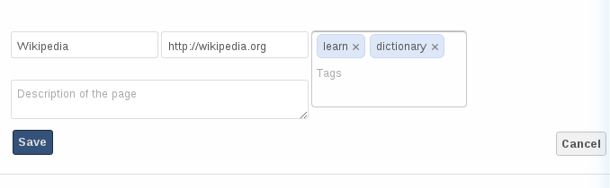
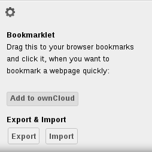

=======================
Using the Bookmarks App
=======================

The Bookmark application allows you to bookmark Web sites inside ownCloud.

The main interface
--------------------

Add a bookmark
~~~~~~~~~~~~~~
In the Bookmark application, enter a URL into the top-left area of the content section. After adding an address, click on the pencil button to edit fields for the given address.
The main ownCloud bookmark interface contains 3 fields at the top where
you can enter the website address (or URL), the title of your bookmark, and
a set of tags separated from each other by a space.

	Adding a bookmark manually

In this example, we have added the page `http://wikipedia.org` with the title "Wikipedia"
and some tags describing what Wikipedia is for an easier search later on.

Edit/Delete a bookmark
~~~~~~~~~~~~~~~~~~~~~~

You also have the possibility to edit or delete a bookmark.

To edit a bookmark, hover over the bookmark and click on the pencil icon. 
The bookmark details will then be filled into the 3 fields at the top of the screen.
Modify your bookmark to your needs then click the save button to persist the change.

To delete a bookmark, hover over the bookmark and click the cross icon.

Search
~~~~~~

If you click on a tag, ownCloud will only display the bookmarks that
are described with this tag.

You can also use the search bar of ownCloud in the top right of your screen.

Simply click on the "Bookmarks" menu in the sidebar to come back to
the default view.

The Bookmarklet
---------------

	Bookmarklet link

The creator of this app understands that people won't want to
open the ownCloud boorkmarks page to add a bookmark every time they see a cool site.
This is why they have made this cool "bookmarklet".

A bookmarklet is small button that you can drag and drop in your bookmarks.
The next time you see a cool new site, click on this special bookmark
to add the site to your ownCloud bookmarks.

To find this bookmark, click on the gear button at the bottom of the bookmarks app.

