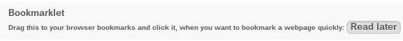

Using the Bookmarks App
=======================

If you want to add a bookmark to the Bookmarks application, 
you can either use the main interface or the bookmarklet.

The main interface
--------------------

Add a bookmark
~~~~~~~~~~~~~~

The main ownCloud interface contains 3 fields at the top where
you can enter the website address (or URL), the title of your bookmark and
a set of tags separated from each other by a space.

.. figure:: images/bookmark_addurl.jpg

In this example, we have added the page : http://wikipedia.org with the title "Wikipedia"
and some tags describing what wikipedia is (for an easier search later on).

Edit/delete a bookmark
~~~~~~~~~~~~~~~~~~~~~~

You also have the possibility to edit or delete your bookmark.
For that, just hover on the bookmark and click on the little pencil if you wish to edit the bookmark
or on the cross if you want to the delete it.

The bookmark will then be filled into the 3 fields at the top of the screen.
Modify your bookmark to your need then hit the save button to persist the change.

Search
~~~~~~

If you click on a tag, ownCloud will only display the bookmarks that
are described with this tag.

You can also use the search bar of owncloud in the top right of your screen.

Simply click on the "Bookmarks" menu in the sidebar to come back to
the default view.

The bookmarklet
---------------

The creator of this app understand that people won't come,
open the ownCloud page to add the bookmark when the see a cool site.
This is why they have made this cool "bookmarklet".

A bookmarklet is small button that you can drag and drop in your bookmarks.
The next time you see a cool new site, press on this special bookmark,
it will add the site to your ownCloud bookmarks.

To find this bookmark go to your personnal preference and search for
the "Bookmarklet" item.

