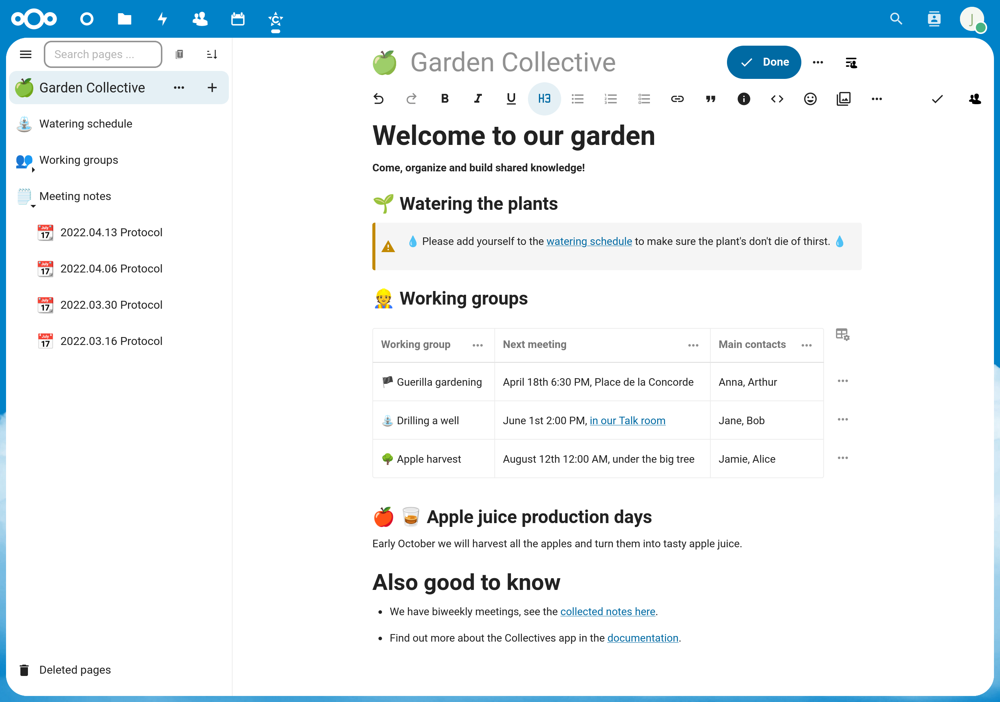

===============
Getting started
===============

Think of Collectives as your space to take notes together and collaborate online.
You and your peers can write documents collaboratively and structure your shared
knowledge. You can even embed task boards, whiteboards and calendars. Collectives
emphasizes horizontal and non-hierarchical workflows.

Why use Collectives?
--------------------

* You need a tool to collaborate, cowork or organize with others.
* You want all your shared knowledge in one place.
* You want a quick and easy overview of your pages and subpages.
* You want to share parts of the knowledge with external people.
* You already use Nextcloud.

First steps
-----------

You will create your first collective with two pages and a link from one to the other. It
expects that you open Collectives in a desktop browser (i.e. not on mobile).

1. Select the Collectives app in the app menu on the top:

   .. image:: images/open_app.png
      :width: 100px
2. Click on “New collective”.
3. Enter the name ``My first collective`` and choose an emoji (or keep the preselected one).
4. Select “Create without members”. We’ll learn how to add other members later.
5. In the page list on the left, click the ➕ button next to the landing page. Congratulations,
   you just created a first page in your collective. 🎉
6. Give the page a title by typing ``My first page``.
7. Now press :kbd:`Enter` and the cursor will jump to the (still empty) page content.
8. Type ``## My first heading`` to insert a second-level heading. Alternatively you can open
   the headings menu in the editor toolbar, select “Heading 2” and then type ``My first heading``.
   You just learned that there’s more than way to format text 🎉
9. Create a subpage of “My first page” by clicking the ➕ button next to “My first page” in the
   page sidebar. The button will only appear once you hover the mouse cursor over the entry in
   the page list.
10. Give the subpage a title by typing “My subpage”.
11. Add a link from to the first page by opening the 🔗 link menu in the editor toolbar and
    selecting “Link to page”. A dialogue to select the page will open. Type ``first`` in the
    search field and “My first page” will appear. Click on it and it will be added as a link
    preview to the subpage.

Congratulations, you learned two important basics when working with Collectives: how to create
and link between pages and how to format content in a page.

What's next
-----------

* To learn how to use Collectives in your team, see :doc:`onboard_your_team`.
* For an overview over features, see here.
